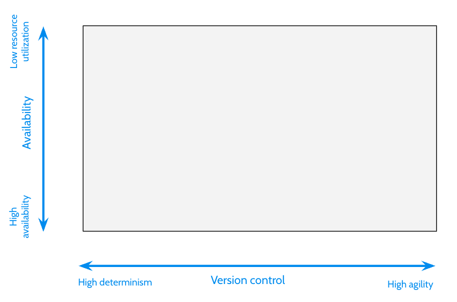
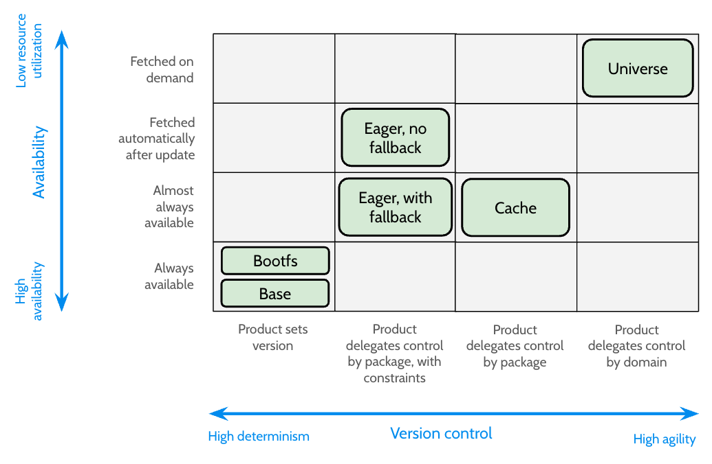
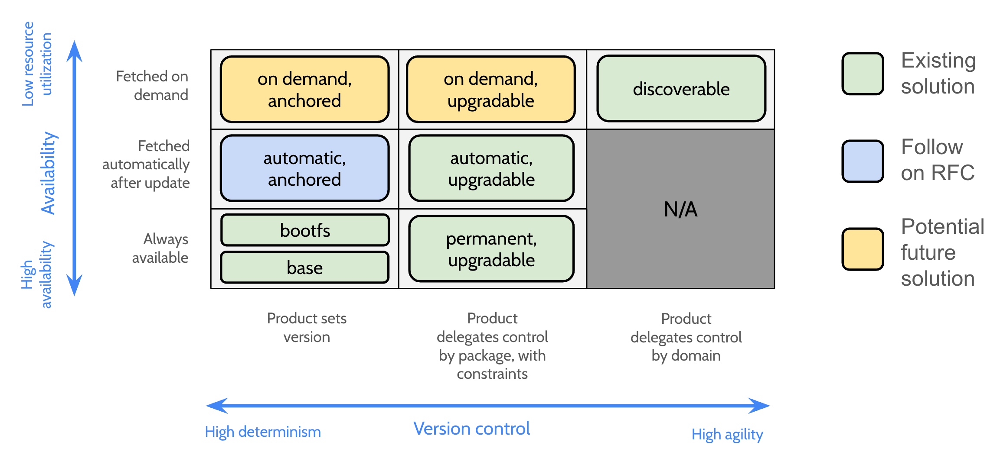

<!-- Generated with `fx rfc` -->
<!-- mdformat off(templates not supported) -->


# {{ rfc.name }}: {{ rfc.title }}
{# Fuchsia RFCs use templates to display various fields from _rfcs.yaml. View the #}
{# fully rendered RFCs at https://fuchsia.dev/fuchsia-src/contribute/governance/rfcs #}

<!-- mdformat on -->

## Summary

This RFC provides an official definition for the term "Package Set" and proposes
an updated framework for package sets. This framework expresses packages sets
in terms of the availability and version control they provide and accomodates:

* The three existing package sets
* Earlier software delivery work that had not previously been integrated with
  package sets
* New package sets that enable more flexibility in the delivery of Fuchsia
  software as requested by products.

## Motivation {#motivation}

[Packages][glossary.package] are the unit of software distribution on Fuchsia.
Packages are used to deliver both platform software and product software and are
also used in a range of different testing and development workflows.

Each Fuchsia product uses some mixture of product-specific packages and
platform-provided packages; the content of this mixture differs from product to
product. Not all the packages that a product uses need to be delivered at the
same time or updated using the same strategy. For example, some packages may
be downloaded as a part of an [over the air update][docs_ota] while other
packages may not be downloaded until the user takes some action.

A "package set" is a collection of packages used by a product where all packages
in the set are delivered and updated using the same strategy. Three different
package sets are currently in use on Fuchsia: base, cache, and universe.

The current state of package sets on Fuchsia is insufficient for several
reasons:

- The term "package set" has not been clearly defined.
- The existing package sets have not been clearly defined and the behaviors they
  provide are not obvious given their names. The same terms are reused across
  different contexts with different meanings. For example, the set of packages
  that a device stores in its package cache is not the same as the "cache"
  package set.
- The existing package sets have not been updated to reflect recent software
  delivery RFCs such as [eagerly package updates][rfc_0145],
  [subpackages][rfc_0154], or [bootfs packages][rfc_0167].
- The existing package sets do not solve several product developer needs. For
  example:
  - It should be possible to defer fetching non-essential packages when disk
    space is limited.
  - It should be possible to update product software independently from the
    platform (this was designed in [RFC-0145][rfc_0145] but has not been
    included in the package set definitions).
  - It should be possible to quickly and reliably update packages during
    development.

This RFC intends to achieve the following:

- Clearly define the term "package set".
- Define the design space within which potential package set definitions lie.
- Describe where existing package concepts fit within this design space and
  refine the names we use to refer to them based on that.
- Identify gaps in the design space that should be filled by designs in future
  RFCs.
- Identify existing concepts that are no longer required and should be
  deprecated.

## Stakeholders {#stakeholders}

_Facilitator:_

- abarth

_Reviewers:_

- wittrock (SWD)
- amituttam (PM)
- aaronwood (Software Assembly)
- markdittmer (Security)
- sethladd (DX)
- marvinpaul (Server infrastructure)

_Consulted:_

- yaar, senj, etrylezaar, galbanum, richkadel

_Socialization:_

The work that led to this RFC was discussed in a series of design discussions
internal to the software delivery team. Early versions of the text in this RFC
were reviewed with stakeholders in the Software Assembly, Server Infrastructure,
First Party Product, and PM teams.

## Definitions

- **[Package][glossary.package]** - The unit of software distribution in
  Fuchsia. A package is a collection of files, such as manifests, metadata, zero
  or more executables (e.g. components), and assets. The word "package" has been
  used both to mean the definition of such a collection (e.g. the Timekeeper
  package as defined by its [build rule][src_timekeeper_package]) and an
  individual artifact produced from that definition (e.g. the Timekeeper package
  built on 14th November 2022 with a merkle root of
  `de07b9f06ae01181b0536b61c7f643496025598c3a2908dca5c72fce191be5d1`). For this
  RFC we use only the former meaning.
- **Package version** - A single instance of a particular package (e.g. the
  Timekeeper package built on 14th November 2022 with a merkle root of
  `de07b9f06ae01181b0536b61c7f643496025598c3a2908dca5c72fce191be5d1`). Fuchsia
  does not currently require numbering (or even ordering) of package versions.
  The CUP metadata for some eager update packages may contain an ordered version
  number used in fallback checks, as defined in [RFC-0145][rfc_0145].
- **[Product][glossary.product]** - A specification for an assembled system. A
  product defines the software configuration that a build will produce. Most
  critically, a product typically defines the kinds of user experiences that are
  provided for, such as what kind of graphical shell the user might observe,
  whether or not multimedia support is included, and so on.
- **Product build** - A single version of the assembled system for a
  particular product. A product build is the artifact produced from the
  specification that a product defines. For example
  "Workstation 8.20220622.2.1".
- **Product release** - A product build that has been pushed to an update
  channel.
- **Package set** - See [below](#package-set).
- **Versioning authority** - A server or repository that determines what version
  of a package a Fuchsia device should use. In a production system Omaha acts as
  the versioning authority while during development a TUF repository on the host
  acts as the versioning authority.
- **Base** (originally known as "monolith") - A package set defined prior to
  this RFC. The contents of the base package set are always present on the
  device with a version fixed by the product release. This RFC proposes
  retaining the base package set.
- **Cache** (originally known as "preinstall") - A package set defined prior to
  this RFC. The contents of the cache package set are present on the device in
  nearly all circumstances but the version may be updated in some circumstances
  during local development. This package set is not used in production. This RFC
  proposes creating a new developer-focused flow to replace the cache package
  set.
- **Universe** (originally known as "available") - A package set defined prior
  to this RFC. The contents of the universe package set are downloaded on
  demand, using a version determined by a versioning authority. This package set
  is not currently used in production. The word "universe" has been used both to
  refer to the contents of this package set and to the contents of all package
  sets. To avoid confusion this RFC proposes renaming the universe package set
  to "discoverable".
- **Eager update** - A mechanism for updating packages independently of the
  product release, as defined in [RFC-0145][rfc_0145].
- **Bootfs packages** - Packages that are stored in the bootfs filesystem, as
  defined in [RFC-0167][rfc_0167].
- **Subpackages** - Packages that are referenced by and fetched atomically with
  some other package as defined in [RFC-0154][rfc_0154].
- **Parent package** - The package that references a subpackage as defined in
  [RFC-0154][rfc_0154].
- **Garbage collection** - The process of removing package contents from blobfs
  when they are no longer required.
- **[System update][docs_ota]** (also known as "OTA") - The process of updating
  a Fuchsia device from one product release to another.

## Design {#design}

### Package Set {#package-set}

A package set is a collection of packages where all the packages in the set are
delivered and updated using the same strategy. For example, in the base
package set all packages are fetched during a system update at a version that is
determined by the product release. Packages in this base package set are
guaranteed to be present on a device whenever the device is running.

The contents of a package set are defined by a product. A particular package may
be present in one package set in product A but a different package set (or
omitted entirely) in product B. The package set that a package is placed in
reflects the relationship between a package and the product using it; packages
that are critical to the operation of a product should be placed in a package
set that guarantees these packages will always be present on the device.
Typically a package will only exist in one package set for a given product, but
there are cases where a package can be present in multiple package sets.

Several related but subtly different definitions of "package set" have evolved
based on the context in which the term is used. We introduce some of these
below, along with a name that may be used to unamiguously refer to the
definition.

- **Eligible package set** - A set of packages that a device is allowed to
  resolve. For example, the "eligible base package set" is the set of all
  packages that a device could successfully resolve and place in its delivered
  base package set.
- **Built package set** (also known as build dependency set) - A set of packages
  that are produced when a Fuchsia product is built. A built package set is
  often equal to the corresponding eligible package set but in some cases it may
  be dramatically smaller. For example, a device might have thousands of
  eligible universe packages but a build may not produce any of these.
- **Delivered package set** - A set of packages that have already been delivered
  to a device. A delivered package set is a subset of the corresponding eligible
  package set.

The remainder of this document focuses on the design of the software delivery
system and therefore the "eligible package set" definition.

### Proposed Design Space {#design-space}

The software delivery system answers two key questions:

1. What determines the version of the package?
1. When is the package available on the device?

This RFC proposes a two dimensional design space for categorizing package sets
based on these two questions as illustrated below:

Note that in both cases there is no one "best" answer; each axis represents a
trade between two desirable properties. For some use cases one end of the axis
may be the best fit while for other use cases the opposite end of the spectrum
is a better fit.

#### Axis 1 - Version Control

Determining the current correct version for a package is critical to the
security and the updatability of the system. Changing the version of a package
is necessary to release new functionality and to fix bugs, yet if an entity with
the power to choose the package version is compromised it may be used to deploy
inappropriate or malicious versions of the software. Changing the version of a
package very frequently often involves running software that is less mature or
combinations of software that have not been tested together.

The version control axis is a trade between high agility and high determinism.
For example:

- Critical elements of the system do not need to change frequently and must be
  controlled centrally and tightly. In these cases it is desirable to lock the
  version of the package to the platform or product version.
- End user applications may change frequently according to the tempo of the
  organization that develops them. In these cases it is desirable for the
  publisher to release new versions to compatible devices without waiting for a
  product release.
- Components being debugged by a developer may change every few seconds each
  time the code is changed. In these cases it is desirable for the version to be
  updated immediately and automatically.

#### Axis 2 - Availability

Packages exist to enable some useful functionality on a Fuchsia device, and they
can only do this when they are present (and known to be correct) on that device.

The availability axis is a trade between high availability and low resource
utilization. For example:

- Critical elements of the system need to be available at all times, even if the
  network is not available. In these cases it is necessary to store the package
  for the entire time it might be used. This implies storing both the previous
  and current versions of a package during an update.
- Less critical parts of a product experience may not need availability
  guarantees. In these cases it may be best to delete the old version of a
  package before fetching an updated version to reduce the peak storage demand.
- Some end user applications may only be used on a small fraction of devices. In
  these cases it is desirable to only consume resources by fetching a package
  when there is some signal that the user intends to use it.

### Mapping to existing concepts

The existing package sets and package-related RFCs fall into four different
version control categories:

1. _Package version is fixed by the product_: Applies to base & bootfs.
1. _Product delegates version control for a specific package to a versioning
  authority with constraints_: Applies to eagerly updated packages. With eagerly
  updated packages the product release may constrain the minimum version that
  will be accepted.
1. _Product delegates version control for a specific package to a versioning
  authority without constraints_: Applies to cache packages.
1. _Product delegates version control for all URLs in a domain to a versioning
  authority without constraints_: Applies to universe packages that are not in
  the base or cache sets. Note this is the only category where the product
  release does not define the existence of every package in the set.

The existing package sets and package-related RFCs fall into four different
availability categories:

1. _Always available_: Applies to base and bootfs.
1. _Almost always available_: Applies to eagerly updated packages (when a
  fallback version is specified) and to cache packages. In these cases the
  intent was for the package to always be available but the current design of
  cache package resolution and garbage collection algorithms means there are
  some circumstances in which the package will not be available.
1. _Fetched automatically after system update_: Applies to eagerly updated
  packages when no fallback version is specified. These packages will be
  available some time after the system update has been committed, provided the
  network is healthy.
1. _Fetched on demand_: Applies to universe packages that are not in other
  package sets like base. These packages will be available some time after a
  package resolution request is made, provided the network is healthy.

Subpackage references include the content hash of the target therefore
subpackages follow the version control category of their parent package.
Subpackages are resolved atomically with their parent (and cannot be resolved
without a context from resolving the parent) and therefore subpackages follow
the availability of their parent package.

In summary, the existing package concepts fit into the proposed design space as
illustrated below:

### Proposed Changes {#proposed-changes}

When mapping the existing package concepts into this design space as shown
above, several problems are immediately visible:

1. The existing concepts do not cover large portions of the design space,
   suggesting that our current package sets do not provide a solution for many
   of the potentially valuable use cases.
1. Cache packages and eagerly updated packages play a very similar role.
1. "almost always available" packages are not desired and only exist due to
   problems in the cache package resolution and garbage collection algorithms.
1. The names of the existing concepts do not follow a consistent pattern and in
   most cases do not imply the portion of the design space that the concept
   occupies.
1. Several of the concepts (for example, eager updates) are not defined as
   package sets.

This RFC proposes a series of changes that together address these problems and
lead to a more comprehensive and consistent coverage of the design space as
illustrated below:

Each of the changes is discussed in more detail in the following sections. Note
that we introduce these in the order we intend to start them, but many changes
can be conducted in parallel. Where changes depend on each other the
relationship is discussed in the text.

#### Change 1 - Introduce a unified nomenclature for package sets {#change-1}

Before this RFC, package sets were named with a single word. This was viable
since there were only three sets and they lay along a single axis, but even then
the terse names have caused some confusion.

This RFC proposes referring to package sets with a short phrase describing the
properties they provide. Each phrase contains one term describing the
availability of packages in the set and a second term describing the versioning
of packages in the set, as defined in the table below:

<table>
  <tr>
    <td><strong>Availability Term</strong></td>
    <td><strong>Description</strong></td>
  </tr>
  <tr>
    <td>Permanent</td>
    <td>These packages are available in all circumstances</td>
  </tr>
  <tr>
    <td>Automatic</td>
    <td>These packages are fetched automatically when disk space and network
    availability allows</td>
  </tr>
  <tr>
    <td>OnDemand</td>
    <td>These packages are only fetched when some entity on the device attempts
    to use them</td>
  </tr>
</table>

<table>
  <tr>
    <td><strong>Versioning Term</strong></td>
    <td><strong>Description</strong></td>
  </tr>
  <tr>
    <td>Anchored</td>
    <td>The version of these packages is set by the product release.</td>
  </tr>
  <tr>
    <td>Upgradable</td>
    <td>The product release delegates control to a versioning authority for each
    of these packages, optionally with constraints such as a minimum acceptable
    version.</td>
  </tr>
  <tr>
    <td>Discoverable</td>
    <td>The product release does not define individual packages within this set,
    but instead delegates control to a versioning authority for a URL
    domain.</td>
  </tr>
</table>

For example, an eagerly updated package without a fallback would be referred to
in full as a member of the "automatic availability, upgradable versioning"
package set. In situations where context and meaning are clear this could be
abbreviated to "automatic & upgradable".

In the bottom left segment we have two distinct package sets with the same
versioning and availability behavior - base and bootfs. We will retain these
names to refer to those package sets while using "permanent availability,
anchored versioning" to refer to the more general behavior they share.

We will retain the existing "cache" name to refer to the cache package set until
this set is replaced (see [change 6](#change-6)).

The word "universe" has conflicting definitions on Fuchsia. The original
definition was the set of all built packages which was consistent with the set
theory meaning of the term. Today more commonly "universe" refers to only those
packages that are built but not included in another package sets, i.e. base
packages are not a part of universe. This definition is inconsistent with the
set theory meaning of the term. To avoid this confusion we use the name
"discoverable" rather than "universe" when referring to the top right segment of
the design space.

#### Change 2 - Deprecate the "cache" package set {#change-2}

The cache package set and eagerly updated packages with fallback are two
different solutions that address the same need: let a version control server
provide newer versions of a package while ensuring that some version of the
package remains available, even when the device is offline.

Eagerly updated packages as defined in [RFC-0145][rfc_0145] provide a more
robust solution to this problem:

- Unlike cache packages, server communication problems cannot cause an eagerly
  updated package to fail resolution
- Unlike cache packages, an eagerly updated package will not revert to an
  earlier version if the device is offline

Cache packages are only used in developer flows at the moment but (due to the
problems above and others) they are not a very good fit for these use cases.
Given the advantages of eagerly updated packages it will never be desirable to
use cache packages in production flows.

We will deprecate the cache package concept, meaning SWD will not invest in
further improvements to the flow. We will neither remove the flow nor the
developer documentation until a suitable replacement has been deployed and
adopted (see [change 6](#change-6)).

Note that deprecating cache packages does not mean deprecating the similarly
named "package cache" component.

#### Change 3 - Remove the subpackage package set restriction in RFC-0154 {#change-3}

[RFC-0154][rfc_0154] required that subpackages be placed "in the same package
set as" their parent. This requirement would become difficult to meet as we
introduce new package categories because it would require that the product
maintainer update the package set definition every time the set of transitive
subpackages changed.

Implementation work since RFC-0154 has already loosened the same package set
constraint but this RFC officially removes it. As discussed above, subpackages
still follow the availability and version control of their parent (and therefore
still effectively behave as members of their parent's package set) but product
maintainers no longer need to independently include subpackages as top-level
members of the package sets that reference them.

Security audit tools are used to verify that each release of a product
contains the expected set of packages. The golden files used for this
verification *will* include all the subpackages included in anchored version
package sets, transitively. This ensures that any addition of a subpackage or
nested subpackage to an anchored version package set will receive a human
review.

#### Change 4 - Redesign the garbage collection algorithm {#change-4}

Fuchsia's current package garbage collection (GC) algorithm was designed very
early in the program and has not scaled well as software delivery evolved. Even
today we experience failure modes where necessary packages are deleted and where
unnecessary packages are retained. The current GC algorithm was not equipped to
handle the introduction of new package sets.

We will publish the requirements and algorithm for a replacement GC
implementation that can accommodate more package sets on a follow-on RFC in the
near future.

#### Change 5 - Design an automatic & anchored package set {#change-5}

During each release of a product the product maintainers must test fixed
versions of many different platform and product packages together to ensure they
integrate correctly. Today, the only way for a product to include a fixed
version of a package is to include it in the base package set. This means that
two copies of all these packages may need to be stored on disk concurrently
during a system update, making it challenging to run Fuchsia on devices with
limited storage space.

This problem can be solved by implementing an automatic availability, anchored
version package set, i.e. supporting packages whose version is fixed by the
product but that are not downloaded until after a system update has been
successfully committed. We will publish a design for this package set as a
follow-on RFC in the near future.

#### Change 6 - Design a replacement developer-focused package delivery flow {#change-6}

As discussed in [change 2](#change-2) above, the cache package flow is not a
good fit for the developer need to easily, quickly, and reliably update packages
during development. We will research a better solution by focussing on the
developer needs, then publish a design as a follow-on RFC.

We expect that this new developer-focused flow discussed will act as an overlay
on the design space in engineering builds, but this will be explored further in
the follow-on RFC.

#### Change 7 - Design on demand anchored and/or on demand upgradable package sets {#change-7}

These package sets would let product maintainers define packages with either a
fixed version or a constrained version that are not fetched until they are
needed.

These package sets are potentially useful for future products but, unlike the
automatic & anchored package set in [change 5](#change-5), we do not yet have
a launch customer.

We will design and implement one or both of these package sets when a specific
product or developer need arises.

### Putting it all together

Once these changes are complete, including the proposed follow-on RFCs, the
software delivery stack will offer significantly more flexibility to product
developers. For example:

* Products will be able to reduce resource utilization without losing control
  over versioning by moving non-essential packages from base to the automatic &
  anchored or on demand & anchored package sets.
* Products will be able to include packages that can be upgraded independently
  of the product using the upgradable package sets.
    * Products will be able to control the availability of these upgradable
      packages. This include making them always available by placing them in the
      permanent & upgradeable package set.
    * These upgradable packages could reference other packages that were not
      known to the product release at the time it was built.
        * This can either be achieved using subpackages, where the parent
          package sets the version of the referred package, or using a URL in
          the discoverable package set, where a versioning authority sets the
          version of the referred package.
        * The availability of these referred packages follows the referring
          package (in the case of a reference to a subpackages) or is controlled
          by the referring package (in the case of a reference to a discoverable
          package).
* Products may use packages that were not explicitly defined in a product
  release by enabling the discoverable package set.
* In all cases packages may only be fetched from a repository that is trusted by
  the product.
* Software delivery will manage the available blob storage space, ensuring that
  non-critical packages are evicted if needed to perform a system update and
  that automatic packages are fetched automatically when space is available.
* Developers will be able to easily update the packages that they need to modify
  during development.

The changes described in this RFC also have significant implications for
assumptions inside the SWD stack. For example:

* **It will be necessary to store more than one version of a package in the
  package cache**. An upgradable package may include a subpackage reference to a
  package that has already been included by the product in its anchored set.
  Since the product and the upgradable package do not know each other's
  versioning schemes they cannot coordinate to ensure the version of this common
  package is the same in both. Similarly, different packages in the same
  upgradable package set may include subpackage references to the same package
  but at different versions.
* **It will be necessary for a package in the package cache to support more than
  one package set**. As above, an upgradable package may include a subpackage
  reference to a package that has already been included by the product.
  Sometimes this package will be at the same version in both package sets. It
  will be necessary to consider all the package sets that a package is
  supporting when deciding when to remove it.
* **Package fetching and garbage collection will need to be coordinated**. The
  upgradeable and automatic package sets both mean that new package versions
  will be fetched outside of the system update process. These operations can
  only succeed when sufficient blob storage space is available. In some cases it
  may be necessary to defer or cancel these operations because space is not
  available, in other cases it may be necessary to evict other packages in order
  for the operations to succeed.
* **The relationship between package resolvers and package sets will change**.
  Today there is a loose correlation between the base and universe package
  resolvers and the package sets with the same name but this correlation is not
  exact and in cases one resolver is used to resolve packages destined for the
  other package set. This correlation does not scale to a larger number of
  package sets with more complex relationships and we will not add additional
  package resolvers for the new package sets discussed in this RFC. In the
  future the selection and naming of package resolvers will become an
  implementation detail of the software delivery stack, letting us decouple the
  work associated with determining the version of a package from the work
  associated with ensuring its availability.
* **Executability enforcement mechansisms may need to change**. Only the
  contents of base packages are executable in production releases today; this
  has meant simple mechanisms for controlling executability were sufficient. In
  the future the contents of packages in every package set (and the subpackages
  they reference) will potentially need to be executable. This may require more
  complex enforcement mechanisms.

## Implementation {#implementation}

The initial implementation of this RFC will be mainly documentation changes
covered in [more detail below](#documentation). The names of the most heavily
used package sets (i.e. base, bootfs, and cache) are not changed by this RFC. We
will update references to "universe" with "discoverable" in source code and
tooling as opportunities arise. Where deprecated source code and tools use the
term "universe" we will not generally not update these references.

Proposed changes 4, 5, and 6 require follow-on RFCs and these RFCs will document
the implementation of the changes they introduce.

## Performance

In the long term this RFC will reduce the size of the base package set, with
some packages currently in base moving to the newer package sets with lower
resource requirements. Over the long term this will improve several performance
metrics, particularly disk and network utilization.

The latency to resolve a package may increase if a product chooses to move the
package from a package set with permanent availability to one with automatic or
on demand availability.

## Security considerations

The net security impact of this RFC is believed to be positive:

- This RFC formally defines upgradable package sets. Upgradable package sets
  make it easier for a product to update some packages to patch security
  vulnerabilities
- This RFC creates a clearer relationship between packages making it easier to
  reason about software delivery behavior. This may lead to an increase in
  security over the long term although the improvement would be difficult to
  quantify.
- The relaxation of constraints on the use of subpackages in proposed change 3
  will require analysis by the security team.

## Privacy considerations

The net privacy impact of this RFC is believed to be neutral:

- This RFC would make it easier to define packages that are not downloaded until
  some user action, making it easier to correlate network traffic with user
  behavior
- This RFC would make it easier for a product to update versions of product
  software, making it easier to patch privacy vulnerabilities
- The software delivery components impacted by this RFC do not directly process
  user data

## Testing

Proposed changes 4, 5, and 6 require follow-on RFCs and these RFCs will document
the testing of the changes they introduce.

## Documentation {#documentation}

Upon acceptance of this RFC we will:

- Add glossary entries for "package set", "base package", and for each of the
  version control and availability categories.
- Update the glossary entry for package
- Update the section on [packages in concepts][docs_concepts_packages]
- Update the [page on packages in the IDK][docs_idk_packages]
- Update the
  [page on product packages in the get started guide][docs_get_started_packages]

## Drawbacks, alternatives, and unknowns

### Drawback 1 - Name changes

The RFC introduces a change in nomenclature for universe packages and eagerly
updated packages. Any naming change incurs some cost in developer confusion, but
these terms were not used by many developers and were not used consistently
previously. We believe the confusion of a name change will be outweighed by the
long term usability of names that are logical and self consistent.

### Alternative 1 - Allow guaranteed and/or automatic discoverable packages {#alternative-1}

The [proposed changes](#proposed-changes) section above marks the lower right
section of the design space "not applicable". The reason we do not support this
combination is we argue it is illogical: in order for a package to be guaranteed
or loaded automatically it must be explicitly specified by the product release
at which point it meets the criteria for inclusion in an upgradeable package
set.

## Prior art and references

- [Packages in fuchsia.dev][docs_concepts_packages]
- [Eager package updates RFC][rfc_0145]
- [Subpackages RFC][rfc_0154]
- [Early boot packages RFC][rfc_0167]

[glossary.package]: /glossary/README.md#package
[glossary.product]: /glossary/README.md#product

[rfc_0145]: /contribute/governance/rfcs/0145_eager_package_updates.md
[rfc_0154]: /contribute/governance/rfcs/0154_subpackages.md
[rfc_0167]: /contribute/governance/rfcs/0167_early_boot_packages.md

[docs_ota]: /concepts/packages/ota.md
[docs_idk_packages]: /development/idk/documentation/packages.md
[docs_concepts_packages]: /concepts/packages/package.md
[docs_get_started_packages]: /get-started/learn/build/product-packages.md

[src_timekeeper_package]: https://cs.opensource.google/fuchsia/fuchsia/+/main:src/sys/time/timekeeper/BUILD.gn;drc=5583d95ed86d1f7e126b41220d9c8f44dcb1735b;l=105
