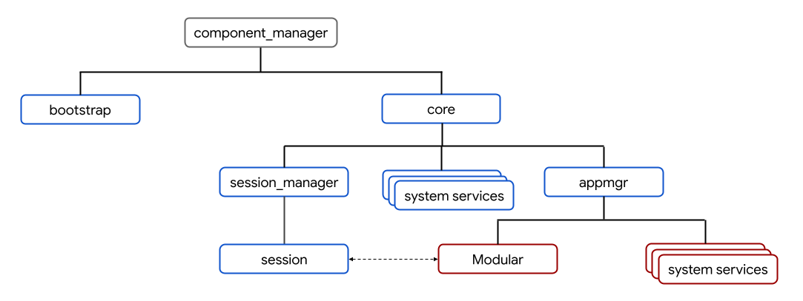

# Components v2 migration

## Goal & motivation

The Component Framework is one of the key foundations of Fuchsia's usermode
runtime environment. The original incarnation of components dates back to the
inception of the Fuchsia OS and the initial commits in 2016. The framework has
steadily evolved since then.

## What's been migrated?

Last updated: **June 2022**

Over two thirds of components have been migrated (`.cmx` to `.cml`).

## Technical background

### Modern and legacy components

Presently there are two revisions of the component framework, the legacy
architecture (also called *appmgr* after its main program, or sometimes
Components v1 and the modern architecture (also called *Component Framework*,
or sometimes [Components v2][glossary.components-v2]).

The legacy framework is largely comprised of:

*   [`appmgr`][appmgr], a program that manages the runtime environment for
    legacy components. `appmgr` is the root of the legacy components tree, and
    provides some foundational services such as the legacy component ELF runner
    and Loader service.
*   `sysmgr`, a component that manages the `sys` realm. `sysmgr` is launched by `appmgr`.
*   The `.cmx` file format for legacy component manifests.
*   The [`fuchsia.sys.*`][fuchsia-sys] FIDL library.
*   The [TestWithEnvironment][sdk-test-with-environment] testing library.

The legacy framework's development reached its peak in 2018. In 2019, Fuchsia
team began developing the modern [Component Framework][intro]. Component
Framework is largely comprised of:

*   [Component manager][component_manager], a program that manages the runtime
    environment for modern components.
*   The [`.cml`][cml] file format for modern component manifests.
*   The [`fuchsia.sys2.*`][fuchsia-sys2] and
    [`fuchsia.component.*`][fuchsia-component] FIDL libraries.
*   The [RealmBuilder][doc-realm-builder] testing library.

The following component framework software supports both modern and legacy
components:

*   Libraries that wrap Component Framework APIs, such as the SDK
    [C++ component library][sdk-components], the internal
    [`fuchsia-component`][lib-fuchsia-component] Rust component library
*   [`cmc`][cmc], the component manifest compiler.

### Topology

A high-level diagram of the system's component topology is shown below:

*   Modern components are shown in blue boxes.
*   Legacy components are shown in red boxes.
*   The dashed arrow between the [session component][glossary.session-component]
    and Modular represents bidirectional communication between both systems.

In addition, all [unit tests with generated manifests][unit-tests-generated] are
modern components.

#### Interoperability

Component manager launches `appmgr`, itself a modern component, which manages
legacy components. `appmgr` is the ancestor of all legacy components running on
the system. Users may continue developing and maintaining existing legacy
components while migrations take place at their own pace. However, if you write
a new component, you are strongly advised to make it a modern component unless
there is some reason it must be legacy. All legacy components in-tree must
appear in the GN allowlist at [//build/components/cmx][gn-cmx-allowlist].

For build configurations that include a [session
component][glossary.session-component], all capabilities hosted by legacy
components that are required by the
session are routed from `appmgr` to `session_manager` by `core`.

### Terminology

Use this terminology when talking about the state of migrating a legacy
component and its tests to the modern framework.

| &nbsp;                 | The component              | Tests that exercise it |
| :--------------------: | -------------------------- | ---------------------- |
| **Fully migrated**     | <ul><li>has a `.cml` file  | <ul><li>All automated  |
:                        : and no `.cmx`              : tests run the          :
:                        : file</li><li>runs as a     : component as a modern  :
:                        : modern component in all    : component</li></ul>    :
:                        : product builds</li></ul>   :                        :
| **Partially migrated** | <ul><li>has a `.cml` file  | <ul><li>Some automated |
:                        : and a `.cmx`               : tests exist in which   :
:                        : file</li><li>runs as a     : the component runs as  :
:                        : legacy component in some   : a modern component,    :
:                        : product configurations but : but others run it as   :
:                        : not others, or is guarded  : legacy</li></ul>       :
:                        : by a flag to do so for     :                        :
:                        : development                :                        :
:                        : purposes</li></ul>         :                        :
| **Prototyped**         | <ul><li>runs as a legacy   | <ul><li>All automated  |
:                        : component in all product   : tests in CI/CQ run the :
:                        : configurations</li><li>has : legacy component       :
:                        : a `.cml` file</li></ul>    : </li><li>there are     :
:                        :                            : tests with the modern  :
:                        :                            : component, but they    :
:                        :                            : don't run in           :
:                        :                            : CI/CQ</li></ul>        :
| **Not migrated**       | <ul><li>does not have a    | <ul><li>There are no   |
:                        : `.cml` file</li></ul>      : tests that run the     :
:                        :                            : component as a modern  :
:                        :                            : | component</li></ul>  :
:                        :                            : |                      :

#### Examples

"`root_presenter` is *partially migrated* but its tests are *not migrated*."

"`stash` and its tests are *fully migrated*."

"`basemgr` is a *partially migrated* component with *partially migrated* tests.
Specifically, ..."

"`setui_service`'s modern component was *prototyped* and it exposed some missing
dependencies."

## How to help

### Picking a task

Component migrations are happening throughout the system. Any component that
still has at least one `.cmx` file is a migration candidate.

For legacy `sys` realm components you may use the
[self-service migration guide][migrating-sys-components]. Multiple component
owners have recently seen success in using this guide, including but not limited
to:

*   Software Delivery
*   Netstack
*   Wlan
*   Bluetooth
*   Cobalt
*   Archivist

### Doing a task

Component migrations may take multiple incremental steps to complete due to
dependencies between other components that have not been migrated yet. For
example, a component and its tests can be migrated separately. For more details
on the incremental stages, see [terminology](#terminology).

The final step for migrating a component typically involves replacing all `.cmx`
files with equivalent `.cml` files. For detailed instructions on migrating a
component and its tests, see the
[self-service migration guide][migrating-sys-components].

### Completing a task

Send code reviews to owners of the directories with the component definitions
that you're changing, and to one of the people listed below:

*   <jmatt@google.com>
*   <geb@google.com>
*   <ypomortsev@google.com>

## Examples

*   [504575: [http-client] Migrate to Components v2](https://fuchsia-review.googlesource.com/c/fuchsia/+/504575)
*   [504523: [soundplayer] transition to CFv2](https://fuchsia-review.googlesource.com/c/fuchsia/+/504523)
*   [489757: [device_settings] Migrate to CFv2](https://fuchsia-review.googlesource.com/c/fuchsia/+/489757)

## Sponsors

Reach out for questions or for status updates:

*   <jmatt@google.com>
*   <shayba@google.com>
*   <component-framework-dev@fuchsia.dev>

[appmgr]: /src/sys/appmgr
[glossary.components-v2]: /docs/glossary/README.md#components-v2
[cmc]: /tools/cmc/
[cml]: /docs/concepts/components/v2/component_manifests.md
[component_manager]: /docs/concepts/components/v2/component_manager.md
[doc-realm-builder]: /docs/development/testing/components/realm_builder.md
[fuchsia-component]: https://fuchsia.dev/reference/fidl/fuchsia.component
[fuchsia-sys2]: https://fuchsia.dev/reference/fidl/fuchsia.sys2
[fuchsia-sys]: https://fuchsia.dev/reference/fidl/fuchsia.sys
[gn-cmx-allowlist]: /build/components/cmx/BUILD.gn
[initial-processes]: /docs/concepts/process/everything_between_power_on_and_your_component.md#initial-processes
[intro]: /docs/concepts/components/v2/introduction.md
[label-cf-v2-migration]: https://bugs.fuchsia.dev/p/fuchsia/issues/list?q=label%3Acf-v2-migration
[lib-fuchsia-component]: /src/lib/fuchsia-component/README.md
[migrating-sys-components]: /docs/development/components/v2/migration/README.md
[sdk-components]: /sdk/lib/sys/cpp
[sdk-test-with-environment]: /sdk/lib/sys/cpp/testing/test_with_environment.h
[glossary.session-component]: /docs/glossary/README.md#session-component
[unit-tests-generated]: /docs/development/components/build.md#unit-tests
