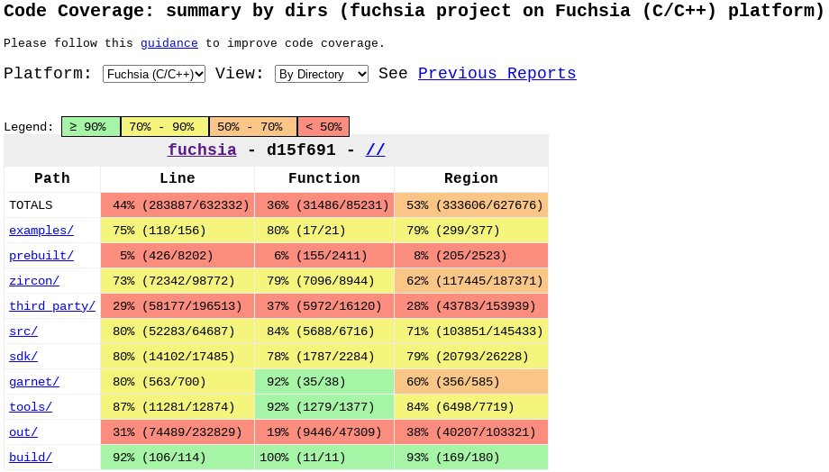
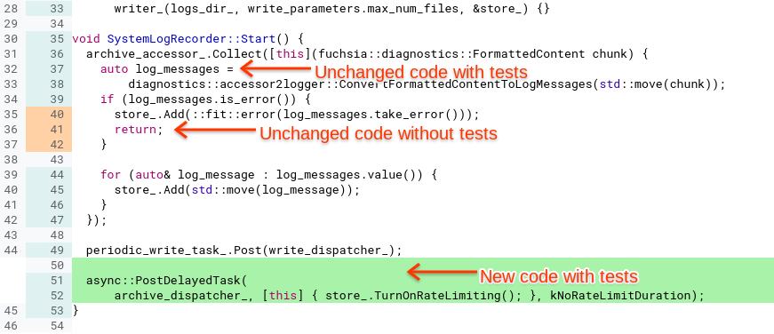
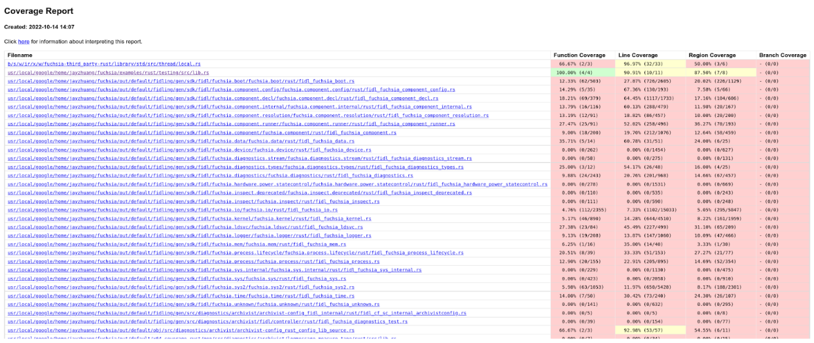
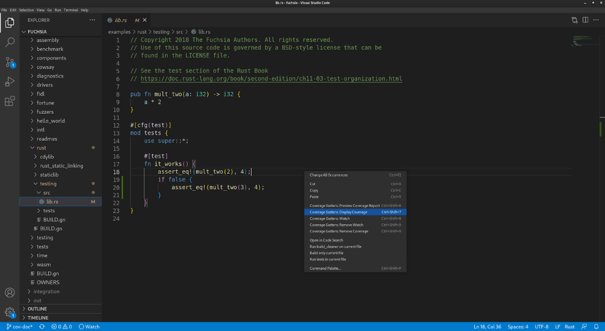
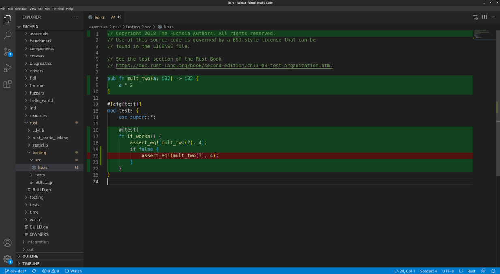
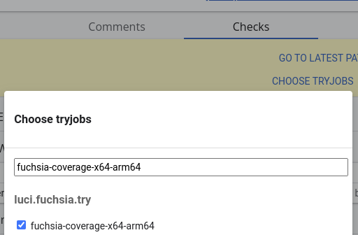
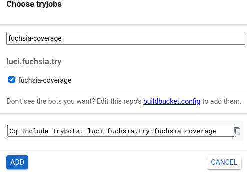

# Test coverage

## Motivation

Software testing is a common practice that helps teams continuously deliver
quality code. Tests exercise invariants on the software's behavior, catch and
prevent regressions in functionality or other desired properties, and help scale
engineering processes.

Measuring test coverage in terms of source code line coverage helps engineers
identify gaps in their testing solutions. Using test coverage as a metric
promotes higher-quality software and safer development practices. Measuring test
coverage continuously helps engineers maintain a high bar of quality.

Test coverage does not guarantee bug-free code. Testing should be used along
with other tools such as [fuzz testing][fuzz-testing], static and dynamic
analysis, etc.

## Absolute test coverage

Absolute test coverage is a measure of all lines of source code that are covered
by the complete set of tests. Fuchsia's Continuous Integration (CI)
infrastructure produces absolute coverage reports, and continuously refreshes
them. Coverage reports are typically at most a couple of hours stale.

### Absolute coverage dashboard

The latest absolute coverage report is available [here][coverage-dashboard].
This dashboard shows a tree layout of all code that was found to have been
covered by all tests that were exercised, as a subset of the source tree. You
can navigate the tree by the directory structure and view total coverage metrics
for directories or individual line coverage information for files.

In addition, coverage information is also available as a layer in Google's
internal code search.



## Incremental test coverage

Incremental test coverage is shown in the context of a change on the
[Gerrit code review web UI][gerrit]. Incremental coverage shows, specifically in
the context of a given change, which modified lines are covered by tests and
which modified lines are not.

Incremental test coverage is collected by Fuchsia's Commit Queue (CQ)
infrastructure. When sending a change to CQ (Commit-Queue+1), you can click on
the "Checks" tab, then under the three dot menu click "Show Additional Results",
then in the filter text box enter "fuchsia-coverage" to find the tryjob that is
responsible for collecting incremental coverage to show in Gerrit. When this
tryjob is complete, your patch set should have absolute coverage (|Cov.|) and
incremental coverage (ΔCov.)

Maintaining high incremental test coverage for changes affecting a project helps
keep test coverage high continuously. Particularly, it prevents introducing new
untested code into a project. Change authors can review incremental coverage
information on their changes to ensure that their test coverage is sufficient.
Code reviewers can review incremental test coverage information on changes and
ask authors to close any testing gaps that they identify as important.




## Coverage-driven development workflow {#local_coverage_edit_loop}

Note: Only component tests are supported at this time.

You can view coverage from local edits in your browser or in VS Code.
You can use this to establish a coverage-driven development workflow.

### Prepare your test environment

First let's configure the build to use the coverage variant and to include the
examples that we'll use to demonstrate the workflow.

* {C++}

  ```posix-terminal
  fx set core.x64 --variant coverage --with examples/hello_world
  fx build
  ```

* {Rust}

  ```posix-terminal
  fx set core.x64 --variant coverage-rust --with examples/hello_world
  fx build
  ```

Let's start an emulator which will be your target device and then start an
update server, we'll use two terminals for this step. If you already have a
target device running, whether an emulator or real hardware, then you can skip
this step.

In your first terminal:

```posix-terminal
fx qemu -kN
```

Next, lets start a package server that you'll use to publish updates to your
test package, this process will run in the background. If you already have a package server running then you can skip
this step.

In your second terminal:

```posix-terminal
ffx repository server start
```

Lastly we need to enable experimental test coverage support:

```posix-terminal
ffx config set coverage true
```

### View coverage in the browser

In this workflow we will run our test and produce a coverage report which we can
view in a browser.

#### Execute your tests and export the coverage HTML report

We execute our tests and generate an html report.

* {C++}

  ```posix-terminal
  fx coverage --html-output-dir $HOME/fx_coverage hello-world-cpp-unittests
  ```

* {Rust}

  ```posix-terminal
  fx coverage --html-output-dir $HOME/fx_coverage hello-world-rust-tests
  ```

### View coverage summary in the browser

Open `$HOME/fx_coverage/index.html` with your browser. You should see a coverage
summary page.



Clicking on any of the files will show you line coverage for that file. The
"Count" column shows how many times a line was visited in testing, 1 or more. No
value for "Count" means 0, i.e. the line wasn't covered.

### View coverage in VS Code

Start this section only after you’ve prepared your test environment.

1. Install the [coverage-gutters] extension from Visual Studio Marketplace.
1. Configure coverage-gutters by adding the following attributes to
   [`settings.json`][settings-json].

```json
{
    "coverage-gutters.coverageBaseDir": ".",
    "coverage-gutters.showLineCoverage": true,
    "coverage-gutters.coverageFileNames": [ "lcov.info" ]
}
```

### Run the test and view coverage

Let's execute the test and export the LCOV file, which VS Code will use to show
coverage.

* {C++}

  ```posix-terminal
  fx coverage --lcov-output-path $FUCHSIA_DIR/lcov.info hello-world-cpp-unittests
  ```

* {Rust}

  ```posix-terminal
  fx coverage --lcov-output-path $FUCHSIA_DIR/lcov.info hello-world-rust-tests
  ```

### View coverage in VS Code

1. Find the file you want to view coverage for.
1. Right click the edit area of the file and select “Coverage Gutters: Display
   Coverage.”
1. Covered lines are in green, and uncovered lines are in red.
1. You can re-export LCOV and redo step 2 to see updated coverage (for some
   reason “watch” doesn’t work.)





### Rerun the test on changes

Lastly, you can use this command to monitor for filesystem changes and rerun
the test every time you save your code.

* {C++}

  ```posix-terminal
  fx -i coverage --lcov-output-path $FUCHSIA_DIR/lcov.info hello-world-cpp-unittests
  ```

* {Rust}

  ```posix-terminal
  fx -i coverage --lcov-output-path $FUCHSIA_DIR/lcov.info hello-world-rust-tests
  ```

## End-to-end (E2E) tests exclusion

Only unit tests and hermetic integration tests are considered reliable sources
of test coverage. No test coverage is collected or presented for E2E tests.

E2E tests are large system tests that exercise the product as a whole and don't
necessarily cover a well-defined portion of the source code. For example, it's
common for E2E tests on Fuchsia to boot the system in an emulator, interact with
it, and expect certain behaviors.

### Why

Because E2E tests exercise the system as a whole:

- They were observed to often trigger different code paths between runs, making
  their coverage results flaky.
- They frequently time out on coverage builders, making the builders flaky. E2E
  tests run considerably slower than unit tests and small integration tests,
  usually take minutes to finish. And they run even slower on coverage builders
  due to coverage overhead that slows down performance.

### How

For top-level buildbot bundles like [`core`][core_bundle]{:.external}, a
counterpart [`core_no_e2e`][core_no_e2e_bundle]{:.external} is provided, so bots
that collect coverage can use the `no_e2e` bundle to avoid building and running
any E2E tests.

Currently, there are no reliable ways to identify all E2E tests in-tree. As a
proxy, `no_e2e` bundles maintain the invariant that they don't have any known
e2e test libraries in their recursive dependencies, through GN's
[`assert_no_deps`][assert-no-deps]{:.external}. The list of E2E test libraries
is manually curated and maintained, with the assumption that it changes very
infrequently:

```gn

```

## Limitations

Currently, test coverage is collected only if:

- The code is written in C, C++, or Rust.
- The code runs on Fuchsia in usermode, or runs on the host. Kernel coverage is
  not yet supported ([tracking bug](https://fxbug.dev/34196)).
- The test runs on qemu. Testing on hardware is not yet supported.
- The test runs as part of the `core` product configuration.
- End-to-end (e2e) tests are [not supported](#end-to-end_e2e_tests_exclusion).

On that last note, e2e tests exercise a lot of code throughout the system, but
they do so in a manner that's inconsistent between runs (or "flaky"). To achieve
higher test coverage for code, it is possible and in fact recommended to do so
using unit tests and integration tests.

### Experimental features

By default, [incremental coverage](#incremental_test_coverage) is only collected
in `core.x64`. To collect combined coverage for your change in both `core.x64`
and `core.arm64`, follow these steps:

1. In Gerrit, go to the Checks tab.
1. Press Choose Tryjobs.
1. Add `fuchsia-coverage-x64-arm64`.



A check will appear. Once it turns from pending to done, refresh Gerrit to see
the coverage results.

See also:
[Issue 91893: Incremental coverage in Gerrit only collected for x64](https://fxbug.dev/91893)

### Upcoming features

Support for the following additional use cases is currently under development:

- Kernel code coverage.
- Coverage on product configurations other than `core`, for instance `bringup`
  or `workstation_eng`.
- Coverage on hardware targets, that is collecting from tests that don't run on
  qemu.

## Troubleshooting

### Unsupported configuration / language / runtime

If you are not seeing absolute or incremental coverage information for your
code, first review the [limitations](#limitations) and ensure that your code is
expected to receive coverage support in the first place.

To help you troubleshoot, review whether you are missing coverage (lines should
have coverage but are showing as not covered) or whether you have no coverage
information at all (files don't appear in coverage reports at all, or lines are
not annotated on whether or not they are covered).

Missing coverage indicates that the code was built with instrumentation but
wasn't actually covered by a test that ran. No coverage information at all might
indicate for instance that your code doesn't build with coverage or your tests
don't run under coverage (more on this below).

### Stale reports / latency

Absolute coverage reports are generated after the code is merged and may take a
few hours to fully compile. The dashboard shows the commit hash for the
generated report. If you're not seeing expected results on the dashboard, ensure
that the data was generated past any recent changes that would have affected
coverage. If the data appears stale, come back later and refresh the page.

Incremental coverage reports are generated by CQ. Ensure that you are looking at
a patch set that was sent to CQ. You can click "show experimental tryjobs" to
reveal a tryjob named `fuchsia-coverage`. If the tryjob is still running, come
back later and refresh the page.

### Ensure that your test ran

If your code is missing coverage that you expect to see, then pick a test that
should have covered your code and ensure that it ran on the coverage tryjob.

1. Find the tryjob in Gerrit, or find a recent `fuchsia-coverage` run on the
   [CI dashboard][fuchsia-coverage-ci].
1. In the Overview tab, find the "collect builds" step and expand it to find
   links to the pages that show different coverage build & test runs for
   different configurations.
1. Each of these pages should have a Test Results tab showing all tests that
   ran. Ensure that your expected test ran, and preferably that it passed.

If your test didn't run on any coverage tryjob as expected then one reason might
simply be that it only runs in configurations not currently covered by CI/CQ.
Another is that the test is explicitly opted out in coverage variants. For
instance a `BUILD.gn` file referencing your test might look as follows:

```gn
fuchsia_test_package("foo_test") {
  test_components = [ ":test" ]
  deps = [ ":foo" ]

  # TODO(fxbug.dev/12345): This test is intentionally disabled on coverage.
  if (is_coverage) {
    test_specs = {
      environments = [
        {
          dimensions = emu_env.dimensions
          tags = [ "disabled" ]
        },
      ]
    }
  }
}
```

Look for context as to why your test is disabled on coverage and investigate.

An example for troubleshooting a case where a test wasn't showing coverage
because it was not set up to run on CQ can be found [here][fxr608002-comment].

### Test only fails or flakes in coverage

Related to the above, tests are more likely to be flaky under coverage
[example][fxr541525]. The extra overhead from collecting coverage at runtime
slows down performance, which in turn affects timing, which is often the cause
for additional flakiness.

Another reason could be a timeout during the test that is not encountered in
regular test runs. Experimental results show that on average tests run 2.3x
slower in the coverage variant, due to the added overhead of collecting the
runtime profile. To accommodate for this, the test runner affords a longer
timeout for each test when running a coverage build. However tests may still
have their own timeouts for internal operations, which may be affected by this.

As a general rule of thumb, you shouldn't have timeouts in tests. When waiting
on an asynchronous operation in a test, it's best to wait indefinitely and let
the test runner's overall timeout expire.

Lastly, on the coverage variant components may use the
[`fuchsia.debug.DebugData`][debugdata] protocol. This interferes with tests that
make assumptions about precisely what capabilities components use. See for
instance:

- [Issue 77206: Failing test on coverage builder: fuchsia-pkg://fuchsia.com/hub_integration_test#meta/hub_integration_test.cmx][fxb77206]
- [Issue 89446: realm_builder_server_test fails on coverage variant][fxb89446]

An immediate fix would be to disable your test under coverage (see the GN
snippet above), at the immediate cost of not collecting coverage information
from your test. As a best practice you should treat flakes on coverage the same
as you would treat flakes elsewhere, mainly fix the flakiness.

See also: [flaky test policy][flaky-policy].

### Not seeing expected coverage in Gerrit

If you are not seeing coverage for certain lines but you are convinced that
those lines should be covered by tests that are running, try collecting coverage
again by pressing "Choose Tryjobs", finding `fuchsia-coverage`, and adding it.



If `fuchsia-coverage` finishes (turns green) and you are seeing different line
coverage results, then one of the following is true:

1. Your tests exercise the code under test in an inconsistent way between
   different runs. This often also leads to flaky test results, and is usually a
   problem with the behavior of the test or the code under test.
1. There is an issue in how coverage is generated and collected that leads to
   inconsistent results. Please file a bug.

## How test coverage works

Fuchsia's code coverage build, test runtime support, and processing tools use
[LLVM source-based code coverage][llvm-coverage]{:.external}. The Fuchsia
platform is supported by compiler-rt profile runtime.

Profile instrumentation is activated when the `"coverage"` build variant is
selected. The compiler will then generate counters that each correspond to a
branch in the code's control flow, and emit instructions on branch entry to
increment the associated counters. In addition, the profile instrumentation
runtime library is linked into the executable.

For more implementation details see
[LLVM Code Coverage Mapping Format][llvm-coverage-mapping-format]{:.external}.

Note that the instrumentation leads to increased binary size, increased memory
usage, and slower test execution time. Some steps were taken to offset this:

- Tests in profile variants are afforded longer timeouts.
- Tests in profile variants are compiled with some optimizations.
- Coverage currently runs on emulators, where storage is less constrained.
- For incremental coverage, only sources affected by the change are
  instrumented.

The profile runtime library on Fuchsia stores the profile data in a [VMO], and
publishes a handle to the VMO using the [`fuchsia.debug.DebugData`][debugdata]
protocol. This protocol is made available to tests at runtime using the
[Component Framework][cfv2] and is hosted by the [Test Runner Framework][trf]'s
on-device controller, Test Manager.

The profiles are collected after the test realm terminates, along with any
components hosted in it. The profiles are then processed into a single summary
for the test. This is an important optimization that significantly reduces the
total profile size. The optimized profile is then sent to the host-side test
controller.

The host uses the [`covargs`][covargs] tool, which itself uses the
[`llvm-profdata`][llvm-profdata]{:.external} and
[`llvm-cov`][llvm-cov]{:.external} tools, to convert raw profiles to a summary
format and to generate test coverage reports. In addition, `covargs` converts
the data to protobuf format which is used as an interchange format with various
dashboards.

## Roadmap

Ongoing work:

- Performance and reliability improvements to the coverage runtime.
- Kernel support for source code coverage from ZBI tests.
- Custom coverage dashboards and alerts: build a dashboard for your team.
- Local workflow: run tests locally, produce a coverage report locally.
- IDE integration: see a coverage layer inside VS Code.

Upcoming work:

- Out-of-tree support: coverage outside of Fuchsia CI/CQ.

## Further reading

- [Code Coverage Best Practices][gtb-coverage-best]{:.external}
- [Measuring Coverage at Google][gtb-coverage-measure]{:.external}
- [Understand Your Coverage Data][gtb-coverage-understand]{:.external}
- [How Much Testing is Enough?][gtb-testing-enough]{:.external}

[assert-no-deps]: https://gn.googlesource.com/gn/+/HEAD/docs/reference.md#var_assert_no_deps
[cfv2]: /concepts/components/v2/
[core_bundle]: https://cs.opensource.google/fuchsia/fuchsia/+/main:bundles/buildbot/BUILD.gn;l=58;drc=9e1506dfbe789637c709fcc4ad43896f5044f947
[core_no_e2e_bundle]: https://cs.opensource.google/fuchsia/fuchsia/+/main:bundles/buildbot/BUILD.gn;l=53;drc=9e1506dfbe789637c709fcc4ad43896f5044f947
[covargs]: /tools/debug/covargs/
[coverage-dashboard]: https://analysis.chromium.org/coverage/p/fuchsia
[coverage-gutters]: https://marketplace.visualstudio.com/items?itemName=ryanluker.vscode-coverage-gutters
[debugdata]: https://fuchsia.dev/reference/fidl/fuchsia.debugdata
[flaky-policy]: /development/testing/test_flake_policy.md
[fuchsia-coverage-ci]: https://ci.chromium.org/p/fuchsia/builders/ci/fuchsia-coverage
[fuzz-testing]: /contribute/testing/fuzz_testing.md
[fxb77206]: https://bugs.fuchsia.dev/p/fuchsia/issues/detail?id=77206
[fxb89446]: https://bugs.fuchsia.dev/p/fuchsia/issues/detail?id=89446
[fxr541525]: https://fuchsia-review.googlesource.com/c/fuchsia/+/541525
[fxr608002-comment]: https://fuchsia-review.googlesource.com/c/fuchsia/+/608002/comments/b0fde8b7_9a3a39d7
[gerrit]: https://fuchsia-review.googlesource.com/
[gtb-coverage-best]: https://testing.googleblog.com/2020/08/code-coverage-best-practices.html
[gtb-coverage-measure]: https://testing.googleblog.com/2014/07/measuring-coverage-at-google.html
[gtb-coverage-understand]: https://testing.googleblog.com/2008/03/tott-understanding-your-coverage-data.html
[gtb-testing-enough]: https://testing.googleblog.com/2021/06/how-much-testing-is-enough.html
[llvm-cov]: https://llvm.org/docs/CommandGuide/llvm-cov.html
[llvm-coverage]: https://clang.llvm.org/docs/SourceBasedCodeCoverage.html
[llvm-coverage-mapping-format]: https://llvm.org/docs/CoverageMappingFormat.html
[llvm-profdata]: https://llvm.org/docs/CommandGuide/llvm-profdata.html
[settings-json]: https://code.visualstudio.com/docs/getstarted/settings#_settingsjson
[trf]: /development/testing/components/test_runner_framework.md
[vmo]: /reference/kernel_objects/vm_object.md
