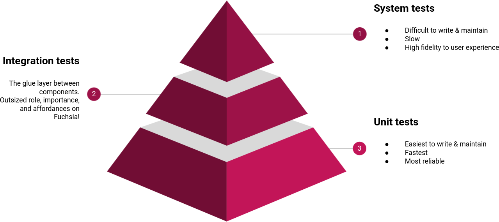

# Testing scope

The most commonly considered parameter that tests vary on is scope (or sometimes
referred to as “size”).

Scope is relative to a testable unit. A test that focuses on a single such unit
is called a unit test, and a test that exercises several units together is
called an integration test. Most tests can also be arranged in the
[testing pyramid](#scope-of-tests).

A unit is arbitrarily defined from the test author’s perspective. For instance
in object-oriented programming, a unit is typically a class. Throughout this
document, and generally on Fuchsia, is is often mention ed that a unit under
test is a component unless otherwise stated.

As you write tests for Fuchsia, you want to make sure that you are familiarized
with the [testing principles][testing-principles] and the
[best practices][best-practices] for writing tests.

## Scope of tests {#scope-of-tests}

Tests at different scope complement each other’s strengths and weaknesses. A
good mix of tests can create a great testing plan that allows developers to make
changes with confidence and catches real bugs quickly and efficiently.

When considering what kind of tests to write and how many of each, imagine tests
arranged as a pyramid:

Many software testing publications advocate for a mix of 70% unit tests, 20%
integration tests, 10% system tests. Fuchsia recommends investing more in
integration testing at the expense of other types of testing for the following
reasons:

- Fuchsia emphasizes componentization of software. Applications and systems on
  Fuchsia tend to exercise the boundaries between components very extensively.
  Therefore we recommend that you test those boundaries.
- Fuchsia’s Component Framework makes it possible, sometimes easy, to reuse
  production components in tests, which lowers the cost of developing
  integration tests.
- Fuchsia’s testing runtime offers the same level of isolation for integration
  tests as it does for unit tests, making integration testing as reliable.
- Communication between components is orders of magnitude slower than a direct
  method call, but still pretty fast. Integration tests typically don’t run
  slower than unit tests to an extent that is perceptible by a human developer.
- There already exist many integration tests on Fuchsia that serve as useful
  examples.

For more information on the various tests from the testing pyramid in Fuchsia:

* [Unit tests](#unit-tests)
* [Integration tests](#integration-tests)
* [System tests](#system-tests)

There are also specialized tests that fall outside of the testing pyramid.
For more information, see [specialized testing](#specialized-testing).

See also:

- [The Practical Test Pyramid][practical-test-pyramid]{:.external}

### Unit tests {#unit-tests}

On Fuchsia, tests that are fully defined in a single component are called unit
tests.

Unit tests can run in an isolated [realm][glossary.realm] that serves as their
sandbox. This keeps tests from acquiring unexpected capabilities, from being
influenced by system state outside the intended scope of the test, and from
influencing other tests that are running in parallel or in sequence on the same
device.

Unit tests are controlled by direct invocations of code within the body of the
test. For instance,
[`audio_effects_example_tests.cc`][audio-effects-example-tests] exercises code
in a loadable module that implements audio effects and validates that the code
works.

In a healthy [testing pyramid](#scope-of-tests), unit tests are the broad base
for testing because unit tests offer the highest degree of isolation and are the
fastest tests, which in turn produces very reliable and useful positive signals
(tests pass) and negative signals (the test failed with an actionable error
indicating a real defect). Unit tests also produce the most actionable
[test coverage][test-coverage] information, and enjoy other fringe benefits such
as when run in combination with [sanitizers]. Therefore any testing needs that
can be met with unit tests should be met with unit tests.

A unit test is said to be hermetic if only the contents of the test’s package
influence whether the test passes or fails.

See also:

- [Testing with Components][testing-v2]
- [Run a test component][run-test-component]
- [Test package GN templates][test-package-gn]

### Integration tests {#integration-tests}

On Fuchsia, tests that span multiple components that are delivered in a single
test package are called integration tests.

In a healthy [testing pyramid](#scope-of-tests), integration tests are the next
most common types of tests after unit tests. Integration tests on Fuchsia are
typically fast, though not as fast as unit tests. Integration tests on Fuchsia
are isolated from outside effects from the rest of the system, same as unit
tests. Integration tests are more complex than unit tests to define and drive.
Therefore any testing needs that can’t be met with unit tests but can be met
with integration tests should be met with integration tests.

Integration testing has an outsized role on Fuchsia compared to other platforms.
This is because Fuchsia encourages software developers to decompose their code
into multiple components in order to meet the platform’s
[security][principles-secure] and [updatability][principles-updatable] goals,
and then offers robust inter-component communication mechanisms such as
[channels][channel] and [FIDL].

In an integration test, an isolated [realm][glossary.realm] is created similarly
to a unit test, but then multiple components are staged in that realm and
interact with each other. The test is driven by one of the components in the
test realm, which also determines whether the test passed or failed and provides
additional diagnostics. For instance, the
[font server integration tests][fonts-tests-integration] test a font resolver
component that exposes the
[`fuchsia.pkg.FontResolver`][fuchsia.pkg.fontresolver] FIDL protocol as a
[protocol capability][capabilities-protocol], and then validate that component
by invoking the methods in its contract with clients and validating expected
responses and state transitions.

Integration tests are controlled by the test driver. The test driver sets up
one or more components under test, exercises them, and observes the outcomes
such as by querying the state of those components using their supported
interfaces and other contracts.

Within the test realm, standard
[capability routing][glossary.capability-routing] works exactly the same way as
it does in any other realm. In test realms, capability routing is often used as
a mechanism for [dependency injection][dependency-injection]{:.external}. For
instance a component under test that has a dependency on a capability provided
by another component that’s outside the test scope may be tested against a
different component (a “test double”), or against a separate instance of the
production component that is running in isolation inside the test realm.

An integration test is said to be hermetic if only the contents of the test’s
package influence whether the test passes or fails.

See also:

- [Complex topologies and integration testing][testing-integration]: How to
  statically define a test realm with multiple components and route capabilities
  between them.
- [Realm builder][realm-builder]: An integration testing helper library for
  runtime construction of test realms and mocking components in individual test
  cases.

### System tests {#system-tests}

On Fuchsia, tests that aren’t scoped to the contents of a single package and of
one or more components contained within are called system tests. The scope of
such tests is not strictly defined in terms of components or packages, and may
span up to and including the entire system as built in a given configuration.

System tests are sometimes referred to as Critical User Journey (CUJ) tests or
End-To-End (E2E) tests. For instance,
[`screen_is_not_black`][screen-is-not-black] is a CUJ test that tests that
booting the system does not result in a completely black screen. Some might say
that such tests are E2E if the scope is even greater than a single Fuchsia
device, for instance when testing against a remote server or when testing in the
presence of specific wifi access points or other connected hardware.

In a healthy [testing pyramid](#scope-of-tests), system tests are the narrow
tip of the pyramid, indicating that there are fewer system tests than there are
tests in other scopes. System tests are typically far slower than unit tests
and integration tests because they exercise more code and have more
dependencies, many of which are implicitly defined rather than explicitly
stated. System tests don’t offer an intrinsic degree of isolation and are
subject to more side effects or unanticipated interference, and as a result they
are typically less reliable than other types of tests. Because the scope of code
that’s exercised by system tests is undefined,
[Fuchsia’s CI/CQ doesn’t collect test coverage from E2E tests][coverage-no-e2e]
(collecting coverage would yield unstable or flaky results).
[E2E configurations are not supported by sanitizers][sanitizers-supported-configs]
for similar reasons. For this reason you should write system tests when their
marginal benefits cannot be gained by unit tests or integration tests.

See also:

- [Run an end-to-end test][run-e2e-test]
- [Create a new end-to-end test][create-e2e-test]

## Additional testing {#specialized-testing}

There are various specialized tests in Fuchsia:

* [Kernel tests](#kernel-tests)
* [Compatibility tests](#compatibility-tests)
* [Performance tests](#performance-tests)
* [Stress and longetivity tests](#stress-longetivity-tests)
* [Fuzzing](#fuzzing)

### Kernel tests

Testing the kernel deserves special attention because of the unique requirements
and constraints that are involved. Tests for the kernel cover the kernel’s
surface: [system calls][syscalls], kernel mechanics such as handle rights or
signaling objects, the [vDSO] ABI, and [userspace bootstrapping][userboot], as
well as any important implementation details.

Most tests for the kernel run in user space and test the kernel APIs from the
outside. These are called [core usermode tests][utest-core]. For instance,
[`TimersTest`][timers-test] tests the kernel’s timer APIs. These tests are more
difficult to write than regular tests: only certain programming languages are
supported, there are weaker isolation boundaries between tests, tests can’t run
in parallel, it’s not possible to update the tests without rebooting and
repaving, and other constraints and limitations apply. These tradeoffs allow the
tests to make fewer assumptions about their runtime environment, which means
that they’re runnable even in the most basic build configurations
([bringup builds][build-bringup]) without the component framework or advanced
network features. These tests are built into the
[Zircon Boot Image (ZBI)][glossary.zbi]. It’s possible to run these tests such
that no other programs run in usermode, which helps isolate kernel bugs.

Some kernel behaviors cannot be tested from the outside, so they’re tested with
code that compiles into the kernel image and runs in kernelspace. These tests
are even more difficult to write and to troubleshoot, but have the most access
to kernel internals, and can be run even when userspace bootstrapping is broken.
This is sometimes necessary for testing. For instance,
[`timer_tests.cc`][timer-tests] tests timer deadlines, which cannot be tested
precisely just by exercising kernel APIs from userspace because the kernel
reserves some [slack][timer-slack] in how it may coalesce timers set from
userspace.

### Compatibility tests

Compatibility tests, sometimes known as conformance tests, extend the notion of
correctness to meeting a given specification and complying with it over time. A
compatibility test is expressed in certain contractual terms and can be run
against more than one implementation of that contract, to ensure that any number
of implementations are compatible.

For example:

- Fuchsia’s [Compatibility Test Suite (CTS)][cts] builds tests that validate
  Fuchsia’s system interface. CTS tests can run against different versions of
  Fuchsia, to ensure that they remain in compatibility or to detect breaking
  changes. In the fullness of time, CTS tests will cover the entirety of the
  surface of the Fuchsia SDK.
- [FIDL] uses a specific binary format (or [wire format][fidl-wire-format]) to
  encode FIDL messages that are exchanged between components over channels. FIDL
  client-side and server-side bindings and libraries exist in many languages
  such as C, C++, Rust, Dart, and Go. The
  [FIDL compatibility tests][fidl-compatibility-tests] and
  [Golden FIDL (GIDL)][gidl] tests ensure that the different implementations are
  binary-compatible, so that client and servers can talk to each other correctly
  and consistently regardless of their developer’s choice of programming
  language.
- [Fuchsia Inspect][inspect] uses a [certain binary format][inspect-vmo-format]
  to encode diagnostics information. Inspect is offered in
  [multiple languages][inspect-codelab] and the underlying binary format
  [may change over time][inspect-vmo-format-update].
  [Inspect validator tests][inspect-validator] ensure binary-compatibility
  between all reader/writer implementations.

### Performance tests

Performance tests exercise a certain workload, such as a synthetic benchmark or
a CUJ, and measure performance metrics such as time to completion or resource
usage during the test.

A performance test may ensure that a certain threshold is met (for instance
frames render at a consistent rate of 60 FPS), or they may simply collect the
performance information and present it as their result.

For instance:

- Many performance tests and performance testing utilities can be found in the
  [end-to-end performance tests directory][e2e-perf]. These cover a range of
  targets such as kernel boot time, touch input latency, Flutter rendering performance,
  and various micro-benchmarks for performance-sensitive code.
- [CPU Performance Monitoring][cpuperf] makes CPU performance counters available
  for high-frequency low-overhead performance testing.
- [Perfcompare] is a framework for comparing the results of a given benchmark
  before and after a given change. It’s useful for measuring performance
  improvements or regressions.
- [FIDL benchmarks][fidl-benchmarks] have various-sized benchmarks for FIDL
  generated code.
- [Netstack benchmarks][netstack-benchmarks] test the network stack’s
  performance using micro-benchmarks for hot code.

### Stress and longevity tests

Stress tests exercise a system in ways that amount to exceptionally high load,
but are otherwise expected within the system's contract. Their goal is to
demonstrate the system's resilience to stress, or to expose bugs that only
happen under stress.

In a stress test, the the system under test is isolated from the test workload
components. Test workload components can do whatever they wish, including
crashing without bringing down the system under test.

For instance, the [minfs stress tests][minfs-stress] performs many operations on
a [MinFS partition][minfs] in repetition. The test can verify that the
operations succeed, that their outcomes are observed as expected, and that MinFS
doesn’t crash or otherwise exhibit errors such as filesystem corruption.

Tests that intentionally exercise a system for a long duration of time are a
type of stress test known as a longevity test. In a longevity test, the span of
time is intrinsic to the load or stress on the system. For instance a test where
a system goes through a user journey 10,000 times successfully is a stress test,
whereas a test where a system goes through the same user journey in a loop for
20 hours and remains correct and responsive is also a longevity test.

See also:

- [Stress tests][stress-tests]
- [Rust stress test library][rust-stress-test-lib]

### Fuzzing

Fuzzers are programs that attempt to produce valid interactions with the code
under test that will result in an erroneous condition, such as a crash. Fuzzing
is directed by pseudorandom behavior, or sometimes through instrumentation
(seeking inputs that cover new code paths) or other informed strategies such as
pregenerated dictionaries or machine learning.

Experience has shown that fuzzers can find unique, high-severity bugs. For
instance [`reader_fuzzer.cc`][reader-fuzzer] found bugs in Inspect reader code
that would result in a crash at runtime, even though this code was already
subjected to extensive testing and sanitizers.

See also:

- [Fuzzing in Fuchsia][fuzzing]

[best-practices]: /docs/contribute/testing/best-practices.md
[testing-principles]: /docs/contribute/testing/principles.md
[audio-effects-example-tests]: /src/media/audio/examples/effects/test/audio_effects_example_tests.cc
[build-bringup]: /docs/development/build/build_system/bringup.md
[capabilities-protocol]: /docs/concepts/components/v2/capabilities/protocol.md
[cf]: /docs/concepts/components/v2/README.md
[cf-capabilities]: /docs/concepts/components/v2/capabilities/README.md
[cf-manifests]: /docs/concepts/components/v2/component_manifests.md
[channel]: /docs/reference/kernel_objects/channel.md
[continuous-integration]: https://martinfowler.com/articles/continuousIntegration.html
[contract-test]: https://martinfowler.com/bliki/ContractTest.html
[coverage-no-e2e]: /docs/contribute/testing/coverage.md#end-to-end_e2e_tests_exclusion
[cpuperf]: /src/performance/cpuperf/README.md
[create-e2e-test]: /docs/development/testing/create_a_new_end_to_end_test.md
[cts]: /sdk/cts/README.md
[dependency-injection]: https://en.m.wikipedia.org/wiki/Dependency_injection
[e2e-perf]: /src/tests/end_to_end/perf/README.md
[fidl]: /docs/concepts/fidl/overview.md
[fidl-benchmarks]: /src/tests/benchmarks/fidl/benchmark_suite/
[fidl-compatibility-tests]: /src/tests/fidl/compatibility/README.md
[fidl-wire-format]: /docs/reference/fidl/language/wire-format
[fonts-tests-integration]: /src/fonts/tests/integration/README.md
[fsi]: /docs/concepts/packages/system.md
[fuchsia.pkg.fontresolver]: https://fuchsia.dev/reference/fidl/fuchsia.pkg#FontResolver
[fuzzing]: /docs/development/testing/fuzzing/overview.md
[gidl]: /tools/fidl/gidl/README.md
[glossary.capability-routing]: /docs/glossary/README.md#capability-routing
[glossary.realm]: /docs/glossary/README.md#realm
[glossary.zbi]: /docs/glossary/README.md#zircon-boot-image
[inspect]: /docs/development/diagnostics/inspect/README.md
[inspect-codelab]: /docs/development/diagnostics/inspect/codelab/codelab.md
[inspect-validator]: /docs/reference/diagnostics/inspect/validator/README.md
[inspect-vmo-format]: /docs/reference/platform-spec/diagnostics/inspect-vmo-format.md
[inspect-vmo-format-update]: /docs/reference/diagnostics/inspect/updating-vmo-format.md
[minfs]: /docs/concepts/filesystems/minfs.md
[minfs-stress]: /src/storage/stress-tests/minfs/
[multi-repo-dev]: https://testing.googleblog.com/2015/05/multi-repository-development.html
[netstack-benchmarks]: /src/connectivity/network/tests/benchmarks/README.md
[netstack3-roadmap]: /docs/contribute/roadmap/2021/netstack3.md
[perfcompare]: /src/testing/perfcompare/README.md
[practical-test-pyramid]: https://martinfowler.com/articles/practical-test-pyramid.html
[principles]: /docs/concepts/index.md
[principles-inclusive]: /docs/concepts/principles/inclusive.md
[principles-pragmatic]: /docs/concepts/principles/pragmatic.md
[principles-secure]: /docs/concepts/principles/secure.md
[principles-updatable]: /docs/concepts/principles/updatable.md
[reader-fuzzer]: /zircon/system/ulib/inspect/tests/reader_fuzzer.cc
[realm-builder]: /docs/development/testing/components/realm_builder.md
[run-e2e-test]: /docs/development/testing/run_an_end_to_end_test.md
[run-test-component]: /docs/development/run/run-test-component.md
[rust-stress-test-lib]: /docs/development/testing/rust_stress_test_library.md
[sanitizers]: /docs/contribute/testing/sanitizers.md
[sanitizers-supported-configs]: /docs/contribute/testing/sanitizers.md#supported_configurations
[screen-is-not-black]: /src/tests/end_to_end/screen_is_not_black/README.md
[stress-tests]: /docs/development/testing/stress_tests.md
[syscalls]: /docs/reference/syscalls/README.md
[test-coverage]: /docs/contribute/testing/coverage.md
[test-package-gn]: /docs/development/components/build.md#test-packages
[testing-integration]: /docs/development/testing/components/integration_testing.md
[testing-v2]: /docs/development/testing/components/README.md
[timer-slack]: /docs/concepts/kernel/timer_slack.md
[timer-tests]: /zircon/kernel/tests/timer_tests.cc
[timers-test]: https://fuchsia.googlesource.com/fuchsia/+/main/src/zircon/tests/timers/timers.cc
[userboot]: /docs/concepts/process/userboot.md
[utest-core]: /zircon/system/utest/core/README.md
[vdso]: /docs/concepts/kernel/vdso.md
[wikipedia-dependency-injection]: https://en.m.wikipedia.org/wiki/Dependency_injection
