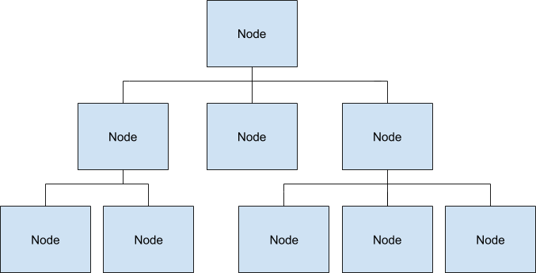
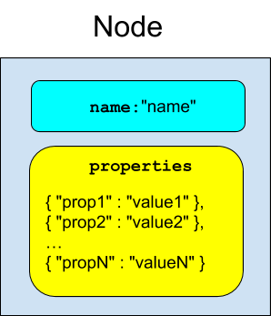

# Fuchsia component inspection overview

Components in Fuchsia may expose structured information about themselves
conforming to the Inspect API. This document describes the concepts of
component inspection, the interface, the C++ language implementation
of the interface, and user-facing tools for interacting with components
that expose information.

[TOC]

## Quick links

**Not sure where to start?**

* [Quickstart](quickstart.md) – A get-started guide for component inspection.
* [`ffx inspect`][ffx-inspect] – The `ffx` command for inspecting components.
* [Codelab](codelab/README.md) – A full codelab in C++, Rust, and Dart.
* API reference for [C++](https://fuchsia-docs.firebaseapp.com/cpp/inspect/index.html),
  [Rust](https://fuchsia-docs.firebaseapp.com/rust/fuchsia_inspect/index.html),
  and [Dart](https://fuchsia-docs.firebaseapp.com/dart/package-fuchsia_inspect_inspect/package-fuchsia_inspect_inspect-library.html).

* [Health checks] – Describes the health check subsystem.

## Concepts

Components may expose a tree of **Nodes**, each of which has a set of
**Properties**.



### Node

A node is an exported entity within a component that may have 0 or
more children. Each node has a name, and each child of a node
must have a unique name among the children.



### Property

Nodes may have any number of properties. A property has a string key and a value
which may be any one of a number of types:

#### Numeric Types

- `UintProperty` - 64-bit unsigned integer.
- `IntProperty` - 64-bit signed integer.
- `DoubleProperty` - 64-bit floating point value.
- `BoolProperty` - A boolean value.

#### String Types

- `StringProperty` - UTF-8 string.
- `ByteVectorProperty` - Vector of bytes.

#### Array Types

- `UintArray`, `IntArray`, `DoubleArray` - An array of the corresponding numeric type.

#### Histogram Types

- `LinearUintHistogram`, `LinearIntHistogram`, `LinearDoubleHistogram`

A histogram with fixed-size buckets stored in an array.

- `ExponentialUintHistogram`, `ExponentialIntHistogram`, `ExponentialDoubleHistogram`

A histogram with exponentially sized buckets stored in an array.

### Inspect File Format

The [Inspect File Format] is a binary format
that supports efficient insertion, modification, and deletion of Nodes and
Properties at runtime. Readers take a consistent snapshot of the contents
without communicating with writers.

### Filesystem Interface

Components by default obtain a reference to their `out/` directory in
their hub.

*Top-level* nodes are exposed as VmoFiles in the Hub ending in the extension `.inspect`.
It is customary for components to expose their primary or root tree as
`out/diagnostics/root.inspect`.

The manager for a component's environment may expose its own information
about the component to the hub. For instance, appmgr exposes
`system_objects` for each component.

### Language Libraries

* {[C++](/zircon/system/ulib/inspect)}

  The C++ Inspect Library provides full [writing][cpp-1] and
  [reading][cpp-2] support for the Inspect File Format.

  Components that write inspect data should refrain from reading that data.
  Reading requires traversing the entire buffer, which is very expensive.

  The `Inspector` class provides a wrapper around creating a new buffer
  with one root Node that can be added to. Nodes and Properties have typed
  [wrappers][cpp-3] that automatically delete the underlying data from the
  buffer when they go out of scope.

  The [sys\_inspect][cpp-4] library provides a simple `ComponentInspector`
  singleton interface to help with the common case of exposing a single
  hierarchy from the component.

  The [health][cpp-5] feature supports exposing structured health information
  in a format known by health checking tools.

  The [test matchers][cpp-6] library provides GMock matchers for verifying
  data that is read out of an Inspect hierarchy in tests.

#### Reading Support

  The [reading library][cpp-reading-1] supports parsing an Inspect File
  into a [Hierarchy][cpp-reading-2]. `Hierarchy`s contain `NodeValue`s
  and `PropertyValues`, which are the parsed versions of `Node`s and
  `Property`s respectively.

  The `Hierarchy`'s `NodeValue` is returned by `node()` and child
  `Hierarchy`s are returned in a vector by `children()`. The `GetByPath`
  function supports reading a specific child hierarchy by path.

  The properties for a particular `NodeValue` are available through the
  `properties()` accessor. You may determine if a property contains a
  certain type by passing the corresponding `PropertyValue` type as the
  template parameter to the `Contains<T>()` method:

  ```cpp
  // Returns true if the first property of the hierarchy's node is an INT value.
  if (hierarchy.node().properties()[0].Contains<IntPropertyValue>()) {
    // ...
  }
  ```

  Use the `Get<T>()` method to obtain the property:

  ```cpp
  // Get the IntPropertyValue of the first property on the node.
  // Note: This causes a runtime exception if the property does not contain
  // the given type, crashing the program.
  hierarchy.node().properties()[0].Get<IntPropertyValue>();
  ```

  You may also switch based on the different possible format types:

  ```cpp
  const auto& property = hierarchy.node().properties()[0];
  switch (property.format()) {
    case FormatType::INT:
      const auto& value = property.Get<IntPropertyValue>();
      /* ... */
      break;
    /* ... */
  }
  ```

  Array types may be specially formatted to contain histograms. The
  `GetBuckets()` method supports returning an array of histogram buckets
  from `{Int,Uint,Double}ArrayValue` types. The array will be empty if
  the underlying array is not a specially formatted histogram.

* {[Rust](/src/lib/diagnostics/inspect/rust)}

  The Rust Inspect Library provides full [writing][rust-1] and
  [reading][rust-2] support for the Inspect File Format.

  Components that write inspect data should refrain from reading that data.
  Reading requires traversing the entire buffer, which is very expensive.

  The `Inspector` class provides a wrapper around creating a new buffer
  with one root Node that can be added to. Nodes and Properties have typed
  [wrappers][rust-3] that automatically delete the underlying data from the
  buffer when they go out of scope.

  The [component][rust-4] module supports a simple `inspector` function to
  handle the common use of exposing a single hierarchy from the component.

  The [health][rust-5] module supports exposing structured health information
  in a format known by health checking tools.

  The [testing][rust-6] module supports the `assert_data_tree!` macro to
  match Inspect data for testing.

* {[Dart](/sdk/dart/fuchsia_inspect/README.md)}

  The Dart Inspect Library provides [write][dart-1] support for the Inspect File Format.

  The `Inspect` class provides a wrapper around exposing and writing
  to named Inspect files on the Hub.  Nodes and Properties have typed
  [wrappers][dart-2].

  Node children and properties are deduplicated automatically by the
  library, so creating the same named property twice simply returns a
  reference to the previously existing property.

  [Deletion][dart-3] is manual, but it is compatible with Futures and callbacks in Dart:

  ```dart
  var item = parent.child('item');
  itemDeletedFuture.then(() => item.delete());
  ```

## Testing

[Validator Architecture] describes an integration test framework for Inspect
language libraries.

## Userspace tools

To examine the inspect hierarchies of components, you can use the
[`ffx inspect show`][ffx-inspect-show] command:

* Print all inspect hierarchies:

   ```posix-terminal
   ffx inspect show
   ```

* Print the inspect hierarchy of a specific component (for example,
   `core/font_provider`):

   ```posix-terminal
   ffx inspect show core/font_provider
   ```

Or run [`ffx target snapshot`][ffx-target-snapshot]
to generate a ZIP archive containing the system's diagnostic information, which
includes inspect:

```posix-terminal
ffx target snapshot
```

<!-- Reference links -->

[cpp-1]: /zircon/system/ulib/inspect/include/lib/inspect/cpp/inspect.h
[cpp-2]: /zircon/system/ulib/inspect/include/lib/inspect/cpp/reader.h
[cpp-3]: /zircon/system/ulib/inspect/include/lib/inspect/cpp/vmo/types.h
[cpp-4]: /sdk/lib/sys/inspect
[cpp-5]: /zircon/system/ulib/inspect/include/lib/inspect/cpp/health.h
[cpp-6]: /sdk/lib/inspect/testing
[cpp-reading-1]: /zircon/system/ulib/inspect/include/lib/inspect/cpp/reader.h
[cpp-reading-2]: /zircon/system/ulib/inspect/include/lib/inspect/cpp/hierarchy.h
[rust-1]: https://fuchsia-docs.firebaseapp.com/rust/fuchsia_inspect/struct.Inspector.html
[rust-2]: https://fuchsia-docs.firebaseapp.com/rust/fuchsia_inspect/reader/index.html
[rust-3]: https://fuchsia-docs.firebaseapp.com/rust/fuchsia_inspect/index.html
[rust-4]: https://fuchsia-docs.firebaseapp.com/rust/fuchsia_inspect/component/index.html
[rust-5]: https://fuchsia-docs.firebaseapp.com/rust/fuchsia_inspect/health/index.html
[rust-6]: https://fuchsia-docs.firebaseapp.com/rust/fuchsia_inspect/testing/index.html
[dart-1]: https://fuchsia-docs.firebaseapp.com/dart/package-fuchsia_inspect_inspect/Inspect-class.html
[dart-2]: https://fuchsia-docs.firebaseapp.com/dart/package-fuchsia_inspect_inspect/package-fuchsia_inspect_inspect-library.html
[dart-3]: https://fuchsia-docs.firebaseapp.com/dart/package-fuchsia_inspect_inspect/Node/delete.html
[Inspect File Format]: /reference/platform-spec/diagnostics/inspect-vmo-format.md
[Validator Architecture]: /reference/diagnostics/inspect/validator/README.md
[Health checks]: /development/diagnostics/inspect/health.md
[ffx-inspect]: https://fuchsia.dev/reference/tools/sdk/ffx.md#inspect
[ffx-inspect-show]: https://fuchsia.dev/reference/tools/sdk/ffx.md#show_3
[ffx-target-snapshot]: https://fuchsia.dev/reference/tools/sdk/ffx.md#snapshot
