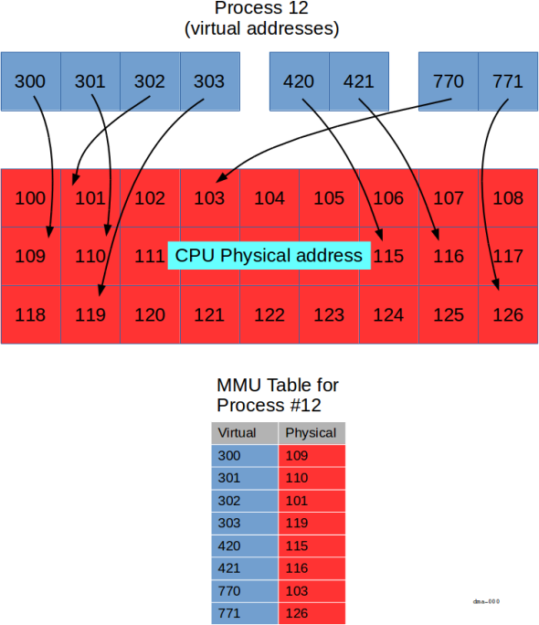
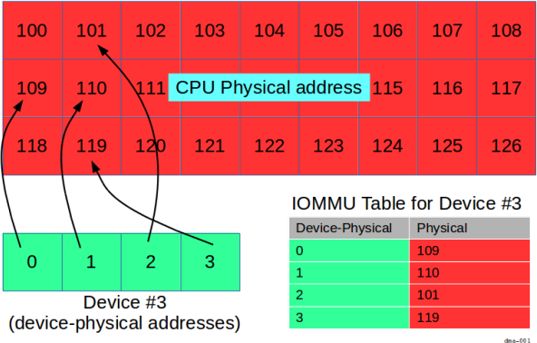

# DMA

Caution: This page may contain information that is specific to the legacy
version of the driver framework (DFv1).

Direct Memory Access (**DMA**) is a feature that allows hardware to access
memory without CPU intervention.
At the highest level, the hardware is given the source and destination of the
memory region to transfer (along with its size) and told to copy the data.
Some hardware peripherals even support the ability to do multiple
"scatter / gather" style operations, where several copy operations
can be performed, one after the other, without additional CPU intervention.

## DMA considerations

In order to fully appreciate the issues involved, it's important to
keep the following in mind:

*   each process operates in a virtual address space,
*   an MMU can map a contiguous virtual address range onto multiple,
    discontiguous physical address ranges (and vice-versa),
*   each process has a limited window into physical address space,
*   some peripherals support their own virtual addresses
    with an Input / Output Memory Management Unit (**IOMMU**).

Let's discuss each point in turn.

### Virtual, physical, and device-physical addresses

The addresses that the process has access to are virtual; that is, they are
an illusion created by the CPU's Memory Management Unit (**MMU**).
A virtual address is mapped by the MMU into a physical address.
The mapping granularity is based on a parameter called "page size," which
is at least 4k bytes, though larger sizes are available on modern processors.



In the diagram above, we show a specific process (process 12) with a number of
virtual addresses (in blue).
The MMU is responsible for mapping the blue virtual addresses into CPU physical
bus addresses (red).
Each process has its own mapping; so even though process 12 has a virtual address
`300`, some other process may also have a virtual address `300`.
That other process's virtual address `300` (if it exists) would be mapped
to a different physical address than the one in process 12.

> Note that we've used small decimal numbers as "addresses" to keep the discussion simple.
> In reality, each square shown above represents a page of memory (4k or more),
> and is identified by a 32 or 64 bit value (depending on the platform).

The key points shown in the diagram are:

1.  virtual addresses can be allocated in groups (three are shown, `300`-`303`, `420`-`421`,
    and `770`-`771`),
2.  virtually contiguous (e.g., `300`-`303`) is not necessarily physically contiguous.
3.  some virtual addresses are not mapped (for example, there is no virtual address
    `304`)
4.  not all physical addresses are available to each process (for example, process
    `12` doesn't have access to physical address `120`).

Depending on the hardware available on the platform, a device's address space
may or may not follow a similar translation.
Without an IOMMU, the addresses that the peripheral uses are the same as
the physical addresses used by the CPU:


In the diagram above, portions of the device's address space (for example, a
frame buffer, or control registers), appear directly in the CPU's physical
address range.
That is to say, the device occupies physical addresses `122` through `125`
inclusive.

In order for the process to access the device's memory, it would need to create
an MMU mapping from some virtual addresses to the physical addresses `122` through
`125`.
We'll see how to do that, below.

But with an IOMMU, the addresses seen by a peripheral may be different than
the CPU's physical addresses:



Here, the device has its own "device-physical" addresses that it knows about,
that is, addresses `0` through `3` inclusive.
It's up to the IOMMU to map the device-physical addresses `0` through `3`
into CPU physical addresses `109`, `110`, `101`, and `119`, respectively.

In this scenario, in order for the process to use the device's memory, it needs
to arrange two mappings:

*   one set from the virtual address space (e.g., `300` through `303`) to the
    CPU physical address space (`109`, `110`, `101`, and `119`, respectively),
    through the MMU, and
*   one set from the CPU physical address space (addresses `109`, `110`, `101`,
    and `119`) to the device-physical addresses (`0` through `3`) through the IOMMU.

While this may seem complicated, Zircon provides an abstraction that removes
the complexity.

Also, as we'll see below, the reason for having an IOMMU, and the benefits provided,
are similar to those obtained by having an MMU.

### Contiguity of memory

When you allocate a large chunk of memory (e.g. with **calloc()**),
your process will, of course, see a large, contiguous virtual address range.
The MMU creates the illusion of contiguous memory at the virtual addressing
level, even though the MMU may choose to back that memory area with physically
discontiguous memory at the physical address level.

Furthermore, as processes allocate and deallocate memory, the mapping of
physical memory to virtual address space tends to become more
complex, encouraging more "swiss cheese" holes to appear (that is,
more discontiguities in the mapping).

Therefore, it's important to keep in mind that contiguous virtual addresses
are not necessarily contiguous physical addresses, and indeed that contiguous
physical memory becomes more precious over time.

### Access controls

Another benefit of the MMU is that processes are limited in their view of
physical memory (for security and reliability reasons).
The impact on drivers, though, is that a process has to specifically request
a mapping from virtual address space to physical address space, and
have the requisite privilege in order to do so.

### IOMMU

Contiguous physical memory is generally preferred.
It's more efficient to do one transfer (with one source address and one
destination address) than it is to set up and manage multiple individual
transfers (which may require CPU intervention between each transfer in
order to set up the next one).

The IOMMU, if available, alleviates this problem by doing the same thing for
the peripherals that the CPU's MMU does for the process &mdash; it gives the peripheral
the illusion that it's dealing with a contiguous address space by
mapping multiple discontiguous chunks into a virtually contiguous space.
By limiting the mapping region, the IOMMU also provides security (in the same way as
the MMU does), by preventing the peripheral from accessing memory that's not "in scope"
for the current operation.

### Tying it all together

So, it may appear that you need to worry about virtual, physical, and device-physical
address spaces when you are writing your driver.
But that's not the case.

## DMA and your driver

Zircon provides a set of functions that allow you to cleanly deal with all of the
above.
The following work together:

*   a Bus Transaction Initiator ([BTI](/docs/reference/kernel_objects/bus_transaction_initiator.md)), and
*   a Virtual Memory Object ([VMO](/docs/reference/kernel_objects/vm_object.md)).

The [BTI](/docs/reference/kernel_objects/bus_transaction_initiator.md)
kernel object provides an abstraction of the model, and an API to deal with
physical (or device-physical) addresses associated with
[VMO](/docs/reference/kernel_objects/vm_object.md)s.

In your driver's initialization, call
**Pci::GetBti()**
to obtain a [BTI](/docs/reference/kernel_objects/bus_transaction_initiator.md) handle:

```cpp
#include <lib/device-protocol/pci.h>

zx_status_t Pci::GetBti(uint32_t index,
                        zx::bti* out_bti);
```

The **GetBti()**
function lives on the `ddk::Pci` class (just like all the other PCI functions
discussed above) and takes an `index` parameter (reserved for future use, use `0`).
It returns a [BTI](/docs/reference/kernel_objects/bus_transaction_initiator.md)
object through the `out_bti` pointer argument.

Next, you need a [VMO](/docs/reference/kernel_objects/vm_object.md).
Simplistically, you can think of the [VMO](/docs/reference/kernel_objects/vm_object.md)
as a pointer to a chunk of memory,
but it's more than that &mdash; it's a kernel object that represents a set
of virtual pages (that may or may not have physical pages committed to them),
which can be mapped into the virtual address space of the driver process.
(It's even more than that, but that's a discussion for a different chapter.)

Ultimately, these pages serve as the source or destination of the DMA transfer.

There are two functions,
[**zx_vmo_create()**](/docs/reference/syscalls/vmo_create.md)
and
[**zx_vmo_create_contiguous()**](/docs/reference/syscalls/vmo_create_contiguous.md)
that allocate memory and bind it to a [VMO](/docs/reference/kernel_objects/vm_object.md):

```c
zx_status_t zx_vmo_create(uint64_t size,
                          uint32_t options,
                          zx_handle_t* out);

zx_status_t zx_vmo_create_contiguous(zx_handle_t bti,
                                     size_t size,
                                     uint32_t alignment_log2,
                                     zx_handle_t* out);
```

As you can see, they both take a `size` parameter indicating the number of bytes required,
and they both return a [VMO](/docs/reference/kernel_objects/vm_object.md) (through `out`).
They both allocate virtually contiguous pages, for a given size.

> Note that this differs from the standard C library memory allocation functions,
> (e.g., **malloc()**), which allocate virtually contiguous memory, but without
> regard to page boundaries. Two small **malloc()** calls in a row might allocate
> two memory regions from the *same* page, for instance, whereas
> the [VMO](/docs/reference/kernel_objects/vm_object.md)
> creation functions will always allocate memory starting with a *new* page.

The
[**zx_vmo_create_contiguous()**](/docs/reference/syscalls/vmo_create_contiguous.md)
function does what
[**zx_vmo_create()**](/docs/reference/syscalls/vmo_create.md)
does, *and* ensures that the pages are suitably
organized for use with the specified [BTI](/docs/reference/kernel_objects/bus_transaction_initiator.md)
(which is why it needs the [BTI](/docs/reference/kernel_objects/bus_transaction_initiator.md) handle).
It also features an `alignment_log2` parameter that can be used to specify a minimum
alignment requirement.
As the name suggests, it must be an integer power of 2 (with the value `0` indicating
page aligned).

At this point, you have two "views" of the allocated memory:

*   one contiguous virtual address space that represents memory
    from the point of view of the driver, and
*   a set of (possibly contiguous, possibly committed) physical pages
    for use by the peripheral.

Before using these pages, you need to ensure that they are present in memory (that is,
"committed" &mdash; the physical pages are accessible to your process), and that the
peripheral has access to them (through the IOMMU if present).
You will also need the addresses of the pages (from the point of view of the device)
so that you can program the DMA controller on your device to access them.

The
[**zx_bti_pin()**](/docs/reference/syscalls/bti_pin.md)
function is used to do all that:

```c
#include <zircon/syscalls.h>

zx_status_t zx_bti_pin(zx_handle_t bti, uint32_t options,
                       zx_handle_t vmo, uint64_t offset, uint64_t size,
                       zx_paddr_t* addrs, size_t addrs_count,
                       zx_handle_t* pmt);
```

There are 8 parameters to this function:

Parameter       | Purpose
----------------|------------------------------------
`bti`           | the [BTI](/docs/reference/kernel_objects/bus_transaction_initiator.md) for this peripheral
`options`       | options (see below)
`vmo`           | the [VMO](/docs/reference/kernel_objects/vm_object.md) for this memory region
`offset`        | offset from the start of the [VMO](/docs/reference/kernel_objects/vm_object.md)
`size`          | total number of bytes in [VMO](/docs/reference/kernel_objects/vm_object.md)
`addrs`         | list of return addresses
`addrs_count`   | number of elements in `addrs`
`pmt`           | returned [PMT](/docs/reference/kernel_objects/pinned_memory_token.md) (see below)

The `addrs` parameter is a pointer to an array of `zx_paddr_t` that you supply.
This is where the peripheral addresses for each page are returned into.
The array is `addrs_count` elements long, and must match the count of
elements expected from
[**zx_bti_pin()**](/docs/reference/syscalls/bti_pin.md).

> The values written into `addrs` are suitable for programming the peripheral's
> DMA controller &mdash; that is, they take into account any translations that
> may be performed by an IOMMU, if present.

On a technical note, the other effect of
[**zx_bti_pin()**](/docs/reference/syscalls/bti_pin.md)
is that the kernel will ensure those pages are not decommitted
(i.e., moved or reused) while pinned.

The `options` argument is actually a bitmap of options:

Option                  | Purpose
------------------------|--------------------------------
`ZX_BTI_PERM_READ`      | pages can be read by the peripheral (written by the driver)
`ZX_BTI_PERM_WRITE`     | pages can be written by the peripheral (read by the driver)
`ZX_BTI_COMPRESS`       | (see "Minimum contiguity property," below)

For example, refer to the diagrams above showing "Device #3".
If an IOMMU is present, `addrs` would contain `0`, `1`, `2`, and `3` (that is,
the device-physical addresses).
If no IOMMU is present, `addrs` would contain `109`, `110`, `101`, and `119` (that is,
the physical addresses).

### Permissions

Keep in mind that the permissions are from the perspective
*of the peripheral*, and not the driver.
For example, in a block device **write** operation, the device **reads** from memory pages and
therefore the driver specifies `ZX_BTI_PERM_READ`, and vice versa in the block device read.

### Minimum contiguity property

By default, each address returned through `addrs` is one page long.
Larger chunks may be requested by setting the `ZX_BTI_COMPRESS` option
in the `options` argument.
In that case, the length of each entry returned corresponds to the "minimum contiguity" property.
While you can't set this property, you can read it with
[**zx_object_get_info()**](/docs/reference/syscalls/object_get_info.md).
Effectively, the minimum contiguity property is a guarantee that
[**zx_bti_pin()**](/docs/reference/syscalls/bti_pin.md)
will always be able to return addresses that are contiguous for at least that many bytes.

For example, if the property had the value 1MB, then a call to
[**zx_bti_pin()**](/docs/reference/syscalls/bti_pin.md)
with a requested size of 2MB would return at most two physically-contiguous runs.
If the requested size was 2.5MB, it would return at most three physically-contiguous runs,
and so on.

### Pinned Memory Token (PMT)

[`zx_bti_pin()`](/docs/reference/syscalls/bti_pin.md) returns a Pinned Memory Token
([PMT](/docs/reference/kernel_objects/pinned_memory_token.md))
upon success in the *pmt* argument.
The driver must call [`zx_pmt_unpin()`](/docs/reference/syscalls/pmt_unpin.md) when the device is
done with the memory transaction to unpin and revoke access to the memory pages by the device.

## Advanced topics

### Cache Coherency

On fully DMA-coherent architectures, hardware ensures the data in the CPU cache is the same
as the data in main memory without software intervention. Not all architectures are
DMA-coherent. On these systems, the driver must ensure the CPU cache is made coherent by
invoking appropriate cache operations on the memory range before performing DMA operations,
so that no stale data will be accessed.

To invoke cache operations on the memory represented by
[VMO](/docs/reference/kernel_objects/vm_object.md)s, use the
[`zx_vmo_op_range()`](/docs/reference/syscalls/vmo_op_range.md) syscall. Prior to a peripheral-read
(driver-write) operation, clean the cache using `ZX_VMO_OP_CACHE_CLEAN` to write out dirty data to
main memory. Prior to a peripheral-write (driver-read), use `ZX_VMO_OP_CACHE_CLEAN_INVALIDATE` to
clean the cache lines and mark them as invalid ensuring data is fetched from main memory on the next
access.

