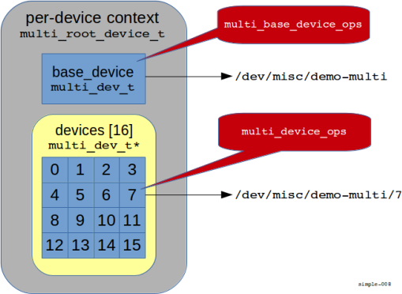

# Simple Drivers

## Overview

In this chapter, we're going to learn about the fundamentals of drivers.
We'll progress from simple through to moderately complex, with each driver illustrating a
specific set of concepts as follows:

`dev/misc/demo-null` and `dev/misc/demo-zero`:

*   trivial, "no-state" sink / source drivers, used to explain the basics, like how to handle a
    client's **read()** and **write()** requests.

`dev/misc/demo-number`:

*   a driver that returns an ASCII number, illustrates per-device context, one-shot **read()**
    operation, and introduces FIDL-based control operations.

`dev/misc/demo-multi`:

*   a driver with multiple sub-devices.

`dev/misc/demo-fifo`:

*   shows more complex device state, examines partial **read()** and **write()** operations, and
    introduces state signalling to enable blocking I/O.

For reference, the source code for all of these drivers is in the
`//examples/drivers/` directory.

## Registration

A system process called the driver manager is responsible for device drivers.
During initialization, it searches `/boot/driver` and `/system/driver` for drivers.

<!--- TODO Brian says that /system is going away as we transition to a package-based
world, at which point these drivers will be provided by the package manager in garnet-->

These drivers are implemented as Dynamic Shared Objects (**DSO**s), and provide
two items of interest:

*   a set of instructions for driver manager to use when evaluating driver binding, and
*   a binding function.

Let's look at the bottom of `demo-null.c` in the `dev/sample/null` directory:

```c
static zx_driver_ops_t demo_null_driver_ops = {
    .version = DRIVER_OPS_VERSION,
    .bind = null_bind,
};

ZIRCON_DRIVER_BEGIN(demo_null_driver, demo_null_driver_ops, "zircon", "0.1", 1)
    BI_MATCH_IF(EQ, BIND_PROTOCOL, ZX_PROTOCOL_MISC_PARENT),
ZIRCON_DRIVER_END(demo_null_driver)
```

<!--- alainv sez these macros are being deprecated in favour of a Driver Binding Language -->

The C preprocessor macros `ZIRCON_DRIVER_BEGIN` and `ZIRCON_DRIVER_END` delimit
an ELF note section that's created in the DSO.
This section contains one or more statements that are evaluated by driver manager.

In the above, the macro `BI_MATCH_IF` is a condition that evaluates to `true` if
the device has `BIND_PROTOCOL` equal to `ZX_PROTOCOL_MISC_PARENT`.
A `true` evaluation causes driver manager to then bind the driver, using the binding ops
provided in the `ZIRCON_DRIVER_BEGIN` macro.

We can ignore this "glue" for now, and just note that this part of the code:

*   tells driver manager that this driver can be bound to devices requiring the
    `ZX_PROTOCOL_MISC_PARENT` protocol, and
*   contains a pointer to the `zx_drivers_ops_t` table that lists the
    functions provided by this DSO.

To initialize the device, driver manager calls the binding function **null_bind()**
through the `.bind` member (also in `demo-null.c`):

```c
static zx_protocol_device_t null_device_ops = {
    .version = DEVICE_OPS_VERSION,
    .read = null_read,
    .write = null_write,
};

zx_status_t null_bind(void* ctx, zx_device_t* parent) {
    device_add_args_t args = {
        .version = DEVICE_ADD_ARGS_VERSION,
        .name = "demo-null",
        .ops = &null_device_ops,
    };

    return device_add(parent, &args, NULL);
}
```

The binding function is responsible for "publishing" the device by calling
**device_add()** with
a pointer to the parent device, and an arguments structure.

The new device is bound relative to the parent's pathname &mdash; notice how we pass just
`"demo-null"` in the `.name` member above.

The `.ops` member is a pointer to a `zx_protocol_device_t` structure that lists the operations
available for that device.
We'll see these functions, **null_read()** and **null_write()**, below.

After calling **device_add()**,
the device name is registered, and the operations passed in
the `.ops` member of the argument structure are bound to the device.
A successful return from **null_bind()** indicates to driver manager that the driver is now
associated with the device.

At this point, our `/dev/misc/demo-null` device is ready to handle client requests,
which means that it must:

*   support **open()** and **close()**
*   provide a **read()** handler that returns end-of-file (**EOF**) immediately
*   provide a **write()** handler that discards all data sent to it

No other functionality is required.

## Reading data from the device

In the `zx_protocol_device_t` structure `null_device_ops`, we indicated that we support reading
and writing through the functions **null_read()** and **null_write()** respectively.

The **null_read()** function provides reading:

```c
static zx_status_t
null_read(void* ctx, void* buf, size_t count, zx_off_t off, size_t* actual) {
    *actual = 0;
    return ZX_OK;
}
```

and ends up being called in response to a client's call to **read()**.

Notice that there are two size-related arguments passed to the handler:

Parameter   | Meaning
------------|--------------------------------------------------------
`count`     | Maximum number of bytes that the client can accept
`actual`    | Actual number of bytes sent to the client

The following diagram illustrates the relationship:


That is, the available size of the client's buffer (here, `sizeof(buf)`), is passed as the `count`
parameter to **null_read()**.
Similarly, when **null_read()** indicates the number of bytes that it read (0 in our case), this
appears as the return value from the client's **read()** function.


Note: The handler is expected to always return immediately.
By convention, indicating zero bytes in `*actual` indicates EOF

There are, of course, cases when the device doesn't have data immediately available, *AND* it's
not an EOF situation.
For example, a serial port may be waiting for more characters to arrive from the remote end.
This is handled by a special notification, which we'll see below, in the `/dev/misc/demo-fifo`
device.

### Writing data to the device

Writing data from the client to the device is almost identical, and is provided
by **null_write()**:

```c
static zx_status_t
null_write(void* ctx, const void* buf, size_t count, zx_off_t off, size_t* actual) {
    *actual = count;
    return ZX_OK;
}
```

As with the **read()**, the **null_write()** is triggered by the client's call to **write()**:


The client specifies the number of bytes they wish to transfer in their **write()** function, and
this appears as the `count` parameter in the device's **null_write()** function.
It's possible that the device may be full (not in the case of our `/dev/misc/demo-null`, though
&mdash; it never fills up), so the device needs to tell the client how many bytes it actually
wrote.
This is done with the `actual` parameter, which shows up as the return value to the client's
**write()** function.

Note that our **null_write()** function includes the code:

```c
*actual = count;
```

This tells the client that all of their data was written.
Of course, since this is the `/dev/misc/demo-null` device, the data doesn't actually *go*
anywhere.

Note: Just like in the **null_read()** case, the handler must not block.

## What about **open()** and **close()**?

We didn't provide an **open()** nor **close()** handler, and yet our device supports those
operations.

This is possible because any operation hooks that are not provided take on defaults.
Most of the defaults simply return "not supported," but in the case of **open()** and **close()**
the defaults provide adequate support for simple devices.

## `/dev/misc/demo-zero`

As you might imagine, the source code for the `/dev/misc/demo-zero` device is almost identical
to that for `/dev/misc/demo-null`.
From an operational point of view, `/dev/misc/demo-zero` is supposed to return an endless stream
of zeros &mdash; for as long as the client cares to read.
We don't support writing.

Consider `/dev/misc/demo-zero`'s **zero_read()** function:

```c
static zx_status_t
zero_read(void* ctx, void* buf, size_t count, zx_off_t off, size_t* actual) {
    memset(buf, 0, count);
    *actual = count;
    return ZX_OK;
}
```

The code sets the entire buffer `buf` to zero (the length is given by the client in the
`count` argument),
and tells the client that that many bytes are available (by setting `*actual` to the same number
as the client request).

## `/dev/misc/demo-number`

Let's build a more complicated device, based on the concepts we learned above.
We'll call it `/dev/misc/demo-number`, and its job is to return an ASCII string representing
 the next number in sequence.
For example, the following might be a typical command-line session using the device:

```shell
$ cat /dev/misc/demo-number
0
$ cat /dev/misc/demo-number
1
$ cat /dev/misc/demo-number
2
```

And so on.

Whereas `/dev/misc/demo-null` returned EOF immediately, and `/dev/misc/demo-zero` returned
a never-ending stream of zeros, `/dev/misc/demo-number` is kind of in the middle: it needs
to return a short data sequence, and *then* return EOF.

In the real world, the client could read one byte at a time, or it could ask for a large buffer's
worth of data.
For our initial version, we're going to assume that the client asks for a buffer that's "big
enough" to get all the data at once.

This means that we can take a shortcut.
There's an offset parameter (`zx_off_t off`) that's passed as the 4th parameter to the **read()**
handler function:

```c
static zx_status_t
number_read(void* ctx, void* buf, size_t count, zx_off_t off, size_t* actual)
```

This indicates where the client would like to begin (or continue) reading from.
The simplification that we're making here is that if the client has an offset of zero, it means
that it's starting from the beginning, so we return as much data as the client can handle.
However, if the offset isn't zero, we return `EOF`.

Let's discuss the code (note that we're initially presenting a slightly simpler version than what's
in the source directory):

```c
static int global_counter;      // good and bad, see below

static zx_status_t
number_read(void* ctx, void* buf, size_t count, zx_off_t off, size_t* actual) {
    // (1) why are we here?
    if (off == 0) {
        // (2) first read; return as much data as we can
        int n = atomic_add(&global_counter);
        char tmp[22];           // 2^64 is 20 digits + \n + nul = 22 bytes
        *actual = snprintf(tmp, sizeof(tmp), "%d\n", n);
        if (*actual > count) {
            *actual = count;
        }
        memcpy(buf, tmp, *actual);
    } else {
        // (3) not the first time -- return EOF
        *actual = 0;
    }
    return ZX_OK;
}
```

The first decision we make is in step (1), where we determine if the client is reading the
string for the first time, or not.
If the offset is zero, it's the first time.
In that case, in step (2), we grab a value from `global_counter`, put it into a string,
and tell the client that we're returning some number of bytes.
The number of bytes we return is limited to the smaller of:

*   the size of the client's buffer (given by `count`), or
*   the size of the generated string (returned from **snprintf()**).

If the offset is not zero, however, it means that it's not the first time that the client
is reading data from this device.
In this case, in step (3) we simply set the number of bytes that we're returning (the value
of `*actual`) to zero, and this has the effect of indicating `EOF` to the client (just like
it did in the `null` driver, above).

### Globals are bad

The `global_counter` that we used was global to the driver.
This means that each and every session that ends up calling **number_read()** will end up
incrementing that number.

This is expected &mdash; after all, `/dev/misc/demo-number`'s job is to "hand out increasing
numbers to its clients."

What may not be expected is that if the driver is instantiated multiple times (as might happen
with real hardware drivers, for example), then the value is *shared* across those multiple
instances.
Generally, this isn't what you want for real hardware drivers (because each driver instance
is independent).

The solution is to create a "per-device" context block; this context block would contain
data that's unique for each device.

In order to create per-device context blocks, we need to adjust our binding routine.
Recall that the binding routine is where the association is made between the device and
its protocol ops.
If we were to create our context block in the binding routine, we'd then be able to
use it later on in our read handler:


```c
typedef struct {
    zx_device_t*    zxdev;
    uint64_t        counter;
} number_device_t;

zx_status_t
number_bind(void* ctx, zx_device_t* parent) {
    // allocate & initialize per-device context block
    number_device_t* device = calloc(1, sizeof(*device));
    if (!device) {
        return ZX_ERR_NO_MEMORY;
    }

    device_add_args_t args = {
        .version = DEVICE_ADD_ARGS_VERSION,
        .name = "demo-number",
        .ops = &number_device_ops,
        .ctx = device,
    };

    zx_status_t rc = device_add(parent, &args, &device->zxdev);
    if (rc != ZX_OK) {
        free(device);
    }
    return rc;
}
```

Here we've allocated a context block and stored it in the `ctx` member of the `device_add_args_t`
structure `args` that we passed to **device_add()**.
A unique instance of the context block, created at binding time, is now associated with each
bound device instance, and is available for use in all protocol functions bound by
**number_bind()**.
Note that while we don't use the `zxdev` device from the context block, it's good practice
to hang on to it in case we need it for any other device related operations later.


The context block can be used in all protocol functions defined by `number_device_ops`, like
our **number_read()** function:

```c
static zx_status_t
number_read(void* ctx, void* buf, size_t count, zx_off_t off, size_t* actual) {
    if (off == 0) {
        number_device_t* device = ctx;
        int n = atomic_fetch_add(&device->counter, 1);

        //------------------------------------------------
        // everything else is the same as previous version
        //------------------------------------------------

        char tmp[22];   // 2^64 is 20 digits + \n + \0
        *actual = snprintf(tmp, sizeof(tmp), "%d\n", n);
        if (*actual > count) {
            *actual = count;
        }
        memcpy(buf, tmp, *actual);
    } else {
        *actual = 0;
    }
    return ZX_OK;
}
```

Notice how we replaced the original version's `global_counter` with the value from the
context block.
Using the context block, each device gets its own, independent counter.

### Cleaning up the context

Of course, every time we **calloc()** something, we're going to have to **free()** it somewhere.
This is done in our **number_release()** handler, which we store in our `zx_protocol_device_t
number_device_ops` structure:

```c
static zx_protocol_device_t
number_device_ops = {
    // other initializations ...
    .release = number_release,
};
```

The **number_release()** function is simply:

```c
static void
number_release(void* ctx) {
    free(ctx);
}
```

The **number_release()** function is called before the driver is unloaded.

### Controlling your device

Sometimes, it's desirable to send a control message to your device.
This is data that doesn't travel over the **read()** / **write()** interface.
For example, in `/dev/misc/demo-number`, we might want a way to preset the count to a given number.

In a tradition POSIX environment, this is done with an **ioctl()** call on the client
side, and an appropriate **ioctl()** handler on the driver side.

Under Fuchsia, this is done differently, by marshalling data through the Fuchsia Interface
Definition Language
([**FIDL**](/docs/development/languages/fidl/README.md)).

For more details about FIDL itself, consult the reference above.
For our purposes here, FIDL:

*   is described by a C-like language,
*   is used to define the input and output arguments for your control functions,
*   generates code for the client and driver side.

> If you're already familiar with Google's "Protocol Buffers" then you'll be very comfortable
> with FIDL.

There are multiple advantages to FIDL.
Because the input and output arguments are well-defined, the result is
generated code that has strict type safety and checking, on both the client and driver
sides.
By abstracting the definition of the messages from their implementation, the FIDL
code generator can generate code for multiple different languages, without additional
work on your part.
This is especially useful, for example, when clients require APIs
in languages with which you aren't necessarily familiar.

#### Using FIDL

In the majority of cases, you'll be using FIDL APIs already provided by the device,
and will rarely need to create your own.
However, it's a good idea to understand the mechanism, end-to-end.

Using FIDL for your device control is simple:

*   define your inputs, outputs, and protocols in a "`.fidl`" file,
*   compile the FIDL code and generate your client functions, and
*   add message handlers to your driver to receive control messages.

We'll look at these steps by implementing the "preset counter to value"
control function for our `/dev/misc/demo-number` driver.

#### Define the FIDL protocol

The first thing we need to do is define what the protocol looks like.
Since all we want to do is preset the count to a user-specified value,
our protocol will be very simple.

This is what the "`.fidl`" file looks like:

```fidl
library zircon.sample.number;

[Layout="Simple"]
protocol Number {

    // set the number to a given value
    SetNumber(uint32 value) -> (uint32 previous);
};
```

The first line, `library zircon.sample.number;` provides a name for the library that will
be generated.

Next, `[Layout="Simple"]` generates [simple C bindings](/docs/development/languages/fidl/tutorials/tutorial-c.md#simple-bindings).

Finally, the `protocol` section defines all of the methods that are available.
Each method has a name, and specifies inputs and outputs.

Here, we have one method function, called **SetNumber()**, which takes a `uint32` (which is
the FIDL equivalent of the C standard integer `uint32_t` type) as input, and returns a `uint32`
as the result (the previous value of the counter before it was changed).

We'll see more advanced examples below.

#### Compile the FIDL code

The FIDL code is compiled automatically by the build system; you just need to add a dependency
into the `BUILD.` file.
This is what a stand-alone `rules.mk` would look like, assuming the "`.fidl`" file is called
`demo_number.fidl`:

```gn
import("//zircon/public/gn/fidl.gni")

// Defined in //zircon/system/fidl/fuchsia-io/BUILD.gn
fidl_library("zircon.sample.number") {
  sources = [
    "demo_number.fidl",
  ]
}
```

Once compiled, the interface files will show up in the build output directory.
The exact path depends on the build target (e.g., ...`/zircon/build-x64/`... for x86
64-bit builds), and the source directory containing the FIDL files.

For this example, we'll use the following paths:

* ...`/examples/drivers//number/demo-number.c`
	* source file for `/dev/misc/demo-number` driver
* ...`/zircon/system/fidl/zircon-sample/demo_number.fidl`
	* source file for FIDL protocol definition
* ...`/zircon/build-x64/system/fidl/zircon-sample/gen/include/zircon/sample/number/c/fidl.h`
	* generated interface definition header include file

It's instructive to see the interface definition header file that was generated by the
FIDL compiler.
Here it is, annotated and edited slightly to just show the highlights:

```c
// (1) Forward declarations
#define zircon_sample_number_NumberSetNumberOrdinal ((uint32_t)0x1)

// (2) Extern declarations
extern const fidl_type_t zircon_sample_number_NumberSetNumberRequestTable;
extern const fidl_type_t zircon_sample_number_NumberSetNumberResponseTable;

// (3) Declarations
struct zircon_sample_number_NumberSetNumberRequest {
    fidl_message_header_t hdr;
    uint32_t value;
};

struct zircon_sample_number_NumberSetNumberResponse {
    fidl_message_header_t hdr;
    uint32_t result;
};

// (4) client binding prototype
zx_status_t
zircon_sample_number_NumberSetNumber(zx_handle_t _channel,
                                     uint32_t value,
                                     uint32_t* out_result);

// (5) FIDL message ops structure
typedef struct zircon_sample_number_Number_ops {
    zx_status_t (*SetNumber)(void* ctx, uint32_t value, fidl_txn_t* txn);
} zircon_sample_number_Number_ops_t;

// (6) dispatch prototypes
zx_status_t
zircon_sample_number_Number_dispatch(void* ctx, fidl_txn_t* txn, fidl_incoming_msg_t* msg,
                                     const zircon_sample_number_Number_ops_t* ops);

zx_status_t
zircon_sample_number_Number_try_dispatch(void* ctx, fidl_txn_t* txn, fidl_incoming_msg_t* msg,
                                         const zircon_sample_number_Number_ops_t* ops);

// (7) reply prototype
zx_status_t
zircon_sample_number_NumberSetNumber_reply(fidl_txn_t* _txn, uint32_t result);
```

> Note that this generated file contains code relevant to both the client *and* the driver.

Briefly, the generated code presents:

1.  a definition for the command numbers (the "`NumberOrdinal`", recall we used command
    number `1` for **SetNumber()**),
2.  external definitions of tables (we don't use these),
3.  declarations for the request and response message formats; these consist of a FIDL
    overhead header and the data we specified,
4.  client binding prototypes &mdash; we'll see how the client uses this below,
5.  FIDL message ops structure; this is a list of functions that you supply in the driver
    to handle each and every FIDL method defined by all the protocols in the "`.fidl`" file,
6.  dispatch prototypes &mdash; this is called by our FIDL message handler,
7.  reply prototype &mdash; we call this in our driver when we want to reply to the client.

#### The client side

Let's start with a tiny, command-line based client, called `set_number`,
that uses the above FIDL protocol.
It assumes that the device we're controlling is called `/dev/misc/demo-number`.
The program takes exactly one argument &mdash; the number to set the current counter to.

Here's a sample of the program's operation:

```bash
$ cat /dev/misc/demo-number
0
$ cat /dev/misc/demo-number
1
$ cat /dev/misc/demo-number
2
$ set_number 77
Original value was 3
$ cat /dev/misc/demo-number
77
$ cat /dev/misc/demo-number
78
```

The complete program is as follows:

```c
#include <errno.h>
#include <fcntl.h>
#include <stdio.h>
#include <stdlib.h>
#include <string.h>
#include <unistd.h>
#include <ctype.h>

#include <zircon/syscalls.h>
#include <lib/fdio/fdio.h>

// (1) include the generated definition file
#include <zircon/sample/number/c/fidl.h>

int main(int argc, const char** argv)
{
    static const char* dev = "/dev/misc/demo-number";

    // (2) get number from command line
    if (argc != 2) {
        fprintf(stderr, "set_number:  needs exactly one numeric argument,"
                " the value to set %s to\n", dev);
        exit(EXIT_FAILURE);
    }
    uint32_t n = atoi(argv[1]);

    // (3) establish file descriptor to device
    int fd = open(dev, O_RDWR);
    if (fd == -1) {
        fprintf(stderr, "set_number: can't open %s for O_RDWR, errno %d (%s)\n",
                dev, errno, strerror(errno));
        exit(EXIT_FAILURE);
    }

    // (4) establish handle to FDIO service on device
    zx_handle_t num;
    zx_status_t rc;
    if ((rc = fdio_get_service_handle(fd, &num)) != ZX_OK) {
        fprintf(stderr, "set_number: can't get fdio service handle, error %d\n", rc);
        exit(EXIT_FAILURE);
    }

    // (5) send FDIO command, get response
    uint32_t orig;
    if ((rc = zircon_sample_number_NumberSetNumber(num, n, &orig)) != ZX_OK) {
        fprintf(stderr, "set_number: can't execute FIDL command to set number, error %d\n", rc);
        exit(EXIT_FAILURE);
    }
    printf("Original value was %d\n", orig);
    exit(EXIT_SUCCESS);
}
```

This is very similar to the approach taken with POSIX **ioctl()**, except that:

*   we established a handle to the FDIO service (step 4), and
*   the API is type-safe and prototyped for the specific operation (step 5).

Notice the FDIO command has a very long name: **zircon_sample_number_NumberSetNumber()**
(which includes a lot of repetition).
This is a facet of the code generation process from the FIDL compiler &mdash; the
"`zircon_sample_number`" part came from the "`library zircon.sample.number`"
statement, the first "`Number`" came from the "`protocol Number`" statement, and the final
"`SetNumber`" is the name of the method from the protocol definition statement.

#### Add a message handler to the driver

On the driver side, we need to:

*   handle the FIDL message
*   demultiplex the message (figure out which control message it is)
*   generate a reply

In conjunction with the prototype above, to handle the FIDL control message in our
driver we need to bind a message handling function (just like we did in order
to handle **read()**, for example):

```c
static zx_protocol_device_t number_device_ops = {
    .version = DEVICE_OPS_VERSION,
    .read = number_read,
    .release = number_release,
    .message = number_message,  // handle FIDL messages
};
```

The **number_message()** function is trivial in this case; it simply wraps the dispatch
function:

```c
static zircon_sample_number_Number_ops_t number_fidl_ops = {
    .SetNumber = fidl_SetNumber,
};

static zx_status_t number_message(void* ctx, fidl_incoming_msg_t* msg, fidl_txn_t* txn) {
    zx_status_t status = zircon_sample_number_Number_dispatch(ctx, txn, msg, &number_fidl_ops);
    return status;
}
```

The generated **zircon_sample_number_Number_dispatch()** function takes the incoming message
and calls the appropriate handling function based on the provided table of functions in
`number_fidl_ops`.
Of course, in our trivial example, there is only the one function, `SetNumber`:

```c
static zx_status_t fidl_SetNumber(void* ctx, uint32_t value, fidl_txn_t* txn)
{
    number_device_t* device = ctx;
    int saved = device->counter;
    device->counter = value;
    return zircon_sample_number_NumberSetNumber_reply (txn, saved);
}
```

The **fidl_SetNumber()** handler:

*   establishes a pointer to the device context,
*   saves the current count value (so that it can return it later),
*   sets the new value into the device context, and
*   calls the "reply" function to return the value to the client.

Notice that the **fidl_SetNumber()** function has a prototype that matches the FIDL
specification, ensuring type safety. Similarly, the reply function,
**zircon_sample_number_NumberSetNumber_reply()** also conforms to the FIDL
specification's prototype of the result portion of the method definition.

#### Advanced uses

FIDL expressions can certainly be made more complex than what we've shown above.
For example, nested structures can be used, rather than the simple `uint32`.
Multiple parameters are allowed for both inputs and outputs. See the
[FIDL reference](/docs/development/languages/fidl/README.md).

## Registering multiple devices with `/dev/misc/demo-multi`

So far, the devices discussed were "singletons" &mdash; that is, one registered name did one thing
(`null` manifested the null device, `number` manifested the number device, and so on).

What if you have a cluster of devices that all perform similar functions?
For example, you might have a multi-channel controller of some kind that has 16 channels.

The correct way to handle this is to:

1.  create a driver instance,
2.  create a base device node, and
3.  manifest your sub-devices under that base device.

Creating the driver instance is good practice as discussed above, in "Globals are bad" (we'll
discuss it a little more in this particular context later).

In this example, we're going to create a base device `/dev/misc/demo-multi`, and then
we're going to create 16 sub-devices under that called `0` through `15` (e.g.,
`/dev/misc/demo-multi/7`).

```c
static zx_protocol_device_t multi_device_ops = {
    .version = DEVICE_OPS_VERSION,
    .read = multi_read,
    .release = multi_release,
};

static zx_protocol_device_t multi_base_device_ops = {
    .version = DEVICE_OPS_VERSION,
    .read = multi_base_read,
    .release = multi_release,
};

zx_status_t multi_bind(void* ctx, zx_device_t* parent) {
    // (1) allocate & initialize per-device context block
    multi_root_device_t* device = calloc(1, sizeof(*device));
    if (!device) {
        return ZX_ERR_NO_MEMORY;
    }
    device->parent = parent;

    // (2) set up base device args structure
    device_add_args_t args = {
        .version = DEVICE_ADD_ARGS_VERSION,
        .ops = &multi_base_device_ops,          // use base ops initially
        .name = "demo-multi",
        .ctx = device,
    };

    // (3) bind base device
    zx_status_t rc = device_add(parent, &args, &device->base_device.zxdev);
    if (rc != ZX_OK) {
        return rc;
    }

    // (4) allocate and bind sub-devices
    args.ops = &multi_device_ops;               // switch to sub-device ops
    for (int i = 0; i < NDEVICES; i++) {
        char name[ZX_DEVICE_NAME_MAX + 1];
        sprintf(name, "%d", i);
        args.name = name;                       // change name for each sub-device
        device->devices[i] = calloc(1, sizeof(*device->devices[i]));
        if (device->devices[i]) {
            args.ctx = &device->devices[i];     // store device pointer in context
            device->devices[i]->devno = i;      // store number as part of context
            rc = device_add(device->base_device.zxdev, &args, &device->devices[i]->zxdev);
            if (rc != ZX_OK) {
                free(device->devices[i]);       // device "i" failed; free its memory
            }
        } else {
            rc = ZX_ERR_NO_MEMORY;
        }

        // (5) failure backout, schedule the removal of the base device and its children
        // sub-devices.
        if (rc != ZX_OK) {
            device_async_remove(device->base_device.zxdev);
            return rc;
        }
    }

    return rc;
}

// (6) release the per-device context block
static void multi_release(void* ctx) {
    free(ctx);
}
```

The steps are:

1.  Establish a device context pointer, in case this driver is loaded multiple times.
2.  Create and initialize an `args` structure that we'll pass to
    **device_add()**.
    This structure has the base device name, "`demo-multi`", and a context pointer
    to the multi root device `device`.
3.  Call **device_add()** to add the base device.
    This has now created `/dev/misc/demo-multi`.
    Note that we store the newly created device into `base_device.zxdev`. This then
    serves as the "parent" device for the sub-device children.
4.  Now create 16 sub-devices as children of the base ("parent") device.
    Notice that we changed the `ops` member to point to the sub-device protocol ops
    `multi_device_ops` instead of the base version.
    The name of each sub-device is simply the ASCII representation of the device number.
    Note that we store the device number index `i` (0 .. 15) in `devno` as context
    (we have an array of contexts called `multi_devices`, which we'll see shortly).
    We also illustrate allocating each sub-device dynamically, rather than
    allocating its space in the parent's structure.
    This is a more realistic use-case for "hot-plug" devices &mdash; you don't
    want to allocate a large context structure, or perform initialization work,
    for devices that aren't (yet) present.
5.  In case of a failure, we need to remove and deallocate the devices that we
    already added, including the base device and the per-device context block.
    Note that we release up to, but not including, the failed device index.
    This is why we called **free()** on the sub-device structure in step 4 in
    case of **device_add()** failure.
6.  We release the per-device context block in our release handler.
    Since the base device and 16 sub-devices do not implement unbind hooks,
    **device_async_remove()** will invoke the release hooks of the sub-devices,
    followed by the base device.

### Which device is which?

We have two **read()** functions, **multi_read()** and **multi_base_read()**.
This allows us to have different behaviors for reading the base device versus
reading one of the 16 sub-devices.

The base device read is almost identical to what we saw above in `/dev/misc/demo-number`:

```c
static zx_status_t
multi_base_read(void* ctx, void* buf, size_t count, zx_off_t off, size_t* actual) {
    const char* base_name = "base device\n";

    if (off == 0) {
        *actual = strlen(base_name);
        if (*actual > count) {
            *actual = count;
        }
        memcpy(buf, base_name, *actual);
    } else {
        *actual = 0;
    }
    return ZX_OK;
}
```

This just returns the string "`base device\n`" for the read, up to the maximum
number of bytes allowed by the client, of course.

But the read for the sub-devices needs to know which device it's being called
on behalf of.
We keep a device index, called `devno`, in the individual sub-device context block:

```c
typedef struct {
    zx_device_t*    zxdev;
    int             devno;              // device number (index)
} multidev_t;
```

The context blocks for the 16 sub-devices, as well as the base device, are stored in
the per-device context block created in step (1) of the binding function, above.

```c
// this contains our per-device instance
#define NDEVICES 16
typedef struct {
    zx_device_t*    parent;
    multidev_t*     devices[NDEVICES];  // pointers to our 16 sub-devices
    multidev_t      base_device;        // our base device
} multi_root_device_t;
```

Notice that the `multi_root_device_t` per-device context structure contains 1 `multidev_t`
context block (for the base device) and 16 pointers to dynamically allocated context
blocks for the sub-devices.
The initialization of those context blocks occurred in steps (3) (for the base device)
and (4) (done in the `for` loop for each sub-device).



The diagram above illustrates the relationship between the per-device context block,
and the individual devices.
Sub-device 7 is representative of all sub-devices.

This is what our **multi_read()** function looks like:

```c
static const char* devnames[NDEVICES] = {
    "zero", "one", "two", "three",
    "four", "five", "six", "seven",
    "eight", "nine", "ten", "eleven",
    "twelve", "thirteen", "fourteen", "fifteen",
};

static zx_status_t
multi_read(void* ctx, void* buf, size_t count, zx_off_t off, size_t* actual) {
    multi_root_device_t* root_device = ctx;
    multidev_t* device = &root_device->base_device;

    if (off == 0) {
        char tmp[16];
        *actual = snprintf(tmp, sizeof(tmp), "%s\n", devnames[device->devno]);
        if (*actual > count) {
            *actual = count;
        }
        memcpy(buf, tmp, *actual);
    } else {
        *actual = 0;
    }
    return ZX_OK;
}
```

Exercising our device from the command line gives results like this:

```shell
$ cat /dev/misc/demo-multi
base device
$ cat /dev/misc/demo-multi/7
seven
$ cat /dev/misc/demo-multi/13
thirteen
```

and so on.

### Multiple multiple devices

It may seem odd to create a "per device" context block for a controller that
supports multiple devices, but it's really no different than any other controller.
If this were a real hardware device (say a 16 channel data acquisition system),
you could certainly have two or more of these plugged into your system.
Each driver would be given a unique base device name (e.g. `/dev/daq-0`,
`/dev/daq-1`, and so on), and would then manifest its channels under that name
(e.g., `/dev/daq-1/7` for the 8th channel on the 2nd data acquisition system).

Ideally, the assignment of unique base device names should be done based on some kind of
hardware provided unique key.
This has the advantage of repeatability / predictability, especially with hot-plug
devices.
For example, in the data acquisition case, there would be distinct devices connected
to each of the controller channels.
After a reboot, or a hot unplug / replug event, it would be desirable to be able to
associate each controller with a known base device name; it wouldn't be useful
to have the device name change randomly between plug / unplug events.

## Blocking reads and writes: `/dev/misc/demo-fifo`

So far, all of the devices that we've examined returned data immediately (for a **read()**
operation), or (in the case of `/dev/misc/demo-null`), accepted data without blocking
(for the **write()** operation).

The next device we'll discuss, `/dev/misc/demo-fifo`, will return data immediately if
there's data available, otherwise it will block the client until data is available.
Similarly, for writing, it will accept data immediately if there's room, otherwise
it will block the client until room is available.

The individual handlers for reading and writing must return immediately (regardless of whether
data or room is available or not).
However, they don't have to return or accept *data* immediately; they can instead
indicate to the client that it should wait.

Our FIFO device operates by maintaining a single, 32kbyte FIFO.
Clients can read from, and write to, the FIFO, and will exhibit the blocking behavior discussed
above during full and empty conditions, as appropriate.

### The context structure

The first thing to look at is the context structure:

```c
#define FIFOSIZE 32768

typedef struct {
    zx_device_t*    zxdev;
    mtx_t           lock;
    uint32_t        head;
    uint32_t        tail;
    char            data[FIFOSIZE];
} fifodev_t;
```

This is a basic circular buffer; data is written to the position indicated by `head`
and read from the position indicated by `tail`.
If `head == tail` then the FIFO is empty, if `head` is just before `tail` (using wraparound math)
then the FIFO is full, otherwise it has both some data and some room available.

At a high level, the **fifo_read()** and **fifo_write()** functions are almost identical,
so let's start with the **fifo_write()**:


```c
static zx_status_t
fifo_write(void* ctx, const void* buf, size_t len,
           zx_off_t off, size_t* actual) {
    // (1) establish context pointer
    fifodev_t* fifo = ctx;

    // (2) lock mutex
    mtx_lock(&fifo->lock);

    // (3) write as much data as possible
    size_t n = 0;
    size_t count;
    while ((count = fifo_put(fifo, buf, len)) > 0) {
        len -= count;
        buf += count;
        n += count;
    }

    if (n) {
        // (4) wrote something, device is readable
        device_state_set(fifo->zxdev, DEV_STATE_READABLE);
    }
    if (len) {
        // (5) didn't write everything, device is full
        device_state_clr(fifo->zxdev, DEV_STATE_WRITABLE);
    }

    // (6) release mutex
    mtx_unlock(&fifo->lock);

    // (7) inform client of results, possibly blocking it
    *actual = n;
    return (n == 0) ? ZX_ERR_SHOULD_WAIT : ZX_OK;
}
```

In step (1), we establish a context pointer to this device instance's context block.
Next, we lock the mutex in step (2).
This is done because we may have multiple threads in our driver, and we don't
want them to interfere with each other.

Buffer management is performed in step (3) &mdash; we'll examine the implementation later.

It's important to understand what actions we need to take after step (3):

*   If we wrote one or more bytes (as indicated by `n` being non-zero), we need to
    mark the device as "readable" (with **device_state_set()**
    and `DEV_STATE_READABLE`),
    which is done in step (4). We do this because data is now available.
*   If we still have bytes left to write (as indicated by `len` being non-zero), we
    need to mark the device as "not writable" (with
    **device_state_clr()** and
    `DEV_STATE_WRITABLE`), which is done in step (5). We know that the FIFO is full because
    we were not able to write all of our data.

It's possible that we may execute one or both steps (4) and (5) depending
on what happened during the write.
We will always execute at least one of them because `n` and `len` can never both
be zero.
That would imply an impossible condition where we both didn't write any data (`n`, the
total number of bytes transferred, was zero) and simultaneously wrote all of the data
(`len`, the remaining number of bytes to transfer, was also zero).

In step (7) is where the decision is made about blocking the client.
If `n` is zero, it means that we were not able to write any data.
In that case, we return `ZX_ERR_SHOULD_WAIT`.
This return value blocks the client.

The client is unblocked when the **device_state_set()**
function is called in step (2) from the **fifo_read()** handler:

```c
static zx_status_t
fifo_read(void* ctx, void* buf, size_t len,
          zx_off_t off, size_t* actual) {
    fifodev_t* fifo = ctx;

    mtx_lock(&fifo->lock);
    size_t n = 0;
    size_t count;

    while ((count = fifo_get(fifo, buf, len)) > 0) {
        len -= count;
        buf += count;
        n += count;
    }

    // (1) same up to here; except read as much as possible

    if (n) {
        // (2) read something, device is writable
        device_state_set(fifo->zxdev, DEV_STATE_WRITABLE);
    }
    if (len) {
        // (3) didn't read everything, device is empty
        device_state_clr(fifo->zxdev, DEV_STATE_READABLE);
    }

    mtx_unlock(&fifo->lock);
    *actual = n;

    return (n == 0) ? ZX_ERR_SHOULD_WAIT : ZX_OK;
}
```

The shape of the algorithm is the same as in the writing case, with two differences:

1.  We're reading data, so call **fifo_get()** instead of **fifo_put()**
2.  The `DEV_STATE` logic is complementary: in the writing case we set readable
    and cleared writable, in the reading case we set writable and clear
    readable.

Similar to the writing case, after the `while` loop we will perform one or both of the
following actions:

*   If we read one or more bytes (as indicated by `n` being non-zero), we need to mark the
    device as now being writable (we consumed data, so there's now some space free).
*   If we still have bytes to read (as indicated by `len` being non-zero), we mark the
    device as empty (we didn't get all of our data, so that must be because we drained
    the device).

As in the writing case, at least one of the above actions will execute.
In order for neither of them to execute, both `n` (the number of bytes read) and `len`
(the number of bytes left to read) would have to be zero, implying the impossible,
almost metaphysical condition of having read both nothing and everything at the same time.

> An additional subtlety applies here as well.
> When `n` is zero, we *must* return `ZX_ERR_SHOULD_WAIT` &mdash; we can't return `ZX_OK`.
> Returning `ZX_OK` with `*actual` set to zero indicates EOF, and that's definitely not
> the case here.

### Read and write interaction

As you can see, the read handler is what allows blocked writing clients to unblock, and the
write handler is what allows blocked reading clients to unblock.

When a client is blocked (with the `ZX_ERR_SHOULD_WAIT` return code), it gets kicked by
the corresponding **device_state_set()**
function.
This kick causes the client to try their read or write operation again.

Note that there's no guarantee of success for the client after it gets kicked.
We can have multiple readers, for example, waiting for data.
Assume that all of them are now blocked, because the FIFO is empty.
Another client comes along and writes to the FIFO.
This causes the **device_state_set()**
function to get called with `DEV_STATE_READABLE`.
It's possible that one of the clients consumes all of the available data; the
other clients will try to read, but will get `ZX_ERR_SHOULD_WAIT` and will block.

### Buffer management

As promised, and for completeness, here's a quick examination of the buffer management that's
common to both routines.
We'll look at the read path (the write path is virtually identical).

In the heart of the read function, we see:

```c
    size_t n = 0;
    size_t count;

    while ((count = fifo_get(fifo, buf, len)) > 0) {
        len -= count;
        buf += count;
        n += count;
    }
```

The three variables, `n`, `count`, and `len` are inter-related.
The total number of bytes transferred is stored in `n`.
During each iteration, `count` gets the number of bytes transferred, and it's used as the
basis to control the `while` loop.
The variable `len` indicates the remaining number of bytes to transfer.
Each time through the loop, `len` is decreased by the number of bytes transferred, and `n` is
correspondingly increased.

Because the FIFO is implemented as a circular buffer, it means that one
complete set of data might be located contiguously in the FIFO, or it may wrap-around
the end of the FIFO back to the beginning.

The underlying **fifo_get()** function gets as much data as it can without wrapping.
That's why the `while` loop "retries" the operation; to see if it could get
more data possibly due to the `tail` wrapping back to the beginning of the buffer.

We'll call **fifo_get()** between one and three times.

1.  If the FIFO is empty, we'll call it just once.
    It will return zero, indicating no data is available.
2.  We call it twice if the data is contiguously located in the underlying FIFO buffer;
    the first time to get the data, and the second time will return zero, indicating that
    no more data is available.
3.  We'll call it three times if the data is wrapped around in the buffer.
    Once to get the first part, a second time to get the wrap-around part, and a third time
    will return zero, indicating that no more data is available.

