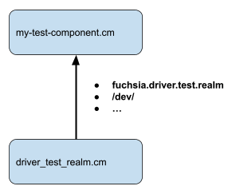
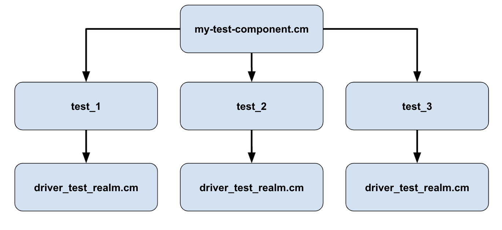
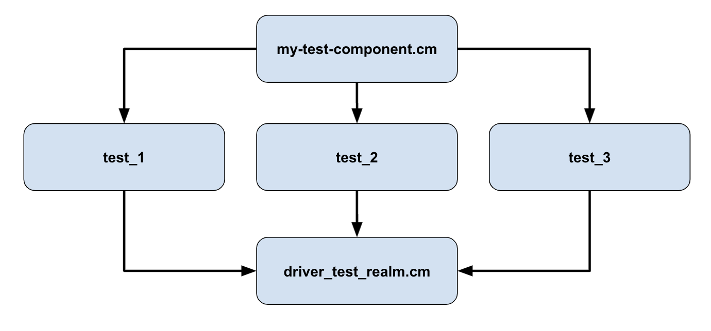

# DriverTestRealm

Caution: This page may contain information that is specific to the legacy
version of the driver framework (DFv1).

*A driver integration testing framework*

Note: The isolated-devmgr library has been deprecated. Please use the driver_test_realm
instead. The DriverFramework team will organize a migration to driver_test_realm.

Note: ***DriverTestRealm is for integration testing.***

DriverTestRealm is an integration testing framework that runs drivers in a
hermetic environment. It is useful for driver authors to test their drivers, and
for system developers to run integration tests that use specific driver stacks.
DriverTestRealm provides a hermetic version of all of the Driver Frameworks
APIs, and provides an environment that is nearly identical to a running system.

DriverTestRealm is for integration testing. For a light weight unit testing
framework, use
[mock DDK](/development/drivers/testing/mock_ddk.md) instead.

## Overview of DriverTestRealm

DriverTestRealm is a component that your test can access. This
component contains all of the DriverFramework's components, like DriverManager
and DriverIndex. It mocks out all of the capabilities these components need.



DriverTestRealm exposes the
[`fuchsia.driver.test/Realm`](/sdk/fidl/fuchsia.driver.test/realm.fidl) protocol
which is used to start the DriverTestRealm. The Start function takes arguments
which can be used to configure things like which drivers are loaded, the root
driver, and how DriverManager shuts down. Start can only be called once per
component; if a new DriverTestRealm is needed for each test, then RealmBuilder
must be used.

## Interacting with drivers

The DriverTestRealm component exposes the `/dev/` directory from DriverManager,
which is how test code will interact with drivers. The `/dev/` directory works
identically to the devfs on a running system. For example, if the test adds a
mock input device, it will show up at `/dev/class/input-report/XXX`.

## Including drivers

By default, the DriverTestRealm component loads drivers from its own package. The test
author must be sure to include all the drivers in the test package that they
expect to load.

## Binding drivers

By default, the root driver for DriverTest realm is the
[test-parent driver](/src/devices/misc/drivers/test-parent). That means that
in order to bind a driver, you should create a mock driver that binds to
the test parent. This can be
accomplished with the following bind rules:

```
fuchsia.BIND_PROTOCOL == fuchsia.test.BIND_PROTOCOL.PARENT;
```

Your mock driver can then add a device with the right properties so that
your driver-under-test will bind to the mock driver.

## Hermetic vs Non-Hermetic

There are two different ways of using DriverTestRealm. It can be used
hermetically or non-hermetically.

### Hermetic

In the hermetic version of Driver Test Realm every test gets its
own version of the Driver Test Realm component. This means every test is
hermetic, or isolated, from the other tests. Tests will not share any
state, as each Driver Test Realm is unique to that test.



Using a hermetic Driver Test Realm may be slower as each test has to
spawn and setup new components.

### Non Hermetic

The non-hermetic way of using Driver Test Realm is to have a single Driver
Test Realm child component that is shared between every test instance.



The test author needs to be extra careful to make sure that their driver's
state is cleared between each tests so that the individual tests do not
interact with each other.

Using a non-hermetic Driver Test Realm may be much faster since each test
does not need to spawn and setup new components. The test code may also
be simpler.

Note: In specific languages (like Rust) all tests are run simultaneously in
their own thread, which means using the non-hermetic Driver Test Realm
has the potential for data races if each test is interacting with the same
driver.

## DriverTestRealm examples

Here are some examples of using DriverTestRealm hermetically and non-hermetically,
in both C++ and Rust.

The examples can be seen at [//examples/drivers/driver_test_realm/](/examples/drivers/driver_test_realm).

### Hermetic

Test authors can use
[RealmBuilder](/development/testing/components/realm_builder.md) to create a new DriverTestRealm for each test.
The DriverFramework has provided a helpful library using
[DriverTestRealm in RealmBuilder](/sdk/lib/driver_test_realm/realm_builder).

Here's an example `BUILD.gn` file for using DriverTestRealm with RealmBuilder.
Notice that there's a specific DriverTestRealm GN target to depend on so the
test's generated CML has the correct RealmBuilder permissions.

* {C++}

  ```
  
  ```

* {Rust}

  ```
  
  ```

Here's test code that spawns a new DriverTestRealm per test.

* {C++}

  ```
  
  ```

* {Rust}

  ```
  
  ```

### Non Hermetic

Here's a basic example of a test that starts a DriverTestRealm component and then connects
to `/dev` to see a driver that has been loaded.

First, it's important that the build rules are set up correctly. The test package
needs to contain the DriverTestRealm component, as well as any drivers that
are going to be loaded. Adding drivers to the package will automatically make those
drivers visible to DriverTestRealm.

* {C++}

```

```

Here's what the test setup would look like. Notice that you have to call
`fuchsia.driver.test/Realm:Start` before your test framework is run. The
arguments to `Start` can be setup to configure the DriverManger implementation.

* {C++}

  ```
  
  ```

Notice that once DriverTestRealm has been started the test environment has
all of DriverFramework's APIs available to it in its component namespace.
The `/dev/` directory can be watched and opened to connect to drivers.

#### Simple example

The [Simple](/sdk/lib/driver_test_realm/simple) library lets
a test use DriverTestRealm with the default arguments.

Most integration tests are fine with DriverTestRealm's default configuration;
they don't need to pass arguments to Start. If this is the case, then
SimpleDriverTestRealm starts automatically.

* {C++}

  ```
  
  ```

* {Rust}

  ```
  

The test looks identical except that it doesn't need to set up a `main` function
to call `fuchsia.driver.test/Realm:Start`.

* {C++}

  ```
  
  ```

* {Rust}

  ```
  
  ```


## Common Issues:

* A driver isn't binding
  * Make sure the driver is being included in the package
  * Make sure `src/devices/misc/drivers/test-parent` is included if the default root driver is being used.
* Calls to /dev/ are hanging
  * Make sure `fuchsia.driver.test/Realm:Start` is called.
* `fuchsia.driver.test/Realm:Start` returns ZX_ERR_ALREADY_BOUND
  * Start can only be called once per component. If you want a new DriverTestRealm per test, please see the RealmBuilder section.
