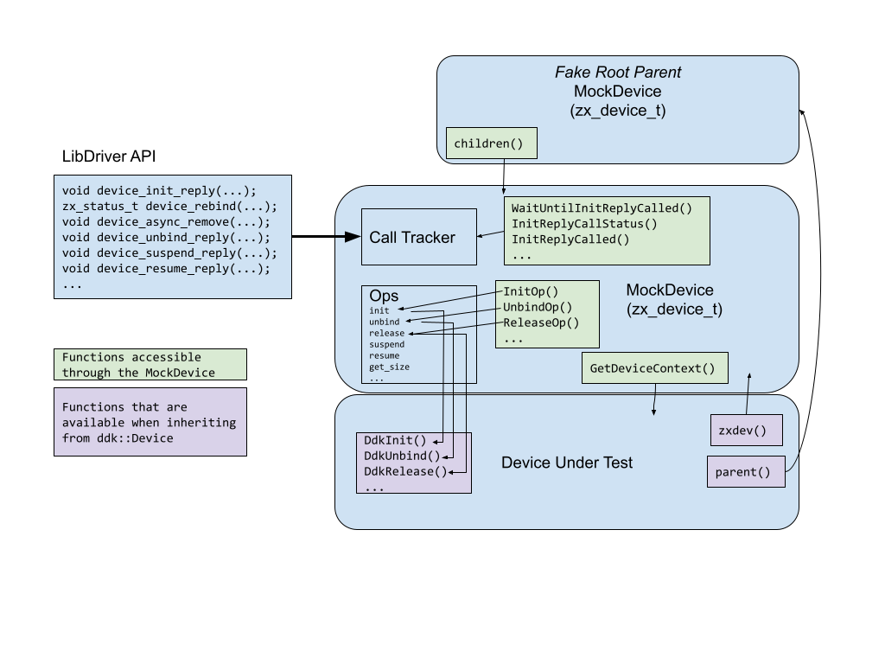

# Mock DDK

Caution: This page may contain information that is specific to the legacy
version of the driver framework (DFv1).

*A driver unit testing framework*

Note: ***The mock-ddk is only for unit testing.***
The mock_ddk does not test any interfaces for correctness, it is simply a
framework which helps driver authors load and exercise their code.
For integration testing, use the [Driver Test Realm](driver_test_realm.md) instead.

## Simple example

Here is a basic example of a driver that uses the using the mock-ddk library to mock the driverhost
framework to allow for testing.

First, a simple driver that needs testing.  This example driver will be
used for all of the code in this documentation.

```c++
// Very simple driver:
class MyDevice;
using MyDeviceType = ddk::Device<MyDevice, ddk::Unbindable, ddk::Initializable>;

class MyDevice : public MyDeviceType {
  public:
    MyDevice(zx_device_t* parent)
      : MyDeviceType(parent), client_(parent) {}

    static zx_status_t Create(void* ctx, zx_device_t* parent) {
        auto device = std::make_unique<MyDevice>(parent);
        // Usually do init stuff here that might fail.

        auto status = device->DdkAdd("my-device-name");
        if (status == ZX_OK) {
          // Intentionally leak this device because it's owned by the driver framework.
           [[maybe_unused]] auto unused = device.release();
        }
        return status;
    }

    // Methods required by the ddk mixins
    void DdkInit(ddk::InitTxn txn) { txn.Reply(ZX_OK); }
    void DdkUnbind(ddk::UnbindTxn txn) { txn.Reply(); }
    void DdkRelease() { delete this; }
  private:
    ddk::FooProtocolClient function_;
};

static zx_driver_ops_t my_driver_ops = []() -> zx_driver_ops_t {
  zx_driver_ops_t ops{};
  ops.version = DRIVER_OPS_VERSION;
  ops.bind = MyDevice::Create;
  return ops;
}();

ZIRCON_DRIVER(my_device, my_driver_ops, "fuchsia", "0.1");
```

Normally this driver can only be loaded by the driver host, as the libraries it
requires are not made available to normal components. Further, drivers tend to
get information from their parent devices.   With the mock-ddk library, the device
can be loaded and make calls to and from a mock driverhost interface:

``` c++
TEST(FooDevice, BasicTest) {
  std::shared_ptr<MockDevice> fake_parent = MockDevice::FakeRootParent();
  ASSERT_OK(MyDevice::Create(nullptr, fake_parent.get());
  auto child_dev = fake_parent->GetLatestChild();
  child_dev->InitOp(); // Call the device's Init op
  // Do some testing here

  child_dev->UnbindOp(); // Call the Unbind op if needed
  // The mock-ddk will automatically call DdkRelease() on any remaining children of
  // fake_parent upon destruction.
}
```

## Overview of the Mock-DDK

The mock ddk exists simply as a set of `zx_device_t`’s that track the
interactions a device has with the mocked driver host, and allow calls
into the device.  There is no global state - if the root “parent” device
ever goes out of scope, all the `zx_device_t`’s will destruct and delete
their accompanying device.

Here is an interaction model of how the mock-ddk interacts with a driver:



## Interactions with the Driverhost

The mock_ddk mocks out and makes available calls to and from the driverhost.

Calling into the device <br> (device ops)  | Calling out to the driverhost <br> (Libdriver API)
--------------------------------------|--------------------------------------
Call device ops through the MockDevice. Functions are named as op name + `Op` <br> **Example:** <br> Call the `init` function using `InitOp()`  | All calls in the libdriver API are recorded on the appropriate device, but no action is taken. <br> **Example:**<br> To test if `device_init_reply()` has been called, call `InitReplyCalled()`<br> or to wait on the call, `WaitUntilInitReplyCalled()`.


### An example lifecycle test {: #lifecycle-test}


```c++
auto parent = MockDevice::FakeRootParent();
MyDevice::Create(nullptr, parent.get());
// make sure the child device is there
ASSERT_EQ(1, parent->child_count());
auto* child = parent->GetLatestChild();
// If your device has an init function:
child->InitOp();
// Use this if init replies asynchronously:
EXPECT_EQ(ZX_OK,  child->WaitUntilInitReplyCalled());
// Otherwise, can just verify init replied:
EXPECT_TRUE(child->InitReplyCalled());
// If your device has an unbind function:
child->UnbindOp();
// Use this if unbind replies asynchronously:
EXPECT_EQ(ZX_OK, child->WaitUntilUnbindReplyCalled());
// Otherwise, can just verify init replied:
EXPECT_TRUE(child->UnbindReplyCalled());
// Mock-ddk will release all the devices on destruction, or you can do it manually.
```

### Automatically Unbind and Release {: #auto-unbind-release }
The driverhost will always call unbind before releasing a driver, but that
step must be done manually in the mock-ddk.
If you have multiple drivers under test, it may be easier to automate the
unbinding and releasing behavior.  The Mock DDK has a helper function for this
purpose:

```c++
auto parent = MockDevice::FakeRootParent();
MyDevice::Create(nullptr, parent.get());
zx_device_t* child_dev = parent->GetLatestChild();

MyDevice::Create(nullptr, child_dev);
// The state of the tree is now:
//         parent   <--  FakeRootParent
//           |
//        child_dev
//           |
//       grandchild

// You want to remove both test devices, by calling unbind and release in the right order?
device_async_remove(child_dev);

// ReleaseFlaggedDevices performs the unbind and release of any device
// below the input device that has had device_async_remove called on it.
mock_ddk::ReleaseFlaggedDevices(parent.get());
```

### Getting Device Context {: #getting-device-context }
The mock-ddk only deals with the `zx_device_t`'s that are associated with a device.
However, if you have assigned a device context, by for example using
the ddktl library, you may want to access corresponding the ddk::Device:

```c++
  auto fake_parent = MockDevice::FakeRootParent();
  // May not get the device* back from bind:
  ASSERT_OK(MyDevice::Create(nullptr, fake_parent.get());

  // Never fear! Recover device from parent:
  MockDevice* child_dev = fake_parent->GetLatestChild();
  MyDevice* test_dev = child_dev->GetDeviceContext<MyDevice>();
```

## Interactions with other drivers

Some information can be added to a device (usually a parent) so that the
device under test can retrieve expected values.

### Mocking Parent Protocols

Parent protocols are added to the parent before a child device is expected to
access them with a call to `device_get_protocol()`

```c++
auto parent = MockDevice::FakeRootParent();
const void* ctx = reinterpret_cast<void*>(0x10),
const void* ops = nullptr,

parent->AddProtocol(8, ops, ctx);
```


### Fragment protocols

Composite devices get protocols from multiple parent “fragments”.  This is manifested
in protocols being keyed by a name.  Mock-ddk allows binding a name to a protocol,
to indicate it comes from a fragment.

```c++
auto parent = MockDevice::FakeRootParent();
// Mock-ddk uses the same call as adding a
// normal parent protocol:
parent->AddProtocol(ZX_PROTOCOL_GPIO, gpio.GetProto()->ops, gpio.GetProto()->ctx, "fragment-1");
parent->AddProtocol(ZX_PROTOCOL_I2C, i2c.GetProto()->ops, i2c.GetProto()->ctx, "fragment-2");
parent->AddProtocol(ZX_PROTOCOL_CODEC, codec.GetProto()->ops, codec.GetProto()->ctx, "fragment-3");
// gpio, i2c, and codec are device objects with mocked/faked HW interfaces.
```

### Mocking FIDL connections

If the device serves a FIDL protocol, the test may want to call the fidl
functions provided.  This can be difficult as the fidl functions take a
completer as an argument.  You can create a client to communicate with
the device class over a fidl channel.

```c++
auto fake_parent = MockDevice::FakeRootParent();
ASSERT_OK(MyDevice::Create(nullptr, fake_parent.get());
MockDevice* child_dev = fake_parent->GetLatestChild();
MyDevice* test_dev = child_dev->GetDeviceContext<MyDevice>();

async::Loop loop(&kAsyncLoopConfigNoAttachToCurrentThread);
auto endpoints = fidl::CreateEndpoints<fidl_proto>();
std::optional<fidl::ServerBindingRef<fidl_proto>> fidl_server;
fidl_server = fidl::BindServer(
    loop.dispatcher(), std::move(endpoints->server), test_dev);
loop.StartThread("thread-name");
fidl::WireSyncClient fidl_client{std::move(endpoints->client)};
// fidl_client can be used synchronously.
```


### Mocking Metadata

Metadata can be added to any ancestor of the device under test.
Metadata is propagated to be available to all descendants.

```c++
auto parent = MockDevice::FakeRootParent();
const char kSource[] = "test";
parent->SetMetadata(kFakeMetadataType, kSource, sizeof(kSource));
```

### Load Firmware

Load firmware is an deprecated function, but is included for
the drivers that still need it:

```c++
auto fake_parent = MockDevice::FakeRootParent();
ASSERT_OK(MyDevice::Create(nullptr, fake_parent.get());
MockDevice* child_dev = fake_parent->GetLatestChild();
MyDevice* test_dev = child_dev->GetDeviceContext<MyDevice>();
constexpr std::string_view kFirmwarePath = "test path";
std::vector<uint8_t> kFirmware(200, 42);
child_dev->SetFirmware(kFirmware, kFirmwarePath);
EXPECT_TRUE(test_dev->LoadFirmware(kFirmwarePath).is_ok());
```


## Common Issues

* Not calling Init/Unbind
    * Call Init using the `MockDevice::InitOp()`
    * Call Unbind using the `MockDevice::UnbindOp()`, or call `device_async_remove()` and call `mock_ddk::ReleaseFlaggedDevices`
* Deleting the device directly
    * Solution: release the Device from the current scope after calling `DdkAdd()`

