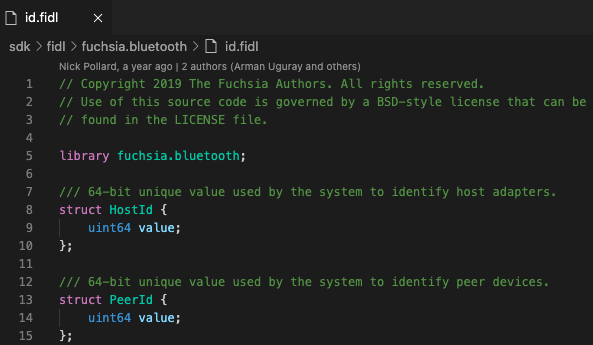
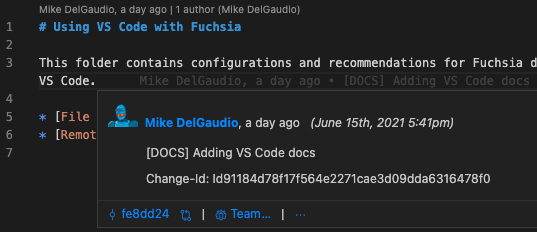



# VS Code extensions

The following VS Code extensions may provide a productive development environment for Fuchsia:

## Fuchsia-specific extensions

Fuchsia-specific extensions provide support with custom Fuchsia files.

### FIDL Language Support

[FIDL Language Support](https://marketplace.visualstudio.com/items?itemName=fuchsia-authors.language-fidl){: .external}
provides syntax support and LSP-based language features in [FIDL][fidl].

Note: You need to configure Fuchsia environment variables to run this extension. For more information, see [Set up environment variables][set-up-env].



### Fuchsia.git Helper

[Fuchsia.git Helper](https://marketplace.visualstudio.com/items?itemName=jwing.fuchsia-git-helper){: .external}
adds an "Open in...", which allows you to open a file in OSS Code Search.

To use this extension:

1. Right click a file in the file editor.
1. Select **Open in OSS Code Search**.


### FuchsiAware

[FuchsiAware](https://marketplace.visualstudio.com/items?itemName=RichKadel.fuchsiaware){: .external}
assists with browsing Fuchsia artifacts, such as by linking from component URLs to component manifests.


     
## General workflow extensions

General workflow extensions provide an overall productive workflow when working with Fuchsia.

### GitLens

[GitLens](https://marketplace.visualstudio.com/items?itemName=eamodio.gitlens){: .external}
provides highly customizable insights of git history, which allows you to see code evolution.



### GN

[GN](https://marketplace.visualstudio.com/items?itemName=npclaudiu.vscode-gn){: .external}
adds syntax highlighting for GN files.


### GNFormat

[GNFormat](https://marketplace.visualstudio.com/items?itemName=persidskiy.vscode-gnformat){: .external}
provides GN file formatting.

You may need to configure GNFormat with the file path to your GN binary and buildtools.
Do the following:

1. In VS Code, launch **Quick Open** by running `CMD/CTRL + P`.
1. Type `settings` in the search field.
1. Click **Preferences: Open Settings (JSON)**.
1. Add the following configuration and restart VS Code:

```json5
"gnformat.path.gn": "{{ '<var>' }}FILE_PATH{{ '</var>' }}",
"gnformat.path.buildtools": "{{ '<var>' }}BUILD_TOOLS_PATH{{ '</var>' }}"
```

### JSON5

[JSON5](https://marketplace.visualstudio.com/items?itemName=mrmlnc.vscode-json5){: .external}
adds syntax highlighting for JSON5 files.


### Rust-analyzer {#rust-analyzer}

[Rust-analyzer](https://marketplace.visualstudio.com/items?itemName=matklad.rust-analyzer){: .external}
is a [Language Server Protocol][lsp-definition]{: .external} (LSP)
implementation for the Rust language.

Note: If your Fuchsia source is symlinked from another mountpoint, the
`rust-analyzer` extension may not locate the files for analysis.
Instead, open the actual file path to the Fuchsia source in VS Code.

To use `rust-analyzer` with VS Code, Fuchsia recommends:

* [Updating to the latest stable VS Code][vscode-update]{: .external}.
* [Disabling telemetry reporting][vscode-disable-telemetry]{: .external} for confidential code.

#### Configure workflow {#rust-configure-workflow}

After installing `rust-analyzer`, modify your
VS Code's `settings.json` file:

1. Press `CMD/CTRL + SHIFT + P` to open **Command Palette**.
1. Type `settings` in the search field.
1. Click **Preferences: Open Settings (JSON)**.
1. In `settings.json`, paste the following snippets:

Note: If you use VS Code's [remote workspaces][vscode-remote-workspaces], use the `settings.json`
for your remote environment.

```json

  // disable cargo check on save
  "rust-analyzer.checkOnSave.enable": false,
  "rust-analyzer.checkOnSave.allTargets": false,

```

Additionally, you may want to configure smaller tooltips and hide parameter hints to optimize your
workspace:

```json

  // optional: only show summary docs for functions (keeps tooltips small)
  "rust-analyzer.callInfo.full": false,
  // optional: don't activate parameterHints automatically
  "editor.parameterHints.enabled": false,

```

#### Enable rustfmt

The `rust-analyzer` extension relies on the `rustup` installer to invoke `rustfmt`,
a tool for formatting Rust code according to style guidelines.

To configure `rustup` with your Fuchsia source code, run:

Note: `HOST_OS` is `linux-x64` on Linux and `mac-x64` on macOS.

```posix-terminal
rustup toolchain link fuchsia {{ '<var>' }}FUCHSIA_DIR{{ '</var>' }}/prebuilt/third_party/rust/{{ '<var>' }}HOST_OS{{ '</var>' }}
```

After configuring `rustup`, the `rust-analyzer` extension supports additional configuration
with Fuchsia's Rust style guide, [`rustfmt.toml`](/rustfmt.toml).

Add the following snippet to your `settings.json` using the same steps
from [Configuring workflow](#rust-configure-workflow):

```json

    // use fuchsia toolchain and fuchsia's rules for rustfmt:
    "rust-analyzer.rustfmt.extraArgs": [
        "+fuchsia",
        "--config-path= {{ '<var>' }}FUCHSIA_DIR{{ '</var>' }}/rustfmt.toml"
    ],

```

<!-- Reference links -->

[set-up-env]: get-started/get_fuchsia_source.md#set-up-environment-variables
[fidl]: development/languages/fidl/README.md
[rust-analyzer-latest]: https://github.com/rust-analyzer/rust-analyzer/releases
[vscode-extension-guide]: development/editors/extensions.md#rust-analyzer
[vscode-download]: https://code.visualstudio.com/Download
[vscode-update]:  https://vscode-docs.readthedocs.io/en/stable/supporting/howtoupdate/
[vscode-disable-telemetry]: https://code.visualstudio.com/docs/getstarted/telemetry#_disable-telemetry-reporting
[vscode-rust-analyzer]: https://marketplace.visualstudio.com/items?itemName=matklad.rust-analyzer
[vscode-downgrade]: https://code.visualstudio.com/updates/v1_30#_install-previous-versions
[supported-rust-analyzer-version]: development/languages/rust/editors.md#supported-rust-analyzer-version
[lsp-definition]: https://microsoft.github.io/language-server-protocol/
[vscode-remote-workspaces]: development/editors/vscode/remote-workspaces.md