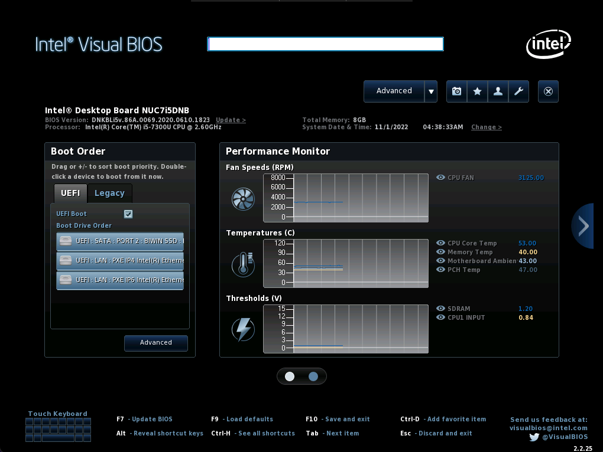
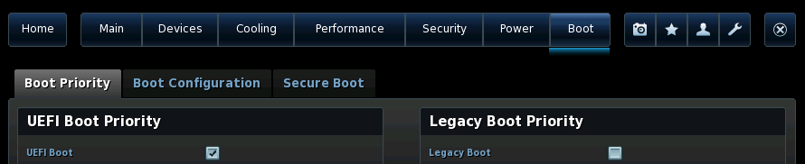
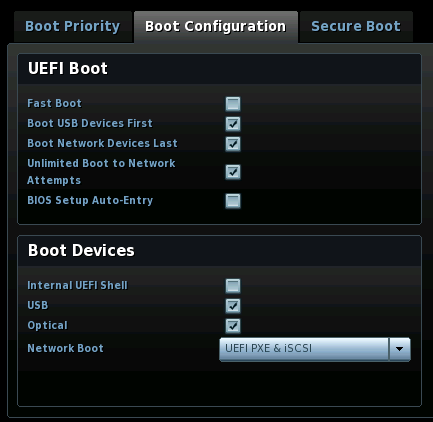
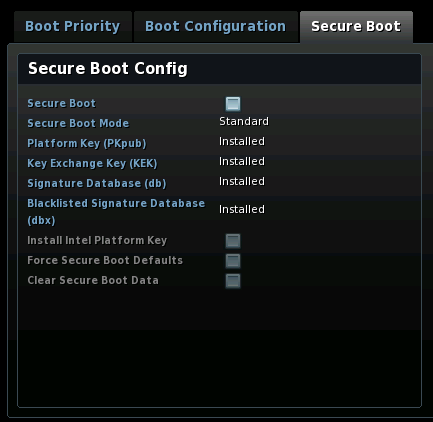
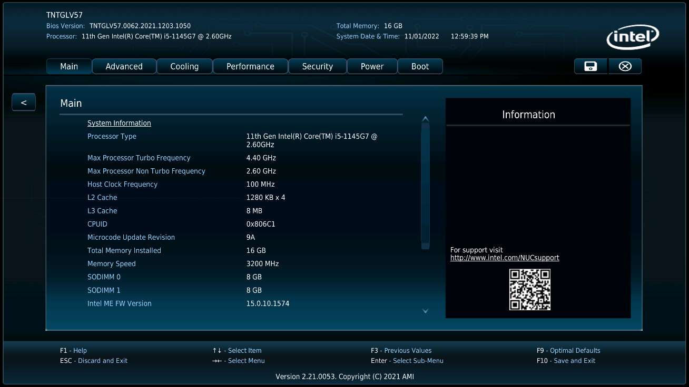
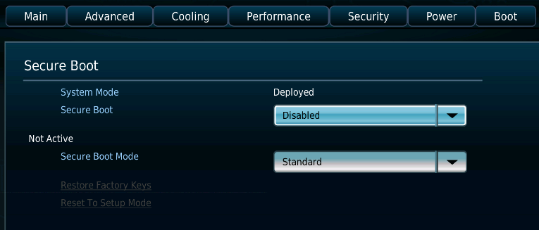
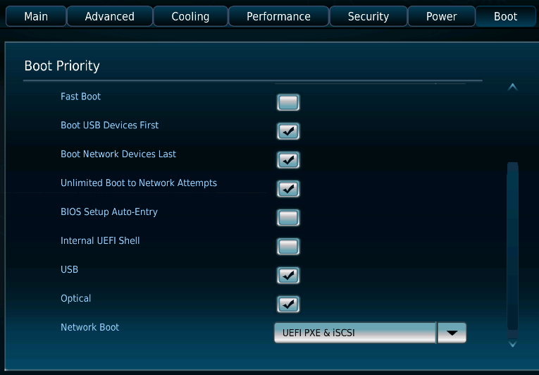

<!--
# Install Fuchsia on a NUC
 -->
# 在 NUC 迷你电脑上安装 Fuchsia

<!--
This guide provides instructions on how to install Fuchsia on an
Intel [NUC][nuc-wiki]{:.external} (Next Unit of Computing) device.
 -->
本指南提供了有关在 Intel [NUC][nuc-wiki]{:.external}（Next Unit of Computing）迷你电脑设备上安装 Fuchsia 方法的说明。

<!--
The steps are:
 -->
安装步骤为：

<!--
1. [Prerequisites](#prerequisites).
1. [Build Fuchsia](#build-fuchsia).
1. [Prepare a USB drive](#prepare-usb).
1. [Enable EFI booting on the NUC](#enable-efi-booting).
1. [Install Fuchsia on the NUC](#install-fuchsia).
1. [(Optional) Upload Fuchsia SSH keys to the NUC](#upload-fuchsia-ssh-keys).
 -->
1. [前提条件](#prerequisites)。
1. [构建 Fuchsia](#build-fuchsia)。
1. [准备 USB 驱动器](#prepare-usb)。
1. [启用 NUC 迷你电脑上的 EFI 引导](#enable-efi-booting)。
1. [将 Fuchsia 安装至 NUC 迷你电脑](#install-fuchsia)。
1. [（可选）将 Fuchsia SSH 密钥上传至 NUC 迷你电脑](#upload-fuchsia-ssh-keys)。

<!--
## Prerequisites {:#prerequisites .numbered}
 -->
## 前提条件 {:#prerequisites .numbered}

<!--
Before you start installing Fuchsia on a NUC device, make sure that
you've completed the following tasks:
 -->
开始在 NUC 迷你电脑设备上安装 Fuchsia 之前，请确保您完成了以下工作：

<!--
* [Set up the Fuchsia development environment](#set-up-fuchsia-env)
* [Get parts](#get-parts)
 -->
* [设置 Fuchsia 开发环境](#set-up-fuchsia-env)
* [获取配件](#get-parts)

<!--
### Set up the Fuchsia development environment {#set-up-fuchsia-env}
 -->
### 设置 Fuchsia 开发环境 {#set-up-fuchsia-env}

<!--
To set up the Fuchsia development environment on your workstation,
complete the [Get started with Fuchsia][get-started-with-fuchsia] guide.
 -->
要在工作站上建立 Fuchsia 开发环境，请您完成[开始使用 Fuchsia][get-started-with-fuchsia] 指南。

<!--
### Get parts {#get-parts}
 -->
### 获取配件 {#get-parts}

<!--
Note: Fuchsia only supports the NUC configurations listed in
[Supported system configurations][supported-sys-config]. However,
unsupported NUC configurations may also work with Fuchsia. For more information
on experimental setups, see [Experimental hardware][experimental-hardware].
 -->
注意：Fuchsia 仅支持列入[支持的系统配置][supported-sys-config]清单的 NUC 迷你电脑配置。不过，未支持的 NUC 迷你电脑配置也可能运行 Fuchsia。要获取关于实验性安装的更多信息，请参阅[实验性硬件][experimental-hardware]。

<!--
The following parts are required for this guide:
 -->
本指南需要使用以下配件：

<!--
*  A NUC device (see [example models](#supported-nuc-models))
*  A USB 3.0 flash drive
*  A keyboard
*  A mouse (Optional)
*  A monitor with an HDMI port
*  An HDMI cable
*  An Ethernet cable
*  A Phillips-head screwdriver (with a magnetic tip)
 -->
*  一台 NUC 迷你电脑设备（请参阅[示例型号](#supported-nuc-models)）
*  一个 USB 3.0 闪存驱动器
*  一个键盘
*  一只鼠标（可选）
*  一台带有 HDMI 端口的显示器
*  一条 HDMI 线缆
*  一条以太网线缆
*  一把十字头螺丝刀（带有磁性尖端）

<!--
Note: The [_2. Build Fuchsia_](#build-fuchsia) and
[_3. Prepare a USB drive_](#prepare-usb) sections do not require a NUC
device, so you can complete these sections prior to obtaining a NUC device.
However, you will need a USB flash drive for the _3. Prepare a USB drive_
section.
 -->
注意：“[2. 构建 Fuchsia](#build-fuchsia)”和“[3. 准备 USB 驱动器](#prepare-usb)”两节不需要 NUC 迷你电脑设备，因此您可以在获得 NUC 迷你电脑设备之前完成这些章节。但是，“3. 准备 USB 驱动器”一节需要 USB 闪存驱动器。

<!--
## Build Fuchsia {:#build-fuchsia .numbered}
 -->
## 构建 Fuchsia {:#build-fuchsia .numbered}

<!--
Installing Fuchsia on a NUC device requires that you build a Workstation
image (`workstation_eng.x64`) and generate build artifacts (which include
the Fuchsia installer) on your workstation.
 -->
要在 NUC 迷你电脑设备上安装 Fuchsia，您需要构建工作站镜像（`workstation_eng.x64`），并在工作站上生成构建内容（包括 Fuchsia 安装程序）。

<!--
To build Fuchsia for NUC installation, do the following:
 -->
要构建安装在 NUC 迷你电脑上的 Fuchsia，请执行以下操作：

<!--
1. Set your build configuration to `workstation_eng.x64` and include the
   recovery package (`recovery-installer`):
 -->
1. 将构建配置设置为 `workstation_eng.x64`，并包含恢复包（`recovery-installer`）：

   ```posix-terminal
   fx set workstation_eng.x64 --with //build/images/recovery:recovery-installer
   ```

<!--
1.  Build Fuchsia:
 -->
1.  构建 Fuchsia ：

    ```posix-terminal
    fx build
    ```

<!--
    Building Fuchsia can take up to 90 minutes.
 -->
    Fuchsia 构建可能长达 90 分钟。

<!--
## Prepare a USB drive {:#prepare-usb .numbered}
 -->
## 准备 USB 驱动器 {:#prepare-usb .numbered}

<!--
You need to prepare a bootable USB drive that runs the Fuchsia installer.
Later in the [Install Fuchsia on the NUC](#install-fuchsia) section,
you will use this USB drive to boot your NUC into the Fuchsia installer.
 -->
您需要准备一个运行 Fuchsia 安装程序的可引导 USB 驱动器。稍后，在[将 Fuchsia 安装至 NUC 迷你电脑](#install-fuchsia)一节，您将使用该 USB 驱动器将 NUC 迷你电脑引导至 Fuchsia 安装程序。

<!--
Important: The instructions below require that you've completed the
build in the previous [Build Fuchsia](#build-fuchsia) section.
 -->
重要提示：下面的说明要求您已经在先前的[构建 Fuchsia](#build-fuchsia) 一节完成了构建。

<!--
To prepare a bootable USB drive, do the following:
 -->
要准备可引导 USB 驱动器，请执行以下操作：

<!--
1. Plug the USB drive into **your workstation**.
 -->
1. 将 USB 驱动器插入**您的工作站**。

<!--
1. Identify the path to the USB drive:
 -->
1. 确定 USB 驱动器路径：

   ```posix-terminal
   fx list-usb-disks
   ```

<!--
   This command prints output similar to the following:
 -->
   该命令打印的输出内容形如：

   ```none {:.devsite-disable-click-to-copy}
   $ fx list-usb-disks
   /dev/sda - My Example USB Disk
   ```

<!--
1. Create a bootable USB drive:
 -->
1. 创建可引导 USB 驱动器：

   ```posix-terminal
   fx mkinstaller -v {{ "<var>" }}PATH_TO_USB_DRIVE{{ "</var>" }}
   ```

<!--
   Replace `PATH_TO_USB_DRIVE` with the path to the USB drive from the step
   above.
 -->
   在上述步骤中将 `PATH_TO_USB_DRIVE` 替换为 USB 驱动器路径。

<!--
   The example command below selects the `/dev/sda` path:
 -->
   下面的示例命令选择了 `/dev/sda` 路径：

   ```none {:.devsite-disable-click-to-copy}
   $ fx mkinstaller -v /dev/sda
   ```

<!--
   When finished, the command prints output similar to the following
   in the end:
 -->
   完成后，命令最终的输出结果形如：

   ```none {:.devsite-disable-click-to-copy}
   $ fx mkinstaller -v /dev/sda
   mkinstaller: WARNING: Changing ownership of /dev/sda to alice
   [sudo] password for alice:
   ...
   mkinstaller: INFO:    Writing image fvm.sparse.blk to partition storage-sparse...
   mkinstaller: INFO:      Wrote 835.6M in 35.55s, 23.5M/s
   mkinstaller: INFO: Done.
   mkinstaller: INFO: Ejected USB disk
   ```

<!--
1. Unplug the USB drive from the workstation.
 -->
1. 从工作站上拔下 USB 驱动器。

<!--
## Enable EFI booting on the NUC {:#enable-efi-booting .numbered}
 -->
## 启用 NUC 迷你电脑上的 EFI 引导 {:#enable-efi-booting .numbered}

<!--
Update your NUC's BIOS setup so that it can boot from
a USB drive.
 -->
请更新 NUC 迷你电脑的 BIOS 设置，以便其从 USB 驱动器启动。

<!--
Two versions of BIOS are available on NUC devices: **Visual BIOS** (for instance, NUC7)
and **Aptio V BIOS** (for instance, NUC11). The steps are slightly different depending
on which BIOS is included in your system.
 -->
NUC 迷你电脑设备上的 BIOS 有两个版本：**Visual BIOS**（例如 NUC7）和 **Aptio V BIOS**（例如 NUC11）。根据系统中包含的 BIOS 版本，设置步骤略有不同。

<!--
Important: To be able to enter the BIOS setup mode, you may need to unplug the
Ethernet cable from the NUC device if it's already connected to the host machine.
 -->
重要提示：为了能够进入 BIOS 设置模式，如果 NUC 迷你电脑设备已经连接到主机，那么您可能需要从设备上拔下以太网电缆。

* {Visual BIOS}

<!--
   {: width="700"}
 -->
   {: width="700"}

<!--
   **Figure 1**. A screenshot of Visual BIOS
 -->
   **图 1**. Visual BIOS 屏幕截图

<!--
   To enable EFI (Extensible Firmware Interface) booting on your NUC,
   do the following:
 -->
   要启用 NUC 迷你电脑上的 EFI（Extensible Firmware Interface，可扩展固件接口）引导，请执行以下操作：

<!--
   1. Reboot your NUC.
   1. To enter the BIOS setup, press `F2` while booting.
   1. Click the **Advanced** button at the top.
   1. Click the **Boot** tab.
   1. Click the **Boot Priority** tab and confirm the following settings:
 -->
   1. 重新启动您的 NUC 迷你电脑。
   1. 要进入 BIOS 设置，请在启动时按下 `F2`。
   1. 点击上方的 **Advanced**（高级）按钮。
   1. 点击 **Boot**（引导）选项卡。
   1. 点击 **Boot Priority**（引导优先级）选项卡，确认以下设置：

<!--
      -  **UEFI Boot** is checked.
      -  **Legacy Boot** is unchecked.
 -->
      -  **UEFI Boot**（UEFI 引导）已勾选。
      -  **Legacy Boot**（旧版引导）已取消勾选。

<!--
     {: width="700"}
 -->
     {: width="700"}

<!--
   1. Click the **Boot Configuration** tab and confirm the following settings:
 -->
   1. 点击 **Boot Configuration**（引导配置）选项卡，并确认下列设置：

<!--
      -  In the **UEFI Boot** window:
 -->
      -  在 **UEFI Boot**（UEFI 引导）窗口中：

<!--
         -  **Boot USB Devices First** is checked.
         -  **Boot Network Devices Last** is checked.
         -  **Unlimited Network Boot Attempts** is checked.
 -->
         -  **Boot USB Devices First**（首先使用 USB 设备引导）已勾选。
         -  **Boot Network Devices Last**（最后使用网络设备引导）已勾选。
         -  **Unlimited Network Boot Attempts**（网络引导尝试不限次数）已勾选。

<!--
      -  In the **Boot Devices** window:
 -->
      -  在 **Boot Devices**（引导设备）窗口中：

<!--
         -  **USB** is checked.
         -  **Network Boot** is set to `UEFI PXE & iSCSI`.
 -->
         -  **USB** 已勾选。
         -  **Network Boot**（网络引导）已设置为 `UEFI PXE & iSCSI`。

<!--
      {: width="400"}
 -->
      {: width="400"}

<!--
   1. Click the **Secure Boot** tab and confirm the following settings:
 -->
   1. 点击 **Secure Boot**（安全引导）选项卡，并确认以下设置：

<!--
      -  **Secure Boot** is unchecked.
 -->
      -  **Secure Boot**（安全引导）已取消勾选。

<!--
      {: width="400"}
 -->
      {: width="400"}

<!--
   1. To save and exit BIOS, press `F10` and click **Yes**.
 -->
   1. 要保存并退出 BIOS，请按下 `F10`，然后点击 **Yes**（是）。

* {Aptio V BIOS}

<!--
   {: width="700"}
 -->
   {: width="700"}

<!--
   **Figure 2**. A screenshot of Aptio V BIOS
 -->
   **图 2**. Aptio V BIOS 的屏幕截图

<!--
   To enable EFI (Extensible Firmware Interface) booting on your NUC,
   do the following:
 -->
   要在您的 NUC 迷你电脑上启用 EFI（Extensible Firmware Interface，可扩展固件接口）引导，请执行以下操作：

<!--
   1. Reboot your NUC.
   1. To enter the BIOS setup, press `F2` while booting.
   1. Click the **Boot** tab.
   1. Click **Secure Boot** and confirm the following settings:
 -->
   1. 重新启动您的 NUC 迷你电脑。
   1. 要进入 BIOS 设置，请在启动时按下 `F2`。
   1. 点击 **Boot**（引导）选项卡。
   1. 点击 **Secure Boot**（安全引导），并确认以下设置：

<!--
      -  **Secure Boot** is set to `Disabled`.
 -->
      -  **Secure Boot**（安全引导）已设置为 `Disabled`（禁用）。

<!--
      {: width="500"}
 -->
      {: width="500"}

<!--
   1. To return, click the **<** button on the left.
   1. Click **Boot Priority** and confirm the following settings:
 -->
   1. 要返回，请点击左侧的 **<** 按钮。
   1. 点击 **Boot Priority**（引导优先级）并确认以下设置：

<!--
      -  **UEFI Boot** is checked.
      -  **Legacy Boot** is unchecked.
 -->
      -  **UEFI Boot**（UEFI 引导）已勾选。
      -  **Legacy Boot**（旧版引导）已取消勾选。

<!--
         Note: If you don't see the **UEFI Boot** and **Legacy Boot** options, it means that
         your system does not support legacy boot. Skip these first two checks.
 -->
         注意：如果您没有看到 **UEFI Boot** 和 **Legacy Boot** 选项，则表示您的系统不支持旧版引导。请跳过这两项检查。

<!--
      -  **Boot USB Devices First** is checked.
      -  **Boot Network Devices Last** is checked.
      -  **Unlimited Boot to Network Attempts** is checked.
      -  **USB** is checked.
      -  **Network Boot** is set to `UEFI PXE & iSCSI`.
 -->
      -  **Boot USB Devices First**（首先使用 USB 设备引导）已勾选。
      -  **Boot Network Devices Last**（最后使用网络设备引导）已勾选。
      -  **Unlimited Network Boot Attempts**（网络引导尝试不限次数）已勾选。
      -  **USB** 已勾选。
      -  **Network Boot**（网络引导）已设置为 `UEFI PXE & iSCSI`。

<!--
      {: width="500"}
 -->
      {: width="500"}

<!--
   1. To save and exit BIOS, press `F10` and click **Ok**.
 -->
   1. 要保存并退出 BIOS，请按下 `F10`，然后点击 **Ok**（好）。

<!--
## Install Fuchsia on the NUC {:#install-fuchsia .numbered}
 -->
## 将 Fuchsia 安装至 NUC 迷你电脑 {:#install-fuchsia .numbered}

<!--
Use the [bootable USB drive](#prepare-usb) to boot your NUC into
the Fuchsia installer. It then installs the Workstation image
(which was built in the [Build Fuchsia](#build-fuchsia) section) to the NUC.
 -->
请使用[可引导 USB 驱动器](#prepare-usb)将您的 NUC 迷你电脑引导至 Fuchsia 安装程序中。之后程序会将[工作站镜像](#build-fuchsia)（构建于[构建 Fuchsia](#build-fuchsia) 一节）安装至 NUC 迷你电脑。

<!--
To install Fuchsia on your NUC, do the following:
 -->
要在您的 NUC 迷你电脑上安装 Fuchsia，请执行以下操作：

<!--
1. Plug the bootable USB drive into the NUC.
 -->
1. 将可引导 USB 驱动器插入 NUC 迷你电脑中。

<!--
1. Reboot your NUC.
 -->
1. 重新启动您的 NUC 迷你电脑。

<!--
   The NUC boots into the Fuchsia Workstation Installer (with a pink background).
 -->
   NUC 迷你电脑引导至 Fuchsia 工作站安装程序（背景为粉红色）。

<!--
1. Press **Enter** to select the `Install from USB` option.
 -->
1. 按下 **Enter**（回车）键选择 `Install from USB`（从 USB 安装）选项。

<!--
1. Press **Enter** on other prompts to continue.
 -->
1. 在出现其他提示时按下 **Enter**（回车）键继续。

<!--
1. Once the installation completes, unplug the USB drive from the NUC device.
 -->
1. 安装完成后，从 NUC 迷你电脑设备上拔下 USB 驱动器。

<!--
1. Reboot the NUC device.
 -->
1. 重新启动 NUC 迷你电脑设备。

<!--
   The NUC is now booted into Fuchsia’s Workstation.
 -->
   NUC 迷你电脑现在将引导至 Fuchsia 工作站。

<!--
Note: Later, if you need to install a new version of Fuchsia (for instance, after
re-building a new Workstation image using `fx build`), see
[Flash a new Fuchsia image to the NUC](#flash-fuchsia) in Appendices.
 -->
注意：之后，如果您需要安装新版本的 Fuchsia（例如，在使用 `fx build` 重新构建新的工作站镜像后），请参见附录中[将 Fuchsia 新镜像刷入 NUC 迷你电脑](#flash-fuchsia) 一节。

<!--
## (Optional) Upload Fuchsia SSH keys to the NUC {:#upload-fuchsia-ssh-keys .numbered}
 -->
## （可选）将 Fuchsia SSH 密钥上传至 NUC 迷你电脑 {:#upload-fuchsia-ssh-keys .numbered}

<!--
If you plan on using this NUC device **for Fuchsia development**, you need
to flash a Fuchsia image to the NUC device from your host machine, which
in turn uploads the [Fuchsia-specific SSH keys][fuchsia-ssh-keys] to the NUC.
Once those Fuchsia-specific SSH keys are uploaded to the NUC, you can perform
[`ffx`-based  workflows][ffx-workflows] on the NUC from your host machine.
 -->
如果您计划使用该 NUC 迷你电脑设备**进行 Fuchsia 开发**，那么您需要将 Fuchsia 镜像从您的主机刷入该 NUC 迷你电脑设备，从而上传 [Fuchsia 特定的 SSH 密钥][fuchsia-ssh-keys] 至 NUC 迷你电脑。Fuchsia 特定的 SSH 密钥上传至 NUC 迷你电脑之后，您就可以从主机在 NUC 迷你电脑上执行 [`ffx`-based workflows][ffx-workflows] 了。

<!--
To upload Fuchsia SSH keys to the NUC, do the following:
 -->
要将 Fuchsia SSH 密钥上传至 NUC 迷你电脑，请执行以下操作：

<!--
1. Complete the steps in the
   [Flash a new Fuchsia image to the NUC](#flash-fuchsia) section
   in Appendices.
 -->
1. 完成附录中[将 Fuchsia 新镜像刷入 NUC 迷你电脑](#flash-fuchsia) 一节中的步骤。

<!--
1. To verify that you can connect to the NUC from the host machine,
   run the following command:
 -->
1. 要验证从主机到 NUC 迷你电脑的连接性，请运行以下命令：

   ```posix-terminal
   ffx target show
   ```

<!--
   This command prints output similar to the following:
 -->
   该命令的输出形如：

   ```none {:.devsite-disable-click-to-copy}
   $ ffx target show
   Target:
       Name: "fuchsia-54b2-0389-644b"
       SSH Address: "fe81::55b1:2ff2:fe34:567b%en10:22"
   Board:
       Name: "default-board"
       Revision: "1"
       Instruction set: "x64"
   ...
   ```

<!--
## Appendices
 -->
## 附录

<!--
### Supported NUC models {#supported-nuc-models}
 -->
### 支持的 NUC 迷你电脑型号 {#supported-nuc-models}

<!--
For GPU support, get a NUC7 (Kaby Lake) or NUC8 (Coffee Lake), or a higher
generation.
 -->
为获得 GPU 支持，请使用 NUC 迷你电脑 7（Kaby Lake）、NUC 迷你电脑 8（Coffee Lake）或更新版本。

<!--
The list below shows some example models:
 -->
下面的列表展示了一些示例型号：

<!--
 * [Intel® NUC Kit NUC7i5DNKE][NUC7i5DNKE]{:.external}
 * [Intel® NUC Kit NUC7i5DNHE][NUC7i5DNHE]{:.external} (Best choice)
 * [Intel® NUC Kit NUC7i3DNKE][NUC7i3DNKE]{:.external}
 * [Intel® NUC Kit NUC7i3DNHE][NUC7i3DNHE]{:.external}
 * [Intel® NUC Kit NUC8i5BEK][NUC8i5BEK]{:.external}
 * [Intel® NUC Kit NUC8i5BEH][NUC8i5BEH]{:.external}
 * [Intel® NUC Kit NUC8i3BEK][NUC8i3BEK]{:.external}
 * [Intel® NUC Kit NUC8i3BEH][NUC8i3BEH]{:.external}
 -->
 * [Intel® NUC 套件 NUC7i5DNKE][NUC7i5DNKE]{:.external}
 * [Intel® NUC 套件 NUC7i5DNHE][NUC7i5DNHE]{:.external}（最佳选择）
 * [Intel® NUC 套件 NUC7i3DNKE][NUC7i3DNKE]{:.external}
 * [Intel® NUC 套件 NUC7i3DNHE][NUC7i3DNHE]{:.external}
 * [Intel® NUC 套件 NUC8i5BEK][NUC8i5BEK]{:.external}
 * [Intel® NUC 套件 NUC8i5BEH][NUC8i5BEH]{:.external}
 * [Intel® NUC 套件 NUC8i3BEK][NUC8i3BEK]{:.external}
 * [Intel® NUC 套件 NUC8i3BEH][NUC8i3BEH]{:.external}

<!--
### Flash a new Fuchsia image to the NUC {#flash-fuchsia}
 -->
### 将 Fuchsia 新镜像刷入 NUC 迷你电脑 {#flash-fuchsia}

<!--
Once a NUC is running Fuchsia, you can use Fuchsia's flashing
mechanism to provision a new Fuchsia image to the NUC.
 -->
NUC 迷你电脑运行 Fuchsia 之后，您就可以使用 Fuchsia 的刷入机制（flashing mechanism）来为 NUC 迷你电脑提供 Fuchsia 新镜像了。

<!--
To flash a Fuchsia image to your NUC, do the following:
 -->
要将 Fuchsia 镜像刷入您的 NUC 迷你电脑，请执行以下操作：

<!--
1. Connect the NUC directly to the workstation using an Ethernet cable.
 -->
1. 使用以太网线缆将 NUC 迷你电脑直接连接到工作站。

<!--
   (Or you can also connect the NUC to a router or WiFi modem in the same
   Local Area Network as the workstation.)
 -->
   （您也可以将 NUC 迷你电脑连接到与工作站相同本地网络下的路由器或 WiFi 调制解调器）

<!--
   Note: Network booting only works with the NUC's built-in Ethernet port.
   Netbooting with an USB port (via an Ethernet-to-USB adapter) is not supported.
 -->
   注意：网络引导仅适用于 NUC 迷你电脑的内置以太网端口。（通过以太网转 USB 适配器）使用 USB 端口进行网络引导是不支持的。

<!--
1. Reboot your NUC.
 -->
1. 重新启动您的 NUC 迷你电脑。

<!--
1. On Fuchsia's boot screen, press the `f` key to select the `fastboot` option.
 -->
1. 在 Fuchsia 引导屏幕下，请按下 `f` 键以选择 `fastboot` 选项。

<!--
   Once the NUC is in Fastboot mode, it prints `Fastboot TCP is ready`
   on the screen.
 -->
   NUC 迷你电脑处于 Fastboot 模式时，会在屏幕上输出 `Fastboot TCP is ready`（Fastboot TCP 就绪）。

<!--
1. **On your workstation**, discover the NUC in Fastboot mode:
 -->
1. **在您的工作站上**，发现处于 Fastboot 模式的 NUC 迷你电脑：

   ```posix-terminal
   ffx target list
   ```

<!--
   This command prints output similar to the following:
 -->
该命令打印的输出形如：

   ```none {:.devsite-disable-click-to-copy}
   $ ffx target list
   NAME                      SERIAL       TYPE       STATE       ADDRS/IP                           RCS
   fuchsia-54b2-0389-644b    <unknown>    Unknown    Fastboot    [fe81::55b1:2ff2:fe34:567b%en10]    N
   ```

<!--
   Verify that the device's state is `Fastboot`.
 -->
   验证设备状态为 `Fastboot`。

<!--
1. Flash a new Fuchsia image to the NUC:
 -->
1. 将 Fuchsia 新镜像刷入 NUC 迷你电脑：

<!--
   Note: To build a new Fuchsia image, see the [Build Fuchsia](#build-fuchsia) section above.
 -->
   注意：要构建 Fuchsia 新镜像，请参阅上述[构建 Fuchsia](#build-fuchsia) 一节。

   ```posix-terminal
   fx flash
   ```

<!--
   If you have multiple devices connected to the host machine previously, you may need to
   explicitly specify the name of the NUC device, for example:
 -->
   您如果曾将多个设备连接到主机，则可能需要显式指出 NUC 迷你电脑设备的名称，例如：

   ```posix-terminal
   fx flash -s fuchsia-54b2-0389-644b
   ```

<!--
   When finished, the NUC reboots and starts running the new Fuchsia image.
 -->
   完成后，NUC 迷你电脑会重新启动并开始运行新的 Fuchsia 镜像。

<!--
### Remote management of NUC devices {:#remote-management-of-nuc-devices}
 -->
### NUC 迷你电脑设备的远程管理 {:#remote-management-of-nuc-devices}

<!--
To enable remote management, including KVM, you need to configure
Intel [AMT][amt]{:.external} (Active Management Technology).
 -->
要启用包括 KVM 在内的远程管理，您需要配置 Intel [AMT][amt]{:.external}（Active Management Technology，主动管理技术）。

<!--
Note: This assumes you're using NUC connected to the EdgeRouter. If
your networking setup is different, you may need a different network
configuration.
 -->
注意：这里假设您使用的是连接至边界路由器的 NUC 迷你电脑。如果您的网络设置不同，则可能需要不同的网络配置。

<!--
First, configure Intel ME on your NUC:
 -->
首先，在您的 NUC 迷你电脑上配置Intel ME：

<!--
1. Reboot your NUC.
1. Enter Intel ME settings by pressing `Ctrl+P` on the boot screen.
1. Select **MEBx Login**
1. Set up a new password, the default one is `admin`.
 -->
1. 重新启动您的 NUC 迷你电脑。
1. 在启动屏幕下，按下 `Ctrl+P` 以进入Intel ME 设置。
1. 选择 **MEBx Login**（MEBx 登录）。
1. 设置新密码，默认密码为 `admin`。

<!--
   Note: The password must be at least 8 characters long, contain both lowercase and
   uppercase characters, at least one digit and at least one non alphanumeric
   character ("_" is considered alphanumeric).
 -->
注意：密码必须至少 8 个字符长，同时包含小写和大写字母，且包含至少一个数字和至少一个非字母数字字符（“_”视为字母数字）。

<!--
   Tip: If you choose a password that is exactly 8 characters long, you can use the same password
   as the VNC password below.
 -->
   提示：如果您选择的密码恰为 8 个字符长，则可以使用相同的密码作为下文的 VNC 密码。

<!--
1. Configure network:
 -->
1. 配置网络：

<!--
   1. Select **Intel(R) AMT Configuration**.
   1. Unconfigure existing network settings:
 -->
   1. 选择 **Intel(R) AMT Configuration**（Intel（R）AMT 配置）。
   1. 取消（unconfigure）现有网络设置：

<!--
      1. Select **Unconfigure Network Access**
      1. Select **Full Unprovision**
      1. Press `Y` to confirm.
   1. Select **Network Setup** > **TCP/IP Settings** > **Wired LAN IPV4 Configuration**.
   1. Set **DHCP Mode** to **Disabled**.
   1. Set **IPV4 Address** to an address reachable from your host machine via the EdgeRouter.
 -->
      1. 选择 **Unconfigure Network Access**（取消网络访问配置）。
      1. 选择**Full Unprovision**（完全取消）。
      1. 按下 `Y` 确认。
   1. 选择 **Network Setup**（网络设置）> **TCP/IP Settings**（TCP/IP 设置）> **Wired LAN IPV4 Configuration**（有线局域网 IPv4 配置）。
   1. 将 **DHCP Mode**（DHCP 模式）设置为 **Disabled**（禁用）。
   1. 将 **IPV4 Address**（IPv4地址）设置为一个您的主机通过边界路由器可达的地址。

<!--
      On your host machine, run `ifconfig` and find the entry that corresponds to the EdgeRouter, for example:
 -->
      在您的主机上，运行 `ifconfig`，找到与边界路由器对应的条目：

      ``` none {:.devsite-disable-click-to-copy}
      $ ifconfig
      enx00e04c0c13ba: flags=4163<UP,BROADCAST,RUNNING,MULTICAST>  mtu 1500
              inet 192.168.42.86  netmask 255.255.255.0  broadcast 192.168.42.255
              ...
      ```

<!--
      In this case, you could try using the address **192.168.42.20**
 -->
      在这种情况下，您可以尝试使用地址 **192.168.42.20**。

<!--
   1. Set **Subnet Mask Address** to the netmask of your host machine to EdgeRouter connection, for example **255.255.255.0**.
   1. Press `Esc` until you return to **Intel(R) AMT Configuration**.
   1. Select **Activate Network Access** and press `Y` to confirm.
   1. Exit Intel ME settings and save your changes.
 -->
   1. 将 **Subnet Mask Address**（子网掩码地址）设置为主机到边界路由器连接的网络掩码，例如 **255.255.255.0**。
   1. 按下 `Esc`，直到您返回至 **Intel(R) AMT Configuration**。
   1. 选择 **Activate Network Access**（激活网络访问），然后按下 `Y` 确认。
   1. 退出 Intel ME 设置并保存您的更改。

<!--
Now, configure the [`amtctrl`][amtctrl]{:.external} command-line utility on your host machine:
 -->
现在，在主机计算机上配置 [`amtctrl`][amtctrl]{:.external} 命令行实用程序：

<!--
These instructions assume you have set some environment variables:
 -->
该说明假设您设置了下列环境变量：

<!--
 * `AMT_HOST`: The IPv4 address you configured in the Intel ME settings.
 * `AMT_PASSWORD`: The password you chose for Intel ME.
 * `VNC_PASSWORD`: A password for accessing the NUC over VNC.
 -->
 * `AMT_HOST`：您在 Intel ME 设置中配置的 IPv4 地址。
 * `AMT_PASSWORD`：您为 Intel ME 选择的密码。
 * `VNC_PASSWORD`：通过 VNC 访问 NUC 迷你电脑的密码。

<!--
Note: The password used for `VNC_PASSWORD` must be _exactly_ 8 characters long,
must contain both lowercase and uppercase characters, at least one digit and
at least one non alphanumeric character.
 -->
注意：`VNC_PASSWORD` 所使用的密码必须**恰为** 8 个字符长，必须同时包含小写和大写字符、至少一个数字和至少一个非字母数字字符。

<!--
1. Clone the `amtctrl` repository:
 -->
1. 克隆 `amtctrl` 仓库：

   ```posix-terminal
   git clone https://github.com/sdague/amt
   ```

<!--
1. Install `amtctrl`:
 -->
1. 安装 `amtctrl`：

   ```posix-terminal
   cd amt && sudo ./setup.py install
   ```

<!--
1. Configure NUC IP address and passwords:
 -->
1. 配置 NUC 迷你电脑的 IP 地址和密码：

   ```posix-terminal
   amtctrl set -V $VNC_PASSWORD nuc $AMT_HOST $AMT_PASSWORD
   ```

<!--
1. Enable VNC:
 -->
1. 启用 VNC：

   ```posix-terminal
   amtctrl nuc vnc
   ```

<!--
Now, you can access the NUC from your host machine using any VNC client by connecting to
the IP address set in `AMT_HOST`. Enter the password set in `VNC_PASSWORD` when prompted.
 -->
现在，您可以使用主机上的任意 VNC 客户端通过连接到 `AMT_HOST` 中设置的 IP 地址来访问 NUC 迷你电脑。出现提示时，请输入 `VNC_PASSWORD` 中设置的密码。

<!--
Note: The NUC needs to be plugged in to a monitor with a HDMI cable to accept VNC connections.
 -->
注意：NUC 迷你电脑需要通过 HDMI 线缆连接至显示器，以接受 VNC 连接。

<!--
You can also turn on, turn off or reboot the NUC with the following terminal commands:
 -->
您也可以使用以下终端命令打开、关闭或重新启动 NUC 迷你电脑：

<!--
 * To turn on the NUC:
 -->
 * 打开 NUC 迷你电脑：

   ```posix-terminal
   amtctrl nuc on
   ```

<!--
 * To turn off the NUC:
 -->
 * 关闭 NUC 迷你电脑：

   ```posix-terminal
   amtctrl nuc off
   ```

<!--
 * To reboot the NUC:
 -->
 * 重新启动 NUC 迷你电脑：

   ```posix-terminal
   amtctrl nuc reboot
   ```


<!-- Reference links -->

[nuc-wiki]: https://en.wikipedia.org/wiki/Next_Unit_of_Computing
[get-started-with-fuchsia]: /get-started/README.md
[usb-setup]: /development/hardware/usb_setup.md
[supported-sys-config]: /reference/hardware/support-system-config.md
[NUC7i5DNKE]: https://ark.intel.com/content/www/us/en/ark/products/122486/intel-nuc-kit-nuc7i5dnke.html
[NUC7i5DNHE]: https://ark.intel.com/content/www/us/en/ark/products/122488/intel-nuc-kit-nuc7i5dnhe.html
[NUC7i3DNKE]: https://ark.intel.com/content/www/us/en/ark/products/122495/intel-nuc-kit-nuc7i3dnke.html
[NUC7i3DNHE]: https://ark.intel.com/content/www/us/en/ark/products/122498/intel-nuc-kit-nuc7i3dnhe.html
[NUC8i5BEK]: https://ark.intel.com/content/www/us/en/ark/products/126147/intel-nuc-kit-nuc8i5bek.html
[NUC8i5BEH]: https://ark.intel.com/content/www/us/en/ark/products/126148/intel-nuc-kit-nuc8i5beh.html
[NUC8i3BEK]: https://ark.intel.com/content/www/us/en/ark/products/126149/intel-nuc-kit-nuc8i3bek.html
[NUC8i3BEH]: https://ark.intel.com/content/www/us/en/ark/products/126150/intel-nuc-kit-nuc8i3beh.html
[ffx]: https://fuchsia.dev/reference/tools/sdk/ffx
[ffx-workflows]: /development/sdk/ffx/index.md
[fuchsia-ssh-keys]: /development/sdk/ffx/create-ssh-keys-for-devices.md
[experimental-hardware]: /contribute/governance/rfcs/0111_fuchsia_hardware_specifications.md#experimental-hardware
[amt]: https://www.intel.com/content/www/us/en/architecture-and-technology/intel-active-management-technology.html
[amtctrl]: https://github.com/sdague/amt
