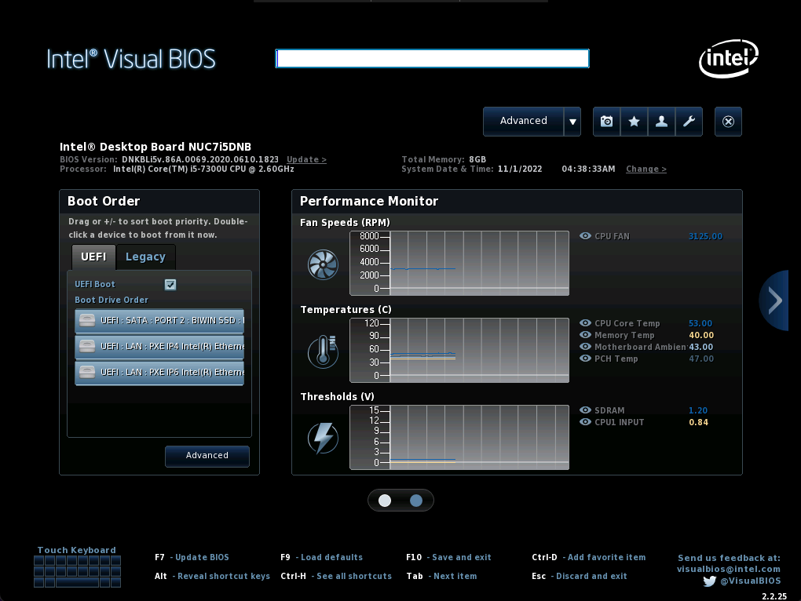
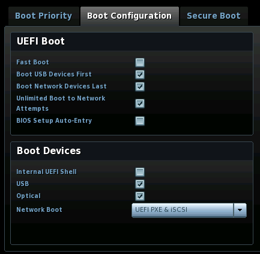
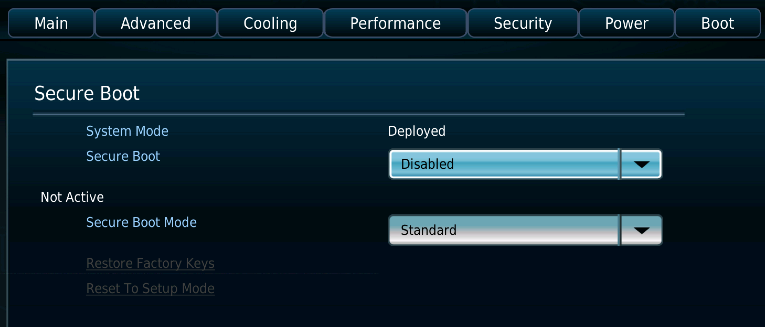
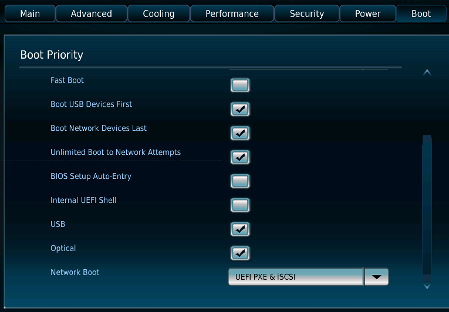

<!--
# Install Fuchsia on a NUC using Zedboot (Legacy)
 -->
# 在 NUC 迷你电脑上使用 Zedboot 安装 Fuchsia（旧版）

<!--
This guide provides instructions on how to install Fuchsia on an
Intel [NUC][nuc-wiki]{:.external} (Next Unit of Computing) device
using a [Zedboot][glossary.zedboot]-based bootable USB drive.
 -->
本指南提供了有关在 Intel [NUC][nuc-wiki]{:.external}（Next Unit of Computing）迷你电脑设备上使用基于 [Zedboot][glossary.zedboot] 的可引导 USB 驱动器安装 Fuchsia 方法的说明。

<!--
Caution: This legacy installation method is being deprecated
in favor of the [`mkinstaller` command][install-fuchsia].
 -->
注意：该旧版安装方法已弃用，以便支持 [`mkinstaller` 命令][install-fuchsia]。

<!--
The steps are:
 -->
安装步骤为：

<!--
1. [Prerequisites](#prerequisites).
1. [Build Fuchsia](#build-fuchsia).
1. [Prepare a Zedboot-based bootable USB drive](#prepare-zedboot-usb).
1. [Enable EFI booting on the NUC](#enable-efi-booting).
1. [Install Fuchsia on the NUC](#install-fuchsia).
 -->
1. [前提条件](#prerequisites)。
1. [构建 Fuchsia](#build-fuchsia)。
1. [准备 基于 Zedboot 的可引导 USB 驱动器](#prepare-zedboot-usb)。
1. [启用 NUC 迷你电脑上的 EFI 引导](#enable-efi-booting)。
1. [将 Fuchsia 安装至 NUC 迷你电脑](#install-fuchsia)。

<!--
## 1. Prerequisites {#prerequisites}
 -->
## 1. 前提条件 {#prerequisites}

<!--
Before you start installing Fuchsia on a NUC device, make sure that
you've completed the following tasks:
 -->
开始在 NUC 迷你电脑设备上安装 Fuchsia 之前，请确保您完成了以下工作：

<!--
* [Set up the Fuchsia development environment](#set-up-fuchsia-env)
* [Get parts](#get-parts)
 -->
* [设置 Fuchsia 开发环境](#set-up-fuchsia-env)
* [获取配件](#get-parts)

<!--
### Set up the Fuchsia development environment {#set-up-fuchsia-env}
 -->
### 设置 Fuchsia 开发环境 {#set-up-fuchsia-env}

<!--
To set up the Fuchsia development environment on your workstation,
complete the [Get started with Fuchsia][get-started-with-fuchsia] guide.
 -->
要在工作站上建立 Fuchsia 开发环境，请您完成[开始使用 Fuchsia][get-started-with-fuchsia] 指南。

<!--
### Get parts {#get-parts}
 -->
### 获取配件 {#get-parts}

<!--
Note: Fuchsia only supports the NUC configurations listed in
[Supported system configurations][supported-sys-config]. However,
unsupported NUC configurations may also work with Fuchsia. For more information
on experimental setups, see [Experimental hardware][experimental-hardware].
 -->
注意：Fuchsia 仅支持列入[支持的系统配置][supported-sys-config]清单的 NUC 迷你电脑配置。不过，未支持的 NUC 迷你电脑配置也可能运行 Fuchsia。要获取关于实验性安装的更多信息，请参阅[实验性硬件][experimental-hardware]。

<!--
The following parts are required for this guide:
 -->
本指南需要使用以下配件：

<!--
*  A NUC device (see [example models](#supported-nuc-models))
*  A USB 3.0 flash drive
*  A keyboard
*  A mouse (Optional)
*  A monitor with an HDMI port
*  An HDMI cable
*  An Ethernet cable
*  A Phillips-head screwdriver (with a magnetic tip)
 -->
*  一台 NUC 迷你电脑设备（请参阅[示例型号](#supported-nuc-models)）
*  一个 USB 3.0 闪存驱动器
*  一个键盘
*  一只鼠标（可选）
*  一台带有 HDMI 端口的显示器
*  一条 HDMI 线缆
*  一条以太网线缆
*  一把十字头螺丝刀（带有磁性尖端）

<!--
Note: The [_2. Build Fuchsia_](#build-fuchsia) and
[_3. Prepare a USB drive_](#prepare-usb) sections do not require a NUC
device, so you can complete these sections prior to obtaining a NUC device.
However, you will need a USB flash drive for the _3. Prepare a USB drive_
section.
 -->
注意：“[2. 构建 Fuchsia](#build-fuchsia)”和“[3. 准备 USB 驱动器](#prepare-usb)”两节不需要 NUC 迷你电脑设备，因此您可以在获得 NUC 迷你电脑设备之前完成这些章节。但是，“3. 准备 USB 驱动器”一节需要 USB 闪存驱动器。

<!--
## 2. Build Fuchsia {#build-fuchsia}
 -->
## 2. 构建 Fuchsia {#build-fuchsia}

<!--
Installing Fuchsia on a NUC device requires that you build a Workstation
image (`workstation_eng.x64`) and generate build artifacts on your workstation.
 -->
要在 NUC 迷你电脑设备上安装 Fuchsia，您需要构建工作站镜像（`workstation_eng.x64`），并在工作站上生成构建内容。

<!--
To build Fuchsia for NUC installation, do the following:
 -->
要构建安装在 NUC 迷你电脑上的 Fuchsia，请执行以下操作：

<!--
1.  Set your build configuration to `workstation_eng.x64`:
 -->
1.  将构建配置设置为 `workstation_eng.x64`：

    ```posix-terminal
    fx set workstation_eng.x64
    ```

<!--
1.  Build Fuchsia:
 -->
1.  构建 Fuchsia ：

    ```posix-terminal
    fx build
    ```

<!--
    Building Fuchsia can take up to 90 minutes.
 -->
    Fuchsia 构建可能长达 90 分钟。

<!--
## 3. Prepare a Zedboot-based bootable USB drive {#prepare-zedboot-usb}
 -->
## 3. 准备 基于 Zedboot 的可引导 USB 驱动器 {#prepare-zedboot-usb}

<!--
You need to prepare a bootable USB drive that is based on Fuchsia's
Zedboot. Later in the [Install Fuchsia on the NUC](#install-fuchsia) section,
you will use this USB drive to boot your NUC into the Zedboot mode.
 -->
您需要准备一个基于 Fuchsia Zedboot 的可引导 USB 驱动器。稍后，在[将 Fuchsia 安装至 NUC 迷你电脑](#install-fuchsia)一节，您将使用该 USB 驱动器将 NUC 迷你电脑引导至 Zedboot 模式。

<!--
Note: The instructions below require that you've completed the
build in the previous [Build Fuchsia](#build-fuchsia) section.
 -->
注意：下面的说明要求您已经在先前的[构建 Fuchsia](#build-fuchsia) 一节完成了构建。

<!--
To prepare a bootable USB drive, do the following:
 -->
要准备可引导 USB 驱动器，请执行以下操作：

<!--
1. Plug the USB drive into **your workstation**.
 -->
1. 将 USB 驱动器插入**您的工作站**。

<!--
1. Identify the path to the USB drive:
 -->
1. 确定 USB 驱动器路径：

   ```posix-terminal
   fx list-usb-disks
   ```

<!--
   This command prints output similar to the following:
 -->
   该命令打印的输出内容形如：

   ```none {:.devsite-disable-click-to-copy}
   $ fx list-usb-disks
   /dev/sda - My Example USB Disk
   ```

<!--
1. Create a Zedboot-based bootable USB drive:
 -->
1. 创建基于 Zedboot 的可引导 USB 驱动器：

   ```posix-terminal
   fx mkzedboot {{ "<var>" }}PATH_TO_USB_DRIVE{{ "</var>" }}
   ```

<!--
   Replace `PATH_TO_USB_DRIVE` with the path to the USB drive from the step
   above, for example:
 -->
   在上述步骤中将 `PATH_TO_USB_DRIVE` 替换为 USB 驱动器路径，例如：

   ```none {:.devsite-disable-click-to-copy}
   $ fx mkzedboot /dev/sda
   ```

<!--
   This command creates a Zedboot-based bootable USB drive and
   dismounts the USB drive.
 -->
   该命令创建一个基于 Zedboot 的可引导 USB 驱动器，并将其卸载。

<!--
1. Unplug the USB drive from the workstation.
 -->
1. 从工作站上拔下 USB 驱动器。

<!--
## 4. Enable EFI booting on the NUC {#enable-efi-booting}
 -->
## 4. 启用 NUC 迷你电脑上的 EFI 引导 {#enable-efi-booting}

<!--
Update your NUC's BIOS setup so that it can boot from
a USB drive.
 -->
请更新 NUC 迷你电脑的 BIOS 设置，以便其从 USB 驱动器启动。

<!--
Two versions of BIOS are available on NUC devices: **Visual BIOS** (for instance, NUC7)
and **Aptio V BIOS** (for instance, NUC11). The steps are slightly different depending
on which BIOS is included in your system.
 -->
NUC 迷你电脑设备上的 BIOS 有两个版本：**Visual BIOS**（例如 NUC7）和 **Aptio V BIOS**（例如 NUC11）。根据系统中包含的 BIOS 版本，设置步骤略有不同。

<!--
Important: To be able to enter the BIOS setup mode, you may need to unplug the
Ethernet cable from the NUC device if it's already connected to the host machine.
 -->
重要提示：为了能够进入 BIOS 设置模式，如果 NUC 迷你电脑设备已经连接到主机，那么您可能需要从设备上拔下以太网电缆。

* {Visual BIOS}

<!--
   {: width="700"}
 -->
   {: width="700"}

<!--
   **Figure 1**. A screenshot of Visual BIOS
 -->
   **图 1**. Visual BIOS 屏幕截图

<!--
   To enable EFI (Extensible Firmware Interface) booting on your NUC,
   do the following:
 -->
   要启用 NUC 迷你电脑上的 EFI（Extensible Firmware Interface，可扩展固件接口）引导，请执行以下操作：

<!--
   1. Reboot your NUC.
   1. To enter the BIOS setup, press `F2` while booting.
   1. Click the **Advanced** button at the top.
   1. Click the **Boot** tab.
   1. Click the **Boot Priority** tab and confirm the following settings:
 -->
   1. 重新启动您的 NUC 迷你电脑。
   1. 要进入 BIOS 设置，请在启动时按下 `F2`。
   1. 点击上方的 **Advanced**（高级）按钮。
   1. 点击 **Boot**（引导）选项卡。
   1. 点击 **Boot Priority**（引导优先级）选项卡，确认以下设置：

<!--
      -  **UEFI Boot** is checked.
      -  **Legacy Boot** is unchecked.
 -->
      -  **UEFI Boot**（UEFI 引导）已勾选。
      -  **Legacy Boot**（旧版引导）已取消勾选。

<!--
     {: width="700"}
 -->
     {: width="700"}

<!--
   1. Click the **Boot Configuration** tab and confirm the following settings:
 -->
   1. 点击 **Boot Configuration**（引导配置）选项卡，并确认下列设置：

<!--
      -  In the **UEFI Boot** window:
 -->
      -  在 **UEFI Boot**（UEFI 引导）窗口中：

<!--
         -  **Boot USB Devices First** is checked.
         -  **Boot Network Devices Last** is checked.
         -  **Unlimited Network Boot Attempts** is checked.
 -->
         -  **Boot USB Devices First**（首先使用 USB 设备引导）已勾选。
         -  **Boot Network Devices Last**（最后使用网络设备引导）已勾选。
         -  **Unlimited Network Boot Attempts**（网络引导尝试不限次数）已勾选。

<!--
      -  In the **Boot Devices** window:
 -->
      -  在 **Boot Devices**（引导设备）窗口中：

<!--
         -  **USB** is checked.
         -  **Network Boot** is set to `UEFI PXE & iSCSI`.
 -->
         -  **USB** 已勾选。
         -  **Network Boot**（网络引导）已设置为 `UEFI PXE & iSCSI`。

<!--
      {: width="400"}
 -->
      {: width="400"}

<!--
   1. Click the **Secure Boot** tab and confirm the following settings:
 -->
   1. 点击 **Secure Boot**（安全引导）选项卡，并确认以下设置：

<!--
      -  **Secure Boot** is unchecked.
 -->
      -  **Secure Boot**（安全引导）已取消勾选。

<!--
      {: width="400"}
 -->
      {: width="400"}

<!--
   1. To save and exit BIOS, press `F10` and click **Yes**.
 -->
   1. 要保存并退出 BIOS，请按下 `F10`，然后点击 **Yes**（是）。

* {Aptio V BIOS}

<!--
   {: width="700"}
 -->
   {: width="700"}

<!--
   **Figure 2**. A screenshot of Aptio V BIOS
 -->
   **图 2**. Aptio V BIOS 的屏幕截图

<!--
   To enable EFI (Extensible Firmware Interface) booting on your NUC,
   do the following:
 -->
   要在您的 NUC 迷你电脑上启用 EFI（Extensible Firmware Interface，可扩展固件接口）引导，请执行以下操作：

<!--
   1. Reboot your NUC.
   1. To enter the BIOS setup, press `F2` while booting.
   1. Click the **Boot** tab.
   1. Click **Secure Boot** and confirm the following settings:
 -->
   1. 重新启动您的 NUC 迷你电脑。
   1. 要进入 BIOS 设置，请在启动时按下 `F2`。
   1. 点击 **Boot**（引导）选项卡。
   1. 点击 **Secure Boot**（安全引导），并确认以下设置：

<!--
      -  **Secure Boot** is set to `Disabled`.
 -->
      -  **Secure Boot**（安全引导）已设置为 `Disabled`（禁用）。

<!--
      {: width="500"}
 -->
      {: width="500"}

<!--
   1. To return, click the **<** button on the left.
   1. Click **Boot Priority** and confirm the following settings:
 -->
   1. 要返回，请点击左侧的 **<** 按钮。
   1. 点击 **Boot Priority**（引导优先级）并确认以下设置：

<!--
      -  **UEFI Boot** is checked.
      -  **Legacy Boot** is unchecked.
 -->
      -  **UEFI Boot**（UEFI 引导）已勾选。
      -  **Legacy Boot**（旧版引导）已取消勾选。

<!--
         Note: If you don't see the **UEFI Boot** and **Legacy Boot** options, it means that
         your system does not support legacy boot. Skip these first two checks.
 -->
         注意：如果您没有看到 **UEFI Boot** 和 **Legacy Boot** 选项，则表示您的系统不支持旧版引导。请跳过这两项检查。

<!--
      -  **Boot USB Devices First** is checked.
      -  **Boot Network Devices Last** is checked.
      -  **Unlimited Boot to Network Attempts** is checked.
      -  **USB** is checked.
      -  **Network Boot** is set to `UEFI PXE & iSCSI`.
 -->
      -  **Boot USB Devices First**（首先使用 USB 设备引导）已勾选。
      -  **Boot Network Devices Last**（最后使用网络设备引导）已勾选。
      -  **Unlimited Network Boot Attempts**（网络引导尝试不限次数）已勾选。
      -  **USB** 已勾选。
      -  **Network Boot**（网络引导）已设置为 `UEFI PXE & iSCSI`。

<!--
      {: width="500"}
 -->
      {: width="500"}

<!--
   1. To save and exit BIOS, press `F10` and click **Ok**.
 -->
   1. 要保存并退出 BIOS，请按下 `F10`，然后点击 **Ok**（好）。

<!--
## 5. Install Fuchsia on the NUC {#install-fuchsia}
 -->
## 5. 将 Fuchsia 安装至 NUC 迷你电脑 {#install-fuchsia}

<!--
Use the [Zedboot-based bootable USB drive](#prepare-zedboot-usb) to boot
your NUC into the Zedboot mode. Then pave the
[Workstation prebuilt image](#build-fuchsia) from your workstation
to the NUC to install Fuchsia for the first time.
 -->
请使用[基于 Zedboot 的可引导 USB 驱动器](#prepare-zedboot-usb)将您的 NUC 迷你电脑引导至 Zedboot 模式。之后将[预构建的工作站镜像](#build-fuchsia)从您的工作站铺设（pave）至 NUC 迷你电脑，以首次安装 Fuchsia。

<!--
On a NUC, Fuchsia boots the device using a chain of bootloaders. The instructions
in this section creates a bootable USB drive for Fuchsia that handles the first two
steps in the bootloader chain: [Gigaboot][gigaboot] and [Zedboot][glossary.zedboot].
Gigaboot is a UEFI boot shim with some limited functionality (for instance,
[netbooting][netbooting] and flashing). By default, Gigaboot chains into Zedboot,
which is a bootloader built on top of Zircon. Zedboot then can boot the device
into a Fuchsia product or allow you to pave a Fuchsia image to the device.
 -->
在 NUC 迷你电脑上，Fuchsia 使用一系列引导加载程序来引导设备。本节中的说明为 Fuchsia 创建了可引导 USB 驱动器，用于处理引导加载程序链中的前两个步骤：[Gigaboot][gigaboot] 和 [Zedboot][glossary.zedboot]。Gigaboot 是一个 UEFI 引导兼容库（shim），具有一些有限的功能（例如，[网络引导][netbooting]和刷写）。默认情况下，Gigaboot 链接到 Zedboot 内，后者是一个构建在 Zircon 之上的引导加载程序。之后 Zedboot 可以将设备引导至 Fuchsia 产品（product）中，或者允许您将 Fuchsia 镜像铺设到设备上。

<!--
To install Fuchsia on your NUC, do the following:
 -->
要在您的 NUC 迷你电脑上安装 Fuchsia，请执行以下操作：

<!--
1. Plug the Zedboot-based bootable USB drive into the NUC.
 -->
1. 将基于 Zedboot 的可引导 USB 驱动器插入 NUC 迷你电脑中。

<!--
1. Connect the NUC directly to the workstation using an Ethernet cable
   (or connect the NUC to a router or WiFi modem in the same
   Local Area Network as the workstation).
 -->
1. 使用以太网线缆将 NUC 迷你电脑直接连接到工作站（您也可以将 NUC 迷你电脑连接到与工作站相同本地网络下的路由器或 WiFi 调制解调器）

<!--
   Note: Network booting only works with the NUC's built-in Ethernet port –
   netbooting with an USB port (via an Ethernet-to-USB adapter) is not supported.
 -->
   注意：网络引导仅适用于 NUC 迷你电脑的内置以太网端口。（通过以太网转 USB 适配器）使用 USB 端口进行网络引导是不支持的。

<!--
1. Reboot your NUC.
 -->
1. 重新启动您的 NUC 迷你电脑。

<!--
   The NUC boots into Fuchsia's Zedboot mode, displaying Zedboot's signature
   blue screen.
 -->
   NUC 迷你电脑 引导至 Fuchsia Zedboot 模式，显示 Zedboot 的标志性蓝色画面。

<!--
1. On the Zedboot screen, press `Alt` + `F3` to switch to a command-line prompt.
 -->
1.在 Zedboot 屏幕下，按下 `Alt` + `F3` 切换到命令行提示符。

<!--
   Note: If you cannot press `Alt`+`F3` because the keyboard on the NUC is not
   working, see
   [Keyboard not working after Zedboot](#keyboard-not-working-after-zedboot)
   in Troubleshoot.
 -->
   注意：如果您由于 NUC 迷你电脑上的键盘无法工作而不能按下 `Alt`+`F3`，则请参阅故障排除中的 [Zedboot 后键盘不工作](#keyboard-not-working-after-zedboot) 。

<!--
1. On the NUC, view the HDD or SSD's block device path:
 -->
1. 在 NUC 迷你电脑上，查看 HDD 或 SSD 的块设备路径：

   ```posix-terminal
   lsblk
   ```

<!--
   Take note of the block device path (for example, the path might look like
   `/dev/sys/platform/pci/00:17.0/ahci/sata0/block`).
 -->
   记下块设备路径（例如，该路径可能形如 `/dev/sys/platform/pci/00:17.0/ahci/sata0/block`）。

<!--
1. On the NUC, wipe and initialize the partition tables of the NUC:
 -->
1. 在 NUC 迷你电脑上，擦除并初始化 NUC 迷你电脑的分区表：

   ```posix-terminal
   install-disk-image wipe-partition-tables --block-device <BLOCK_DEVICE_PATH>
   ```

   ```posix-terminal
   install-disk-image init-partition-tables --block-device <BLOCK_DEVICE_PATH>
   ```

<!--
   Replace `BLOCK_DEVICE_PATH` with the block device path from the step above,
   for example:
 -->
<!--TODO-->
   在上述步骤中将 `BLOCK_DEVICE_PATH` 替换为块设备路径，例如：

   ```none {:.devsite-disable-click-to-copy}
   $ install-disk-image wipe-partition-tables --block-device /dev/sys/platform/pci/00:17.0/ahci/sata0/block
   $ install-disk-image init-partition-tables --block-device /dev/sys/platform/pci/00:17.0/ahci/sata0/block
   ```

<!--
1. **On your workstation**, pave the Fuchsia image to the NUC:
 -->
1. **在您的工作站上**，将 Fuchsia 镜像铺设至 NUC 迷你电脑：

   ```posix-terminal
   fx pave
   ```

<!--
1. When the paving is finished, unplug the USB drive from the NUC.
 -->
1. 铺设完成后，从 NUC 迷你电脑上拔下 USB 驱动器。

<!--
Fuchsia is now installed on your NUC. When you reboot the device, it will load Gigaboot,
Zedboot, and Fuchsia all from your device's storage. Therefore, you no longer need to
keep the USB drive plugged in.
 -->
Fuchsia 现已安装在您的 NUC 迷你电脑上。当您重新启动设备时，它将从设备的存储器中加载 Gigaboot、Zedboot 和 Fuchsia。因此，您不再需要保持 USB 驱动器插入了。

<!--
Later, if you need to install a new version of Fuchsia (for instance, after re-building
a new Workstation image using `fx build`), see
[Flash a new Fuchsia image to the NUC][flash-fuchsia-to-nuc].
 -->
之后，如果您需要安装新版本的 Fuchsia（例如，在使用 `fx build` 重新构建新的工作站镜像后），请参见[将 Fuchsia 新镜像刷入 NUC 迷你电脑][flash-fuchsia-to-nuc]。

<!--
## Troubleshoot
 -->
## 故障排除

<!--
### Keyboard not working after Zedboot {#keyboard-not-working-after-zedboot}
 -->
### Zedboot 后键盘不工作 {#keyboard-not-working-after-zedboot}

<!--
After plugging the Zedboot USB drive to the NUC,
if you notice that the keyboard on the NUC is not working, then skip
Step 4 through 6 and perform the following workaround instead:
 -->
将 Zedboot USB 驱动器插入 NUC 迷你电脑后，如果您发现 NUC 迷你电脑上的键盘不工作，则请跳过步骤 4 至 6，并转而执行以下解决方法：

<!--
1. **On your workstation**, try to install Fuchsia on the NUC:
 -->
1. **在您的工作站上**，尝试将 Fuchsia 安装在 NUC 迷你电脑上：

   ```posix-terminal
   fx pave
   ```

<!--
   This command may fail due to the partition tables issue on the NUC.
 -->
   该命令可能由于 NUC 迷你电脑上的分区表问题而失败。

<!--
1. View the kernel logs:
 -->
1. 查看内核日志：

   ```posix-terminal
   fx klog
   ```

<!--
   In the logs, look for an error message similar to the following:
 -->
   在日志中，查找形如以下内容的错误消息：

<!--
   ```none {:.devsite-disable-click-to-copy}
   Unable to find a valid GPT on this device with the expected partitions. Please run *one* of the following command(s):
   fx init-partition-tables /dev/sys/platform/pci/00:17.0/ahci/sata0/block
   ```
1. To initialize the partition tables on the NUC, run the suggested command
   in the logs, for example:
 -->
   （译：无法在该设备上找到具有所需分区的有效 GUID 分区表（GPT）。请运行以下命令之一：）
1. 要在 NUC 迷你电脑上初始化分区表，请运行日志中建议的命令，例如：

   ```none {:.devsite-disable-click-to-copy}
   $ fx init-partition-tables /dev/sys/platform/pci/00:17.0/ahci/sata0/block
   ```

<!--
1. Now, to install Fuchsia on the NUC, run the following command again:
 -->
1. 现在，要在 NUC 迷你电脑上安装 Fuchsia，请再次运行以下命令：

   ```posix-terminal
   fx pave
   ```

<!--
### Paving or netbooting not working after Zedboot {#paving-not-working-after-zedboot}
 -->
### Zedboot 后铺设或网络引导不工作

<!--
After issuing the `fx pave` command, if paving does not complete,
make sure the Ethernet cable is directly connected to the Ethernet port of the NUC, and
is not using an Ethernet-to-USB adapter to connect to a USB port of the NUC –
even though an Ethernet-to-USB adapter works after Fuchsia has been paved
(for instance, when doing `fx ota`), the USB port doesn't work with Zedboot when paving.
 -->
发出 `fx pave` 命令后，如果铺设未完成，请确保以太网线缆直接连接到了 NUC 迷你电脑的以太网端口，且未使用以太网转 USB 适配器连接到NUC 迷你电脑的 USB 端口——即使在 Fuchsia 铺设后以太网转 USB 适配器可以工作（例如，在执行 `fx ota` 时），但是在铺设时 USB 端口不适用于 Zedboot。

<!--
### Address already in use {#address-already-in-use}
 -->
### 地址已在使用中 {#address-already-in-use}

<!--
When you run the `fx pave` command, you may run into the following error:
 -->
运行`fx pave` 命令时，您可能会遇到以下错误：

```none {:.devsite-disable-click-to-copy}
2022-01-20 15:23:00 [bootserver] cannot bind to [::]:33331 48: Address already in use
there may be another bootserver running
```
（译：无法绑定至 [::]:33331 48：地址已在使用中，可能有另一 bootserver 正在运行）

<!--
When you see this error, do the following:
 -->
当您看到该错误时，请执行以下操作：

<!--
1. Check the processes that are currently using the port 33331:
 -->
1. 检查当前使用端口 33331 的进程：

   ```posix-terminal
   sudo lsof -i:33331
   ```

<!--
   This command prints output similar to the following:
 -->
   该命令的输出形如：

   ```none {:.devsite-disable-click-to-copy}
   $ sudo lsof -i:33331
   COMMAND   PID USER   FD   TYPE             DEVICE SIZE/OFF NODE NAME
   ffx     69264 alice  15u  IPv6 0xb12345ed61b7e12d      0t0  UDP *:diamondport
   ```

<!--
1. Terminate all the processes in the list, for example:
 -->
1. 终止列表中的所有进程，例如：

   ```posix-terminal
   kill 69264
   ```

<!--
## Appendices
 -->
## 附录

<!--
### Supported NUC models {#supported-nuc-models}
 -->
### 支持的 NUC 迷你电脑型号 {#supported-nuc-models}

<!--
For GPU support, get a NUC7 (Kaby Lake) or NUC8 (Coffee Lake), or a higher
generation.
 -->
为获得 GPU 支持，请使用 NUC 迷你电脑 7（Kaby Lake）、NUC 迷你电脑 8（Coffee Lake）或更新版本。

<!--
The list below shows some example models:
 -->
下面的列表展示了一些示例型号：

<!--
 * [Intel® NUC Kit NUC7i5DNKE][NUC7i5DNKE]{:.external}
 * [Intel® NUC Kit NUC7i5DNHE][NUC7i5DNHE]{:.external} (Best choice)
 * [Intel® NUC Kit NUC7i3DNKE][NUC7i3DNKE]{:.external}
 * [Intel® NUC Kit NUC7i3DNHE][NUC7i3DNHE]{:.external}
 * [Intel® NUC Kit NUC8i5BEK][NUC8i5BEK]{:.external}
 * [Intel® NUC Kit NUC8i5BEH][NUC8i5BEH]{:.external}
 * [Intel® NUC Kit NUC8i3BEK][NUC8i3BEK]{:.external}
 * [Intel® NUC Kit NUC8i3BEH][NUC8i3BEH]{:.external}
 -->
 * [Intel® NUC 套件 NUC7i5DNKE][NUC7i5DNKE]{:.external}
 * [Intel® NUC 套件 NUC7i5DNHE][NUC7i5DNHE]{:.external}（最佳选择）
 * [Intel® NUC 套件 NUC7i3DNKE][NUC7i3DNKE]{:.external}
 * [Intel® NUC 套件 NUC7i3DNHE][NUC7i3DNHE]{:.external}
 * [Intel® NUC 套件 NUC8i5BEK][NUC8i5BEK]{:.external}
 * [Intel® NUC 套件 NUC8i5BEH][NUC8i5BEH]{:.external}
 * [Intel® NUC 套件 NUC8i3BEK][NUC8i3BEK]{:.external}
 * [Intel® NUC 套件 NUC8i3BEH][NUC8i3BEH]{:.external}

<!--
### Install RAM and SSD to a NUC device {#install-ram-and-ssd-to-nuc}
 -->
### 将内存条和固态硬盘安装到 NUC 迷你电脑设备 {#install-ram-and-ssd-to-nuc}

<!--
Some NUC devices do not come with RAM or an SSD. In which case,
you need to install them manually.
 -->
某些 NUC 迷你电脑设备不预装内存条或固态硬盘。在这种情况下，您需要手动安装。


<!--
**Figure 1**. A NUC device and RAM and SSD sticks.
 -->
**图 1**. NUC 迷你电脑设备，内存条和固态硬盘条。

<!--
The table below shows some RAM and SSD example models:
 -->
下表展示了一些内存条和固态硬盘示例型号：

<!--
| Item | Link | Notes |
| ---- | ---- | ------ |
| RAM | [Crucial 8GB DDR4-2400 SODIMM][ram-01]{:.external} | Works fine. |
| SSD | [Samsung SSD 850 EVO SATA M.2 250GB][ssd-01]{:.external} | Works fine. |
| SSD | [ADATA Ultimate SU800 M.2 2280 3D NAND SSD][ssd-02]{:.external} | Works fine. |
| SSD | [CRUCIAL MX300 SSD][ssd-03]{:.external} | Works fine, but is discontinued. |
 -->
| 项目   | 链接                                                              | 注释         |
|------|-----------------------------------------------------------------|------------|
| 内存条  | [Crucial 8GB DDR4-2400 SODIMM][ram-01]{:.external}              | 工作正常。     |
| 固态硬盘 | [Samsung SSD 850 EVO SATA M.2 250GB][ssd-01]{:.external}        | 工作正常。     |
| 固态硬盘  | [ADATA Ultimate SU800 M.2 2280 3D NAND SSD][ssd-02]{:.external} | 正常工作。     |
| 固态硬盘  | [Crucial MX300 SSD][ssd-03]{:.external}                         | 工作正常，但已停产。|

<!--
To install the RAM and SSD on your NUC, do the following:
 -->
要在您的 NUC 迷你电脑上安装内存条和固态硬盘，请执行以下操作：

<!--
1. Remove the Phillips screws on the bottom feet of the NUC.
 -->
1. 取下 NUC 迷你电脑底座的十字螺丝。

   
   

<!--
1. Install the RAM.
1. Remove the Phillips screws that would hold the SSD in place
   (a Phillips screwdriver with a magnetic tip is useful here).
 -->
1. 安装内存条。
1. 取下固态硬盘位的十字固定螺钉（此处使用带有磁性尖段的十字螺丝刀较为方便）。

<!--
1. Install the SSD.
1. Mount the SSD in place using the screws from Step 3.
 -->
1. 安装固态硬盘。
1. 使用步骤 3 的螺丝将安装固定固态硬盘。

   
<!--
1. Put the bottom feet and screws back in.
1. Plug the power, monitor (using HDMI), and keyboard into the NUC.
 -->
1. 装回底座和其中的螺丝。
1. 将电源、显示器（使用 HDMI）和键盘连接至 NUC 迷你电脑。

<!--
### Remote management of NUC devices {:#remote-management-of-nuc-devices}
 -->
### NUC 迷你电脑设备的远程管理 {:#remote-management-of-nuc-devices}

<!--
To enable remote management, including KVM, you need to configure
Intel [AMT][amt]{:.external} (Active Management Technology).
 -->
要启用包括 KVM 在内的远程管理，您需要配置 Intel [AMT][amt]{:.external}（Active Management Technology，主动管理技术）。

<!--
Note: This assumes you're using NUC connected to the EdgeRouter. If
your networking setup is different, you may need a different network
configuration.
 -->
注意：这里假设您使用的是连接至边界路由器的 NUC 迷你电脑。如果您的网络设置不同，则可能需要不同的网络配置。

<!--
First, configure Intel ME on your NUC:
 -->
首先，在您的 NUC 迷你电脑上配置Intel ME：

<!--
1. Reboot your NUC.
1. Enter Intel ME settings by pressing `Ctrl+P` on the boot screen.
1. Select **MEBx Login**
1. Set up a new password, the default one is `admin`.
 -->
1. 重新启动您的 NUC 迷你电脑。
1. 在启动屏幕下，按下 `Ctrl+P` 以进入Intel ME 设置。
1. 选择 **MEBx Login**（MEBx 登录）。
1. 设置新密码，默认密码为 `admin`。

<!--
   Note: The password must be at least 8 characters long, contain both lowercase and
   uppercase characters, at least one digit and at least one non alphanumeric
   character ("_" is considered alphanumeric).
 -->
注意：密码必须至少 8 个字符长，同时包含小写和大写字母，且包含至少一个数字和至少一个非字母数字字符（“_”视为字母数字）。

<!--
   Tip: If you choose a password that is exactly 8 characters long, you can use the same password
   as the VNC password below.
 -->
   提示：如果您选择的密码恰为 8 个字符长，则可以使用相同的密码作为下文的 VNC 密码。

<!--
1. Configure network:
 -->
1. 配置网络：

<!--
   1. Select **Intel(R) AMT Configuration**.
   1. Unconfigure existing network settings:
 -->
   1. 选择 **Intel(R) AMT Configuration**（Intel（R）AMT 配置）。
   1. 取消（unconfigure）现有网络设置：

<!--
      1. Select **Unconfigure Network Access**
      1. Select **Full Unprovision**
      1. Press `Y` to confirm.
   1. Select **Network Setup** > **TCP/IP Settings** > **Wired LAN IPV4 Configuration**.
   1. Set **DHCP Mode** to **Disabled**.
   1. Set **IPV4 Address** to an address reachable from your host machine via the EdgeRouter.
 -->
      1. 选择 **Unconfigure Network Access**（取消网络访问配置）。
      1. 选择**Full Unprovision**（完全取消）。
      1. 按下 `Y` 确认。
   1. 选择 **Network Setup**（网络设置）> **TCP/IP Settings**（TCP/IP 设置）> **Wired LAN IPV4 Configuration**（有线局域网 IPv4 配置）。
   1. 将 **DHCP Mode**（DHCP 模式）设置为 **Disabled**（禁用）。
   1. 将 **IPV4 Address**（IPv4地址）设置为一个您的主机通过边界路由器可达的地址。

<!--
      On your host machine, run `ifconfig` and find the entry that corresponds to the EdgeRouter, for example:
 -->
      在您的主机上，运行 `ifconfig`，找到与边界路由器对应的条目：

      ``` none {:.devsite-disable-click-to-copy}
      $ ifconfig
      enx00e04c0c13ba: flags=4163<UP,BROADCAST,RUNNING,MULTICAST>  mtu 1500
              inet 192.168.42.86  netmask 255.255.255.0  broadcast 192.168.42.255
              ...
      ```

<!--
      In this case, you could try using the address **192.168.42.20**
 -->
      在这种情况下，您可以尝试使用地址 **192.168.42.20**。

<!--
   1. Set **Subnet Mask Address** to the netmask of your host machine to EdgeRouter connection, for example **255.255.255.0**.
   1. Press `Esc` until you return to **Intel(R) AMT Configuration**.
   1. Select **Activate Network Access** and press `Y` to confirm.
   1. Exit Intel ME settings and save your changes.
 -->
   1. 将 **Subnet Mask Address**（子网掩码地址）设置为主机到边界路由器连接的网络掩码，例如 **255.255.255.0**。
   1. 按下 `Esc`，直到您返回至 **Intel(R) AMT Configuration**。
   1. 选择 **Activate Network Access**（激活网络访问），然后按下 `Y` 确认。
   1. 退出 Intel ME 设置并保存您的更改。

<!--
Now, configure the [`amtctrl`][amtctrl]{:.external} command-line utility on your host machine:
 -->
现在，在主机计算机上配置 [`amtctrl`][amtctrl]{:.external} 命令行实用程序：

<!--
These instructions assume you have set some environment variables:
 -->
该说明假设您设置了下列环境变量：

<!--
 * `AMT_HOST`: The IPv4 address you configured in the Intel ME settings.
 * `AMT_PASSWORD`: The password you chose for Intel ME.
 * `VNC_PASSWORD`: A password for accessing the NUC over VNC.
 -->
 * `AMT_HOST`：您在 Intel ME 设置中配置的 IPv4 地址。
 * `AMT_PASSWORD`：您为 Intel ME 选择的密码。
 * `VNC_PASSWORD`：通过 VNC 访问 NUC 迷你电脑的密码。

<!--
Note: The password used for `VNC_PASSWORD` must be _exactly_ 8 characters long,
must contain both lowercase and uppercase characters, at least one digit and
at least one non alphanumeric character.
 -->
注意：`VNC_PASSWORD` 所使用的密码必须**恰为** 8 个字符长，必须同时包含小写和大写字符、至少一个数字和至少一个非字母数字字符。

<!--
1. Clone the `amtctrl` repository:
 -->
1. 克隆 `amtctrl` 仓库：

   ```posix-terminal
   git clone https://github.com/sdague/amt
   ```

<!--
1. Install `amtctrl`:
 -->
1. 安装 `amtctrl`：

   ```posix-terminal
   cd amt && sudo ./setup.py install
   ```

<!--
1. Configure NUC IP address and passwords:
 -->
1. 配置 NUC 迷你电脑的 IP 地址和密码：

   ```posix-terminal
   amtctrl set -V $VNC_PASSWORD nuc $AMT_HOST $AMT_PASSWORD
   ```

<!--
1. Enable VNC:
 -->
1. 启用 VNC：

   ```posix-terminal
   amtctrl nuc vnc
   ```

<!--
Now, you can access the NUC from your host machine using any VNC client by connecting to
the IP address set in `AMT_HOST`. Enter the password set in `VNC_PASSWORD` when prompted.
 -->
现在，您可以使用主机上的任意 VNC 客户端通过连接到 `AMT_HOST` 中设置的 IP 地址来访问 NUC 迷你电脑。出现提示时，请输入 `VNC_PASSWORD` 中设置的密码。

<!--
Note: The NUC needs to be plugged in to a monitor with a HDMI cable to accept VNC connections.
 -->
注意：NUC 迷你电脑需要通过 HDMI 线缆连接至显示器，以接受 VNC 连接。

<!--
You can also turn on, turn off or reboot the NUC with the following terminal commands:
 -->
您也可以使用以下终端命令打开、关闭或重新启动 NUC 迷你电脑：

<!--
 * To turn on the NUC:
 -->
 * 打开 NUC 迷你电脑：

   ```posix-terminal
   amtctrl nuc on
   ```

<!--
 * To turn off the NUC:
 -->
 * 关闭 NUC 迷你电脑：

   ```posix-terminal
   amtctrl nuc off
   ```

<!--
 * To reboot the NUC:
 -->
 * 重新启动 NUC 迷你电脑：

   ```posix-terminal
   amtctrl nuc reboot
   ```

<!-- Reference links -->

[nuc-wiki]: https://en.wikipedia.org/wiki/Next_Unit_of_Computing
[get-started-with-fuchsia]: /get-started/README.md
[gigaboot]: /src/firmware/gigaboot
[glossary.zedboot]: /glossary/README.md#zedboot
[netbooting]: /development/kernel/getting_started.md#network-booting
[usb-setup]: /development/hardware/usb_setup.md
[supported-sys-config]: /reference/hardware/support-system-config.md
[NUC7i5DNKE]: https://ark.intel.com/content/www/us/en/ark/products/122486/intel-nuc-kit-nuc7i5dnke.html
[NUC7i5DNHE]: https://ark.intel.com/content/www/us/en/ark/products/122488/intel-nuc-kit-nuc7i5dnhe.html
[NUC7i3DNKE]: https://ark.intel.com/content/www/us/en/ark/products/122495/intel-nuc-kit-nuc7i3dnke.html
[NUC7i3DNHE]: https://ark.intel.com/content/www/us/en/ark/products/122498/intel-nuc-kit-nuc7i3dnhe.html
[NUC8i5BEK]: https://ark.intel.com/content/www/us/en/ark/products/126147/intel-nuc-kit-nuc8i5bek.html
[NUC8i5BEH]: https://ark.intel.com/content/www/us/en/ark/products/126148/intel-nuc-kit-nuc8i5beh.html
[NUC8i3BEK]: https://ark.intel.com/content/www/us/en/ark/products/126149/intel-nuc-kit-nuc8i3bek.html
[NUC8i3BEH]: https://ark.intel.com/content/www/us/en/ark/products/126150/intel-nuc-kit-nuc8i3beh.html
[ram-01]: https://www.crucial.com/memory/ddr4/ct8g4sfs824a
[ssd-01]: https://www.samsung.com/us/computing/memory-storage/solid-state-drives/ssd-850-evo-m-2-250gb-mz-n5e250bw/
[ssd-02]: https://www.adata.com/upload/downloadfile/Datasheet_SU800%20M.2%202280_EN_202003.pdf
[ssd-03]: https://www.crucial.com/products/ssd/mx300-ssd
[ffx]: https://fuchsia.dev/reference/tools/sdk/ffx
[flash-fuchsia-to-nuc]: intel_nuc.md#flash-fuchsia
[install-fuchsia]: intel_nuc.md
[amt]: https://www.intel.com/content/www/us/en/architecture-and-technology/intel-active-management-technology.html
[amtctrl]: https://github.com/sdague/amt
[experimental-hardware]: /contribute/governance/rfcs/0111_fuchsia_hardware_specifications.md#experimental-hardware
