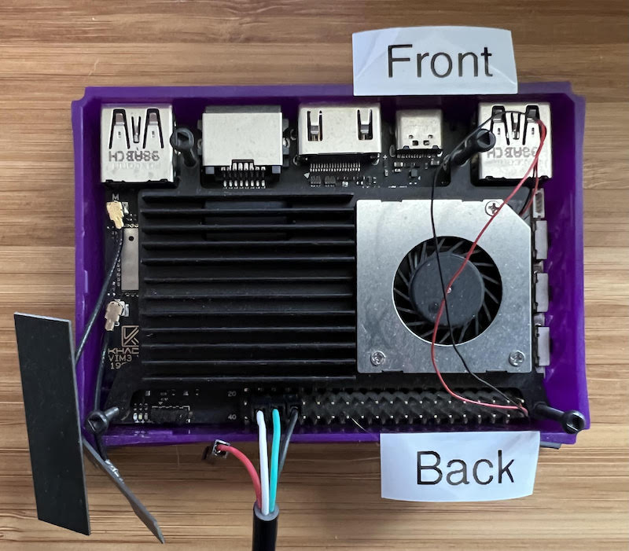

# Install Fuchsia on a Khadas VIM3 board

This document describes running Fuchsia on a Khadas VIM3 board.

The Khadas VIM3 board is the successor to the VIM2. For more information,
check out the [Khadas Docs](http://docs.khadas.com/){:.external} site.

## Feature support

Fuchsia currently supports these features of the VIM3:

* UART Serial Debugger
* Paving over ethernet and USB
* Storage (eMMC)
* HDMI Display and Framebuffer
* GPU (Mali) and Vulkan graphics
* Ethernet
* SDIO
* I2C
* GPIO
* Temperature Sensors and DVFS
* RTC
* Clock
* Fan
* NNA
* USB C in peripheral mode

These features are under development and may not be supported:

* Video decoder
* SPI
* Audio

The following features are not supported, but might be added by future
contributions:

* SPI Flash
* USB C in host mode
* USB A
* Power management and PMIC
* Wake on LAN
* UART BT

These features are not supported and are unlikely to be added:

* Video encoding (due to non-public firmware)
* Trusted Execution Environment / secure boot

When setting up your board, make sure you have at least a 24W power supply, as the VIM3
can draw that much power when DVFS is enabled.

## Board orientation

When describing the location of buttons, pins and other items on the board,
we will refer to the side with the USB, ethernet and HDMI connectors as the **front** of the board
and the opposite side the **back** of the board, as illustrated by this photo.



## Heat Sink

A heat sink is strongly recommended. A passive chip heat sink will allow you
to run 2 cores out of 8 at full speed before reaching 80C, the critical
temperature at which cores have to be throttled down.

## Setup

- USB C port: Connect to host. Provides power and `fastboot`.
- Ethernet: Connect cable directly to board (do not use a USB ethernet adapter).
- HDMI: Optional. Connects to display.
- Serial Console: Required for flashing the device. See next section.

## Serial Console

The debug UART for the serial console is exposed on the 40 pin header at the back of the board.
You may use a 3.3v  USB to serial cable to access the serial console.  Depending on your cable,
the colors will vary, so be sure you have a reference for which color maps to which pin.

The relevant pins on the front row of the header are:

- 2nd from left, pin 19: TX out from VIM3
- 3rd from left, pin 18: RX in to VIM3
- 4th from left, pin 17: Ground

Connect the TX out from your cable to the RX in on the VIM3, and the RX in on your cable
to the TX out from the VIM3.  If your cable has a VCC pin, you do not need to connect it,
but you do need the ground connection.

You can see these pins on the "GPIO Pinout" tab of [this page](https://docs.khadas.com/linux/vim3/Hardware.html#VIM3-Hardware-Info).

When connecting to the serial port, use (115200,8,N,1) as the settings.

## Buttons

When viewed from the front, the VIM3 has 3 buttons on the left side of the board. On the board schematic, SW1 (switch closest to the USB plug) is the reset switch. SW3 (farthest away from the USB plug on the schematic) can be used for entering flashing mode. If SW3 is held down while the board is reset or power cycled , the bootloader will enter flashing mode instead of booting the kernel normally.

## VIM3 Bootloader

Booting Fuchsia on the VIM3 requires a custom bootloader found at
`//prebuilt/third_party/firmware/vim3`. It can also be built from source at
https://third-party-mirror.googlesource.com/u-boot/, in the `vim3` branch.

To find out what version of the bootloader you have, grep for "zircon-bootloader"
in the kernel boot log. You should see something like: "cmdline: zircon-bootloader=0.12"

## First time steps

The first time flashing the device, you will need to unlock the flashing capability.  Boot the device by pressing the reset switch and you'll see logs in the serial console and hold.  Repeatedly press the space bar to get to the U-boot console prompt.
If you are already in Fuchsia, you can enter the u-boot console by repeatedly pressing "f".

Once you see the U-boot prompt (`kvim#`), type `fastboot` to launch fastboot.  You should then see:

```
USB RESET
SPEED ENUM

USB RESET
SPEED ENUM
```

This indicates that fastboot is running.

To unlock flashing, type the following fastboot commands on the host:

```
fastboot flashing unlock
fastboot flashing unlock_critical
```

Now you can flash the Fuchsia bootloader.  Assuming you named the bootloader
file `u-boot.bin.unsigned`, type the following commands:

```
fastboot flash bootloader u-boot.bin.unsigned
fastboot reboot
```

Now your board will reboot and use the new version of U-boot you just flashed.  You only need to do this step once.

## Building Fuchsia

Set your build configuration to the core vim3 product and build it:

```
fx set core.vim3
fx build
```

When the build is complete, you can flash the device (below).

## Flashing & Paving Fuchsia

First enter fastboot mode by holding down SW3 (leftmost button), pressing SW1 (rightmost button) quickly and keeping pressing SW3 for a few seconds. When the following shows up, the device is in fastboot mode:

```
USB RESET
SPEED ENUM

USB RESET
SPEED ENUM
```

Now you can flash & pave:

```
fx flash --pave
```

This flashes all of the zircon, zedboot, vbmeta and fvm images to your vim3 and provisions ssh key files on the device.
It is now ready to use and does not need to go through zedboot or paving.  (If you don't know what those are, don't worry!)

If `fx flash` asks for serial, you can find it with `fastboot devices`.

In order to get into zedboot you can reboot into the recovery:

```
dm reboot-recovery
```

### Paving

Paving is available from the "core" product and above. Run the following under the fuchsia directory:

```
fx set core.vim3 && fx build && fx pave -1
```

### Fuchsia logo

To update the boot splash screen to be the Fuchsia logo, do this in fastboot mode:

```
fastboot flash logo zircon/kernel/target/arm64/board/vim3/firmware/logo.img
```

## Troubleshooting

**Bootserver can't seem to talk to my zedboot instance on the Vim3.**

If you are using ethernet, make sure you have a DHCP server running on the other end.
If you are using USB CDC, comment out this line in the
[kernel command line build file](https://cs.opensource.google/fuchsia/fuchsia/+/main:boards/kernel_cmdline/BUILD.gn):

```
kernel_cmdline("vim3") {
  deps = [ ":pmm-checker-from-board" ]
  args = [
    # Prefer using the built-in NIC to the CDC-ether interface.
    {{'<strong>'}}"netsvc.interface=/dev/dwmac/dwmac/Designware-MAC/ethernet",{{'</strong>'}}
  ]
}
```

The `"netsvc.interface=/dev/dwmac/dwmac/Designware-MAC/ethernet"` command line argument causes the board to prefer using the built-in NIC, which is the default configuration for devices running in Fuchsia's build infrastructure.
