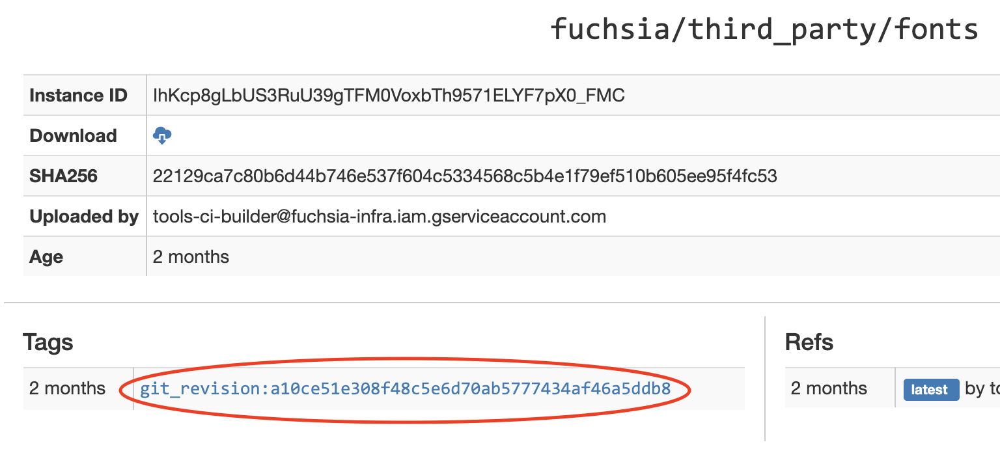

# Build configuration

There are three basic layers to the build configuration for fonts:

1.  [Common infrastructure and metadata](#common-infra)
1.  [Reusable font bundles and groups](#reusable)
1.  [Product-specific configurations](#product-specific)

## Background

The setup for getting a collection of fonts into a Fuchsia build is somewhat
tricky. This is because

*   Fuchsia's developer guidelines prefer to keep prebuilt binary files in CIPD,
    not in Git repos.
*   Fuchsia's font files come from a variety of sources.
*   On a running Fuchsia system, it's not sufficient to just offer clients a
    directory full of `.ttf` files.
    *   Font files are not fully self-describing; there is important metadata
        (such as names, aliases, and style properties) that must be obtained
        externally.
    *   Other pieces of metadata, such as the list of
        [code points](.#gloss-code-point) supported by a font, could be obtained
        at runtime from each font file, but it would be much more efficient to
        precompute them at build time.
    *   Client applications might not know exactly what font they are looking
        for; they might want to ask for a particular
        [generic font family](.#gloss-generic-font-family),
        [style](.#gloss-style), and language, but not actually have a specific
        font file in mind.
*   Font metadata is verbose, often repetitive, and error-prone to maintain. It
    is preferable to define this metadata just once for every common font
    available on Fuchsia, than to ask maintainers of product targets and
    individual components to manage their own copies.

## Common infrastructure and metadata {#common-infra}

The first layer establishes the catalogs of assets and metadata that are
available for use in Fuchsia product builds.

### Font data repo

The metadata and list of external sources for font files is maintained in a
_font data repo_. For Fuchsia's open-source fonts, this is found at
[`//fontdata`](https://fuchsia.googlesource.com/fontdata/).
<!-- TODO: Add fuchsia/fontdata to validProjects -->

Note: The `fontdata` repo is not part of Fuchsia's standard `jiri` checkout; for
editing, it must be checked out manually.

Whenever the contents of a font data repo change, Fuchsia's
[automated infrastructure](#recipe) automatically checks it out, fetches all of
the fonts files that the repo describes, and bundles them into a CIPD package
that is uploaded to Fuchsia's CIPD server.

A font data repo contains the following files:

#### `manifest.xml`

This is a
[Jiri manifest file](https://fuchsia.googlesource.com/jiri/+/HEAD/manifest.md).
In this case, it consists of a list of Git repos and revision IDs that contain
the desired font files.

Note: Due to a technical limitation, a Jiri manifest cannot currently include
external repos (e.g. on github.com) directly; repos must first be mirrored to
`fuchsia.googlesource.com/third_party/<repo-name>`.

Each imported repo is listed in a `<project>` element.

Sample entry:

<!--
TODO: Add fuchsia/fontdata to validProjects
```xml
{ % includecode gerrit_repo="fuchsia/fontdata" gerrit_path="manifest.xml" regexp="    <project[^>]*?noto-cjk[^>]*?/>" adjust_indentation="auto" % }
```
-->

```xml
<project
    name="github.com/googlefonts/noto-cjk"
    path="github.com/googlefonts/noto-cjk"
    remote="https://fuchsia.googlesource.com/third_party/github.com/googlefonts/noto-cjk"
    remotebranch="upstream/master"
    revision="be6c059ac1587e556e2412b27f5155c8eb3ddbe6"/>
```

*   `name`: arbitrary name (doesn't affect anything)
*   `path`: determines where the repo is checked out relative to the root
    _checkout directory_.
*   `remote`: Git URL of remote repo
*   `remotebranch`: Branch name in remote repo
*   `revision`: Git commit hash at which to pin the checkout

#### `contents.json` {#contents-json}

These are instructions for Fuchsia's infrastructure to copy files from the
_checkout directory_ into the _staging directory_. Each entry of `{destination,
files}` defines a top-level folder in the staging directory, and the list of
files that will be copied into it.

Sample entry:

<!--```json
TODO: Add fuchsia/fontdata to validProjects.
{ % includecode gerrit_repo="fuchsia/fontdata" gerrit_path="contents.json" regexp="\{\s+\"destination\": \"material\"[^}]*?\}" adjust_indentation="auto" % }
```-->

```json
{
    "destination": "material",
    "files": [
      "github.com/google/material-design-icons/iconfont/MaterialIcons-Regular.ttf",
      "github.com/google/material-design-icons/LICENSE"
    ]
}
```

#### `${catalog_name}.font_catalog.json` {#font-catalog-json}

The font catalog file is a human-written bundle of metadata for all of the font
families, assets, and typefaces in this font data repo.

For ease of editing, the JSON schema for `.font_catalog.json` files is available
at
[/src/fonts/tools/schemas/font_catalog.schema.json](/src/fonts/tools/schemas/font_catalog.schema.json).
The canonical schema is
[defined in Rust](/src/fonts/tools/manifest_generator/src/font_catalog.rs).

#### `packing_script.py` {#packing-script}

Fuchsia's infrastructure invokes this script after populating the _staging
directory_.

The script:

*   Copies all font and license files from the staging directory to the output
    directory.
*   Generates a [`${catalog_name}.font_pkgs.json`](#font-pkgs-json) file in the
    output directory.

The script generally does not need to be modified.

### Infrastructure recipe {#recipe}

As described above, an infrastructure recipe is automatically triggered whenever
the `fontdata` is modified. This recipe:

1.  Checks out the referenced repos using `jiri init` and `jiri update`.
1.  Stages the checked out files according to [`contents.json`](#contents-json).
1.  Invokes the [packing script](#packing-script) to write files to the output
    directory.
1.  Uploads the contents of the output directory to [CIPD](#cipd-package).

### CIPD package {#cipd-package}

The bundle of open-source fonts is uploaded to the
[`fuchsia/third_party/fonts` CIPD package](https://chrome-infra-packages.appspot.com/p/fuchsia/third_party/fonts/+/).

### Jiri prebuilts

The contents of the CIPD package make their way into a Fuchsia checkout via the
[`prebuilts` jiri manifest](https://fuchsia.googlesource.com/integration/+/HEAD/prebuilts):

<!--
TODO: Fix fuchsia/integration GoB permissions.
```xml
{ % includecode gerrit_repo="fuchsia/integration" gerrit_path="prebuilts" regexp="    <package name=.fuchsia/third_party/fonts..*/>" % }
```
-->

```xml
    <!--   Fonts -->
    <package name="fuchsia/third_party/fonts"
             version="git_revision:a10ce51e308f48c5e6d70ab5777434af46a5ddb8"
             path="prebuilt/third_party/fonts"/>
```

The `version` ID for the `fuchsia/third_party/fonts` package can be obtained
from the "Tags" on latest instance on the
[CIPD package page](https://chrome-infra-packages.appspot.com/p/fuchsia/third_party/fonts/+/).



### Global GN arguments

[`//src/fonts/build/font_args.gni`](/src/fonts/build/font_args.gni) declares
several font-related build arguments. The two most important ones are

*   `font_catalog_paths`: The locations of all
    [`.font_catalog.json`](#font-catalog-json) files.
*   `font_pkgs_paths`: The locations of all [`.font_pkgs.json`](#font-pkgs-json)
    files.

#### `*.font_pkgs.json` files {#font-pkgs-json}

These files are designed to be parseable by GN's simple JSON parser,
[`read_file`](https://gn.googlesource.com/gn/+/HEAD/docs/reference.md#func_read_file).
They contain a list of entries of the form

```json
    {
      "file_name": "AlphaSans-Regular.ttf",
      "safe_name": "alphasans-regular-ttf",
      "path_prefix": "alpha"
    },
```

*   `file_name`: The name of a font file asset file. This is the canonical
    identifier for every font asset, and hence the key in this lookup table.
*   `safe_name`: A transformed version of the file name: converted to lowercase,
    with all special characters replaced with hyphens. This can be used to name
    Fuchsia packages.
*   `path_prefix`: Location of the asset's parent directory, relative to
    `//prebuilt/third_party/fonts`.

In [`//src/fonts/build/fonts.gni`](/src/fonts/build/fonts.gni), the contents of
the `.font_pkgs.json` files are merged into a single GN scope that can be used
as a lookup table.

### Font packages {#font-packages}

In addition to providing font assets directly to Font Provider's namespace,
there is also the option of creating single-font Fuchsia packages. This is
exactly what it sounds like: a `package` containing just a single font in its
`resources` and nothing else.

This can be used for ephemeral font delivery, in conjunction with
`fuchsia.pkg.FontResolver`. (TODO: Link to more docs.)

Note: Ephemeral packages are currently disabled in production builds.

All possible font packages are predeclared in
[`//src/fonts/packages/BUILD.gn`](/src/fonts/packages/BUILD.gn).

*   Each package name is of the form `font-package-<font-safe-name>` (see
    [`safe_name`](#font-pkgs-json) above), e.g.
    `font-package-roboto-regular-ttf`.
*   The GN target for a package is therefore
    `//src/fonts/packages:<package-name>`, e.g.
    `//src/fonts/packages:font-package-roboto-regular.ttf`.
*   Each package's URL is of the form
    `fuchsia-pkg://fuchsia.com/<package-name>`, e.g.
    `fuchsia-pkg://fuchsia.com/font-package-roboto-regular-ttf`.

## Reusable font bundles and groups {#reusable}

The second layer is optional; it is mainly intended to save some repetition.
Instead of having to refer to font assets and packages individually, reusable
groups are declared in
[`//src/fonts/groups/BUILD.gn`](/src/fonts/groups/BUILD.gn).

### `local_font_bundle` {#local_font_bundle}

_Defined in [fonts.gni](/src/fonts/build/fonts.gni)_

A local font bundle is a set of font assets that are placed directly into the
Font Provider's namespace using
[build-time configuration data](/development/components/data.md)
(`config_data()`).

Most local font bundles are declared in
[`//src/fonts/collections/BUILD.gn`](/src/fonts/collections/BUILD.gn).

Example:

```gn
```gn

```

### `font_package_group` {#font_package_group}

_Defined in [fonts.gni](/src/fonts/build/fonts.gni)_

When referring to multiple font packages, the GN template `font_package_group`
obviates the need to derive or look up fonts assets' package names. Just list
the names of the assets, as in this example in
[`//src/fonts/groups/BUILD.gn`](/src/fonts/groups/BUILD.gn):

```gn

```

The target `//src/fonts/groups:roboto-slab` contains a `group` of all of the
`package`s corresponding to the listed asset names.

## Product-specific font configurations {#product-specific}

Finally, every
[product target](/development/build/build_system/boards_and_products.md#products)
that uses fonts needs to be configured with the specific font assets and
metadata that it will include.

### Font product config files {#product-config}

A `.fontcfg.json` (or `.fontcfg.json5`) file contains a human-written set of
product-specific font settings. There is a
[JSON schema](/src/fonts/tools/schemas/fontcfg.schema.json) available for a
better editor experience.

Currently, the main purpose of this file is to define a specific font fallback
chain, i.e. a preferred sequence of typefaces to use when an exact match for the
client's typeface request is not available.

Here is a basic example of a fallback chain from
[`//src/fonts/collections/open-fonts-collection.fontcfg.json5`](/src/fonts/collections/open-fonts-collection.fontcfg.json5):

```js

```

If an asset file contains multiple typefaces, a single typeface can be
referenced by using a JSON object instead of just the file name:

```js
fallback_chain: [
    "SomeCompleteFont-Bold.ttf",
    { file_name: "NotoSansCJK-Regular.ttc", index: 1},
]
```

The fallback chain is defined manually. Some guidelines to follow:

-   Include at least one font for every supported script. (The set of supported
    scripts varies by product.)
-   Try to cover at least the `sans-serif`, `serif`, and `monospace` font
    families.
-   When there is overlapping coverage, put more specific assets higher in the
    list. For example, all of the _Noto Sans_ script-specific fonts have glyphs
    for the ASCII range, but the Noto Sans Latin variant should go first.
-   When there is overlapping coverage, put smaller font files higher in the
    list. This reduces UI jank when loading fallback fonts.

### `font_collection` {#font_collection}

_Defined in [fonts.gni](/src/fonts/build/fonts.gni)_

After any needed `local_font_bundle`s, font `packages`, and/or
`font_package_group`s have been declared, they are assembled into a
`font_collection`.

#### Inputs {#font_collection-inputs}

(See fonts.gni for complete documentation.)

*   `font_packages`: GN labels of font `package`s and/or `font_package_group`s
    that are in `universe_package_labels` for the target product.
*   `local_font_bundles`: GN labels of `local_font_bundle`s (or `group`s
    thereof) for the target product. These will be included in the font
    provider's config data.
*   `local_asset_names`: List of local font asset names (creates an ad-hoc
    `local_font_bundle`).
*   `product_config_path`: Path to a JSON file containing
    [product-specific font configuration](#product-config), including a fallback
    chain.
*   `manifest_prefix`: A prefix for the generated font manifest file name.
    Defaults to `"all"`.

#### Internals

A `font_collection` traverses the transitive closure all of the font assets,
packages, and groups that it contains. It collects their
[GN metadata](https://gn.googlesource.com/gn/+/HEAD/docs/reference.md#var_metadata)
to build lists of fonts that map to font packages in local
files.

The template passes this information to the font manifest generator
([GN template](/src/fonts/build/font_manifest.gni),
[Rust source](/src/fonts/tools/manifest_generator)), along with the paths of the
[font catalogs](#font-catalog-json) and of all of the font assets.

The manifest generator selects from the font catalogs the predefined metadata
for the font files that are included in the `font_collection`. It also reads
every included font file and extracts the list of
[code points](.#gloss-code-points) (character set) that each font file supports.

All of this data is assembled into a single `.font_manifest.json` file that
supplied to the font provider service using a `config_data` rule.

#### Outputs {#:font_collection-outputs}

A `font_collection` produces the following artifacts:

*   `<manifest-prefix>.font_manifest.json`: This is the assembly of metadata
    described above. It is supplied to the font provider service using a
    `config_data` rule.
*   `font_packages.json`. This file lists all included single-font Fuchsia
    packages and is provided to `pkg-resolver` using a `config_data` rule. This
    determines the font packages exposed through `fuchsia.pkg.FontResolver`.

The GN target created by `font_collection` contains the `config_data` for the
two JSON files above, as well as config_data targets for the local font assets.

If a product only uses _local_ fonts, it is sufficient to add the
`font_collection` target to the product's dependency labels (usually to
[`base_package_labels`](/gen/build_arguments.md#base_package_labels)).

If a product also uses font `package`s and/or `font_package_group`s, those
targets must be added explicitly to either
[`base_package_labels`](/gen/build_arguments.md#base_package_labels) or
[`universe_package_labels`](/gen/build_arguments.md#universe_package_labels),
depending on whether the packages are meant to be ephemeral.
