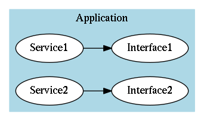

# FIDL tutorial

_Audience: Beginning FIDL developers._

_Prerequisites: At least beginner skills in C++ or Dart._

_Maintained by: jimbe@google.com, shayba@google.com_

[TOC]

## About this tutorial

This tutorial describes how to make calls in C++ and Dart using the FIDL
interprocess communication (IPC) system in Fuchsia. FIDL stands for "Fuchsia
Interface Definition Language", but the word "FIDL" is commonly used to refer to
the infrastructure required to make these calls, including the FIDL language,
compiler and the generated bindings.

The Fuchsia operating system has no innate knowledge of FIDL. The FIDL bindings
use a standard channel communication mechanism in Fuchsia. The FIDL bindings and
libraries enforce a set of semantic behavior and persistence formats on how that
channel is used.

For details on the design and implementation of FIDL, see
[zircon/docs/fidl/](https://fuchsia.googlesource.com/docs/+/master/development/languages/fidl/README.md)

## Getting and building the FIDL source code

See the [instructions for getting and building Fuchsia](/getting_started.md).

Most examples we will use for this tutorial are located in Garnet at:
[https://fuchsia.googlesource.com/garnet/+/master/examples/fidl/](https://fuchsia.googlesource.com/garnet/+/master/examples/fidl/)

Dart examples are in Topaz at:
[https://fuchsia.googlesource.com/topaz/+/master/examples/fidl/](https://fuchsia.googlesource.com/topaz/+/master/examples/fidl/)

While you're reading on, warm up your build:

```sh
# You'll need Topaz for Dart later
fx set-petal topaz
# Also include garnet examples when building Topaz
fx set x64 --packages topaz/packages/default,garnet/packages/examples/fidl
fx full-build
```

Alternatively if you're not interested in Dart:

```sh
fx set-petal garnet
fx full-build
```

## FIDL architecture

FIDL is organized like so:

A FIDL **Component** is software that's designed to work with FIDL interfaces.
The primary thread in a FIDL component usually has a run loop to dispatch
calls and may have additional threads with run loops.

A component is called through its **Interface(s)**. Interfaces are reusable
and can be vended by multiple components. An interface is defined with the
Fuchsia Interface Definition Language (IDL). The classes that bind an interface
to a language are generated by the FIDL compiler.

A **Service** is your implementation of an interface. Therefore, within a
particular FIDL component, there is one service per interface. In the FIDL
client library, you will see calls like `AddPublicService()` or
`ConnectToService()`.



A
**[Channel](https://fuchsia.googlesource.com/zircon/+/master/docs/objects/channel.md)**
is an [operating system construct for IPC (InterProcess
Communication)](https://fuchsia.googlesource.com/zircon/+/master/docs/concepts.md#message-passing_sockets-and-channels),
although it works equally well between processes, threads, or even within a
thread. FIDL uses channels to communicate between components.

A **Connection** refers to the construction of the initial channel between two
components.

The word **Client** is used in this document to refer to a FIDL component that
connects to a **Server** component. The difference between client and server
is an artificial distinction for this tutorial. A FIDL component you write can
be a client, a server, or both, or many.

## Hello World "Echo" interface

We'll start with a C++ echo service that echoes its input and prints "hello
world".

Open
[garnet/examples/fidl/services/echo2.fidl](https://fuchsia.googlesource.com/garnet/+/master/examples/fidl/services/echo2.fidl).
A .fidl file defines the interfaces and related data structures that a FIDL
components vends (makes available to other FIDL components). An interface
can be used in any language supported by FIDL, which allows you to easily make
calls across languages.

<!-- NOTE: the code snippets here need to be kept up to date manually by
     copy-pasting from the actual source code. Please update a snippet
     if you notice it's out of date. -->

The example file `echo2.fidl`, with line numbers added, looks like this:

```
1. library fidl.examples.echo;
2. [Discoverable]
3. interface Echo {
4.   1: EchoString(string? value) -> (string? response);
5. };
```

Let's go through it line by line.

**Line 1:** The library definition is used to define the namespace. FIDL
interfaces in different libraries can have the same name.

**Line 2:** The `Discoverable` attribute automatically generates a name that
clients can use to discover and connect to the service.

**Line 3:** The name of the interface.

**Line 4:** The method name. There are three unusual aspects of this line:

*   Note the `1:` before the method name. This is a **sequence number**, and is
    used to ensure backwards compatibility when there are multiple versions of
    the same interface. All methods must have a unique sequence number.
*   Note the `string?` declarations with a question mark. The question mark
    means that these parameters may be null.
*   The return type comes after the method declaration, not before. Unlike C++
    or Java, a method can return multiple values.

### Generated files

When you [build the tree](#getting-and-building-the-fidl-source-code), the FIDL
compiler is run automatically. It writes the glue code that allows the
interfaces to be used from different languages. Below are the implementation
files created for C++, assuming that your build flavor is `x64`.

```
./out/x64/fidling/gen/fidl/examples/echo/cpp/fidl.cc
./out/x64/fidling/gen/fidl/examples/echo/cpp/fidl.h
```

Generated files for C++ will follow the same pattern.
For other languages, the tools may employ strategies that are more suitable for
these languages.

## `Echo` server in C++

Let's take a look at the server implementation in C++:

[garnet/examples/fidl/echo2_server_cpp/](https://fuchsia.googlesource.com/garnet/+/master/examples/fidl/echo2_server_cpp/)

Find the implementation of the main function, and that of the `Echo` interface.

To understand how the code works, here's a summary of what happens in the server
to execute an IPC call.

1.  Fuchsia loads the server executable, and your `main()` function starts.
1.  `main` creates an `EchoServerApp` object which will bind to the service
    interface when it is constructed.
1.  `EchoServerApp()` registers itself with the `StartupContext` by calling
    `context->outgoing().AddPublicService<Echo>()`. It passes a lambda function
    that is called when a connection request arrives.
1.  Now `main` starts the run loop, expressed as an `async::Loop`.
1.  The run loop receives a request to connect from another component, so
    calls the lambda created in `EchoServerApp()`.
1.  That lambda binds the `EchoServerApp` instance to the request channel.
1.  The run loop receives a call to `EchoString()` from the channel and
    dispatches it to the object bound in the last step.
1.  `EchoString()` issues an async call back to the client using
    `callback(value)`, then returns to the run loop.

Let's go through the details of how this works.

### File headers

First the namespace definition. This matches the namespace defined in the FIDL
file in its "library" declaration, but that's incidental:

```cpp
namespace echo2 {
```

Here are the #include files used in the server implementation:

```cpp
#include <fuchsia/cpp/echo2.h>
#include <lib/async-loop/cpp/loop.h>
#include <lib/zx/channel.h>

#include "lib/app/cpp/startup_context.h"
```

-   `echo2.h` contains the generated C++ definition of our `Echo` FIDL
    interface.
-   `startup_context.h` is used by `EchoServerApp` to expose service
    implementations.

### main

Most `main()` functions for FIDL components look very similar. They create a
run loop using `async::Loop` or some other construct, and bind service
implementations. The `Loop.Run()` function enters the message loop to process
requests that arrive over channels.

Eventually, another FIDL component will attempt to connect to our component.

### The `EchoServerApp()` constructor

Before going further, a quick review from the [FIDL
Architecture](#fidl-architecture) section. A connection is defined as the
_first_ channel with another component. Any additional channels are not
"connections". Therefore, service registration is performed before the run loop
begins and before the first connection is made.

Here's what the `EchoServerApp` constructor looks like:

```cpp
EchoServerApp()
    : context_(fuchsia::sys::StartupContext::CreateFromStartupInfo()) {
  context_->outgoing().AddPublicService<Echo>(
      [this](fidl::InterfaceRequest<Echo> request) {
        bindings_.AddBinding(this, std::move(request));
      });
```

The function calls `AddPublicService` once for each service it makes available
to the other component (remember that each service exposes a single
interface). The information is cached by `StartupContext` and used to decide
which `Interface` factory to use for additional incoming channels. A new
channel is created every time someone calls `ConnectToService()` on the other
end.

If you read the code carefully, you'll see that the parameter to
`AddPublicService` is actually a lambda function that captures `this`. This
means that the lambda function won't be executed until a channel tries to bind
to the interface, at which point the object is bound to the channel and will
receive calls from other components. Note that these calls have
thread-affinity, so calls will only be made from the same thread.

The function passed to `AddPublicService` can be implemented in different ways.
The one in `EchoServerApp` uses the same object for all channels. That's a good
choice for this case because the implementation is stateless. Other, more
complex implementations could create a different object for each channel or
perhaps re-use the objects in some sort of caching scheme.

Connections are always point to point. There are no multicast connections.

### The `EchoString()` function

Finally we reach the end of our server discussion. When the message loop
receives a message in the channel to call the `EchoString()` function in the
`Echo` interface, it will be directed to the implementation below:

```cpp
void EchoString(fidl::StringPtr value, EchoStringCallback callback) override {
  printf("EchoString: %s\n", value->data());
  callback(std::move(value));
}
```

Here's what's interesting about this code:

-   The first parameter to `EchoString()` is a `fidl::StringPtr`. As the name
    suggests, a `fidl::StringPtr` can be null. Strings in FIDL are supposed to
    be UTF-8, but this is not enforced by the FIDL client library.
-   The `EchoString()` function returns void because FIDL calls are
    asynchronous. Any value we might otherwise return wouldn't have anywhere to
    go.
-   The last parameter to `EchoString()` is the client's callback function. In
    this case, the callback takes a `fidl::StringPtr`.
-   `EchoServerApp::EchoString()` returns its response to the client by calling
    the callback. The callback invocation is also asynchronous, so the call
    often returns before the callback is run in the client.
-   Because the callback is async, the callback also returns void.

Any call to an interface in FIDL is asynchronous. This is a big shift if you are
used to a procedural world where function calls return after the work is
complete. Because it's async, there's no guarantee that the call will ever
actually happen, so your callback may never be called. The remote FIDL
component might close, crash, be busy, etc.

## `Echo` client in C++

Let's take a look at the client implementation in C++:

[garnet/examples/fidl/echo2_client_cpp/](https://fuchsia.googlesource.com/garnet/+/master/examples/fidl/echo2_client_cpp/)

The structure of the client is similar to that of the server, with a `main`
function and an `async::Loop`. The difference is that the client immediately
kicks off work once everything is initialized. In contrast, the server does no
work until a connection is accepted.

**Note:** a component can be a client, a server, or both, or many. The
distinction in this example between Client and Server is purely for
demonstration purposes.

Here is the summary of how the client makes a connection to the echo service.

1.  The shell loads the client executable and calls `main`.
1.  `main()` creates an `EchoClientApp` object to handle connecting to the
    server, calls `Start()` to initiate the connection, and then starts the
    message loop.
1.  In `Start()`, the client calls `context_->launcher()->CreateComponent`
    with the url to the server component. If the server component is not
    already running, it will be created at this point.
1.  Next, the client calls `ConnectToService()` to open a channel to the server
    component.
1.  `main` calls into `echo_->EchoString(...)` and passes the callback. Because
    FIDL IPC calls are async, `EchoString()` will probably return before the
    server processes the call.
1.  `main` then blocks on a response on the interface.
1.  Eventually, the response arrives, and the callback is called with the
    result.

### main

main() in the client is very different from the server, as it's synchronous on
the server response.

```cpp
int main(int argc, const char** argv) {
  std::string server_url = "fuchsia-pkg://fuchsia.com/echo2_server_cpp#meta/echo2_server_cpp.cmx";
  std::string msg = "hello world";
  for (int i = 1; i < argc - 1; ++i) {
    if (!strcmp("--server", argv[i])) {
      server_url = argv[++i];
    } else if (!strcmp("-m", argv[i])) {
      msg = argv[++i];
    }
  }
  async::Loop loop(&kAsyncLoopConfigMakeDefault);
  echo2::EchoClientApp app;
  app.Start(server_url);
  app.echo()->EchoString(msg, [&loop](fidl::StringPtr value) {
    printf("***** Response: %s\n", value->data());
    loop.Quit();
  });
  return loop.Run();
}
```

### Start

`Start()` is responsible for connecting to the remote `Echo` service.

```cpp
void Start(std::string server_url) {
  fuchsia::sys::LaunchInfo launch_info;
  launch_info.url = server_url;
  launch_info.directory_request = echo_provider_.NewRequest();
  context_->launcher()->CreateComponent(std::move(launch_info),
                                          controller_.NewRequest());
  echo_provider_.ConnectToService(echo_.NewRequest().TakeChannel(),
                                  Echo::Name_);
}
```

First, `Start()` calls `CreateComponent()` to launch `echo_server`. Then, it
calls `ConnectToService()` to bind to the server's `Echo` interface. The exact
mechanism is somewhat hidden, but the particular interface is automatically
inferred from the type of `EchoPtr`, which is a typedef for
`fidl::InterfacePtr<Echo>`.

The second parameter to `ConnectToService()` is the service name.

Next the client calls `EchoString()` in the returned interface. FIDL interfaces
are asynchronous, so the call itself does not wait for `EchoString()` to
complete remotely before returning. `EchoString()` returns void because of the
async behavior.

Since the client has nothing to do until the server response arrives, and is
done working immediately after, `main()` then blocks using `loop.Run()`,
then exits. When the response will arrive, then the callback given to
`EchoString()`, will execute first, then `Run()` will return,
allowing `main()` to return and the program to terminate.

### Run the sample

You can run the Hello World example like this:

```sh
$ run fuchsia-pkg://fuchsia.com/echo2_client_cpp#meta/echo2_client_cpp.cmx
```

You do not need to specifically run the server because the call to
`CreateComponent()` in the client will automatically launch the server.

## `Echo` server in Rust

The echo server implementation in Rust can be found at:
[garnet/examples/fidl/echo2_server_rust/src/main.rs](https://fuchsia.googlesource.com/garnet/+/master/examples/fidl/echo2_server_rust/src/main.rs)

This file has two functions: `main()`, and `spawn_echo_server`:

-   The `main()` function creates an asynchronous task executor
    and a `ServicesServer` and runs the `ServicesServer` to completion on
    the executor.
-   `spawn_echo_server` spawns a new asynchronous task which will handle
    incoming echo service requests.

To understand how the code works, here's a summary of what happens in the server
to execute an IPC call. We will dig into what each of these lines means, so it's
not necessary to understand all of this before you move on.

1.  **Services Server:** The `ServicesServer` is the main top-level future
    being run on the executor. It binds itself to the startup handle of the
    current process and listens for incoming service requests.
1.  **Service Request:** When another component needs to access an "Echo"
    server, it sends a request to the `ServicesServer` containing the name of
    the service to connect to ("Echo") and a channel to connect.
1.  **Service Lookup:** The incoming service request wakes up the
    `async::Executor` executor and tells it that the `ServicesServer` task
    can now make progress and should be run. The `ServicesServer` wakes up,
    sees the request available on the startup handle of the process, and looks
    up the name of the requested service in the list of
    `(service_name, service_startup_func)` provided through calls to
    `add_service`. If a matching `service_name` exists, it calls
    `service_startup_func` with the channel to connect to the new service.
1.  **Server Creation:**  At this point in our example,
    `|chan| spawn_echo_server(chan)` is called with the channel that wants to
    be connected to an `Echo` service. `spawn_echo_server` creates a new
    future which loops over each value in the incoming stream of requests.
    It spawns that future to be run on the thread-local `async::Executor`.
1.  **API Request:** An `echo_string` request is sent on the channel.
    This makes the channel the `Echo` service is running on readable, which
    wakes up the asynchronous task spawned in `spawn_echo_server`. The task
    reads the request off of the channel and yields a value from the
    `try_next()` future.
1.  **API Response:** Upon receiving a request, the task sends a response
    back to the client with `responder.send`.

Now let's go through the code and see how this works.

### File headers

Here are the import declarations in the Rust server implementation:

```rust
use failure::{Error, ResultExt};
use fidl::endpoints2::{ServiceMarker, RequestStream};
use fidl_fidl_examples_echo::{EchoMarker, EchoRequest, EchoRequestStream};
use fuchsia_app::server::ServicesServer;
use fuchsia_async as fasync;
use futures::prelude::*;
```
-   `failure` provides conveniences for error handling, including a standard
    dynamically-dispatched `Error` type as well as a extension trait that adds
    the `context` method to `Result` for providing extra information about
    where the error occurred.
-   `fidl::endpoints2::ServiceMarker` is the trait implemented by `XXXMarker`
    types. It provides the associated string `NAME`.
-   `fidl_fidl_examples_echo` contains bindings for the `Echo` interface.
    This file is generated from the interface defined in `echo2.fidl`.
    These bindings include:
    -   The `EchoMarker` type, a [zero-sized type] used to hold compile-time
        metadata about the `Echo` service (such as `NAME`)
    -   The `EchoRequest` type, an enum over all of the different request types
        that can be received.
    -   The `EchoRequestStream` type, a [`Stream`] of incoming requests for the
        server to handle.
-   `ServicesServer` links service requests to service launcher functions.
-   `fuchsia_async`, often aliased to the abbreviated `fasync`, is the runtime
    library for running asynchronous tasks on Fuchsia. It also provides
    asynchronous bindings to a number of Fuchsia primitives, such as channels,
    sockets, and TCP/UDP.
-   `futures` is a crate for working with asynchronous tasks. These tasks are
    composed of asynchronous units of work that may produce a single value
    (a `Future`) or many values (a `Stream`). Futures can be `await!`ed inside
    an `async` function or block, which will cause the current task to be
    suspended until the future is able to make more progress.
    For more about futures, see [the crate's documentation][docs].
    To understand more about how futures
    are structured internally, see [this post][Tokio internals] on how futures
    connect to system waiting primitives like `epoll` and Fuchsia's ports.
    Note that Fuchsia does not use Tokio, but employs a very similar strategy
    for managing asynchronous tasks.

[docs]: https://rust-lang-nursery.github.io/futures-api-docs/0.3.0-alpha.5/futures/
[`Stream`]: https://docs.rs/futures/0.2.0/futures/stream/trait.Stream.html
[Tokio internals]: https://cafbit.com/post/tokio_internals/
[zero-sized type]: https://doc.rust-lang.org/nomicon/exotic-sizes.html#zero-sized-types-zsts

### `fn main`

Everything starts with main():

```rust
fn main() -> Result<(), Error> {
    let mut executor = fasync::Executor::new().context("Error creating executor")?;
    let quiet = env::args().any(|arg| arg == "-q");

    let fut = ServicesServer::new()
                .add_service((EchoMarker::NAME, move |chan| spawn_echo_server(chan, quiet)))
                .start()
                .context("Error starting echo services server")?;

    executor.run_singlethreaded(fut).context("failed to execute echo future")?;
    Ok(())
}
```

`main` creates an asynchronous task executor and a `ServicesServer` and runs the
`ServicesServer` to completion on the executor. You may notice that `main`
returns a `Result` type: if an `Error` is returned from `main` as a result of
one of the `?` lines, the error will be `Debug` printed and the program will
return with a status code indicating failure. Functions that return `Result`,
such as `async::Executor::new()`, can have extra information appended to their
error message via the `context` function provided by `failure::ResultExt`.

The `ServicesServer` represents a collection of services that can be provided.
`add_service` takes a tuple of `service_name` and `service_start_fn`. We pass
it the name of our `Echo` service, `EchoMarker::NAME`, and a function which
takes a channel and spawns the echo server onto that channel. We then attempt
to `start` the `ServicesServer`, which binds it to the startup handle of the
current component. If that binding fails, the
"Error starting echo services server" occurs. Otherwise, we get back a `Future`
which, when run on the executor, will process and delegate incoming service
requests until a protocol error occurs or the startup handle is closed.

### `fn spawn_echo_server`

```rust
fn spawn_echo_server(chan: fasync::Channel, quiet: bool) {
    fasync::spawn(async move {
        let mut stream = EchoRequestStream::from_channel(chan);
        while let Some(EchoRequest::EchoString { value, responder }) =
            await!(stream.try_next()).context("error running echo server")?
        {
            if !quiet {
                println!("Received echo request for string {:?}", value);
            }
            responder.send(value.as_ref().map(|s| &**s)).context("error sending response")?;
            if !quiet {
                println!("echo response sent successfully");
            }
        }
        Ok(())
    }.unwrap_or_else(|e: failure::Error| eprintln!("{:?}", e)));
}
```

When a request for an echo service is received, `spawn_echo_server` is called
with the channel to host the `Echo` service on. The channel that will contain
incoming requests is turned into an `EchoRequestStream`, an asynchronous
stream of `EchoRequest`s.

We use `async move { ... }` to create an asynchronous block, and spawn that
asynchronous task onto the local executor using `fasync::spawn`.

The `.try_next()` function will return a future which yields a value of type
`Result<Option<EchoRequest>, fidl::Error>`. We `await!` the future, causing
the current task to yield if no request is yet available. When a value
becomes available, `await!` returns the result. We apply a `context("...")`
to give some information about the error that may have occurred, and use
`?` to return early in the error case. If no request is available, this
expression will result in `None`, the `while` loop will exit, and we return
`Ok`.

When a request is received, we
use pattern-matching to extract the contents of the `EchoString` variant
of the `EchoRequest` enum. For an interface with more than one type of request,
we would instead write `|x| match x { MyServiceRequest::Req1 { ... } => ... }`.
In our case, we receive `value`, an optional string, and `responder`, a control
handle with a `send` method for sending a response.
We log the request using `println!`, and
then do a bit of complicated-looking nonsense. :)
The `as_ref().map(|s| &**s)` trick isn't related to FIDL, but is a specific
issue with converting `Option<String>` into `Option<&str>`. If you're not
interested in the details of this conversion, feel free to skip the following
paragraph.

`s` is an `Option<String>`, but our `send` method takes back an
`Option<&str>` to allow sending back non-heap-allocated strings. To convert between
the two, we use `.as_ref()` to go from `Option<String>` to `Option<&String>`,
and then `.map(|s| &**s)` to get `Option<&str>` using the `Deref<Target=str>`
implementation for `String`. The first `*` goes from `&String` to `String`,
the next goes from `String` to `str`, and the last goes from `str` to `&str`.
You might well ask why we used `as_ref` at all, since we immediately dereference
the resulting `&String`. This necessary in order to make sure that we're still
borrowing from the initial `Option<String>` value. `Option::map` takes `self`
by value and so consumes its input, but we want to instead create a *reference*
to its input.

Once we've done the conversion from `Option<String>` to `Option<&str>`, we call
`send`, which returns a `Result<(), Error>` which we use `?` on to return an
error on failure.

Finally, we call `.unwrap_or_else(|e| ...)` on our `async move { ... }` block
to handle the case in which an error occurred.

## `Echo` client in Rust

The echo client implementation in Rust can be found at:

[garnet/examples/fidl/echo2_client_rust/src/main.rs](https://fuchsia.googlesource.com/garnet/+/master/examples/fidl/echo2_client_rust/src/main.rs)

Our simple client does everything in `main()`.

**Note:** a component can be a client, a service, or both, or many. The
distinction in this example between Client and Server is purely for
demonstration purposes.

Here is the summary of how the client makes a connection to the echo service.

1.  **Launch:** The server component is specified, and we request for it to
    be launched if it wasn't already. Note that this step isn't included in
    most production FIDL-using components: generally you're connecting with
    an already-running server component.
1.  **Connect:** We call `connect_to_service` on the launched server
    component and get back a proxy with methods for making IPC calls to
    the remote server.
1.  **Call:** We call the `echo_string` method with the desired value to
    echo, get back a `Future` of the response, and `map` the future so that
    the response will be logged once it is received.
1.  **Run:** We run the future to completion on an asynchronous task executor.

```rust
fn main() -> Result<(), Error> {
    let mut executor = async::Executor::new().context("Error creating executor")?;

    #[derive(StructOpt, Debug)]
    #[structopt(name = "echo_client_rust")]
    struct Opt {
        #[structopt(long = "server", help = "URL of echo server",
                    default_value = "fuchsia-pkg://fuchsia.com/echo2_server_rust#meta/echo2_server_rust.cmx")]
        server_url: String,
    }

    // Launch the server and connect to the echo service.
    let Opt { server_url } = Opt::from_args();

    let launcher = Launcher::new().context("Failed to open launcher service")?;
    let app = launcher.launch(server_url, None)
                      .context("Failed to launch echo service")?;

    let echo = app.connect_to_service(EchoMarker)
       .context("Failed to connect to echo service")?;

    let fut = async {
        let res = await!(echo.echo_string(Some("hello world!")))?;
        println!("response: {:?}", res);
        Ok(())
    };

    executor.run_singlethreaded(fut)
}
```

### Run the sample

You can run the echo example like this:

```sh
$ run fuchsia-pkg://fuchsia.com/echo2_client_rust#meta/echo2_client_rust.cmx
```

## `Echo` server in Dart

The echo server implementation in Dart can be found at:
[topaz/examples/fidl/echo_server_dart/lib/main.dart](https://fuchsia.googlesource.com/topaz/+/master/examples/fidl/echo_server_dart/lib/main.dart)

This file implements the `main()` function and the `EchoImpl` class:

-   The `main()` function is executed when the component is loaded. `main()`
    registers the availability of the service with incoming connections from
    FIDL.
-   `EchoImpl` processes requests on the `Echo` interface. A new object is
    created for each channel.

To understand how the code works, here's a summary of what happens in the server
to execute an IPC call. We will dig into what each of these lines means, so it's
not necessary to understand all of this before you move on.

1.  **Startup.** The FIDL Shell loads the Dart runner, which starts the VM,
    loads `main.dart`, and calls `main()`.
1.  **Registration** `main()` registers `EchoImpl` to bind itself to incoming
    requests on the `Echo` interface. `main()` returns, but the program doesn't
    exit, because an [event
    loop](https://webdev.dartlang.org/articles/performance/event-loop) to handle
    incoming requests is running.
1.  **Service request.** The `Echo` server package receives a request to bind
    `Echo` service to a new channel, so it calls the `bind()` function passed in
    the previous step.
1.  **Service request.** `bind()` uses the `EchoImpl` instance.
1.  **API request.** The `Echo` server package receives a call to `echoString()`
    from the channel and dispatches it to `echoString()` in the `EchoImpl`
    object instance bound in the last step.
1.  **API request.** `echoString()` calls the given `callback()` function to
    return the response.

Now let's go through the details of how this works.

### File headers

Here are the import declarations in the Dart server implementation:

```dart
import 'package:fidl/fidl.dart';
import 'package:fuchsia.fidl.echo2/echo2.dart';
import 'package:lib.app.dart/app.dart';
```

-   `fidl.dart` exposes the FIDL runtime library for Dart. Our program needs it
    for `InterfaceRequest`.
-   `app.dart` is required for `StartupContext`, which is where we register
    our service.
-   `echo2.dart` contains bindings for the `Echo` interface.This file is
    generated from the interface defined in `echo2.fidl`.

### main()

Everything starts with main():

```dart
void main(List<String> args) {
  _context = new StartupContext.fromStartupInfo();
  _echo = new _EchoImpl();
  _context.outgoingServices.addServiceForName<Echo>(_echo.bind, Echo.$serviceName);
}
```

`main()` is called by the Dart VM when your service is loaded, similar to
`main()` in a C or C++ component. It binds an instance of `EchoImpl`, our
implementation of the `Echo` interface, to the name of the `Echo` service.

Eventually, another FIDL component will attempt to connect to our component.

### The `bind()` function

Here's what it looks like:

```dart
void bind(InterfaceRequest<Echo> request) {
  _binding.bind(this, request);
}
```

The `bind()` function is called when the first channel is received from another
component. This function binds once for each service it makes available to the
other component (remember that each service exposes a single interface). The
information is cached in a data structure owned by the FIDL runtime, and used to
create objects to be the endpoints for additional incoming channels.

Unlike C++, Dart only has a [single
thread](https://webdev.dartlang.org/articles/performance/event-loop#darts-single-thread-of-execution)
per isolate, so there's no possible confusion over which thread owns a channel.

#### Is there really only one thread?

Both yes and no. There's only one thread in your component's VM, but the
handle watcher isolate has its own, separate thread so that component isolates
don't have to block. Component isolates can also spawn new isolates, which
will run on different threads.

### The `echoString` function

Finally we reach the implementation of the server API. Your `EchoImpl` object
receives a call to the `echoString()` function. It receives the arguments to the
function, as well as a callback function to return the result parameters:

```dart
void echoString(String value, void callback(String response)) {
  print('EchoString: $value');
  callback(value);
}
```

## `Echo` client in Dart

The echo client implementation in Dart can be found at:
[topaz/examples/fidl/echo_client_dart/lib/main.dart](https://fuchsia.googlesource.com/topaz/+/master/examples/fidl/echo_client_dart/lib/main.dart)

Our simple client does everything in `main()`.

**Note:** a component can be a client, a service, or both, or many. The
distinction in this example between Client and Server is purely for
demonstration purposes.

Here is the summary of how the client makes a connection to the echo service.

1.  **Startup.** The FIDL Shell loads the Dart runner, which starts the VM,
    loads `main.dart`, and calls `main()`.
1.  **Connect.** The destination server is specified, and we request for it to
    be started if it wasn't already.
1.  **Bind.** We bind `EchoProxy`, a generated proxy class, to the remote `Echo`
    service.
1.  **Invoke.** We invoke `echoString` with a value, and set a callback to
    handle the response.
1.  **Wait.** `main()` returns, but the FIDL run loop is still waiting for
    messages from the remote channel.
1.  **Handle result.** The result arrives, and our callback is executed,
    printing the response.
1.  **Shutdown.** `dart_echo_client` exits.

### main()

The `main()` function in the client contains all the client code.

```dart
void main(List<String> args) {
  String server = 'fuchsia-pkg://fuchsia.com/echo_dart#meta/echo_server_dart.cmx';
  if (args.length >= 2 && args[0] == '--server') {
    server = args[1];
  }

  _context = new StartupContext.fromStartupInfo();
  final Services services = new Services();
  final LaunchInfo launchInfo = new LaunchInfo(
      url: server, directoryRequest: services.request());
  _context.launcher.createComponent(launchInfo, null);

  _echo = new EchoProxy();
  _echo.ctrl.bind(services.connectToServiceByName<Echo>(Echo.$serviceName));

  _echo.echoString('hello', (String response) {
    print('***** Response: $response');
  });
}
```

Again, remember that everything in FIDL is async. The call to
`_echo.echoString()` returns immediately and then `main()` returns. The FIDL
client library keeps its own pointer to the component object, which prevents
the component from exiting. Once the response arrives, all of the handles are
closed, and the component will terminate after the callback returns.

### Run the sample

You can run the Hello World example like this:

```sh
$ run fuchsia-pkg://fuchsia.com/echo_dart#meta/echo_client_dart.cmx
```

You do not need to specifically run the server because the call to
`connectToServiceByName()` in the client will automatically demand-load the
server.

## `Echo` across languages and runtimes
As a final exercise, you can now mix & match `Echo` clients and servers as you
see fit. Let's try having the Dart client call the C++ server.

```sh
$ run fuchsia-pkg://fuchsia.com/echo_dart#meta/echo_client_dart.cmx --server fuchsia-pkg://fuchsia.com/echo2_server_cpp#meta/echo2_server_cpp.cmx
```

The Dart client will start the C++ server and connect to it. `EchoString()`
works across language boundaries, all that matters is that the ABI defined by
FIDL is observed on both ends.
