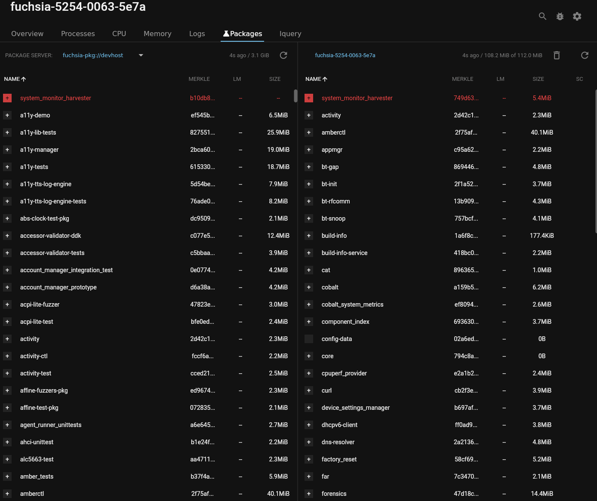

# Check if an updated package exists on your device

## Overview {#overview}

When developing for Fuchsia you sometimes need to confirm that the package
you've just built has been installed in your package server and cached on your
device.

The **Packages** tool lets you see if a package is out of date in your package
server or on your device.

The Fuchsia DevTools **Packages** tool shows the packages in your package server
and alerts you when a new package has not been cached on your device.

## About package caching

When you make a change to a component, your build system creates a new version
of the package that contains that component and adds that updated package to
your package server.

When your Fuchsia device restarts the component, that
device first checks the package server for updates. For many Fuchsia packages,
if your device finds an update for that package, your device caches the updated
package in its local storage.

Note: In Fuchsia, not all packages are cached in its locals storage. However,
in most cases, the packages that you are developing should be cached.

Package caching can fail if a package resolution error occurs. For example, if
the device is out of disk space, the device won’t cache the new package. Instead
of running the new version of the component, your device runs the
previous version of the component.

You can confirm that the most recent version of the package is in your
package server and that it has been cached on your device by reviewing the
Fuchsia DevTools **Packages** tool.

## Prerequisites {#prerequisites}

*   A hardware device that is set up to run Fuchsia or the Fuchsia emulator.
    *   The device should be paved and running. If you haven't already
    installed Fuchsia, see the [Get Started](/docs/get-started/README.md)
    documentation for your device or the emulator.
*   Fuchsia DevTools running and connected to your device, including a
    running package server.
    *   For more information, see [Launch Fuchsia DevTools](/docs/development/monitoring/devtools/launch-devtools.md).
*   Your development environment, allowing you to build components and install
    them as packages in your package server.

## Confirm your updated package has been cached

  Note: Fuchsia DevTools automatically checks for new packages every thirty
  seconds. To see the status of your package immediately, click the
  **Refresh** button.

1. Click the **Packages** tab.

    The left pane lists the packages in your package server, including the
    package's shortened merkle root, size, and date the package was last
    modified, if available.

    The right pane lists the packages cached on your device, including the
    package's shortened merkle root, size, and date the package was last
    modified, if available.

  <figure>
  </figure>

1. Update your component and push its package to your package server.

1. Check the **Packages** tool’s left pane to confirm that your updated
package exists in your package server by checking its modification date.

  In Fuchsia DevTools, any packages that have been updated in your
  package server but haven’t been cached on your device are marked in red.

  <figure>
  </figure>

1. Restart the component on your device.

1. Confirm that your package name is no longer in red.

  If the name of your package is still in red, your device has not cached the
  updated package.
