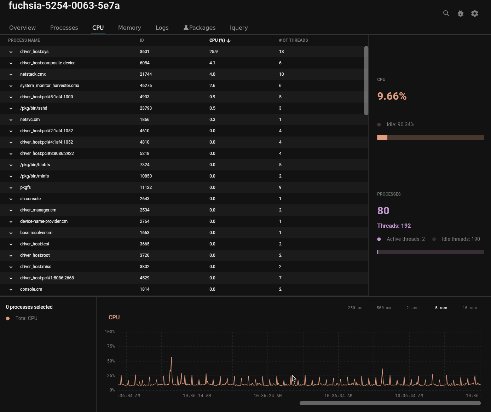
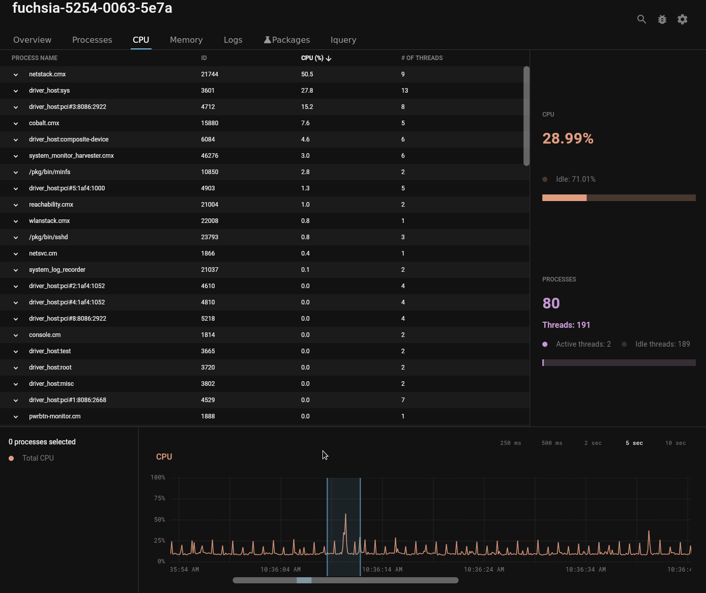

# Examine CPU usage

With the Fuchsia DevTools **CPU** tool, you can examine the amount of CPU used by
the entire device. You can also examine the amount of CPU used by an
individual thread or process.

## Overview

CPU cycles, like other computing resources, are finite. Checking the CPU usage
of a process or device can uncover implementation errors and
unexpected behaviors.

Use the **CPU** tool to help monitor CPU usage.

## Prerequisites

*   A hardware device that is set up to run Fuchsia or the Fuchsia emulator.
    *   The device should be paved and running. If you haven't already
    installed Fuchsia, see the [Get Started](/docs/get-started/README.md)
    documentation for your device or the emulator.
*   Fuchsia DevTools running and connected to your device, including a
    running package server.
    *   For more information, see [Launch Fuchsia DevTools](/docs/development/monitoring/devtools/launch-devtools.md).

## Examine overall CPU usage

Click the **CPU** tab to see the device’s overall CPU usage.

*   The CPU stats box reports the total CPU usage by all processes on the device.
*   The graph at the bottom of the tab shows the time history of CPU usage
    since Fuchsia DevTools launched.

The CPU usage for the device is the percentage of total available CPU cycles
consumed by your device. For example, on a four core device 100% CPU
means all four cores are being utilized.

## Examine individual process or thread CPU usage

The **CPU** tool can display the CPU usage of any process or thread on
the system instantaneously.

With the **CPU** tool, you can do the following:

*   Scroll the process list to find the process that you’re interested in
    examining.
*   Type some or all of a process’s name in the search box to filter
    the process list.
*   Select a process's to see its CPU usage on the graph.
*   Click the expansion control to see the process list of threads.
*   Select a thread to see its CPU usage on the graph.

The CPU usage for a process or thread is the percentage of CPU cycles it
consumes on a single core.

For example, on a device with a four core CPU, 100% CPU means
only one core is being fully utilized. Fuchsia DevTools shows the total device
CPU and per-process or thread CPU on the same graph. However, Fuchsia DevTools
displays the per-process and thread CPU statistics at different scales.

## Examine CPU usage for a period of time

The graph lets you examine CPU usage over a time range. For example, you can
determine the average CPU used within a spike on the graph.

### Select a time range in the graph

To select a time range in the graph, do the following:

  1. Drag the scroll bar to bring the desired range of time into view.
  1. Click and drag in the graph to select the desired time range.
  1. Drag either end of the selection range to adjust its start or stop time.

  <figure>
  </figure>

  The CPU stats box reports the average CPU used over the selected time range.

  Note: Currently, the CPU stats box displays the CPU level at the
  right end of the time range.

### Clear the selection from the graph and resume real-time display of CPU

Under normal operation the graph updates in real-time, moving older data to the
left. The graph halts its real-time display of CPU usage when you make a
selection or drag the scrollbar.

To clear the selection of the graph, do the following:

1. Click in the graph to clear the selection.
1. Drag the scrollbar to the right and release to resume the real time display.

   <figure>
   </figure>

