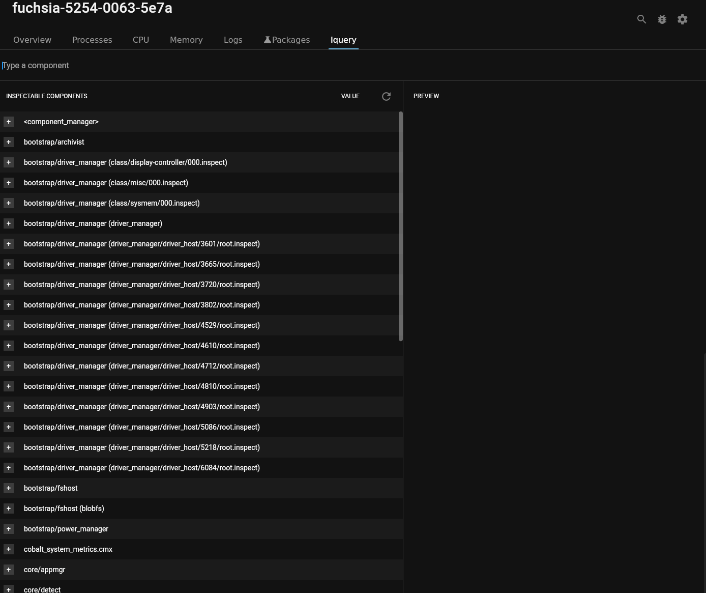
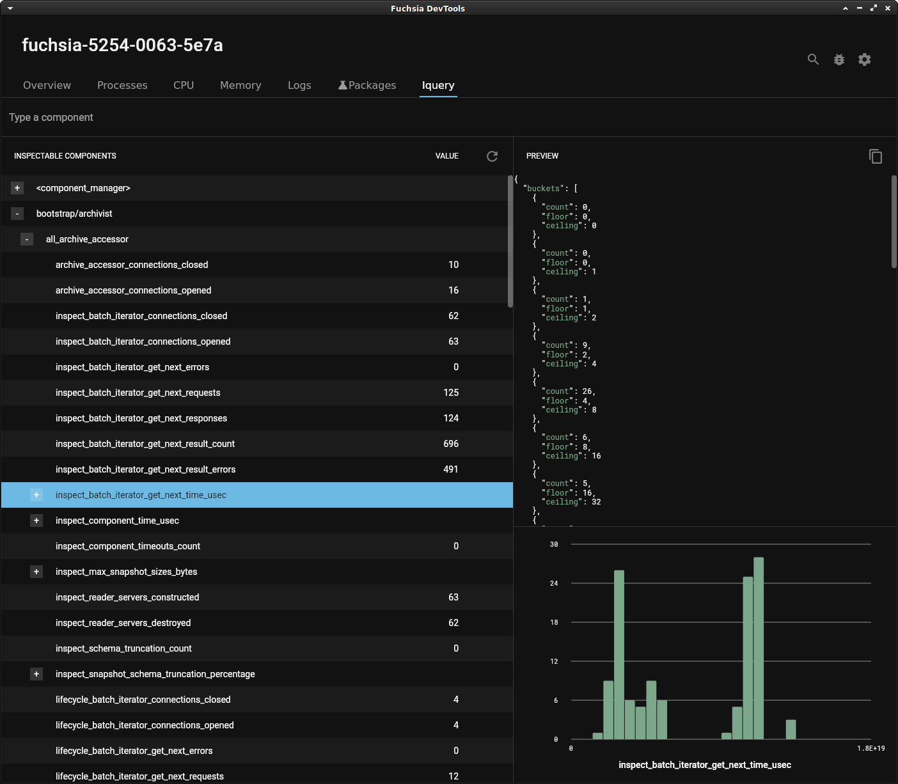

# Inspect component properties for debugging

## Overview

The **Iquery** tool displays the properties of components that publish their
state through the [Inspect API](/docs/development/diagnostics/inspect).

Components in Fuchsia may expose structured information about themselves through
the Inspect API for debugging purposes. For example Scenic, the Fuchsia graphics
engine, publishes its frame rate through the Inspect API.

A component you write could publish an error rate, an interaction count, or
other information that’s useful for component debugging.

The **Iquery** tool lets you do the following:

  *   Check the values of properties published by built-in system components.
  *   Check the values of properties published by components you write.
  *   Observe how those component properties change as you interact with
      the device.

Only components that publish information through the Inspect API appear in the
Iquery tool’s list of components. For more information on the Inspect API,
see [Fuchsia component inspection](/docs/development/diagnostics/inspect).

## Prerequisites

*   A hardware device that is set up to run Fuchsia or the Fuchsia emulator.
    *   The device should be paved and running. If you haven't already
    installed Fuchsia, see the [Get Started](/docs/get-started/README.md)
    documentation for your device or the emulator.
*   Fuchsia DevTools running and connected to your device, including a
    running package server.
    *   For more information, see [Launch Fuchsia DevTools](/docs/development/monitoring/devtools/launch-devtools.md).

## Check the value of a component property

After launching Fuchsia DevTools in your required developer environment,
complete the following steps:

  1. Locate the component in the **Iquery** tool.
  1. Expand the component and its subnodes until you locate the property that
     you want to review.

    Each property node displays its value in the **Value** column.

    Clicking a node in the component’s property tree displays the raw JSON
    representation of that node in the **Preview** pane on the right.

      <figure>
      </figure>

    For nodes with histogram properties, the **Iquery** tab displays a histogram
    of that data in the **Preview** pane.

      <figure>
      </figure>

  1. Click the **Refresh** button to update the property value display.

