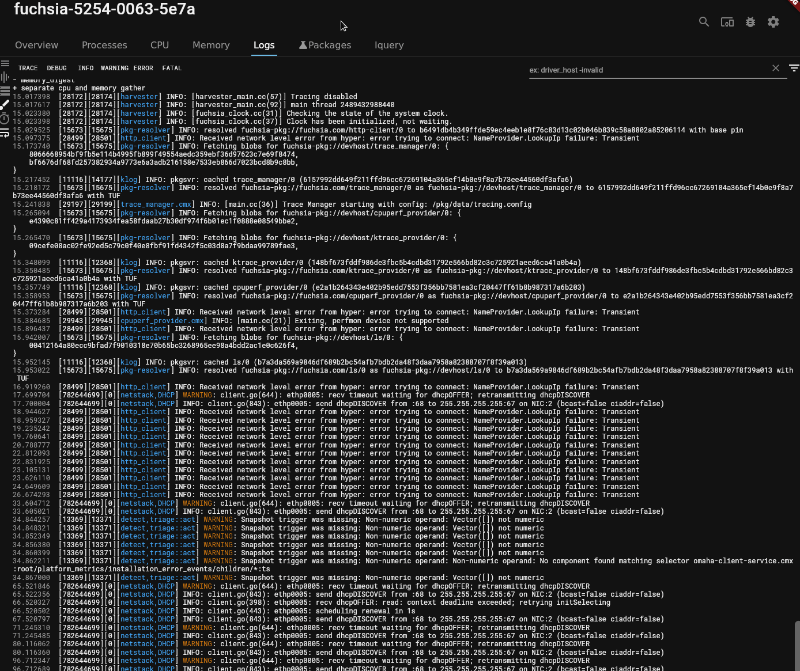
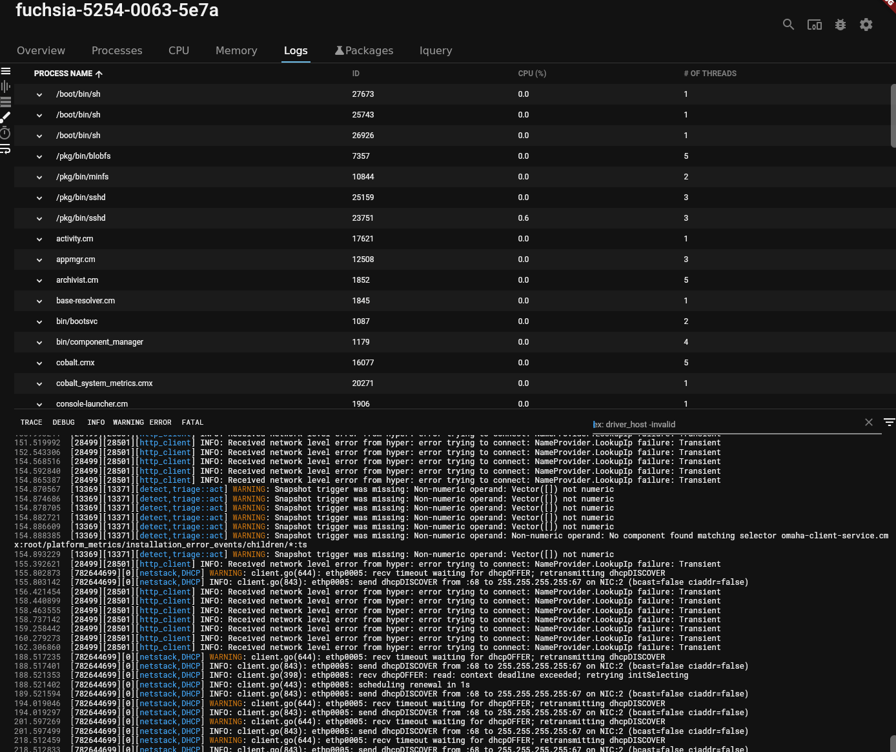
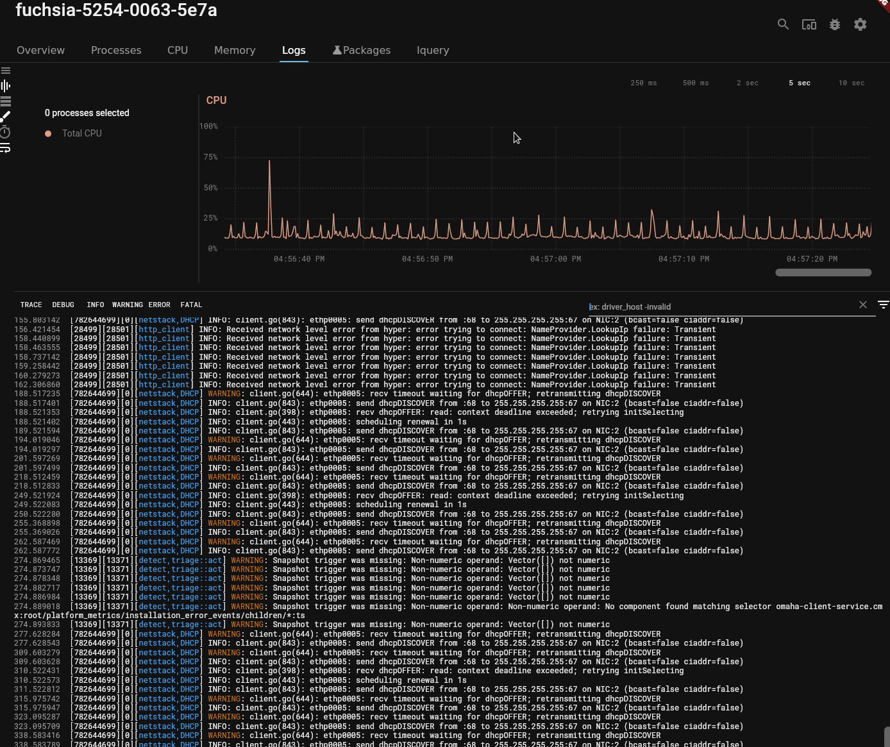

# Search and filter log messages from a device

With the Fuchsia DevTools **Logs** tool, you can hide repetitive log messages
to make your log stream more readable.

## Overview

The **Logs** tool streamlines the browsing, searching, and filtering of logs.

When a process generates log messages at a high rate, it can be
difficult to locate the logs that you’re interested in if you’re reading
those logs from the command line.

In the Fuchsia DevTools **Logs** tool, you can hide repetitive log messages
to make your log stream more readable by using [negative search](#negative-search).
You can also locate logs that contain a particular keyword.

## Prerequisites

*   A hardware device that is set up to run Fuchsia or the Fuchsia emulator.
    *   The device should be paved and running. If you haven't already
    installed Fuchsia, see the [Get Started](/docs/get-started/README.md)
    documentation for your device or the emulator.
*   Fuchsia DevTools running and connected to your device, including a
    running package server.
    *   For more information, see [Launch Fuchsia DevTools](/docs/development/monitoring/devtools/launch-devtools.md).

## Filter log messages

The **Logs** tool in Fuchsia DevTools lets users filter logs in
the following ways:

* Filter log messages by using negative search
* Filter log messages that contain a certain search term
* Filter log messages by severity

### Filter log messages by using negative search {#negative-search}

Repetitive non-specific logs, or "log spam", can make it difficult to locate
the logs that you’re actually interested in reviewing. You can use negative
search to exclude certain log messages, making your log stream more readable.

To only see log messages that don't contain a certain search term,
do the following:

1. Review your logs.

    Determine which word is shared by all of the log spam messages. This is
    the term that you want to filter out.

    For example, spam messages typically contain the name of the process
    generating the spam. Searching for the process name would collect all of
    the spam.

1. Click the search field in the **Logs** tab.

1. Enter <var>-SEARCH-TERM</var>, where <var>-SEARCH-TERM</var> is the word
that you are trying
to filter out.

  By prefixing the search term with a minus sign, the **Logs**
  tool hides any messages that contain that term.

  For example if the `pkg-resolver` process is generating log spam, enter
  "-pkg-resolver" in the search field.

  <figure>
  </figure>
  Note: You can enter multiple terms prefixed with "-" to hide multiple matching
  messages. Delimit between terms with spaces.

### Filter log messages that contain a certain search term

To only see log messages that contain a certain search term, do the following:

1. Click the search field in the **Logs** tool.
1. Enter one or more search terms.

    As a result, the **Logs** tool hides all log messages that don’t match the
    search terms you’ve entered. The **Logs** tool also highlights those
    terms within each matching message.

### Filter log messages by severity

To filter log messages by severity, click a severity level from the severity
control near the top of the tab.

The **Logs** tool hides all logs below the severity level you set.

For example if you choose `WARNING` you can see `WARNING`, `ERROR`, and
`FATAL` messages but not see `INFO`, `DEBUG`, and `TRACE` messages.

  <figure>
  </figure>

### Filter log messages by process

To filter log messages by process, do the following:

1. Click the **PROCESS NAME** button on the left side of the tab to reveal
the process list.

1. Select a process from the list to only show the logs from that process.

   You can further filter logs by the severity, search term, and time range.

  <figure>
  </figure>

### Filter log messages by time range

To filter log messages by time range, do the following:

1. Click the **CPU** graph button at the left side of the tab to see
the CPU graph.

1. Select a portion of the graph. Drag either end of the selection range to
adjust the graph.

  As a result, the **Logs** tool hides all logs outside of the time range.

  You can further filter logs by the severity, process, and search term.

  <figure>
  </figure>

