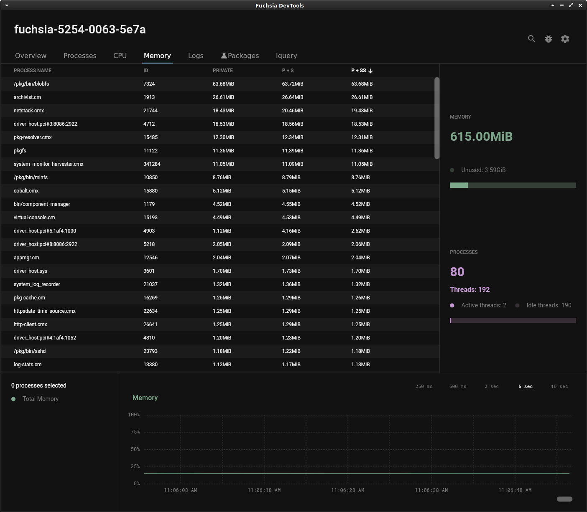

# Examine memory usage

With the **Memory** tool, you can examine the amount of memory used by an
individual process or the entire device.

## Overview

Memory, like other computing resources, is finite. Checking the memory usage of
a process or device can uncover implementation errors and unexpected behaviors.

Use the **Memory** tool to help monitor CPU usage.

## Prerequisites

*   A hardware device that is set up to run Fuchsia or the Fuchsia emulator.
    *   The device should be paved and running. If you haven't already
    installed Fuchsia, see the [Get Started](/docs/get-started/README.md)
    documentation for your device or the emulator.
*   Fuchsia DevTools running and connected to your device, including a
    running package server.
    *   For more information, see [Launch Fuchsia DevTools](/docs/development/monitoring/devtools/launch-devtools.md).

## Examine overall memory usage

Click the **Memory** tab to see the device’s overall memory usage.

*   The **Memory** tool reports the total memory used by all processes
    on the device.
*   The graph at the bottom of the tab shows the history of memory usage
    since Fuchsia DevTools launched.

## Examine per-process memory usage

### Examine instantaneous memory usage

The **Memory** tool can display the memory usage of any process on the system
instantaneously.

In the **Memory** tool, you can do the following:

* Scroll the process list to find a specific process.
* Type some or all of a process’s name in the search box to filter
the process list.
* Select a process to see its memory usage on the graph.

### Examine memory statistics

Each process in the **Memory** tool lists the following information:

*   **Private memory**: the total memory used by only this process.
*   **Private plus shared memory (P+S)**: the process private memory plus the
total memory it shares with other processes.
*   **Private plus scaled-shared memory (P+SS)**: the process's private memory,
    plus the total memory it shares with other processes divided by the number
    of processes sharing that memory.

    For example if a process's private memory is 1Mb and it shares 1Mb with
    three other processes, its private plus scaled-shared total is 1.25Mb.

    <figure>
    </figure>

