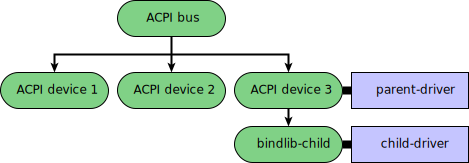

# Create a new bind library for a driver

This guide walks through the tasks related to creating a new bind library in the
Fuchsia SDK development environment (which uses the [Bazel][bazel]{:.external}
build system).

In Fuchsia driver development, bind libraries make the following tasks easy to
coordinate:

- Write [bind rules][bind-rules] for a driver.
- Assign [node properties][node-properties] to a [child node][nodes]
  in a parent driver.

The Fuchsia SDK includes a set of bind libraries you can use to write bind rules
for drivers. However, sometimes using only the existing bind libraries may not
be sufficient to compose precise build rules for your driver. On such occasions,
you may need to create a new bind library to define a custom set of binding
properties for the driver and its target node.

## Development scenario in this guide {:#development-scenario}

Note: This guide use a custom bind library named `fuchsia.example.gizmo.bind` as
an example, which is available in the [SDK driver samples repository][sdk-driver-sample-repo].

When a new bind library becomes available, two groups with two distinct
responsibilities may be interested in using the new bind library: one that
manages the [parent driver](#update-the-parent-driver) and the other that
works on the [child driver](#update-the-child-driver).

{: width="600"}

**Diagram 1**. A node topology that displays the parent-child relationship
between two drivers.

Diagram 1 shows a node topology with two drivers: `parent-driver` and
`child-driver`. Now, imagine a scenario where a group of platform developers has
written a driver (`parent-driver`) for a built-in ACPI device in a Fuchsia system,
and a group of device developers is writing a driver (`child-driver`) for a new
ACPI device, whose target node is `bindlib-child`.

In this scenario, the following events take place:

1. [Create a new bind library](#create-a-new-bind-library) - A new bind library is
   created to define node properties for the new ACPI device.

1. This new custom bind library is then shared between the two groups:

   * [Update the parent driver’s child node](#update-the-parent-driver) -
     Developers that manage `parent-driver` assign new node properties
     to the child node `bindlib-child`.

   * [Update the child driver’s bind rules](#update-the-child-driver) -
     Developers that work on `child-driver` write bind rules using the new
     node properties.

## Create a new bind library {:#create-a-new-bind-library}

Create a new bind library that enables developers to precisely identify certain
target devices in a Fuchsia system.

To create a new bind library, the steps are:

1. [Write a new bind library](#write-a-new-bind-library).
1. [Create a build file for the new bind library](#create-a-build-file-for-the-new-bind-library).

### 1. Write a new bind library {:#write-a-new-bind-library}

Write a bind library that defines a new set of custom node properties.

Note: For more details on bind libraries, see this [Bind libraries][bind-library]
section under the Open source project tab. However, that page may contain information
specific to the legacy version of the driver framework (DFv1).

A new bind library may look as shown below (see [`testlibrary.bind`][test-library-bind]
in the `lib` directory of the [bind library sample][bind-library-sample]):

```cpp {:.devsite-disable-click-to-copy}

```

The name of this new bind library is defined at the top  in the line
`library fuchsia.examples.gizmo.bind;`. Also notice that the line
`using fuchsia.acpi;` establishes a dependency to the`fuchsia.acpi` bind
library, which is included in the Fuchsia SDK. This setup reflects a realistic development
scenario which often requires using the two types of bind libraries: an existing library
and a custom library.

### 2. Create a build file for the new bind library {:#create-a-build-file-for-the-new-bind-library}

Create a build file (that is, `BUILD.bazel`) for the new bind library so that
developers can auto-generate library artifacts.

Note: For related concepts, see [Bind library code generation tutorial][bind-library-code-generation-tutorial]
under the Open source project tab. And for comparison, see
[Differences in bind library code generation between the source and SDK](#differences-in-bind-library-code-generation)
in Appendices.

The build targets below define a new C++ bind library named
`fuchsia.example.gizmo.bind` in the sample bind library’s
[`BUILD.bazel`][build-bazel-bind-library] file:

```cpp {:.devsite-disable-click-to-copy}

```

One of the library artifacts generated by building the
`fuchsia.example.gizmo.bind library` is the following C++ header file
(which, by the way, is not included in the sample):

```cpp {:.devsite-disable-click-to-copy}
// Copyright 2022 The Fuchsia Authors. All rights reserved.
// Use of this source code is governed by a BSD-style license that can be
// found in the LICENSE file.

// WARNING: This file is machine generated by bindc.

#ifndef BIND_FUCHSIA_EXAMPLES_GIZMO_BIND_BINDLIB_
#define BIND_FUCHSIA_EXAMPLES_GIZMO_BIND_BINDLIB_

#include <string>

#include <bind/fuchsia/acpi/cpp/bind.h>

namespace bind_fuchsia_examples_gizmo_bind {

static const std::string MODELNAME = "fuchsia.examples.gizmo.bind.ModelName";

static const std::string GIZMOTYPE = "fuchsia.examples.gizmo.bind.GizmoType";
static const std::string GIZMOTYPE_MEM_64K = "fuchsia.examples.gizmo.bind.GizmoType.MEM_64K";
static const std::string GIZMOTYPE_MEM_128K = "fuchsia.examples.gizmo.bind.GizmoType.MEM_128K";
static const std::string GIZMOTYPE_MEM_256K = "fuchsia.examples.gizmo.bind.GizmoType.MEM_256K";

static constexpr uint32_t BIND_PCI_VID_GIZMOTRONICS = 3227993;

}  // namespace bind_fuchsia_examples_gizmo_bind

#endif  // BIND_FUCHSIA_EXAMPLES_GIZMO_BIND_BINDLIB_
```

Developers can now use the node properties in this C++ header file for the following tasks:

- [Update the parent driver’s child node](#update-the-parent-driver).
- [Update the child driver’s bind rules](#update-the-child-driver).

## Update the parent driver’s child node {:#update-the-parent-driver}

In Fuchsia, some drivers create child nodes that enable other drivers to bind to. Drivers that
create child nodes are referred to as parent drivers. With a new bind library, the main task is
to update the parent driver’s child node so that it receives node properties from the new
bind library.

To update the parent driver’s child node, the steps are:

1. [Add the new bind library in the build file](#add-new-bind-library-in-the-parent-drivers-build-file).
1. [Assign node properties to the child node](#assign-node-properties-to-the-child-node).

### 1. Add the new bind library in the build file {:#add-new-bind-library-in-the-parent-drivers-build-file}

Update the build file of the parent driver to include a dependency to the new bind library.

The parent driver’s [`BUILD.bazel`][build-bazel-parent-driver] file below shows that the
`cc_binary` target has a dependency to the custom bind library `fuchsia.example.gizmo.bind_cc`:

```cpp {:.devsite-disable-click-to-copy}

```

Notice that the dependency is prefixed with `//src/bind_library/lib` (instead of `@fuchsia_sdk//`),
which indicates that it is from a local directory in the sample.

### 2. Assign node properties to the child node {:#assign-node-properties-to-the-child-node}

Update the source code of the parent driver so that certain node properties from the new bind
library are passed down to the child node.

With the [auto-generated C++ header](#create-a-build-file-for-the-new-bind-library) file from the
new bind library included in [`parent-driver.cc`][parent-driver-cc], this driver can now read
node properties from the new bind library:

```cpp {:.devsite-disable-click-to-copy}


...


```

Notice that some string variables from the `bind_fuchsia_examples_gizmo_bind` namespace
(see the [auto-generated C++ header](#create-a-build-file-for-the-new-bind-library) file) are
used to initialize the child node's node properties.

## Update the child driver’s bind rules {:#update-the-child-driver}

A driver that binds to a child node of an existing driver is referred to as a child driver.
With a new bind library, the main task is to update the child driver’s bind rules to make
use of node properties from the new bind library. The underlying goal is to write more
precise bind rules for the driver so that it is guaranteed to match the target node in a
Fuchsia system.

To update the child driver’s bind rules, the steps are:

1. [Add the new bind library in the build file](#add-new-bind-library-in-the-child-drivers-build-file).
1. [Write bind rules using new node properties](#write-bind-rules-using-new-node-properties).

### 1. Add the new bind library in the build file {:#add-new-bind-library-in-the-child-drivers-build-file}

Update the build file of the child driver to include a dependency to the new bind library

The child driver’s [`BUILD.bazel`][build-bazel-child-driver] file below shows that the
`fuchsia_driver_bytecode_bind_rules` target has a dependency to the custom bind library
`fuchsia.example.gizmo.bind`:

```cpp {:.devsite-disable-click-to-copy}

```

Notice that the dependency is prefixed with `//src/bind_library/lib` (instead of `@fuchsia_sdk//`),
which indicates that it is from a local directory in the sample.

### 2. Write bind rules using new node properties {:#write-bind-rules-using-new-node-properties}

Write (or update) the child driver’s bind rules to use node properties from the new bind library.

The child driver’s bind rules ([`child-driver.bind`][child-driver-bind]) show that the `ModelName`
and `GizmoType` properties from the custom bind library `fuchsia.example.gizmo.bind` are used in
the rules to narrow down the driver's target device:

```cpp {:.devsite-disable-click-to-copy}


...


```

For more information on bind rules, see [Write bind rules for a driver][write-bind-rules].

## Appendices

### Differences in bind library code generation between the source and SDK {:#differences-in-bind-library-code-generation}

Most concepts and samples in the [Bind library code generation tutorial][bind-library-code-generation-tutorial] apply
to the Fuchsia SDK development environment.

However, the differences are as follows:

* Rust targets cannot be generated in the SDK.
* The C++ library target `cc_library` is `:{target_name}_cc` (instead of `:{target_name}_cpp`)
  in the SDK.
* Targets for the C++ library `fuchsia_bind_cc_library` need to be added in
  `BUILD.bazel` manually if the bind library is not included in the SDK.

<!-- Reference links -->

[bazel]: https://bazel.build/
[sdk-driver-sample-repo]: https://fuchsia.googlesource.com/sdk-samples/drivers/+/refs/heads/main/src/bind_library/
[bind-rules]: /docs/concepts/drivers/driver_binding.md
[node-properties]: /docs/concepts/drivers/drivers_and_nodes.md#node_properties
[nodes]: /docs/concepts/drivers/drivers_and_nodes.md
[bind-library]: /docs/development/drivers/concepts/device_driver_model/driver-binding.md#bind-libraries
[test-library-bind]: https://fuchsia.googlesource.com/sdk-samples/drivers/+/refs/heads/main/src/bind_library/lib/testlibrary.bind
[bind-library-sample]: https://fuchsia.googlesource.com/sdk-samples/drivers/+/refs/heads/main/src/bind_library/
[bind-library-code-generation-tutorial]: /docs/development/drivers/tutorials/bind-libraries-codegen.md
[build-bazel-bind-library]: https://fuchsia.googlesource.com/sdk-samples/drivers/+/refs/heads/main/src/bind_library/lib/BUILD.bazel
[build-bazel-parent-driver]: https://fuchsia.googlesource.com/sdk-samples/drivers/+/refs/heads/main/src/bind_library/parent/BUILD.bazel
[parent-driver-cc]: https://fuchsia.googlesource.com/sdk-samples/drivers/+/refs/heads/main/src/bind_library/parent/parent-driver.cc
[build-bazel-child-driver]: https://fuchsia.googlesource.com/sdk-samples/drivers/+/refs/heads/main/src/bind_library/child/BUILD.bazel
[child-driver-bind]: https://fuchsia.googlesource.com/sdk-samples/drivers/+/refs/heads/main/src/bind_library/child/child-driver.bind
[write-bind-rules]: /docs/development/sdk/write-bind-rules-for-driver.md
