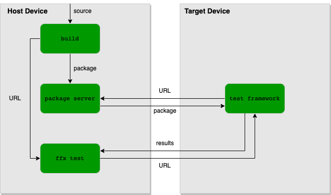

# Run tests on a device

The `ffx test run` command can run tests on a Fuchsia device and collect
test results and diagnostic information.

## Concepts

The `ffx test run` command executes tests that are integrated with the
[Fuchsia test runner framework][trf], which allows test cases to be defined
and implemented in a Fuchsia component.

Running a [test component][test-components] on a Fuchsia device requires
the following steps:

1. Compile the code, component, and package definitions into a Fuchsia package.
1. Make the package available to the target device.
1. Run the test component on the target device.

The `ffx test` commands only handle step 3. Steps 1 and 2 inherently require
knowledge of the build system and`ffx test` is explicitly designed to be agnostic
to build systems.



**Figure 1**. A flow diagram showing how `ffx test` fits in among other tools
used in compiling and running tests.

The `ffx test` commands are intended to serve as a lower-level tool that gets
invoked by other tools, which often run tests that are specific to a build system
or a development environment. The workflows documented on this page are mainly for
developers who are working on such high-level tools. As a test author, if you are
looking for instructions on how to run tests in a specific project, try examining
the documentation in the project repository. And for running tests within the
Fuchsia source checkout (`fuchsia.git`), see the [`fx test` documentation][fx-test].

However, in rare cases you may need to invoke `ffx test` directly to use fine-grained
options that are not available in high-level tools. Additionally, a project may need
to support other types of tests that `ffx test` does not support, such as host tests.
High-level test scripts either directly handle these concerns or delegate the
responsibilities to other tools. For example, [`fx test`][fx-test] is used for
development in `fuchsia.git` and `bazel test` in the [Fuchsia SDK][sdk].

## Run a test component {:#run-a-test-component}

To run a test component on the target device, run the following command:

```posix-terminal
ffx test run {{ '<var>' }}TEST_COMPONENT_URL{{ '</var>' }}
```
Replace <var>TEST_COMPONENT_URL</var> with the target test component URL.

The example command below runs tests in the `example.cm` component on
the target device:

```none {:.devsite-disable-click-to-copy}
$ ffx test run fuchsia-pkg://fuchsia.com/example#example.cm
```

## Run specific test cases using filters {:#run-specific-test-cases-using-filters}

To selectively run test cases in a test component, run the following
command:

```posix-terminal
ffx test run {{ '<var>' }}TEST_COMPONENT_URL{{ '</var>' }} --test-filter {{ '<var>' }}FILTERS{{ '</var>' }}
```
Replace the following:

* <var>TEST_COMPONENT_URL</var> – The target test component URL.
* <var>FILTERS</var> – Patterns to be used to match test cases.

The filters provided in the `--test-filter` option will match based on
glob patterns. Only the test cases that match at least one pattern will be run.
For example, given that a suite has the test cases `Foo.Test1`, `Foo.Test2`,
`Bar.Test1`, and `Bar.Test2`, the command below only executes `Foo.Test1` and
`Foo.Test2`:

```none {:.devsite-disable-click-to-copy}
$ ffx test run fuchsia-pkg://fuchsia.com/example#example.cm --test-filter Foo.*
```

Negative filters may be specified by prepending `-`. When negative
filters are specified, test cases matching the negative filter are excluded.
For example, with the same suite as above, the command below only executes
`Bar.Test1` and `Bar.Test2`:

```none {:.devsite-disable-click-to-copy}
$ ffx test run fuchsia-pkg://fuchsia.com/example#example.cm --test-filter -Foo.*
```

The `--test-filter` option can be specified multiple times. The behavior
of multiple filters is as follows:

* When no filters are specified, all test cases are run.
* When only positive filters are specified, test cases that match at least one
  filter are run.
* When only negative filters are specified, test cases that match none of the
  filters are run.
* When both positive and negative filters are specified, test cases that match
  at least one positive filter but do not match any negative filters are run.

With the same suite as above, the example command below only executes
`Foo.Test2`:

```none {:.devsite-disable-click-to-copy}
$ ffx test run fuchsia-pkg://fuchsia.com/example#example.cm --test-filter Foo.* --test-filter -*.Test1
```

## Run tests with arguments {:#run-tests-with-arguments}

To pass arguments to the tests in a test component, run the following
command:

```posix-terminal
ffx test run {{ '<var>' }}TEST_COMPONENT_URL{{ '</var>' }} -- {{ '<var>' }}ARGS{{ '</var>' }}
```

Replace the following:

* <var>TEST_COMPONENT_URL</var> – The target test component URL.
* <var>ARGS</var> – Arguments to be passed to the tests.

The example command below passes the arguments `hello` and `1234` directly to
the tests:

```none {:.devsite-disalbe-click-to-copy}
$ ffx test run fuchsia-pkg://fuchsia.com/example#example.cm -- hello 1234
```

## Run tests and store structured results {:#run-tests-and-store-structured-results}

`ffx test run` supports printing and storing test results in a machine readable
format, which is suitable for consumption by other tools (see
[test output format][test-output] for the details of the schema).

To store structured test results after runing tests, run the following
command:

```posix-terminal
ffx test run {{ '<var>' }}TEST_COMPONENT_URL{{ '</var>' }} --output-directory {{ '<var>' }}DIR{{ '</var>' }}
```

Replace the following:

* <var>TEST_COMPONENT_URL</var> – The target test component URL.
* <var>DIR</var> – The directory to store structured test results.

The example command below stores the output in the `/tmp/ffx-out` directory:

```none {:.devsite-disable-click-to-copy}
$ ffx test run fuchsia-pkg://fuchsia.com/example#example.cm --output-directory /tmp/ffx-out
```

## Appendices

### Return codes {:#return-codes}

`ffx test run` returns zero when a test runs successfully, and non-zero in case
of failure. `ffx test run` supports a number of special error codes:

| Name         | Exit code | Description                                                  |
| ------------ | --------- | ------------------------------------------------------------ |
| Setup failed | 28        | Connecting to required protocols on the target device failed |
| Timed out    | 21        | Test execution failed due to timeout                         |

### Interrupt signal {:#interrupt-signal}

When passed `SIGINT`, which is typically done by pressing `Ctrl+C` in the
terminal, `ffx test run` will attempt to gracefully stop in-progress
tests and store the results.

### Experimental features {:#experimental-features}

`ffx test run` supports a number of experimental features. These features are
subject to breaking changes or removal. Using an experimental feature requires
opting in by setting the corresponding `ffx config` fields to `true`. See
`ffx test run --help` for information on available experimental features and
how to opt in.

<!-- Reference links -->

[fx-test]: /docs/development/testing/run_fuchsia_tests.md
[sdk]: /docs/development/sdk/index.md
[test-components]: /docs/development/testing/components/test_component.md
[test-output]: /docs/reference/platform-spec/testing/test-output-format.md
[trf]: /docs/development/testing/components/test_runner_framework.md
