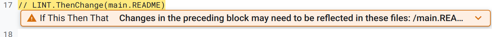
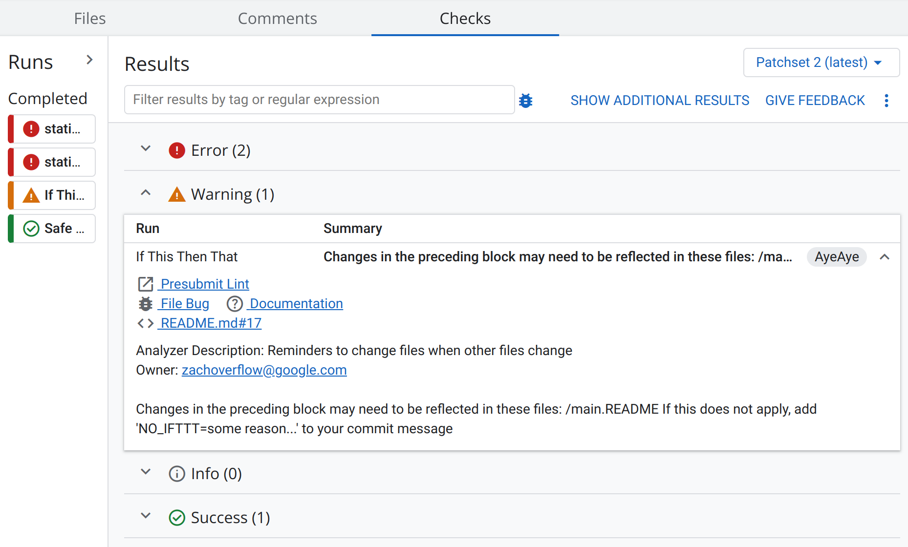

# Presubmit checks

All changelists sent to Fuchsia undergo a series of presubmit checks. These
happen automatically; there is no need to manually trigger them. Where possible,
changelists should ensure all presubmit checks pass successfully. If this is not
possible, the reason why should be documented in the change description.

## Types of checks

### Language linters

Linters are run automatically for a variety of languages and will leave comments
in the **Checks** tab of Gerrit.

### Presubmit tools

Some of the presubmit checks are tools that are language-agnostic but provide
stronger confidence in the quality of a changelist.

#### IfThisThenThat

IfThisThenThat is a check that can be used to ensure files that co-change with
one another stay synchronized. If one file changes, a warning is given that the
other file(s) should change too in the same changelist. Ideally, such a check
should not be necessary, but can come up when executable code needs to be
synchronized with configuration files.

IfThisThenThat leaves _warnings_ and so does not block changelist submission.

##### Example

Unlike other presubmit checks which operate independently, IFTTT checks need to
be manually implemented. To set up a new IFTTT check, insert the special
comments `// LINT.IfChange`  and  `// LINT.ThenChange(<other_file_path>)`  in
each file that should be updated together.

In the following example, IFTTT checks are implemented for `test.go` and
`main.rs`. If only one of the files change, a warning appears in Gerrit.

`test.go`

```go
import fmt

// LINT.IfChange

fmt.Println("When this block changes, so must main.rs")

// LINT.ThenChange(main.rs)
```

`main.rs`

```rust
// LINT.IfChange

println!("When this block changes, so must test.go");

// LINT.ThenChange(test.go)
```

Note that for Markdown files, the structure must be wrapped in comments so that
Markdown ignores the syntax.

```markdown
<!--

// LINT.IfChange

-->

Block to be changed.

<!--

// LINT.ThenChange(test.go)

-->
```

IfThisThenThat supports absolute file paths (those that start with `/`), and
relative paths (those that do not start with `/`).

If the text within the `LINT.IfChange/ThenChange` directives is altered, so too
must the other file that is pointed to. Files should always have the LINT
directives in each file that is joined. A one-way directive would mean that one
file can lose synchronization from the other.

If an IfThisThenThat directive is violated, a comment is left on the CL:



The warning also appears on the **Checks** tab:


