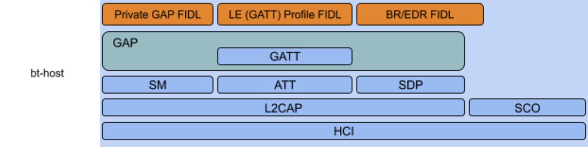

# Understanding `bt-host` unit tests

This guide explains how to write tests for Fuchsia's
[`bt-host` driver](/src/connectivity/bluetooth/core/bt-host/) by detailing the
[`SMP_Phase1Test`](https://fuchsia.googlesource.com/fuchsia/+/2ee647a648d93300d49328db8ef4bb0426e36c53/src/connectivity/bluetooth/core/bt-host/sm/phase_1_unittest.cc#36)
test fixture and the
[FeatureExchangeBothSupportSCFeaturesHaveSC](https://fuchsia.googlesource.com/fuchsia/+/2ee647a648d93300d49328db8ef4bb0426e36c53/src/connectivity/bluetooth/core/bt-host/sm/phase_1_unittest.cc#318)
test case.

The `bt-host` driver implements most of the Bluetooth Core Specification v5.2,
Volume 3 (Host Subsystem).

The Fuchsia project places a
[strong emphasis on automated testing](/docs/development/testing/testability_rubric.md)
and the Bluetooth team strives to be
[leaders of testing culture](/src/connectivity/bluetooth/README.md#tests).

In order to merge your `bt-host` driver change in the Fuchsia source tree, you
need to write automated tests for that change.

## Introduction

`bt-host` is a relatively large codebase with many layers of abstraction.

Below is a diagram of the `bt-host` driver's main logical components:

 {#architecture-diagram}

Every abstraction layer in the graph roughly corresponds to an entire protocol.

When working with `bt-host` tests, focus on understanding the relationship
between the layer you're currently working on (e.g. SM), and the layer(s)
directly beneath it (e.g. L2CAP).

While each layer may have additional internal layers of abstraction, these
inter-protocol relationships are most frequently mocked and/or exercised in
tests.

### Resources

`bt-host` is written in C++, and Fuchsia uses the
[gUnit](/docs/development/languages/c-cpp/library_restrictions.md#third_partygoogletest)
[Googletest](https://github.com/google/googletest) library for C++ tests.

To work with `bt-host` unit tests, you need a solid understanding of the
following resources:

  + [GTest primer](https://github.com/google/googletest/blob/HEAD/docs/primer.md)
    + [Test fixtures](https://github.com/google/googletest/blob/HEAD/docs/primer.md#test-fixtures-using-the-same-data-configuration-for-multiple-tests-same-data-multiple-tests)

The following topics occasionally come up while writing `bt-host` tests and can
be referenced as needed:

  + [Advanced googletest topics](https://github.com/google/googletest/blob/HEAD/docs/advanced.md)
  + [Assertion placement](https://github.com/google/googletest/blob/HEAD/docs/advanced.md#assertion-placement)
  + [Death tests](https://github.com/google/googletest/blob/HEAD/docs/advanced.md#death-tests)
  + [Scoped tracing](https://github.com/google/googletest/blob/HEAD/docs/advanced.md#adding-traces-to-assertions)

### `bt-host` unit test overview

Most `bt-host` tests are written in the following pattern:

  1. Create a [test fixture](#test_fixtures) to store
     [test doubles](#test_doubles) and the Layer Under Test (LUT).

  1. Construct the LUT within that test fixture, using test doubles in place of
     the LUT's depenencies.

    Note: Fuchsia does not allow usage of the gMock framework, so any mock
          dependencies must be written without it. For more information, see
          [Library restrictions](/docs/development/languages/c-cpp/library_restrictions.md).

  1. Exercise a functionality within the LUT. For example, this guide examines
     the `FeatureExchangeBothSupportSCFeaturesHaveSC` test case.

  1. Validate that the higher-level command results in an expected behavior.

### Test fixtures

GTest test fixtures are reusable environments that often store test
dependencies and provide convenience methods for writing unit tests. The test
fixture used in this example is the [`SMP_Phase1Test` class](#smp_phase1_test).

### Test doubles

Test doubles are objects used to substitute for real objects in test code. There
are many different types of test doubles. The two example test doubles used in
`SMP_Phase1Test` are [`FakeChannel`](#fake_channel) and
[`FakeListener`](#fakelistener).

## `SMP_Phase1Test` test fixture {#smp_phase1_test}

[`SMP_Phase1Test`](https://fuchsia.googlesource.com/fuchsia/+/2ee647a648d93300d49328db8ef4bb0426e36c53/src/connectivity/bluetooth/core/bt-host/sm/phase_1_unittest.cc#36)
is the test fixture used to test the
[`sm::Phase1`](https://fuchsia.googlesource.com/fuchsia/+/2ee647a648d93300d49328db8ef4bb0426e36c53/src/connectivity/bluetooth/core/bt-host/sm/phase_1.h)
class.

The `Phase1` class is responsible for Phase 1 of Bluetooth Low Energy (BLE)
pairing, in which the devices negotiate the security features of the pairing.

This section annotates the test fixture setup code of `SMP_Phase1Test` as a
representative example of
["Creating a test fixture" and "Constructing the LUT"](#bt-host_unit_test_overview).
It may be helpful to have
[phase_1_unittest.cc](https://fuchsia.googlesource.com/fuchsia/+/2ee647a648d93300d49328db8ef4bb0426e36c53/src/connectivity/bluetooth/core/bt-host/sm/phase_1_unittest.cc#42)
open while reading this section.

### `SetUp()`, `TearDown()`, and `NewPhase1()` methods

The constructor of `SMP_Phase1Test` does nothing. Instead, `bt-host` test
fixtures typically use the GTest `SetUp()` method to initialize the test
fixture.

Note: The GTest FAQs have
[some subtle guidance about when to use the constructor vs. `SetUp`](https://github.com/google/googletest/blob/HEAD/docs/faq.md#should-i-use-the-constructordestructor-of-the-test-fixture-or-setupteardown-ctorvssetup),
but it is a `bt-host` best practice to use `SetUp()`.

```C++
void SetUp() override { NewPhase1(); }
```

`NewPhase1` is a `protected` visibility method with defaultable parameters.
`bt-host` test fixtures commonly delegate to a `New<test-fixture-name>` method
with defaultable parameters from `SetUp()`. The `New`\* method does the work of
setting up resources/test doubles and creating the LUT. This enables test
cases[^1] to reinitialize the test fixture by calling `New`\* with different
parameters.

```C++
void NewPhase1(Role role = Role::kInitiator,
               Phase1Args phase_args = Phase1Args(),
               hci::Connection::LinkType ll_type =
                   hci::Connection::LinkType::kLE) {
```

For `NewPhase1`, the configurable aspects are:

  + The device role
  + The transport type
  + A struct that holds the the rest of the Phase1 arguments, which makes it
    easier to change only one of the "default" arguments:

##### `Phase1Args` struct

```C++
struct Phase1Args {
 PairingRequestParams preq = PairingRequestParams();
 IOCapability io_capability = IOCapability::kNoInputNoOutput;
 BondableMode bondable_mode = BondableMode::Bondable;
 SecurityLevel level = SecurityLevel::kEncrypted;
 bool sc_supported = false;
};
```

### L2CAP mock dependency {#fake_channel}

`L2CAP` channels provide a logical connection to a peer protocol/service, and
are depended on by higher-level protocols like `ATT`, `GATT`, `SMP`, `SDP`.

`FakeChannel` is used as a mock dependency to test how real objects send and
receive messages over
[L2CAP channels](https://fuchsia.googlesource.com/fuchsia/+/2ee647a648d93300d49328db8ef4bb0426e36c53/src/connectivity/bluetooth/core/bt-host/l2cap/channel.h).

The first test double created in `NewPhase1` is a `FakeChannel` mock object:

```C++
uint16_t mtu =
  phase_args.sc_supported ? l2cap::kMaxMTU : kNoSecureConnectionsMtu;
ChannelOptions options(cid, mtu);
options.link_type = ll_type;
...
fake_chan_ = CreateFakeChannel(options);
sm_chan_ = std::make_unique<PairingChannel>(fake_chan_);
```

The `CreateFakeChannel` method is available because `SMP_Phase1Test` inherits
from
[`FakeChannelTest`](https://fuchsia.googlesource.com/fuchsia/+/2ee647a648d93300d49328db8ef4bb0426e36c53/src/connectivity/bluetooth/core/bt-host/l2cap/fake_channel_test.h).[^2]

### FakeListener

In real code, `PairingPhase` uses `PairingPhase::Listener` to communicate with
the higher-level `SecurityManager` class. `FakeListener` provides a mock of this
dependency for testing.

```C++
listener_ = std::make_unique<FakeListener>();
```

While not a protocol-level dependency, `FakeListener` exemplifies another common
`bt-host` test pattern. Classes often take interface pointers to communicate
with layers above them. Test doubles implementing these interfaces are passed to
the LUT to verify that the LUT communicates correctly with the layer above it.

Note: For another example of this pattern, see
[`BrEdrConnectionManager`'s `PairingDelegate` pointer](https://fuchsia.googlesource.com/fuchsia/+/2ee647a648d93300d49328db8ef4bb0426e36c53/src/connectivity/bluetooth/core/bt-host/gap/bredr_connection_manager.h#106)
and
[how it's mocked out in tests](https://fuchsia.googlesource.com/fuchsia/+/2ee647a648d93300d49328db8ef4bb0426e36c53/src/connectivity/bluetooth/core/bt-host/gap/bredr_connection_manager_unittest.cc#914).

### Completion callback

`Phase1` stores a callback parameter. When `Phase1` completes, it returns the
results of `Phase1` through this callback. `complete_cb` is used as this
callback when instantiating `Phase1`.

`complete_cb` stores the results of `Phase1` (in this case the `features`,
`preq`, and `pres` arguments) into test fixture variables (`features_`,
`last_pairing_req_`, and `last_pairing_res_`) so that test cases can check that
these variables are generated correctly.

```C++
auto complete_cb = [this](PairingFeatures features,
                         PairingRequestParams preq,
                         PairingResponseParams pres) {
 feature_exchange_count_++;
 features_ = features;
 last_pairing_req_ = util::NewPdu(sizeof(PairingRequestParams));
 last_pairing_res_ = util::NewPdu(sizeof(PairingResponseParams));
 PacketWriter preq_writer(kPairingRequest, last_pairing_req_.get());
 PacketWriter pres_writer(kPairingResponse, last_pairing_res_.get());
 *preq_writer.mutable_payload<PairingRequestParams>() = preq;
 *pres_writer.mutable_payload<PairingResponseParams>() = pres;
};
```

### LUT Instantiation

The next step is to create the `Phase1` LUT according to the `NewPhase1`
parameters. The LUT is stored in the test fixture's `phase_1_` variable.

```C++
if (role == Role::kInitiator) {
 phase_1_ = Phase1::CreatePhase1Initiator(
     sm_chan_->GetWeakPtr(), listener_->as_weak_ptr(),
     phase_args.io_capability, phase_args.bondable_mode,
     phase_args.level, std::move(complete_cb));
} else {
 phase_1_ = Phase1::CreatePhase1Responder(
     sm_chan_->GetWeakPtr(), listener_->as_weak_ptr(),
     phase_args.preq, phase_args.io_capability,
     phase_args.bondable_mode, phase_args.level,
     std::move(complete_cb));
}
```

### Remaining methods

The rest of `Phase1` methods are trivial get methods to do the following:

  + Expose
    [test doubles for manipulation](https://fuchsia.googlesource.com/fuchsia/+/2ee647a648d93300d49328db8ef4bb0426e36c53/src/connectivity/bluetooth/core/bt-host/sm/phase_1_unittest.cc#80).
  + Check `Phase1`'s
    [result output](https://fuchsia.googlesource.com/fuchsia/+/2ee647a648d93300d49328db8ef4bb0426e36c53/src/connectivity/bluetooth/core/bt-host/sm/phase_1_unittest.cc#85)
    against test expectations.

## `FeatureExchangeBothSupportSCFeaturesHaveSC` Test case

This test case verifies that if both devices involved in pairing support a
feature, in this case the Secure Connections (SC) feature, the `PairingFeatures`
returned by `Phase1`'s complete callback correctly reports this.

The default `NewPhase1` parameters
[don't support Secure Connections](#phase1args_struct), so the code sets just
the SC field of `Phase1Args` and leaves the rest defaulted for `NewPhase1`:

```C++
Phase1Args args;
args.sc_supported = true;
NewPhase1(Role::kInitiator, args);
```


The L2CAP messages used in this test case are written out, with the feature bit
under test (`kSC`) set:


```C++
const auto kRequest = StaticByteBuffer(
   // [...omitted]
   AuthReq::kSC | AuthReq::kBondingFlag,
   // [...omitted]
);
const auto kResponse = StaticByteBuffer(
   // [...omitted]
   AuthReq::kSC | AuthReq::kBondingFlag,
   // [...omitted]
);
```

Parts of `bt-host` run on asynchronous task dispatchers. In this case,
`FakeChannelTest` runs its `FakeChannel` on a dispatcher. `Phase1::Start`, which
performs the work of `Phase1`, also needs needs run on this dispatcher.

`PostTask` puts the `Start` method onto the dispatcher.
`FakeChannelTest::Expect` then runs the dispatcher and check that the next
message `Phase1` sends to L2CAP is `kRequest`:

```C++
// Initiate the request in a loop task for Expect to detect it.
async::PostTask(dispatcher(), [this] { phase_1()->Start(); });
ASSERT_TRUE(Expect(kRequest));
```

The `fake_chan` is used to emulate receiving a response from the peer, which
completes the Phase 1 feature exchange. In this case, the code explicitly runs
the task dispatcher loop by calling `RunLoopUntilIdle()`, whereas
`FakeChannelTest::Expect` did that internally:

```C++
fake_chan()->Receive(kResponse);
RunLoopUntilIdle();
```

Finally, the code verifies that:

  + `Phase1` does not notify `FakeListener` of an error
  + All expected parameters are passed up in `Phase1`'s complete callback.


```C++
EXPECT_EQ(0, listener()->pairing_error_count());
EXPECT_EQ(1, feature_exchange_count());
EXPECT_TRUE(features().initiator);
EXPECT_TRUE(features().secure_connections);
ASSERT_TRUE(last_preq());
ASSERT_TRUE(last_pres());
EXPECT_TRUE(ContainersEqual(kRequest, *last_preq()));
EXPECT_TRUE(ContainersEqual(kResponse, *last_pres()));
```

<!-- Footnotes themselves at the bottom. -->
## Notes

[^1]:
     A test case is actually a subclass of the test fixture

[^2]:
     PairingChannel is an SM-specific wrapper that is not relevant to the
     functioning of these tests.
