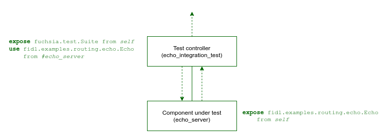

# Integration testing topologies

Integration testing scenarios involve two or more components operating in the
same realm and exchanging capabilities. While the majority of tests are unit
tests that span only a single component, integration testing scenarios call for
defining realm topologies and capability routes.

## Test Runner Framework integration

The integration test component integrates with the [Test Runner Framework][trf] by
including the test runner shard matching the supported language-specific testing framework.

* {Rust}

  ```json5
  
  ```

* {C++}

  ```json5
  
  ```

This shard provides two key elements:

1.  Expose the `fuchsia.test.Suite` protocol, required for the framework to
    discover and execute the test cases.
1.  Set the program `runner` to the test runner provided for the given testing
    framework.

## Test realm topology {#test-topology}

The integration test component declares the topology of the test realm with
itself as the parent. This allows the test controller to be responsible for
capability routing between components under test and their dependencies.

The following is an example topology for integration testing the `echo_server`
component:

<br><br>

This is a simple test realm that binds to the `fidl.examples.routing.echo.Echo`
protocol exposed by the `echo_server` component.
The `echo_integration_test` package contains the following components:

-   **echo_integration_test** - Test controller component
-   **echo_server** - Component under test

You can define the test realm topology in the following ways:

-   [Realm Builder](#realm-builder): Dynamically in code using the Realm Builder
    library.
-   [Component manifests](#static-cml): Statically using component manifest
    language (CML).

Use the following table to help determine which approach is best for your integration tests:

<table>
  <tr>
    <th>Integration test cases</th>
    <th>Realm Builder</th>
    <th>Static CML</th>
  </tr>
  <tr>
    <td>Simple integration tests with static dependencies</td>
    <td><span class="compare-yes"></span></td>
    <td><span class="compare-yes"></span></td>
  </tr>
  <tr>
    <td>Unique component instances for each test case</td>
    <td><span class="compare-yes"></span></td>
    <td><span class="compare-no"></span></td>
  </tr>
  <tr>
    <td>Lifecycle of components under test bound to each test case</td>
    <td><span class="compare-yes"></span></td>
    <td><span class="compare-no"></span></td>
  </tr>
  <tr>
    <td>Dynamic fake, mock, and stub instances for components under test</td>
    <td><span class="compare-yes"></span></td>
    <td><span class="compare-no"></span></td>
  </tr>
  <tr>
    <td>Dynamic routing and configuration between test cases</td>
    <td><span class="compare-yes"></span></td>
    <td><span class="compare-no"></span></td>
  </tr>
</table>

### Realm Builder {#realm-builder}

In cases where realm topology needs to be defined at runtime, or components
need to be replaced with local mock implementations, you can use the Realm Builder
library to create the topology dynamically in your test code.

Note: You can find the example code referenced in this section under
[`//examples/components/realm_builder`][dynamic-example].

The test controller component's manifest includes the Realm Builder library using
its component manifest shard:

* {Rust}

  ```json5
  
  ```

* {C++}

  ```json5
  
  ```

The test controller code constructs the test realm topology, adding `echo_server` as a
child component and declaring the necessary capability routes back to the parent:

* {Rust}

  ```rust
  

  // ...

  

  

  
  ```

* {C++}

  ```cpp
  

  // ...

  

  

  
  ```

The test controller code interacts with the `echo_server` through the capabilities
exposed by the created realm:

* {Rust}

  ```rust
  

  
  ```

* {C++}

  ```cpp
  

  
  ```

For complete details on implementing tests using Realm Builder, see the
[Realm Builder][realm-builder] developer guide.

### Component manifests {#static-cml}

In cases where all components in the test are static, you can define the entire topology
for the test realm declaratively using CML in the component manifest for the test controller.

Note: You can find the example code referenced in this section under
[`//examples/components/routing/integration_tests`][static-example].

The test controller component's manifest statically declares the `echo_server`
component under test as a child, and routes the necessary capabilities back to
the parent:

* {Rust}

  ```json5
  
  ```

* {C++}

  ```json5
  
  ```

The test controller code interacts with the `echo_server` through its exposed
capabilities:

* {Rust}

  ```rust
  
  ```

* {C++}

  ```cpp
  
  ```

## Test package {#test-package}

All components under test are included in the same **hermetic test package**.
This promotes the ability to run and update tests in different environments
without concern for dependencies falling out of sync.

See the following `BUILD.gn` file that defines a `fuchsia_test_package()` target for this example:

* {Rust}

  ```gn
  
  ```

* {C++}

  ```gn
  
  ```

Components are built into the `fuchsia_test_package()` using the following variables:

-   `test_components`: Components containing tests that expose the `fuchsia.test.Suite` protocol.
-   `deps`: Additional component dependencies required by the integration test.

For more details, see [Test package GN templates][test-packages].

## Test component monikers {#test-component-moniker}

A component's moniker identifies the unique instance in the component topology.
For components running inside of a test topology, the moniker path is relative to
the root component in the test realm. In the above example, the root component is
the test controller component that exposes the `fuchsia.test.Suite` protocol.

The child moniker format depends on your [test realm topology](#test-topology):

-   **Static CML**: Components declared statically as children of the root test controller
    are simply identified by their component `name`.
-   **Realm Builder**: Realm Builder introduces an intermediate collection between
    the test controller and child components. For more details on test component
    monikers with Realm Builder, see the [Realm Builder][realm-builder-monikers]
    developer guide.


[dynamic-example]: /examples/components/realm_builder/
[static-example]: /examples/components/routing/integration_tests/
[realm-builder]: /docs/development/testing/components/realm_builder.md
[realm-builder-monikers]: /docs/development/testing/components/realm_builder.md#test-component-moniker
[trf]: test_runner_framework.md
[test-packages]: /docs/development/components/build.md#test-packages
