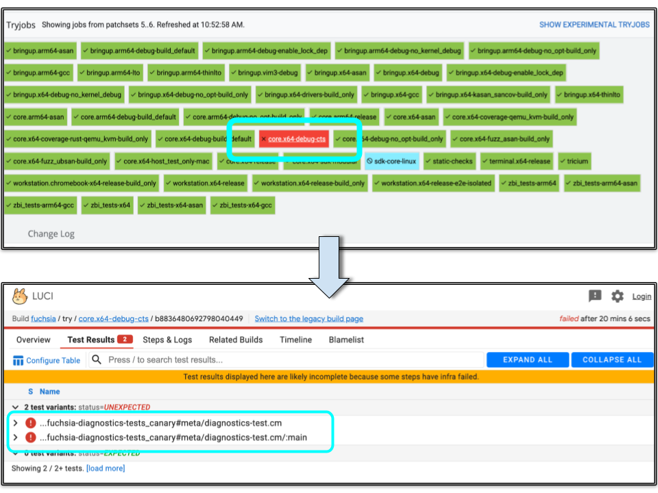

# Diagnosing CTS Test Failures

The Fuchsia Platform Surface Area (PlaSA) is defined as the set of ABIs and
APIs exposed by the Fuchsia SDK.  It is critical to maintain compatibility
between subsequent releases of the Fuchsia Platform in order to ensure existing
products and applications continue to operate correctly.

The Fuchsia Compatibility Test Suite (CTS) is one method of enforcing this
compatibility.  To learn more about how it works, please see the [CTS RFC][rfc15]
and the other pages on CTS in fuchsia.dev. This doc aims to help you understand
what to do if a CTS test fails in Fuchsia CQ.

## Understand how your CL has changed the Fuchsia PlaSA.

First, try to understand what part of the PlaSA has changed.  If you already
know, proceed to the next section.

CTS tests are designed to target a small part of the Fuchsia platform.  The
name and location of the failing test should be a good indication of what
changed.  In general (but not always), CTS tests will mirror their location
in the SDK directory.  Here are a few examples:

| Tests located at ... | Are testing ...|
|----------------------|----------------|
| //sdk/cts/fidl/fuchsia.diagnostics | //sdk/fidl/fuchsia.diagnostics |
| //sdk/cts/pkg/memfs | //sdk/lib/memfs |
| //sdk/cts/tools/package_manager | //src/sys/pkg/bin/pm |

You can find the name of the failing test by clicking on the
`core.x64-debug-cts` builder, and switching to the `Test Results` tab.

If the name of the test gives no indication of what changed in the platform
surface area, do a search of the [CTS directory](https://cs.opensource.google/fuchsia/fuchsia/sdk/cts).
The test code should live in a directory named after the PlaSA area it
validates.

If all else fails, please feel free to reach out to the [CTS team][cts team].

Note: TODO(http://fxbug.dev/85409): Test names may not clearly describe which
PlaSA elements they exercise. Link here a map of CTS test -> PlaSA elements.

Once you've located the test code, you can use it to understand why your CL
is causing it to fail.  If it was an unintentional change, simply update your
CL until the test no longer fails.  If it was intentional, however, you
have a couple of options on how to proceed:

  1. Perform a soft transition to the PlaSA
  2. Patch the test in all active CTS releases (WIP)

The sections below will describe these options in more detail.

## Resolving the issue

### **Option 1:** Perform a Soft Transition to the PlaSA

[RFC-0002][rfc2] describes our strategy for evolving the Fuchsia platform in a
backwards-compatible way.  Modifications to the public interface require a soft
transition whenever possible: new elements are added, users of the old elements
are migrated, then finally the old interface can be deprecated.

This is a multi-step process which may take weeks to complete.  We are working
to make this automatic and self-service, but please don't hesitate to reach out
to the [CTS team][cts team] if you have any questions.

#### **1) Add the new API and associated CTS tests**

*   Work with the [API council][api council] to ensure this new API is ready
for prime time.
*   Consider writing new CTS tests to cover your new API in full.
   *   This will be a requirement in the future, and will help the Fuchsia
Platform continue to evolve efficiently.

#### **2) Deprecate the old API**

*   Work with the SDK team to identify any downstream customers of the old API.
   *   Work with the associated SDK integrators to migrate them to the new API.
*   Finally, work with the [CTS team][cts team] to "pause" existing CTS tests.
   *   It may take weeks for the paused tests to be removed from all CTS
releases in CQ (until the next major Fuchsia Platform release)

#### **3) Remove the old API and associated CTS tests**

*   Once all CTS tests that touch the old API have been removed from the CTS
releases, you can successfully delete the API at TOT.

### **Option 2:** Patch the test in all active CTS releases (WIP)

If a given CTS test is testing too much (e.g. some internal implementation
details), or some other unique situation requires modifying the Fuchsia PlaSA
more frequently than the CTS release window supports, then the CTS tests in the
active CTS releases will need to be modified.

Note: TODO(fxbug.dev/86421): Needs design

Please reach out to the [CTS team][cts team] if this is required.

[rfc2]: /contribute/governance/rfcs/0002_platform_versioning.md
[rfc15]: /contribute/governance/rfcs/0015_cts.md
[api council]: /contribute/governance/api_council.md
[cts team]: https://bugs.fuchsia.dev/p/fuchsia/issues/entry?template=Fuchsia+Compatibility+Test+Suite+%28CTS%29
