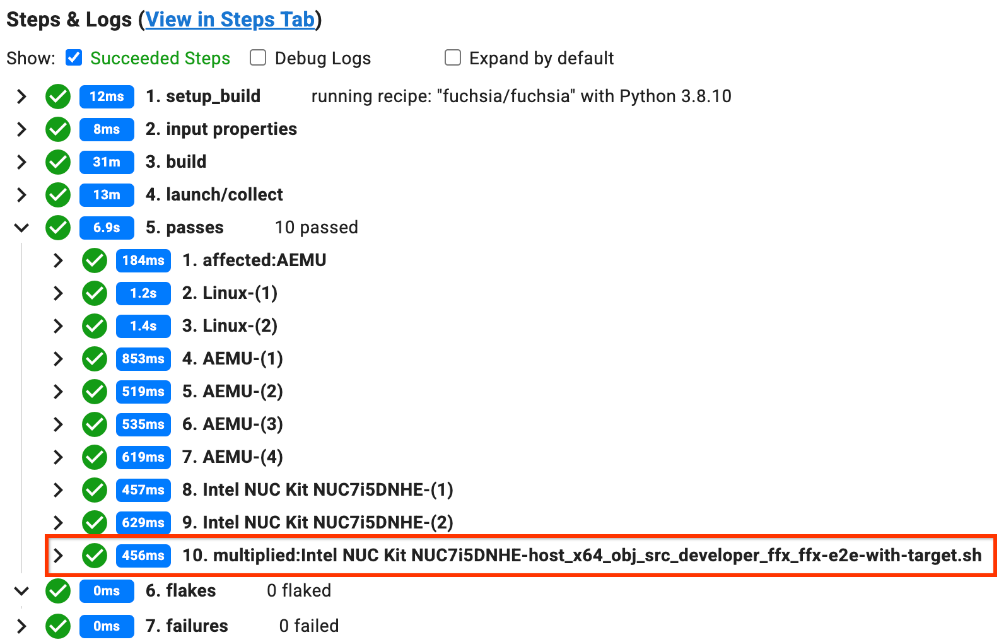

# Testing for flakiness in CQ

To test for flakiness in CQ, the infrastructure can run a test multiple
times and fail the overall build if there is a single failure. This
happens automatically when the infrastructure determines there's a small
number of tests affected by the commit being tested (according to the build
graph).

Change authors can tell the infrastructure to do this for specific tests
with a MULTIPLY field in the commit message.



Note: Multiplying internal tests on public changes is not allowed, to avoid
leaking confidential information. If you want to multiply an internal test,
use `fx make-integration-patch` to create an internal CL that patches your CL
into the integration repository. Then add the necessary MULTIPLY line to the
integration CL instead of the original public CL, and CQ+1 the integration
CL.



To multiply a test, use this format in your commit message:

```txt
MULTIPLY: test_name (os): run_count
```

For example:

```txt
MULTIPLY: foo_tests (fuchsia): 30
```

Note: "os" and "run_count" are both optional. For more examples,
see [Syntax examples](#multiply-examples).

Once you have specified multiply in your commit message, do a CQ dry run
(or choose a tryjob that runs your tests).
These tests show as separate shards for each test, which run that test
repeatedly until it fails, up to the specified run count. On most builders,
the timeout for running these tests is 40 minutes. If a test takes too long,
the shard may time out.

The test name can be any of the following:

* The test package URL (for fuchsia tests) or path (for host tests). This is
  the name that Flake Fetcher uses to refer to tests, and is seen in the
  "name" field of each entry in `out/default/tests.json`. That file is
  created after you run `fx set` inside of your Fuchsia directory.
* A regular expression (using Go's [regular expression
  syntax](https://github.com/google/re2/wiki/Syntax)) that matches the test
  name as described above. However, note that if a single multiplier matches
  more than 5 different tests, it is rejected (to prevent accidental
  DoSing). If this happens to you, simply edit your commit message locally or
  in the Gerrit UI to make your regular expression more specific.

The `os` field, if specified, should be either "fuchsia", "linux", or "mac".
If left unset, the multiplier matches any test, regardless of the test's
operating system, as long as the name matches.

If `run_count` is left unspecified, the infrastructure uses historical
test duration data to calculate a number of runs that produces a single
multiplied test shard whose duration is similar to the expected duration of
the other shards (although the calculated run count will be limited to a
maximum of 2000). Longer tests will run fewer times, while shorter tests
are run more times.

Note: When specifying `run_count`, it's important to have a space after the
colon and before the `run_count` so as to distinguish it from colons in the test
name. Otherwise the colon and `run_count` are treated as part of the test
name.

Note: If your change increases a test's duration, then the historical duration
data may no longer be accurate and the number of runs calculated by the
infrastructure may cause the shard to time out. In this case, you'll have to
edit the commit message and specify a lower number of runs.

## Determine success

When the infrastructure successfully parses the MULTIPLY command from
a comit message and applies it, any builds running the tests specified
by the MULTIPLY feature will add comments to the change that say:

```txt
A builder created multiplier shards. Click the following link for more details:
```

This comment includes a link to the build that runs the multiplied tests. If
the build is completed, you should see a step like `multiplied:<shard
name>-<test name>` under one of the `passes`, `flakes`, or `failures` steps. If
the build is not yet completed, you can click on the link under the `build` step
named `<builder name>-subbuild`, which will take you to the subbuild build page
where you should see a similar `multiplied` step. Since the comment doesn't
specify which tests were multiplied, you can look at the build pages to confirm
(in case you multiplied more than one test).

For example:



If no such comment appears, then there probably is an error with the syntax or
the test is unable to run in any of the regular CQ builders. In this case, you
have to either add it to the build graph so that it is run by one of the
builders or manually choose the tryjob that runs the test if it's run in an
optional builder.

## Syntax examples {#multiply-examples}

* Title-case "Multiply" can be used instead of all-caps "MULTIPLY":

  ```txt
  Multiply: foo_tests (fuchsia): 30
  ```

* If you leave out `os`, the multiplier is applied to any test that
  matches the multiplier name, regardless of operating system:

  ```txt
  Multiply: foo_tests: 30
  ```

* If you leave out the number of runs, the infrastructure calculates a
  number of runs that fill up exactly one shard:

  ```txt
  Multiply: foo_tests (linux)
  ```

* You can also omit both `OS` and the number of runs:

  ```txt
  Multiply: foo_tests
  ```

* To multiply more than one test, add extra "Multiply" lines:

  ```txt
  Multiply: foo_tests
  Multiply: bar_tests
  ```

* Comma-separated multipliers in a single line are also supported:

  ```txt
  Multiply: foo_tests: 5, bar_tests (fuchsia): 6
  ```

* You can reference Fuchsia tests by package URL and host tests by path:

  ```txt
  Multiply: fuchsia-pkg://fuchsia.com/foo_tests#meta/foo_tests.cmx
  Multiply: host_x64/bar_tests
  ```

* Regex and substring matching is also supported:

  ```txt
  Multiply: fuchsia.com/foo_tests
  ```

* This JSON syntax is also valid:

  ```json
  Multiply: `[
    {
      "name": "foo_bin_test",
      "os": "fuchsia",
      "total_runs": 30
    }
  ]`
  ```
