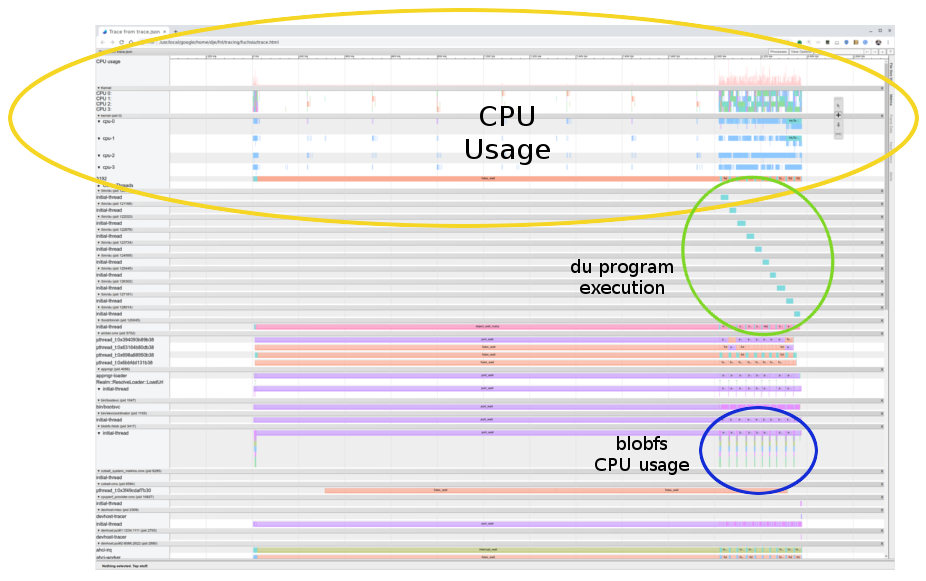
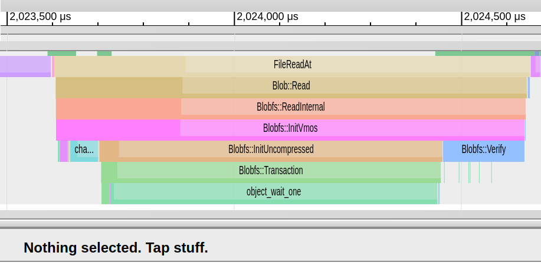
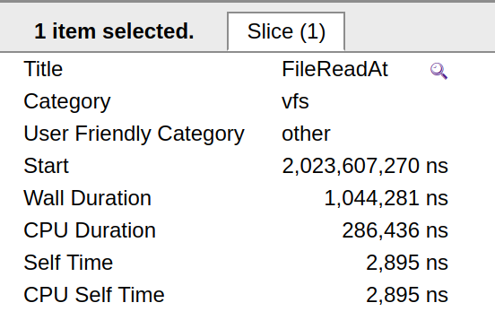
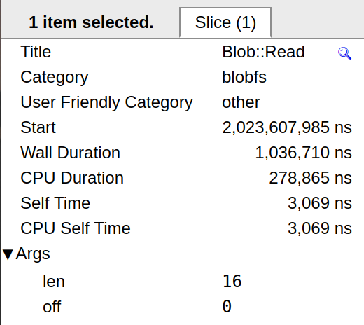

# Converting and visualizing a trace

The [Fuchsia trace system](/docs/concepts/kernel/tracing-system.md)
supports various file formats for recording traces. Each data format
requires a specific tool to visualize trace results.

## Prerequisites

Before you attempt to convert or analyze a trace file, make sure you've
[recorded a trace](/docs/development/tracing/tutorial/recording-a-fuchsia-trace.md).

## Fuchsia trace file formats

The following types of file formats can store Fuchsia trace data:

 * FXT (or [Fuchsia trace format](/docs/reference/tracing/trace-format.md)) is a binary format
   that is a direct encoding of the original trace data that is produced by
   the various programs. For more information, see [FXT trace](#fxt-trace).
 * JSON is used for viewing trace data on Chrome. For more information, see [JSON trace](#json-trace).
 * HTML is a standalone file that includes both the viewer and trace data. For
   more information, see [HTML trace](#html-trace).

## Convert Fuchsia trace files

To convert one or more files from FXT to JSON, run the following
command:

```posix-terminal
fx trace2json < <FXT_FILE> > trace.json
```

Replace `FXT_FILE` with a trace output file in FXT format, for example:

```none {:.devsite-disable-click-to-copy}
fx trace2json < trace.fxt > trace.json
```

## Visualize a trace

There are different ways to visualize a trace based on the format
of the trace:

* [FXT trace](#fxt-trace)
* [JSON trace](#json-trace)
* [HTML trace](#html-trace)

### FXT trace {#fxt-trace}

To visualize an FXT trace, use the
[Perfetto viewer](https://ui.perfetto.dev){:.external}, which also
allows you to use SQL to
[query your trace data](https://www.perfetto.dev/#/trace-processor.md){:.external}.

### JSON trace {#json-trace}

To visualize a JSON trace, use Chromium's
[Trace-Viewer](https://github.com/catapult-project/catapult/tree/HEAD/tracing){:.external}.
The viewer is built into [Chrome](https://google.com/chrome) and can be
loaded with `chrome://tracing`. For more information on Chrome's trace
viewer, see
[The Trace Event Profiling Tool](https://www.chromium.org/developers/how-tos/trace-event-profiling-tool){:.external}.

### HTML trace {#html-trace}

To generate an HTML trace (which is a viewer bundled with trace data), you need to run
`trace2html` from the [Chromium Catapult Repository](https://github.com/catapult-project){:.external}.

From the Catapult repository, run the following command:

```posix-terminal
./tracing/bin/trace2html <JSON_TRACE_FILE>
```

## Analyze a trace file {#analyze-a-trace-file}

Note: The instructions in this section detail how to visualize
an [JSON trace](#json-trace) with a Chrome browser.

To analyze a JSON trace file:

1. Open a new tab in Chrome.
2. Navigate to `chrome://tracing`.
3. Click the **Load** button.
4. Open your JSON trace file.

### Navigation controls

As there is a lot of information in a trace file, there are some useful
keyboard shortcuts that you can use:

Note: Near the top right of the page, there is a small **?** icon that you
can click to see help information.

 * `w` and `s`: Zoom in and zoom out, respectively. The zoom function is
   based on the current position of your mouse.
 * `W` and `S`: Zoom in and zoom out at a larger scale, respectively. The
   zoom function is based on the current position of your mouse.
 * `a` and `d`: Pan left and right, respectively.
 * `A` and `D`: Pan left and right at a larger scale, respectively.
 * You can deselect specific process rows to remove processes that aren't
   important for your current trace. To deselect a specific process row,
   click the **x** in the right corner of the process row.

### Interpret the trace data {#interpret-the-trace-data}

The example in this section shows a trace of what the system is doing
while running the `du` command, which shows disk usage.

Before you can record trace data, you must start a Fuchsia instance. From
your host, if you don't have a Fuchsia target device, you can start a
Fuchsia emulator with networking:

Note: For more information on getting started with Fuchsia, see
[Fuchsia](/docs/get-started/README.md).

```posix-terminal
ffx emu --net tap
```

This command configures and starts the Fuchsia emulator.

To record a trace of `du`, do the following:

1. In a new terminal, run `ffx trace start`:

   Note: For more information on recording a trace in Fuchsia, see
   [Recording a Fuchsia trace](/docs/development/tracing/tutorial/recording-a-fuchsia-trace.md).

   ```posix-terminal
   ffx trace start --buffer-size 64 --categories all
   ```

   This command sets a recording buffer size of 64 megabytes and
   records all tracing categories.

2. In the Fuchsia emulator's terminal, run the following command:

   ```sh
   /boot/bin/sh -c "'\
      sleep 2 ;\
      i=0 ;\
      while [ \$i -lt 10 ] ;\
      do /bin/du /boot ;\
          i=\$(( \$i + 1 )) ;\
      done'"
   ```

   This command runs `du` in a loop,

   Note: For more information on creating a process in Fuchsia, see
   [Process creation](/docs/concepts/process/process_creation.md).

3. To finish the tracing, press `Enter` key in the terminal
   on your host machine.

   When the tracing is finished, it generated an FXT file,

4. Convert this FXT file to JSON:

   ```posix-terminal
   fx trace2json < trace.fxt > trace.json
   ```

5. Generate an HTML trace (see [HTML Trace](#html-trace) above):

   ```posix-terminal
   ./tracing/bin/trace2html trace.json
   ```



A trace file has a lot of information including a time scale near the top of
the trace. In this example, the whole trace lasted about 2.5 seconds.

#### CPU usage {#cpu-usage}

The region marked by the yellow circle shows the CPU usage area where
you can see the overall CPU usage on all CPU cores.

#### Program execution {#program-execution}

The region marked by the green circle shows the program execution.

In this example, you can see 10 invocations of the `du` program, which is
expected since the trace was recorded during a loop of `du`. Therefore,
you can see 10 different `du` process IDs, one after the other.


#### blobfs CPU usage {#blobfs-cpu-usage}

The region marked by the blue circle shows the CPU usage to write to the
blobstore filesystem (blobFS).

In this example, you can see little bursts of CPU time that are each related
to an invocation of `du`.

At this high level, it can be difficult to determine the exact correlation
between the CPU usage and the filesystem:

* Is the CPU usage caused by the loading of `du` from the filesystem?
* Is the CPU usage caused by the execution `du` as it runs through the target
  filesystem to see how much space is in use?

You can zoom in on specific areas of this region to determine the correlation
between the CPU usage and the filesystem.


In this example, you can see just two `du` executions (the first is marked
with a green circle). The first `blobfs` CPU burst actually consists of
three main clusters and some smaller spikes. Subsequent `blobfs` CPU bursts
have two clusters.

From analyzing this example, you can see that the `blobfs` bursts happen
before the `du` program is executed. This information shows that the
`blobfs` bursts are not due to the `du` program reading the filesystem.
Instead, it shows that the bursts are due to loading the `du` program.

You are now ready to dive further into what is causing the `blobs` bursts.



In this example, notice the time scale that spans a time period from 2,023,500
microseconds to just past 2,024,500 which indicated a time scale of about
1 millisecond.

During that millisecond, `blobfs` executed code, starting with a process
identified as `FileReadAt`, which then called `Blob::Read`, which
then called `Blob::ReadInternal`.

To correlate this information with the code, you can click on parts
of the report for more detailed information about a specific object.

If you click on `FileReadAt`, you can see the following information:



This information tells you the following:

*  The trace category for `FileReadAt` is `vfs`.
*  The length of time of the function execution.

Note: For information on how tracing is performed for `FileReatAt`,
see [//src/lib/storage/vfs/cpp/connection.cc](/src/lib/storage/vfs/cpp/connection.cc).

If you click on `Blob::Read`, you can see the following information:



Note: For information on how tracing is performed for `Blob::Read`,
see [//src/storage/blobfs/blob.cc](/src/storage/blobfs/blob.cc).

The code for `Blob::Read` is:

```cpp
zx_status_t Blob::Read(void* data,
                       size_t len,
                       size_t off,
                       size_t* out_actual) {
    TRACE_DURATION("blobfs", "Blob::Read", "len", len, "off", off);
    LatencyEvent event(&blobfs_->GetMutableVnodeMetrics()->read,
                       blobfs_->CollectingMetrics());

    return ReadInternal(data, len, off, out_actual);
}
```

This code calls calls the `TRACE_DURATION()` macro with the category of `blobfs`,
a name of `Blob::Read`, and a length and offset key and value pairs. All
of this information is recorded in the trace file.

After analyzing these examples, you can still see additional objects that
are being traced.
