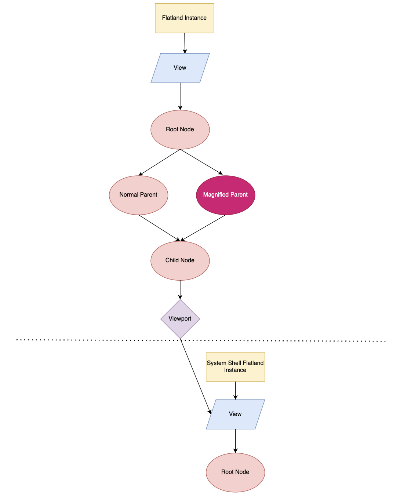

# Flatland Magnification

Magnification is an accessibility feature that allows clients to upscale rendered content
as aid for people with visual impairments. For instance, a small region centered around
the user’s cursor would be shown at a higher scale somewhere else on the display - and that
area would move as the cursor itself moves. There is also the case of full screen magnification,
where as the name suggests, the magnified region would be rendered over the whole display.

## Design

Flatland actually has no explicit notion of "magnification" in its API. Instead, magnification
can be achieved by taking advantage of the flexibility of the Flatland scenegraph, namely, the
ability for a transform node to scale its subtree and for a node to have multiple parent nodes.

## Partial Magnification

Flatland traverses the scene graph in a depth-first manner in order to generate the final data lists
to be sent to the renderer. A node with two parents will be traversed twice, and thus will show up
twice in the final data list, with each instance inheriting a different set of global data depending
on which parent was traversed for that instance. Because render data is duplicated, it is important
to be aware of performance. Content behind fullscreen renderables will also be culled, which helps
with this performance concern.

Thus for magnification, clients can set up a multiparented scene graph, where one parent contains a
scale factor that magnifies all of the instances generated from Flatland traversing down its
specific sub-hierarchy. This magnification node can be modified dynamically to suit the needs of the
client. For instance, if the magnified region needs to follow the cursor, then the translation
component of the magnification node can be updated based on the cursor position to create the effect
of a moving magnified region on the screen.

## Fullscreen Magnification

In the case of full-screen magnification, we can get by with a single parent node scaled
up to the desired level of magnification. The layout information provided to clients for a
particular view will not be affected by the scale factor applied to a parent magnification node.

## Pseudocode

Here is some example code demonstrating how to set up a scene for partial magnification.

    // Create transform IDs.
    const TransformId kIdRoot = {1};
    const TransformId kIdParent1 = {2};
    const TransformId kIdParent2 = {3};
    const TransformId kIdChild = {4};

    // Create the transforms.
    flatland->CreateTransform(kIdRoot);
    flatland->CreateTransform(kIdParent1);
    flatland->CreateTransform(kIdParent2);
    flatland->CreateTransform(kIdChild);

    // Scale up the magnification parent node.
    flatland->SetScale(kIdParent2, {20, 20});

    // Setup the diamond parent hierarchy.
    flatland->SetRootTransform(kIdRoot);
    flatland->AddChild(kIdRoot, kIdParent1);
    flatland->AddChild(kIdRoot, kIdParent2);
    flatland->AddChild(kIdParent1, kIdChild);
    flatland->AddChild(kIdParent2, kIdChild);

    // Present flatland.
    flatland->Present(/*args*/);