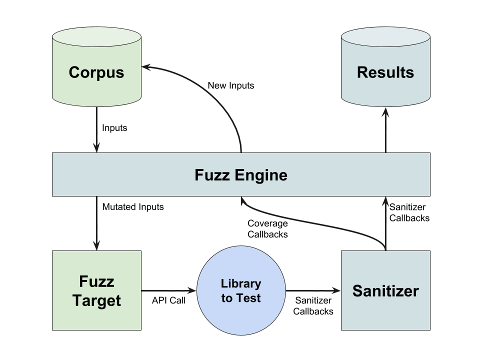

# LibFuzzer in Fuchsia

## tl;dr:

1. Implement [LLVMFuzzerTestOneInput](#q-what-do-i-need-to-write-to-create-a-fuzz-target-) to pass
data to your library.
1. Add a fuzzer:
  * Fuchsia: Add a [`fuzz-target`][gn fuzz target] and [`fuzz-package`][gn fuzz package] to the
  library's BUILD.gn
  * Zircon: Add a [`fuzztest`](#q-how-do-i-create-a-zircon-fuzzer-) to the library's rules.mk.
1. `fx set --fuzz-with asan`, `fx build`, and boot.
1. Run `fx fuzz list` to display fuzzers.
1. Run `fx fuzz start <fuzzer>` to start a fuzzer.
1. Run `fx fuzz check <fuzzer>` to see if the fuzzer found crashes.
1. Run `fx fuzz repro <fuzzer> [crash]` to replay a crash.
1. File and fix bugs!

[TOC]

## Q: What is fuzzing?

A: Fuzzing or fuzz testing is style of testing that stochastically generates inputs to targeted
interfaces in order to automatically find defects and/or vulnerabilities.  In this document,
a distinction will be made between two components of a fuzzer: the fuzzing engine, which produces
context-free inputs, and the fuzzing target, which submits those inputs to a specific interface.

Among the various styles of fuzzing, coverage-based fuzzing has been shown to yield a particularly
high number of bugs for the effort involved.  In coverage-based fuzzing, the code under test is
instrumented for coverage. The fuzzing engine can observe when inputs increase the overall code
coverage and use those inputs as the basis for generating further inputs.  This group of "seed"
inputs is collectively referred to as a corpus.

## Q: What is libFuzzer?

A: [LibFuzzer] is an in-process fuzzing engine integrated within LLVM as a compiler runtime.
[Compiler runtimes][compiler-rt] are libraries that are invoked by hooks that compiler adds to the
code it builds.  Other examples include [sanitizers] such as [ASan], which detects certain overflows
and memory corruptions. LibFuzzer uses these sanitizers both for [coverage data][sancov] provided by
sanitizer-common, as well as to detect when inputs trigger a defect.

## Q: What do I need to write to create a fuzz target?

A: LibFuzzer can be used to make a coverage-based fuzzer by combining it with a sanitized library
and the implementation of the [fuzz target] function:

```cpp
extern "C" int LLVMFuzzerTestOneInput(const uint8_t *Data, size_t Size) {
  // Use the data to do something interesting with your API
  return 0;
}
```
Optionally, you can also add an initial corpus.  Without it, libFuzzer will start from an empty
fuzzer and will (eventually) learn how to make appropriate inputs [on its own][thin-air].

LibFuzzer then be able to generate, submit, and monitor inputs to the library code:


Developer-provided components are in green.

## Q: What should I fuzz with libFuzzer?

A: Coverage based fuzzing works best when fuzzing targets resemble unit tests.  If your code
is already organized to make it easy to unit test, you can add targets for each of the interfaces
being tested., e.g. something like:

```cpp
  // std::string json = ...;
  Metadata metadata;
  EXPECT_TRUE(metadata.Parse(json));
```

becomes:

```cpp
extern "C" int LLVMFuzzerTestOneInput(const uint8_t *Data, size_t Size) {
  std::string json(static_cast<const char *>(Data), Size);
  metadata.Parse(json);
  return 0;
}
```

With a corpus of JSON inputs, `Data` may be close to what the `Metadata` object expects to parse.
If not, the fuzzer will eventually discover what inputs are meaningful to it through random
mutations, trial and error, and code coverage data.

### Q: How do I fuzz more complex interfaces?

A: It is easy to map portions of the provided `Data` to ["plain old data" (POD)][pod] types.  The
data can also be sliced into variable length arrays. More complex objects can almost always be
(eventually) built out of POD types and variable arrays. If `Size` isn't long enough for your needs,
you can simply return `0`.  The fuzzer will quickly learn that inputs below that length aren't
interesting and will stop generating them.

```cpp
  uint32_t flags;
  char name[MAX_NAME_LEN];
  if (Size < sizeof(flags)) {
    return 0;
  }
  memcpy(&flags, Data, sizeof(flags));
  Data += sizeof(flags);
  Size -= sizeof(flags);

  size_t name_len;
  if (Size < sizeof(name_len)) {
    return 0;
  }
  memcpy(&name_len, Data, sizeof(name_len));
  Data += sizeof(name_len);
  Size -= sizeof(name_len);
  name_len %= sizeof(name_len) - 1;

  if (Size < name_len) {
    return 0;
  }
  memcpy(name, Data, name_len);
  Data += name_len;
  Size -= name_len;
  name[name_len] = '\0';

  Parser parser(name, flags);
  parser.Parse(Data, Size);
```

*__NOTE__: A small library to make this easier is under development.*

In some cases, you may have expensive set-up operations that you would like to do once.  The
libfuzzer documentation has tips on how to do [startup initialization].  Be aware though that such
state will be carried over from iteration to iteration.  This can be useful as it may expose new
bugs that depend on the library's persisted state, but it may also make bugs harder to reproduce
when they depend on a sequence of inputs rather than a single one.

### Q: How should I scope my fuzz targets?

A: In general, an in-process coverage-based fuzzer, iterations should be __short__ and __focused__.
The more focused a fuzz target is, the faster libfuzzer will be able to find "interesting" inputs
that increase code coverage.

At the same time, becoming __too__ focused can lead to a proliferation of fuzz targets.  Consider the
example of a routine that parses incoming requests.  The parser may recognize dozens of different
request types, so developing a separate fuzz target for each may be cumbersome.  An alternative in
this case may be to develop a single fuzzer, and include examples of the different requests in the
initial [corpus].  In this way the single fuzz target can still bypass a large amount of shallow
fuzzing by being guided towards the interesting inputs.

*__NOTE:__ Currently, libFuzzer can be used in Fuchsia to fuzz C/C++ code.   Additional language
support is [planned][todo].*

## Q: LibFuzzer isn't quite right; what else could I use?

A: There's many other fuzzing engines out there:
* If the code you want to fuzz isn't a library with linkable interfaces, but instead a standalone
binary, then [AFL] may be a be better suited.
  * *__NOTE:__ AFL support on Fuchsia is [not yest supported][todo].*
* If you want to fuzz a service via [FIDL] calls in the style of an integration test, consider using
[syzkaller]'s FIDL support.
  * *__NOTE:__ FIDL support is in [early development][todo].*
* If none of these options fit your needs, you can still write a custom fuzzer and have it run
continuously under [ClusterFuzz].
  * *__NOTE:__ ClusterFuzz integration is in [early development][todo].*

## Q: How do I create a Fuchsia fuzzer?

A: First, create your [fuzz target].  It's recommended that the fuzzer's target is clear from file
name.  If the library code already has a directory for unit tests, you should use a similar
directory for your fuzzing targets.  If not, make sure the file's name clearly reflects it is a
fuzz test.  In general, use naming and location to make the fuzzing target easy to find and its
purpose clear.

_Example:_ A fuzz target for `//garnet/lib/cmx` might be located at
`//garnet/lib/cmx/cmx_fuzztest.cc`, to match `//garnet/lib/cmx/cmx_unittest.cc`.

Libfuzzer already [provides tips][fuzz target] on writing the fuzz target itself.

Next, add the build instructions to the library's BUILD.gn file.  Adding an import to
[//build/fuzzing/fuzzer.gni][fuzzer.gni] will provide two templates:

### The fuzz-target GN template

The `fuzz-target` [template][fuzzer.gni] is used to build the fuzzer executable.  Given a fuzzing target as a
source and a the library under test as a dependency, it will provided the correct [compiler flags]
to link against the fuzzing engine:

```python
fuzz_target("cowsay_simple_fuzzer") {
  sources = [ "cowsay_fuzztest.cpp" ]
  deps = [ ":cowsay_sources" ]
}
```

It also enables the  `FUZZING_BUILD_MODE_UNSAFE_FOR_PRODUCTION` [build macro].  If the software
under test needs fuzzing-specific modifications, they can be wrapped in a preprocessor conditional
on this macro, e.g.:

```cpp
#ifdef FUZZING_BUILD_MODE_UNSAFE_FOR_PRODUCTION
  srand(++global_counter);
  rand_int = rand();
#else
  zx_cprng_draw(&rand_int, size_of(rand_int));
#endif
```

This can be useful to allow either more deterministic fuzzing and/or deeper coverage.

The fuzz-target template also allows you include additional inputs to control the fuzzer:
* Seed [corpora][corpus] are digests or source paths (described in more detail
[below][3p-corpus]).
* [Dictionaries] are files with tokens, one per line, that commonly appear in the target's input,
e.g. "GET" and "POST" for HTTP.
* An options file, made up a series of key-value pairs, one per line, of libFuzzer command line
[options].

```python
fuzz_target("cowsay_simple_fuzzer") {
  sources = [ "cowsay_fuzztest.cpp" ]
  deps = [ ":cowsay_sources" ]
  corpora = [ "e3b0c44298fc1c149afbf4c8996fb92427ae41e4649b934ca495991b7852b855" ]
  dictionary = "test_data/various_moos.dict"
  options = "test_data/fuzzer.opts"
}
```

The `merge`, `jobs`, `dict`, and `artifact_prefix` are set automatically when using the [fuzz tool]
described below, and do not need to be specified unless they differ from the defaults.

### The fuzz-package GN template

The `fuzz-package` [template][fuzzer.gni] bundles fuzz-targets into Fuchsia packages in the same way that normal
packages bundle binaries.  In addition, the `fuzz-package` template provides a way to specify which
sanitizers can be used with the given fuzzing targets:

```python
fuzz_package("cowsay_fuzzers") {
  targets = [ ":cowsay_simple_fuzzer" ]
  sanitizers = [ "asan", "ubsan" ]
}
```

Once this is defined, a package manifest needs to reference this package the usual way.  If the
package already has a package manifest under `packages/tests` for the appropriate layer, it may be
added there:

```json
{
    "imports": [
        "garnet/packages/prod/boringssl"
    ],
    "packages": [
        "//third_party/boringssl:boringssl_tests",
        "//third_party/boringssl:boringssl_fuzzers"
    ]
}
```

__IMPORTANT__: The build system will build the fuzz targets __only__ if it is explicitly told to
instrument them for fuzzing with an appropriate sanitizer.  The easiest way to achieve this is using
the `--fuzz-with <sanitizer>` flag with `fx set`, e.g:
```
$ fx set x64 --fuzz-with asan --packages garnet/packages/tests/all
$ fx full-build
```

This will build all the fuzz targets in fuzz packages that support [ASan] and are referenced by the
Garnet's test package manifests. If you prefer, you can add the `select_variant` statement directly
to your `args.gn` file, e.g.:

```python
select_variant = [
  {
    variant = "asan-fuzzer"
    target_type = [ "fuzzed_executable" ]
  },
]
```

## Q: How do I create a Zircon fuzzer?

A: It depends on what you're trying to fuzz:
* For fuzzing the Zircon kernel, see [syzkaller].
* For fuzzing the Zircon SDK, create a normal [Fuchsia fuzzer](#q-how-do-i-create-a-fuchsia-fuzzer-)
in Garnet, i.e. under `//garnet/tests/zircon/`.

Otherwise, the library interfaces are not exposed by the SDK, and the [fuzz target] needs to reside
in Zircon as well.  Write the target and save it with a file name that contains both the target and
the word "fuzz" and place it in the appropriate system/utest directory, e.g.
`//zircon/system/utest/hid-parser/hid-parser-fuzztest.cpp`.

Add a fuzz test declaration in the
corresponding rules.mk; e.g.:
```sh
MODULE := $(LOCAL_DIR).fuzztest
MODULE_TYPE := fuzztest
MODULE_NAME := hid_parser_fuzztest # Matches fuzz_target in BUILD.gn
MODULE_SRCS = $(LOCAL_DIR)/hid-parser-fuzztest.cpp
MODULE_LIBS = system/ulib/c system/ulib/fdio
```

*__NOTE__: There are [open issues][TC-241] around how Garnet drivers are built and linked into
Zircon.  The following is a temporary workaround until those issues are resolved.*

The resulting fuzz tests can be run directly (look under `/boot/test/fuzz`), but to use the full
fuzzing tools, it is easier to run the Zircon fuzzers as part of a Fuchsia build.  To accomplish
this, first add the Zircon fuzzer to the special `zircon_fuzzers` package defined in
`//garnet/tests/zircon/BUILD.gn`.  You can use this to add seed [corpora][corpus], [dictionaries],
and/or an [options] file as normal in a [GN fuzz target], e.g:
```python
fuzz_target("hid_parser_fuzztest") { # Matches MODULE_NAME in rules.mk
  corpora = [ "e3b0c44298fc1c149afbf4c8996fb92427ae41e4649b934ca495991b7852b855" ]
  dictionary = "//zircon/system/utest/hid-parser/hid-parser-fuzztest.dict"
  options = "//zircon/system/utest/hid-parser/hid-parser-fuzztest.options"
}

fuzz_package("zircon_fuzzers") {
  omit_binaries = true
  sanitizers = [ "asan" ]
  targets = [
    "hid_parser_fuzztest",
    ...
  ]
}
```

Build this package as you would any other fuzz package, and finally use the `fx fuzz zbi` command to
include the correct dependencies for you Zircon fuzzer in a Fuchsia build:

```sh
$ fx set x64 --fuzz-with asan --packages garnet/packages/garnet --packages garnet/packages/tests/zircon
$ fx full-build
$ fx fuzz zbi
```

Boot normally.  `fx fuzz list` should detect the Zircon fuzzers.

*__NOTE:__ This workflow will build the Zircon fuzzers with ASan. Other sanitizers, like UBSan, are
[not yet supported][todo] in Zircon.*

*__NOTE__: This workflow will build the Zircon fuzzers with SanCov instrumentation only. Zircon has
an [open issue][SEC-144] which prevents full coverage instrumentation from being enabled. The
fuzzers will work, albeit with reduced corpus precision.*

Finally, if needed you can run the `fuzz` tool (without the `fx`) directly from the Zircon command
line.

## Q: How do I run a fuzzer?

A: The fuzzer binary can be started directly, using the normal libFuzzer options, if you prefer.
However, it is easier to use the `fuzz` tool, which understands where to look for fuzzing related
files and knows various common options.  Try one or more of the following:
```sh
$ fuzz help # to see the command usage
$ fuzz list # to see available fuzzing targets.
$ fuzz start [package]/[target] # to start a fuzzer.
```

`package` and `target` match those reported by `fuzz list`, and may be abbreviated.  For commands
that accept a single fuzzer, e.g. `start`, the abbreviated name must uniquely identify exactly one
fuzzer.

A small devshell wrapper also exists as `fx fuzz`.  This tool will use SSH to run the `fuzz` tool,
and background long running tasks, e.g.:
* `fx fuzz list` returns the list of fuzzers immediately
* `fx fuzz start [package]/[target]` starts a fuzzer in the background and returns.

If you do prefer to run the fuzzer directly, note that the `fuzz` tool echoes the command it is
invoking on startup.  Look for the line starting with `+`.

## Q: How can I reproduce crashes found by the fuzzer?

A: Explicit inputs can be passed to libFuzzer to execute [without mutation][options].

If using the `fuzz` tool, the "artifact prefix" will be `/data/fuzzing/<package>/<target>`. All
inputs that the fuzzer finds "interesting" will be saved as `<artifact_prefix>/<type>-<sha1>`, e.g.
if "foo" caused the Zircon fuzztest `bar-fuzztest` to consume an excessive amount of memory (as
determined by [rss_limit_mb][options]), the file
`/data/fuzzing/zircon_fuzzers/bar-fuzztest/oom-8843d7f92416211de9ebb963ff4ce28125932878` will
contain "foo".

The easiest way to get a list of crashes found is `fuzz check [package]/[target]`.

The easiest way to reproduce a crash is to run `fuzz repro [package]/[target] [crash]`.  As with
`package` and `target`, crash may be abbreviated, e.g. `fuzz bar oom` will run the
`zircon-fuzzers/bar-fuzztest` with every input that caused excessive memory usage, but none that
caused a crash, leaked memory, timed out, etc.

As with `fuzz start`, the fuzzer will echo the command it is invoking, prefixed by `+`.  This can be
useful if you need to manually reproduce the bug with modified parameters.

## Q: What should I do with these bugs?

A: File them, then fix them!

*__NOTE:__ The bug tracker is currently only open to Googlers.*

When filing bugs, please use both the custom `found-by-fuzzing` label, as well as the custom
`Sec-TriageMe` label.  This will help the security team see where fuzzers are being used and stay
aware of any critical issues they are finding.

As with other potential security issues, bugs should be filed __in the project of the code under
test__ (and __not__ in the [security project]).  Conversely, if you encounter problems or
shortcomings in the fuzzing framework _itself_, please __do__ open bugs or feature requests in the
[security project] with the label `fuzzing`.

As with all potential security issues, don't wait for triage to begin fixing the bug!  Once fixed,
don't forget to link to the bug in the commit message.  This may also be a good time to consider
minimizing and uploading your corpus at the same time (see the next section).

## Q: How do I manage my corpus?

A: When you first begin fuzzing a new target, the fuzzer may crash very quickly.  Typically, fuzzing
has a large initial spike of defects found followed by a long tail.  Fixing these initial, shallow
defects will allow your fuzzer to reach deeper and deeper into the code. Eventually your fuzzer will
run for several hours (e.g. overnight) without crashing.  At this point, you will want to save the
corpus:

1. First, minimize the corpus using `fx fuzz merge [package]/[target]`.  This will instruct the
fuzzer to use the current corpus instead of looking for new inputs.  It will run repeatedly to find
the most compact set of inputs with the same coverage as the current corpus. As this may take a long
time, you may want to provide a `max_total_time` [option][options] (perhaps again running
overnight).

1. Once complete, you can upload the corpus using `fx fuzz store [package]/[target]`.  This will
store the corpus in [CIPD].  Each fuzz target will have its own corpus CIPD package, organized by
fuzz package.  Take note of the corpus digest that is printed when the corpus is stored; it is used
as the package version.

1. Add the digest from the previous step to the `fuzz-target` in the appropriate BUILD.gn file, and
submit the resulting CL.  This creates a clear association between the state of the corpus and the
state of the source code at various points in time.

1. When deploying your fuzzer to a different instance of Fuchsia, you can install the latest version
of the target's corpus in [CIPD] using `fx fuzz fetch [package]/[target]`.  To use a specific
version of the corpus, you may add the version digest, e.g.
`fx fuzz fetch [package]/[target] digest`.

## Q: Can I use an existing third party corpus?

A: Yes! The `corpora` list in the `fuzz-target` [template][fuzzer.gni] can contain either digests or
source paths.  In general, `git` isn't the best way to store fuzzing corpora, which typically contain
many small binary files that may change dramatically over time.  Still, if you have a fuzzing
corpus already, perhaps as part of a third party project, you can provide the source path to it,
e.g. `corpora = [ "//third_party/boringssl/src/fuzz/bn_div_corpus" ]`.

Running `fx fuzz fetch [package]/[target]` will pull the corpus from the source location and install
it.  Subsequently running `fx fuzz store [package]/[target]` will store this corpus in [CIPD]. If
you need to submit this corpus back upstream, you can save a local copy by explicitly setting the
local "staging" directory, e.g. `fx fuzz -s <source-path> store [package]/[target]`.

## Q: How do make my fuzzer better?

A: Once crashes begin to become infrequent, it may be because almost all the bugs have been
fixed, but it may also be because the fuzzer isn't reaching new code that still has bugs.  Code
coverage information is needed to determine the quality of the fuzzer.  Use
[source-based code coverage] to see what your current corpus reaches.
  * *__NOTE:__ Source-based code coverage is under [active development][todo].*

If coverage in a certain area is low, there are a few options:
  * Improve the [corpus].  If there are types of inputs that aren't represented well, add some
  manually.  For code dealing with large inputs with complex types (e.g. X.509 certificates), you
  probably want to provide an initial corpus from the start.
  * Add a [dictionary][dictionaries].  If the code deals with data that has a certain grammar (e.g.
  HTML), adding that grammar in a dictionary allows the fuzzer to produce more meaningful inputs
  faster.
  * Disable uninteresting shallow checks.  A function that verifies a checksum before proceeding is
  hard to fuzz, even though a maliciously crafted input may be easy enough to construct.  You can
  disable such checks by wrapping them in the `FUZZING_BUILD_MODE_UNSAFE_FOR_PRODUCTION`
  [build macro] described [above][gn fuzz target].

The "run, merge, measure, improve" steps can be repeated for as many iterations as you feel are
needed to create a quality fuzzer.  Once ready, you'll need to upload your corpus and update the
[GN fuzz target] in the appropriate project.  At this point, others will be able use your fuzzer,
This includes [ClusterFuzz] which will automatically find new fuzzers and continuously fuzz them,
updating their corpora, filing bugs for crashes, and closing them when fixed.
  * *__NOTE:__ ClusterFuzz integration is in [early development][todo].*

## Q: What can I expect in the future for fuzzing in Fuchsia?

A: As you can see from the various notes in this document, there's still plenty more to do!
* Add additional language support, e.g for [Rust][rust-fuzzing] and [Go][go-fuzzing].
* Add support for [AFL]  on Fuchsia.  Some design questions need to be worked out, as processes will
not typically be run executed from the shell in the long term.
* Continue work on fuzzing FIDL via [syzkaller].
* Integrate with [ClusterFuzz].  Eventually this *may* be extended to include [OSS-Fuzz] as well.
* Add support to Zircon for additional sanitizers, such as [UBSan].
* Finalize corpus storage.
* Provide source-based code coverage.

We will continue to work on these features and others, and update this document accordingly as they
become available.

[libfuzzer]: https://llvm.org/docs/LibFuzzer.html
[compiler-rt]: https://compiler-rt.llvm.org/
[sanitizers]: https://github.com/google/sanitizers
[asan]: https://clang.llvm.org/docs/AddressSanitizer.html
[sancov]: https://clang.llvm.org/docs/SanitizerCoverage.html
[fuzz target]: https://llvm.org/docs/LibFuzzer.html#fuzz-target
[afl]: http://lcamtuf.coredump.cx/afl/
[FIDL]: ../languages/fidl/README.md
[syzkaller]: https://github.com/google/syzkaller
[todo]: #q-what-can-i-expect-in-the-future-for-fuzzing-in-fuchsia-
[thin-air]: https://lcamtuf.blogspot.com/2014/11/pulling-jpegs-out-of-thin-air.html
[startup initialization]: https://llvm.org/docs/LibFuzzer.html#startup-initialization
[fuzzer.gni]: https://fuchsia.googlesource.com/build/+/master/fuzzing/fuzzer.gni
[build macro]: https://llvm.org/docs/LibFuzzer.html#fuzzer-friendly-build-mode
[compiler flags]: https://fuchsia.googlesource.com/build/+/master/config/sanitizers/BUILD.gn
[corpus]: https://llvm.org/docs/LibFuzzer.html#corpus
[3p-corpus]: #q-can-i-use-an-existing-third-party-corpus-
[dictionaries]: https://llvm.org/docs/LibFuzzer.html#dictionaries
[options]: https://llvm.org/docs/LibFuzzer.html#options
[fuzz tool]: #q-how-do-i-run-a-fuzzer-
[gn fuzz target]: #the-fuzz-target-gn-template
[gn fuzz package]: #the-fuzz-package-gn-template
[source-based code coverage]: https://clang.llvm.org/docs/SourceBasedCodeCoverage.html
[clusterfuzz]: https://github.com/google/oss-fuzz/blob/master/docs/clusterfuzz.md
[rust-fuzzing]: https://github.com/rust-fuzz/libfuzzer-sys
[go-fuzzing]: https://github.com/dvyukov/go-fuzz
[ubsan]: https://clang.llvm.org/docs/UndefinedBehaviorSanitizer.html
[oss-fuzz]: https://github.com/google/oss-fuzz
[cipd]: https://chrome-infra-packages.appspot.com/p/fuchsia/test_data/fuzzing
[sec-144]: https://fuchsia.atlassian.net/browse/SEC-144
[tc-241]: https://fuchsia.atlassian.net/browse/TC-241
[pod]: http://www.cplusplus.com/reference/type_traits/is_pod/
[security project]: https://fuchsia.atlassian.net/browse/SEC
