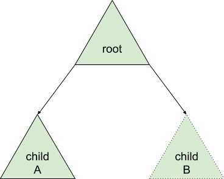

# Inspect discovery and hosting

[Inspect][inspect] is a powerful diagnostics feature for Fuchsia Components.

This document describes the details about how components host their
Inspect data and how various tools discover that data.

## Hosting Inspect data

A component may expose Inspect data in the following ways:

* [`fuchsia.inspect.Tree`](#tree) (C++, Rust)
* [`VmoFile`](#vmofile) (Dart)
* [`fuchsia.inspect.deprecated.Inspect`](#deprecated) (Go)

Components do not need to reach out to other services in
order to expose Inspect data.

Components generally do not need to be concerned with which method is
being used, client libraries abstract out the specific mechanism for
hosting. Nearly all implementations will eventually use `Tree`.

| Feature                | `fuchsia.inspect.Tree` | `VmoFile` | `fuchsia.inspect.deprecated.Inspect` | Description                                                                         |
| ---------------------- | ---------------------- | --------- | ------------------------------------ | ----------------------------------------------------------------------------------- |
| Non-lazy values        | Yes                    | Yes       | Yes                                  | Components may record values such as strings and integers.                          |
| Lazy values            | Yes                    | No        | Yes                                  | Components may generate values dynamically at read time.                            |
| Mutable tree           | Yes                    | Yes       | Yes                                  | Components may modify the values stored in their output.                            |
| Post-mortem inspection | Yes                    | Yes       | No                                   | The values recorded by a component are available after that component exits.        |
| Low-latency snapshots  | Yes                    | Yes       | No                                   | A full snapshot of the data can be obtained with low-latency.                       |
| Consistent snapshots   | Yes\*                  | Yes       | No                                   | The snapshot of the tree is guaranteed to represent its state at one point in time. |

(\*: Each tree's snapshot is consistent, but inter-tree consistency is not guaranteed)

### `fuchsia.inspect.Tree` {#tree}

`fuchsia.inspect.Tree` supports all features of the Inspect API, and it
is the recommended way to expose Inspect data from components.

Components host a single service file named `fuchsia.inspect.Tree` under
a subdirectory called "diagnostics". Multiple such files may exist,
but they must be in separate subdirectories under "diagnostics".

#### Implementation

The `fuchsia.inspect.Tree` [FIDL File][tree-fidl] defines the protocol
that is hosted by components to expose their Inspect data.

The `Tree` protocol links together multiple [Inspect VMOs][vmo-format]
in a "tree of trees."



In the above figure, the tree named "root" handles protocol
`fuchsia.inspect.Tree` for connections on the top-level service hosted
under `diagnostics/fuchsia.inspect.Tree`. Child trees may be enumerated
and opened using methods on the protocol. For example, "child B" may
not exist in memory until opened and read.

The protocol supports this behavior in the following ways:

* `GetContent`

  This method obtains the content of the tree, currently in the form of
  an [Inspect VMO][vmo-format]. By convention, calling this method on
  the root tree should return a VMO that will be continually updated
  with new data. The client should not need to re-read the content of
  the tree to read new values.

* `ListChildNames`

  This method accepts an iterator over which the names of children of
  the tree will be returned. For example, the tree in the figure above
  will return names "child A" and "child B" when run on the root tree.

* `OpenChild`

  This method accepts a request for `fuchsia.inspect.Tree` that will
  be bound to the tree specified by a given name. Using this method a
  client may iterate through all trees exposed over the root iterface.

### `VmoFile` {#vmofile}

Components may expose any number of [Inspect VMOs][vmo-format]
in their `out/diagnostics` directory ending in the file extension
`.inspect`. By convention, components expose their "root" inspect tree at
`diagnostics/root.inspect`.

Note: Reading services may not disambiguate the sources of data in
a component.

Components may choose to generate the content of the VMO when the file
is opened if they choose, however, there exists no mechanism to link
multiple trees created this way together. For this reason, lazy values
are not supported in the context of a single tree, either the entire
tree is generated dynamically or none of it is.

### `fuchsia.inspect.deprecated.Inspect` {#deprecated}

This deprecated interface is used by Go to expose Inspect data. While
`fuchsia.inspect.Tree` exposes a "tree of trees," this interface exposes
only a single tree where subtrees may be dynamically instantiated.

This interface is deprecated in favor of the VMO format hosted by Inspect
tree for the following reasons:

* VMO format supports low-latency snapshots without communicating with
the hosting program.
* VMO format snapshots are always consistent for the whole tree.
* VMO format supports postmortem inspection, all Inspect data using the
deprecated interface dies with the component.
* `Tree` protocol supports the same dynamic features as the deprecated
interface.

## Reading Inspect data

The two primary ways to read Inspect data are:

1. [iquery](#iquery)
2. The [Archivist](#archivist)

### iquery {#iquery}

[iquery][iquery] (Inspect Query) is the CLI for interacting with Inspect data.

`iquery`'s primary mode of operation takes a list of selectors for Inspect data
and prints out the contained information. A selector consists of three parts
which are separated by a `:`:

1. The component selector: This is the moniker in v2 or the realm path plus the
   component name in v1.
2. The node path: The path to a node in the inspect hierarchy.
3. The property path: The name of the property.

For `iquery` only (1) is required. If only (1) is provided (for example
`realm/component`) then iquery will use a selector `realm/component:*` to
fetch all the inspect data.

`iquery` includes two utility commands to know what components are available and
what selectors can be used:

- `list`: iquery will print all component selectors that are available, this is
  all v2 monikers and all v1 realm paths with component names.
- `selectors`: iquery will print all selectors available under the provided
  selector locations.

These modes could be used together as follows:

```
$ iquery show `iquery list | grep component_name`
```

Alternatively `iquery` also allows to print the inspect data at a location. A
location consists either of the path to a `.inspect` file, or the path to a
directory containing `fuchsia.inspect.Tree`. `iquery` includes a utility command
to list all files that contain inspect data (`list-files`).

iquery's secondary mode of operation (triggered by `list-files`) recursively
identifies locations for Inspect data from the given directory path. The
two modes may be used together as follows:

```
$ iquery list-files [component_moniker]
bootstrap/driver_manager
  class/display-controller/000.inspect
  ... additional output


$ iquery show --file 'class/display-controller/000.inspect'
```

In the example above, `iquery list-files` is ran to find a list of Inspect
locations. Then, `iquery` is ran on one of the output to 
recursively list data in the matching locations. You may instead write:

```
$ fx iquery show --manifest component_name
```

### Archivist {#archivist}

The Fuchsia Diagnostics Platform, hosted by the [Archivist][archivist],
is responsible for monitoring and aggregating Inspect data on demand.

When running under component manager, diagnostics data is made available to the
Archivist through [event capabilities][events].

The Archivist is offered events by the root realm. Therefore, it sees events from
the whole system. The events it is allowed to see and is subscribed to are the
following:

- **Started**: sent to the Archivist when a component is started.
- **Running**: sent to the Archivist when subscribing for components that were
  already running.
- **Directory ready**: with a filter for `/diagnostics`. Sent to the Archivist
  when a component exposes a `/diagnostics` directory to the framework.
- **Stopped**: sent to the Archivist when a component is stopped.

A component that wishes to expose Inspect needs to expose a `/diagnostics`
directory to the framework. This typically looks as follows:

```json5
{
    capabilities: [
        {
            directory: "diagnostics",
            rights: [ "connect" ],
            path: "/diagnostics",
        },
    ],
    expose: [
        {
            directory: "diagnostics",
            from: "self",
            to: "framework",
        },
    ],
}
```

There's a useful manifest include that simplifies this and is required by Inspect libraries:

```json5
{
    include: [
        "inspect/client.shard.cml",
    ]
}
```

#### Reading Inspect from the Archivist

The Archivist hosts [`fuchsia.diagnostics.ArchiveAccessor`][archive],
which provides the `StreamDiagnostics` method to obtain Inspect data from
running components.

[archive]: /sdk/fidl/fuchsia.diagnostics/reader.fidl
[archivist]: /src/diagnostics/archivist
[events]: /docs/concepts/components/v2/capabilities/event.md
[fidl-event-provider]: /sdk/fidl/fuchsia.sys.internal/component_event_provider.fidl
[inspect]: /docs/development/diagnostics/inspect/README.md
[iquery]: /docs/reference/diagnostics/consumers/iquery.md
[tree-fidl]: /sdk/fidl/fuchsia.inspect/tree.fidl
[vmo-format]: /docs/reference/platform-spec/diagnostics/inspect-vmo-format.md
