# FIDL wire format specification

For more information about FIDL's overall purpose, goals, and requirements,
see the [concepts overview][concepts].

[TOC]

## Core Concepts

### Message {#message}

A FIDL **message** is a collection of data.

The message is a contiguous structure consisting of a single
**in-line primary object** followed by zero or more
**out-of-line secondary objects**.

Objects are stored in **traversal order**, and are subject to **padding**.

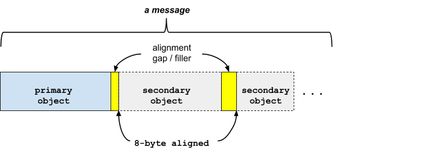

### Primary and Secondary Objects

The first object is called the **primary object**.
It is a structure of fixed size whose type and size are known from the
context. When reading a message, it is required to know the expected
type to be read, i.e. the format is not self-describing. The context
in which a read occurs should make this unambiguous. As an example,
in the case of reading messages as part of IPC
(see [transactional message header](#transactional-messages)),
the context is fully specified by the data contained in the header
(in particular, the ordinal allows the recipient to know what is the
intended type). In the case of reading data at rest, there is no
equivalent descriptor, but it is assumed that both encoder and decoder
have knowledge about what type is being encoded or decoded (for example,
this information is compiled into the respective libraries used by the
encoder and decoder).

The primary object may refer to **secondary objects** (such as in the
case of strings, vectors, unions, and so on) if additional variable-sized
or optional data is required.

Secondary objects are stored **out-of-line** in traversal order.

Both primary and secondary objects are 8-byte aligned, and are stored
without gaps (other than those required for alignment).

Together, a primary object and its secondary objects are called a
**message**.

#### Messages for transactions

A transactional FIDL message (**transactional message**) is used to
send data from one application to another.

Note: The roles of the applications (e.g. **client** vs **server**) are not
relevant to the formatting of the data.

The [transactional messages](#transactional-messages) section, describes how
a transactional message is composed of a header message optionally followed
by a body message.

### Traversal Order {#traversal-order}

The **traversal order** of a message is determined by a recursive depth-first
walk of all of the **objects** it contains, as obtained by following the chain
of references.

Given the following structure:

```fidl

```

The depth-first traversal order for a `Cart` message is defined by the following
pseudo-code:

```
visit Cart:
    for each Item in Cart.items vector data:
        visit Item.product:
            visit Product.sku
            visit Product.name
            visit Product.description
            visit Product.price
        visit Item.quantity
```

### Dual Forms: Encoded vs Decoded {#dual-forms}

The same message content can be expressed in one of two forms:
**encoded** and **decoded**.
These have the same size and overall layout, but differ in terms of their
representation of pointers (memory addresses) or handles (capabilities).

FIDL is designed such that **encoding** and **decoding** of messages can occur
in place in memory.

Message encoding is canonical &mdash; there is exactly one encoding for
a given message.

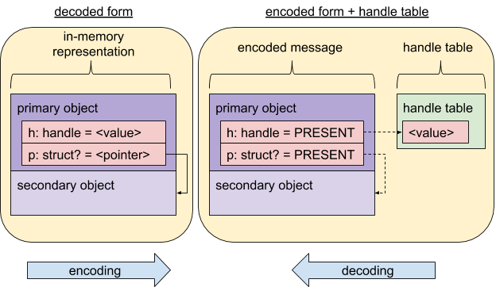

#### Encoded Messages

An **encoded message** has been prepared for transfer to another process: it
does not contain pointers (memory addresses) or handles (capabilities).

During **encoding**...

*   All pointers to sub-objects within the message are replaced with flags that
    indicate whether their referent is present or not-present,
*   All handles within the message are extracted to an associated **handle
    vector** and replaced with flags that indicate whether their referent is
    present or not-present.

The resulting **encoded message** and **handle vector** can then be sent to
another process using [**zx_channel_write()**][channel write] or a similar IPC
mechanism.
There are additional constraints on this kind of IPC. See
[transactional messages](#transactional-messages).

Note: The handle vector is *not* stored as part of the message, it's sent
separately (also known as "**out-of-band**, not to be confused with
**out-of-line**). For example, the
[**zx_channel_write()**][channel write] function takes two sets of data
pointers: one for the message, and one for the handle vector. The message
data pointer will contain all of the **in-line** and **out-of-line** data,
and the handle vector pointer will contain the handles.

#### Decoded Messages

A **decoded message** has been prepared for use within a process's address
space: it may contain pointers (memory addresses) or handles (capabilities).

During **decoding**:

*   All pointers to sub-objects within the message are reconstructed using
    the encoded present and not-present flags.
*   All handles within the message are restored from the associated
    **handle vector** using the encoded present and not-present flags.

The resulting **decoded message** is ready to be consumed directly from memory.

### Inlined Objects

Objects may also contain **inlined objects** which are aggregated within the
body of the containing object, such as embedded structs and fixed-size arrays of
structs.

### Example

In the following example, the `Region` structure contains a vector of
`Rect` structures, with each `Rect` consisting of two `Point`s.
Each `Point` consists of an `x` and `y` value.

```fidl

```

Examining the objects in traversal order means that we start with the
`Region` structure &mdash; it's the **primary object**.

The `rects` member is a `vector`, so its contents are stored **out-of-line**.
This means that the `vector` content immediately follows the `Region` object.

Each `Rect` struct contains two `Point`s, which are stored **in-line**
(because there are a fixed number of them), and each of the `Point`s'
primitive data types (`x` and `y`) are also stored **in-line**.
The reason is the same; there is a fixed number of the member types.

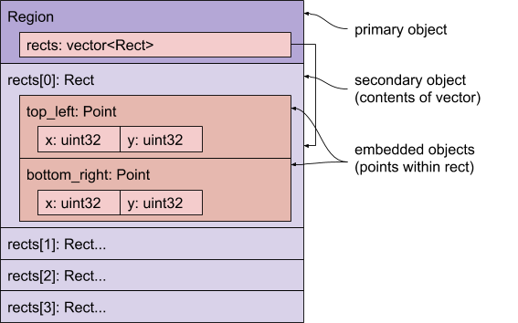

We use **in-line** storage when the size of the subordinate
object is fixed, and **out-of-line** when it's variable (including
boxed structs).

# Type Details

In this section, we illustrate the encodings for all FIDL objects.

## Primitives

*   Value stored in [little-endian format][RFC-0030].
*   Packed with natural alignment.
    *   Each _m_-byte primitive is stored on an _m_-byte boundary.
*   Not optional.

The following primitive types are supported:

Category                | Types
----------------------- | ----------------------------
Boolean                 | `bool`
Signed integer          | `int8`, `int16`, `int32`, `int64`
Unsigned integer        | `uint8`, `uint16`, `uint32`, `uint64`
IEEE 754 floating-point | `float32`, `float64`
strings                 | (not a primitive, see [Strings](#strings))

Number types are suffixed with their size in bits.

The Boolean type, `bool`, is stored as a single byte, and has only the
value **0** or **1**.

All floating point values represent valid IEEE 754 bit patterns.

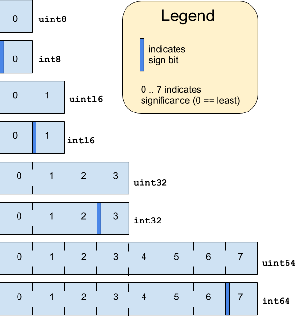

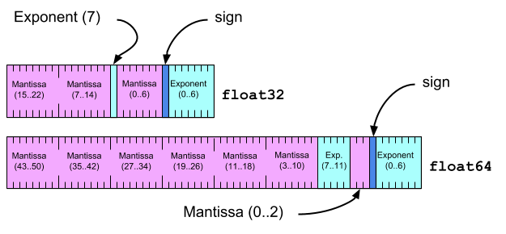

## Enums and Bits

Bit fields and enumerations are stored as their underlying primitive
type (e.g., `uint32`).

## Handles {#handles}

A handle is a 32-bit integer, but with special treatment.
When encoded for transfer, the handle's on-wire representation is replaced with
a present and  not-present indication, and the handle itself is stored in a
separate handle vector. When decoded, the handle presence indication is
replaced with zero (if not present) or a valid handle (if present).

The handle *value* itself is **not** transferred from one application to
another.

In this respect, handles are like pointers; they reference a context that's
unique to each application.
Handles are moved from one application's context to the other's.

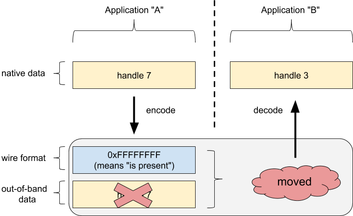

The value zero can be used to indicate a optional handle is absent[[1]](#Footnote-1).

See [Life of a handle] for a detailed example of transferring a handle over
FIDL.

## Aggregate objects

Aggregate objects serve as containers of other objects.
They may store that data in-line or out-of-line, depending on their type.

### Arrays

*   Fixed length sequence of homogeneous elements.
*   Packed with natural alignment of their elements.
    *   Alignment of array is the same as the alignment of its elements.
    *   Each subsequent element is aligned on element's alignment boundary.
*   The stride of the array is exactly equal to the size of the element (which
    includes the padding required to satisfy element alignment constraints).
*   Never optional.
*   There is no special case for arrays of bools. Each bool element takes one
    byte as usual.

Arrays are denoted:

*   `array<T, N>`: where **T** can be any FIDL type
    (including an array) and **N** is the number of elements in the array.
    Note: An array's size MUST be no more than 2<sup>32</sup>-1.
    For additional details, see [RFC-0059].

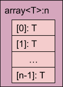

### Vectors {#vectors}

*   Variable-length sequence of homogeneous elements.
*   Can be optional; absent vectors and empty vectors are distinct.
*   Can specify a maximum size, e.g. `vector<T>:40`
    for a maximum 40 element vector.
*   Stored as a 16 byte record consisting of:
    *   `size`: 64-bit unsigned number of elements
    Note: A vector's size MUST be no more than 2<sup>32</sup>-1.
    For additional details, see [RFC-0059].
    *   `data`: 64-bit presence indication or pointer to out-of-line element data
*   When encoded for transfer, `data` indicates
    presence of content:
    *   `0`: vector is absent
    *   `UINTPTR_MAX`: vector is present, data is the next out-of-line object
*   When decoded for consumption, `data` is a
    pointer to content:
    *   `0`: vector is absent
    *   `<valid pointer>`: vector is present, data is at indicated memory address
*   There is no special case for vectors of bools. Each bool element takes one
    byte as usual.

Vectors are denoted as follows:

*   `vector<T>`: required vector of element type **T** (validation error
    occurs if `data` is absent)
*   `vector<T>:optional`: optional vector of element type **T**
*   `vector<T>:N`, `vector<T>:<N, optional>`: vector with maximum length of **N** elements

**T** can be any FIDL type.

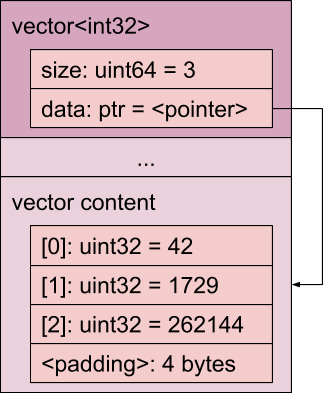

### Strings {#strings}

Strings are implemented as a vector of `uint8` bytes, with the constraint
that the bytes MUST be valid UTF-8.

### Structures

A structure contains a sequence of typed fields.

Internally, the structure is padded so that all members are aligned to the largest
alignment requirement of all members.
Externally, the structure is aligned on an 8-byte boundary, and may therefore contain
final padding to meet that requirement.

Here are some examples.

A struct with an **int32** and an **int8** field has an alignment of 4 bytes (due to
the **int32**), and a size of 8 bytes (3 bytes of padding after the **int8**):


A struct with a **bool** and a **string** field has an alignment of 8 bytes
(due to the **string**) and a size of 24 bytes (7 bytes of padding after the
**bool**):

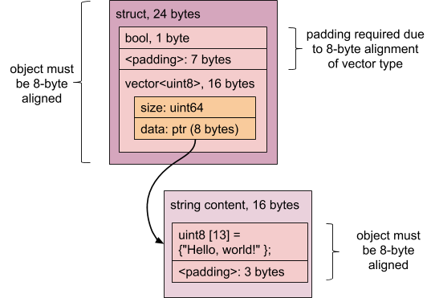

Note: Keep in mind that a **string** is really just a special case of
`vector<uint8>`.

A struct with a **bool** and two **uint8** fields has an alignment of 1 byte
and a size of 3 bytes (no padding!):


A structure can be:

* empty &mdash; it has no fields. Such a structure is 1 byte in size, with an
  alignment of 1 byte, and is exactly equivalent to a structure containing a
  `uint8` with the value zero.
* required &mdash; the structure's contents are stored in-line.
* optional &mdash; the structure's contents are stored out-of-line and
  accessed through an indirect reference.

Storage of a structure depends on whether it is boxed at the point of reference.

* Non-boxed structures:
  * Contents are stored in-line within their containing type, enabling very
    efficient aggregate structures to be constructed.
  * The structure layout does not change when inlined; its fields are not
    repacked to fill gaps in its container.
* Boxed structures:
  * Contents are stored out-of-line and accessed through an indirect
    reference.
  * When encoded for transfer, stored reference indicates presence of
    structure:
    * `0`: reference is absent
    * `UINTPTR_MAX`: reference is present, structure content
      is the next out-of-line object
  * When decoded for consumption, stored reference is a pointer:
    * `0`: reference is absent
    * `<valid pointer>`: reference is present, structure content is at
      indicated memory address

Structs are denoted by their declared name (e.g. `Circle`) and can be boxed:

*   `Point`: required `Point`
*   `box<Color>`: boxed, always optional `Color`

The following example illustrates:

  * Structure layout (order, packing, and alignment)
  * A required structure (`Point`)
  * A boxed (`Color`)

```fidl



```

The `Color` content is padded to the 8 byte secondary object alignment boundary.
Going through the layout in detail:

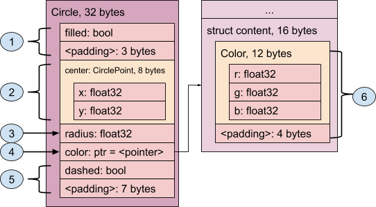

1. The first member, `filled bool`, occupies one byte, but requires three bytes
   of padding because of the next member, which has a 4-byte alignment
   requirement.
2. The `center CirclePoint` member is an example of a required struct. As such,
   its content (the `x` and `y` 32-bit floats) are inlined, and the entire thing
   consumes 8 bytes.
3. `radius` is a 32-bit item, requiring 4 byte alignment. Since the next
   available location is already on a 4 byte alignment boundary, no padding
   is required.
4. The `color box<Color>` member is an example of a boxed structure. Since the
   `color` data may or may not be present, the most efficient way of handling
   this is to keep a pointer to the structure as the in-line data. That way,
   if the `color` member is indeed present, the pointer points to its data
   (or, in the case of the encoded format, indicates "is present"), and the
   data itself is stored out-of-line (after the data for the `Circle`
   structure). If the `color` member is not present, the pointer is `NULL`
   (or, in the encoded format, indicates "is not present" by storing a zero).
5. The `dashed bool` doesn't require any special alignment, so it goes next.
   Now, however, we've reached the end of the object, and all objects must be
   8-byte aligned. That means we need an additional 7 bytes of padding.
6. The out-of-line data for `color` follows the `Circle` data structure, and
   contains three 32-bit `float` values (`r`, `g`, and `b`); they require 4
   byte alignment and so can follow each other without padding. But, just as
   in the case of the `Circle` object, we require the object itself to be
   8-byte aligned, so 4 bytes of padding are required.

Overall, this structure takes 48 bytes.

By moving the `dashed bool` to be immediately after the `filled bool`, though,
you can realize significant space savings [[2]](#Footnote-2):

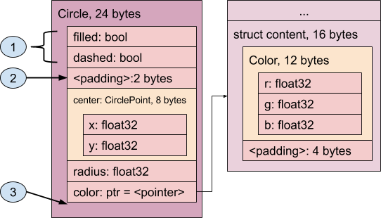

1. The two `bool` values are "packed" together within what would have been
   wasted space.
2. The padding is reduced to two bytes &mdash; this would be a good place to
   add a 16-bit value, or some more `bool`s or 8-bit integers.
3. Notice how there's no padding required after the `Color` box; everything
   is perfectly aligned on an 8 byte boundary.

The structure now takes 40 bytes.

Note: While `fidlc` could automatically pack structs, like Rust, we chose not
to do that in order to simplify [ABI compatibility changes][abi-api-compat].

### Envelopes {#envelopes}

An envelope is a container for data, used internally by tables and unions. It is
not exposed to the FIDL language. It has a fixed, 8 byte format.

An envelope header that is all zeros is referred to as the "zero envelope". It
is used to represent an absent envelope. Otherwise, the envelope is present and
bit 0 of its flags indicate whether the data is stored inline or out-of-line:

  - If bit 0 is set, an *inline representation* is used.

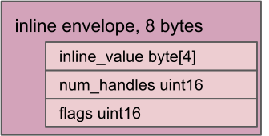

  - If bit 0 is unset an *out-of-line representation* is used.
  
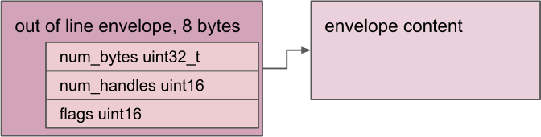

Bit 0 may only be set if the size of the payload is <= 4 bytes. Bit 0 may be
unset only if either the envelope is the zero envelope or the size of the
payload is > 4 bytes.


Having `num_bytes` and `num_handles` allows us to skip unknown envelope content.

`num_bytes` will always be a multiple of 8 because out-of-line objects are
8 byte aligned.

### Tables

*   Record type consisting of the number of elements and a pointer.
*   Pointer points to an array of envelopes, each of which contains one element.
*   Each element is associated with an ordinal.
*   Ordinals are sequential, gaps incur an empty envelope cost and hence are discouraged.

Tables are denoted by their declared name (e.g., **Value**), and are never optional:

*   `Value`: required `Value`

The following example shows how tables are laid out according to their fields.

```fidl

```

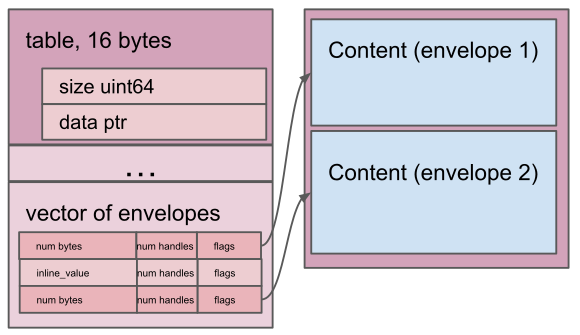

### Unions

*   Record type consisting of an ordinal and an envelope.
*   Ordinal indicates member selection, and is represented with a **uint64**.
*   Each element is associated with a user specified ordinal.
*   Ordinals are sequential. Unlike tables, gaps in ordinals do not incur a wire
    format space cost.
*   Absent optional unions are represented with a `0` ordinal, and an zero envelope.
*   Empty unions are not allowed.

unions are denoted by their declared name (e.g. `Value`) and optionality:

*   `Value`: required `Value`
*   `Value:optional`: optional `Value`

The following example shows how unions are laid out according to their fields.

```fidl

```

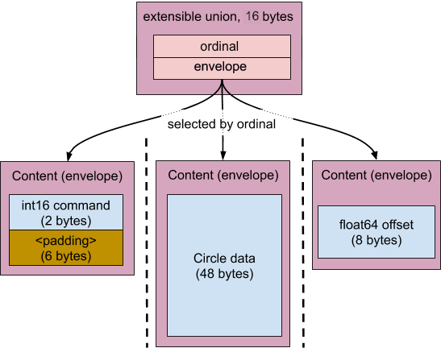

### Transactional Messages {#transactional-messages}

In a transactional message, there is always a **header**, followed by
an optional **body**.

Both the header and body are FIDL messages, as defined above; that is,
a collection of data.

The header has the following form:


*   `zx_txid_t txid`, transaction ID (32 bits)
    * `txid`s with the high bit set are reserved for use by
      [**zx_channel_write()**][channel write]
    * `txid`s with the high bit unset are reserved for use by userspace
    * A value of `0` for `txid` is reserved for messages that do not
      require a response from the other side.
    Note: For more details on `txid` allocation, see
    [**zx_channel_call()**][channel call].
*   `uint8[3] flags`, MUST NOT be checked by bindings. These flags can be used
    to enable soft transitions of the wire format. See [Header Flags](#flags)
    for a description of the current flag definitions.
*   `uint8 magic number`, determines if two wire formats are compatible.
*   `uint64 ordinal`
    *   The zero ordinal is invalid.
    *   Ordinals with the most significant bit set are reserved for
        control messages and future expansion.
    *   Ordinals without the most significant bit set indicate method calls
        and responses.

There are three kinds of transactional messages:

* method requests,
* method responses, and
* event requests.

We'll use the following interface for the next few examples:

```fidl

```

The **Add()** and **Divide()** methods illustrate both the method request
(sent from the client to the server), and a method response
(sent from the server back to the client).

The **Clear()** method is an example of a method request that does not
have a body.

> It's not correct to say it has an "empty" body: that would imply that
> there's a **body** following the **header**. In the case of **Clear()**,
> there is no **body**, there is only a **header**.

#### Method Request Messages

The client of an interface sends method request messages to the server
in order to invoke the method.

#### Method Response Messages

The server sends method response messages to the client to indicate completion
of a method invocation and to provide a (possibly empty) result.

Only two-way method requests that are defined to provide a (possibly empty) result
in the protocol declaration will elicit a method response.
One-way method requests must not produce a method response.

A method response message provides the result associated with a prior method request.
The body of the message contains the method results as if they were packed in a
**struct**.

Here we see that the answer to 912 / 43 is 21 with a remainder of 9.
Note the `txid` value of `1` &mdash; this identifies the transaction.
The `ordinal` value of `2` indicates the method &mdash; in this case, the
**Divide()** method.

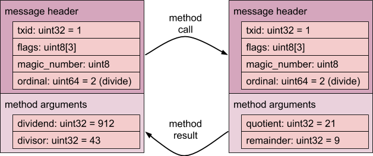

Below, we see that `123 + 456` is `579`.
Here, the `txid` value is now `2` &mdash; this is simply the next transaction
number assigned to the transaction.
The `ordinal` is `1`, indicating **Add()**, and note that the result requires
4 bytes of padding in order to make the **body** object have a size that's
a multiple of 8 bytes.

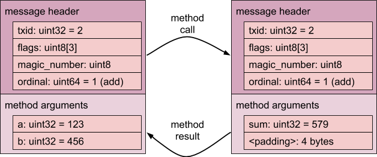

And finally, the **Clear()** method is different than the **Add()** and
**Divide()** in two important ways:
* it does not have a **body** (that is, it consists solely of the **header**), and
* it does not solicit a response from the interface (`txid` is zero).

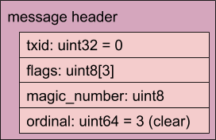

#### Event Requests

An example of an event is the **OnError()** event in our `Calculator`.

The server sends an unsolicited event request to the client
to indicate that an asynchronous event occurred, as specified by
the protocol declaration.

In the `Calculator` example, we can imagine that an attempt to divide by zero
would cause the **OnError()** event to be sent with a "divide by zero" status code
prior to the connection being closed. This allows the client to distinguish
between the connection being closed due to an error, as opposed to for other
reasons (such as the calculator process terminating abnormally).


Notice how the `txid` is zero (indicating this is not part of a transaction),
and `ordinal` is `4` (indicating the **OnError()** method).

The **body** contains the event arguments as if they were packed in a
**struct**, just as with method result messages.
Note that the body is padded to maintain 8-byte alignment.

#### Epitaph (Control Message Ordinal 0xFFFFFFFF)

An epitaph is a message with ordinal **0xFFFFFFFF**. A server may send an
epitaph as the last message prior to closing the connection, to provide an
indication of why the connection is being closed. No further messages may be
sent through the channel after the epitaph. Epitaphs are not sent from clients
to servers.

The epitaph contains an error status. The error status of the epitaph is stored
in the reserved `uint32` of the message header. The reserved word is treated as
being of type **zx_status_t**: negative numbers are reserved for system error
codes, positive numbers are reserved for application error codes, and `ZX_OK` is
used to indicate normal connection closure. The message is otherwise empty.

## Details

#### Size and Alignment

`sizeof(T)` denotes the size in bytes for an object of type **T**.

`alignof(T)` denotes the alignment factor in bytes to store an object of type **T**.

FIDL primitive types are stored at offsets in the message that are a multiple
of their size in bytes. Thus for primitives **T**, `alignof(T) ==
sizeof(T)`. This is called *natural alignment*. It has the
nice property of satisfying typical alignment requirements of modern CPU
architectures.

FIDL complex types, such as structs and arrays, are stored at offsets in the
message that are a multiple of the maximum alignment factor of all of their
fields. Thus for complex types **T**, `alignof(T) ==
max(alignof(F:T))` over all fields **F** in **T**. It has the nice
property of satisfying typical C structure packing requirements (which can be
enforced using packing attributes in the generated code). The size of a complex
type is the total number of bytes needed to store its members properly aligned
plus padding up to the type's alignment factor.

FIDL primary and secondary objects are aligned at 8-byte offsets within the
message, regardless of their contents. The primary object of a FIDL message
starts at offset 0. Secondary objects, which are the only possible referent of
pointers within the message, always start at offsets that are a multiple of 8.
(So all pointers within the message point at offsets that are a multiple of 8.)

FIDL in-line objects (complex types embedded within primary or secondary
objects) are aligned according to their type. They are not forced to 8 byte
alignment.

##### Types

Notes:

* **N** indicates the number of elements, whether stated explicitly (as in
  `array<T, N>`, an array with **N** elements of type **T**) or implicitly
  (a `table` consisting of 7 elements would have `N=7`).
* The out-of-line size is always padded to 8 bytes. We indicate the content
  size below, excluding the padding.
* `sizeof(T)` in the `vector` entry below is\
  `in_line_sizeof(T) + out_of_line_sizeof(T)`.
* **M** in the `table` entry below is the maximum ordinal of present field.
* In the `struct` entry below, the padding refers to the required padding to
  make the `struct` aligned to the widest element. For example,
  `struct{uint32;uint8}` has 3 bytes of padding, which is different than the
  padding to align to 8 bytes boundaries.

Type(s)                      | Size (in-line)                    | Size (out-of-line)                                              | Alignment
-----------------------------|-----------------------------------|-----------------------------------------------------------------|--------------------------------
`bool`                       | 1                                 | 0                                                               | 1
`int8`, `uint8`              | 1                                 | 0                                                               | 1
`int16`, `uint16`            | 2                                 | 0                                                               | 2
`int32`, `uint32`, `float32` | 4                                 | 0                                                               | 4
`int64`, `uint64`, `float64` | 8                                 | 0                                                               | 8
`enum`, `bits`               | (underlying type)                 | 0                                                               | (underlying type)
`handle`, et al.             | 4                                 | 0                                                               | 4
`array<T, N>`                | sizeof(T) * N                     | 0                                                               | alignof(T)
`vector`, et al.             | 16                                | N * sizeof(T)                                                   | 8
`struct`                     | sum(sizeof(fields)) + padding     | 0                                                               | 8
`box<struct>`                | 8                                 | sum(sizeof(fields)) + padding                                   | 8
`envelope`                   | 8                                 | sizeof(field)                                                   | 8
`table`                      | 16                                | M * sizeof(envelope) + sum(aligned_to_8(sizeof(present fields)) | 8
`union`, `union:optional`    | 16                                | sizeof(selected variant)                                        | 8

The `handle` entry above refers to all flavors of handles, specifically
`handle`, `handle:optional`, `handle:H`, `handle:<H, optional>`,
`client_end:Protocol`, `client_end:<Protocol, optional>`,
`server_end:Protocol`, and `server_end:<Protocol, optional>`.

Similarly, the `vector` entry above refers to all flavors of vectors,
specifically `vector<T>`, `vector<T>:optional`, `vector<T>:N`,
`vector<T>:<N, optional>`, `string`, `string:optional`, `string:N`, and
`string:<N, optional>`.

#### Padding

The creator of a message must fill all alignment padding gaps with zeros.

The consumer of a message must verify that padding contains zeros (and generate
an error if not).

#### Maximum Recursion Depth

FIDL vectors, optional structures, tables, and unions enable the construction of
recursive messages. Left unchecked, processing excessively deep messages could
lead to resource exhaustion, or undetected infinite looping.

For safety, the maximum recursion depth for all FIDL messages is limited to
**32** levels of indirection. A FIDL encoder, decoder, or validator **MUST**
enforce this limit by keeping track of the current recursion depth during
message validation.

Formal definition of recursion depth:

*   The inline object of a FIDL message is defined to be at recursion depth
    **0**.
*   Each traversal of an indirection, through a pointer or an envelope,
    increments the recursion depth by **1**.

If at any time the recursion depth exceeds **32**, the operation must be
terminated and an error raised.

Consider for instance:

```fidl

```

When encoding an instance of an `InlineObject`, we have the respective recursion depths:

* The bytes of `content_a` are at a recursion depth of 1, i.e. the `content_a`
  string header is inline within the `InlineObject` struct, and the bytes are in
  an out-of-line object accessible through a pointer indirection.
* The bytes of `content_b` are at a recursion depth of 2, i.e. the `vector`
  header is inline within the `InlineObject` struct, the
  `OutOfLineStructAtLevel1` structs are therefore at recursive depth 1, the
  `content_b` string header is inline within `OutOfLineStructAtLevel1`, and the
  bytes are in an out-of-line object accessible through a pointer indirection
  from depth 1, making them at depth 2.
* The bytes of `content_c` are at a recursion depth of 3, i.e. the `table`
  header is inline within the `InlineObject` struct, the table envelope is at a
  depth of 1, pointing to the `content_c` string header at a depth of 2, and the
  bytes are in an out-of-line object accessible through a pointer indirection,
  making them at depth 3.

Note: By defining a maximum recursion depth of 32, we allow one inline object
followed by 32 out-of-line objects, such that a total of 33 levels are allowed
(but 32 indirections). See
[`//src/tests/fidl/conformance_suite/recursive_depth.gidl`](/src/tests/fidl/conformance_suite/recursive_depth.gidl)
for further details.

#### Validation

The purpose of message validation is to discover wire format errors early before
they have a chance to induce security or stability problems.

Message validation is **required** when decoding messages received from a peer
to prevent bad data from propagating beyond the service entry point.

Message validation is **optional but recommended** when encoding messages to
send to a peer in order to help localize violated integrity constraints.

To minimize runtime overhead, validation should generally be performed as part
of a single pass message encoding or decoding process, such that only a single
traversal is needed. Since messages are encoded in depth-first traversal order,
traversal exhibits good memory locality and should therefore be quite efficient.

For simple messages, validation may be very trivial, amounting to no more than a
few size checks. While programmers are encouraged to rely on their FIDL bindings
library to validate messages on their behalf, validation can also be done
manually if needed.

Conformant FIDL bindings must check all of the following integrity constraints:

*   The total size of the message including all of its out-of-line sub-objects
    exactly equals the total size of the buffer that contains it. All
    sub-objects are accounted for.
*   The total number of handles referenced by the message exactly equals the
    total size of the handle table. All handles are accounted for.
*   The maximum recursion depth for complex objects is not exceeded.
*   All enum values fall within their defined range.
*   All union tag values fall within their defined range.
*   Encoding only:
    *   All pointers to sub-objects encountered during traversal refer precisely
        to the next buffer position where a sub-object is expected to appear. As
        a corollary, pointers never refer to locations outside of the buffer.
*   Decoding only:
    *   All present and not-present flags for referenced sub-objects hold the
        value **0** or **UINTPTR_MAX** only.
    *   All present and not-present flags for referenced handles hold the value
        **0** or **UINT32_MAX** only.

#### Header Flags {#flags}

*Flags[0]*

| Bit     | Current Usage                                                | Past Usages |
|---------|--------------------------------------------------------------|-------------|
| 7 (MSB) | Unused                                                       |             |
| 6       | Unused                                                       |             |
| 5       | Unused                                                       |             |
| 4       | Unused                                                       |             |
| 3       | Unused                                                       |             |
| 2       | Unused                                                       |             |
| 1       | Indicates whether the v2 wire format is used ([RFC-0114])    |             |
| 0       | Unused | Indicates whether static unions should be encoded as xunions ([RFC-0061]) |

*Flags[1]*

| Bit     | Current Usage                                                | Past Usages |
|---------|--------------------------------------------------------------|-------------|
| 7 (MSB) | Unused                                                       |             |
| 6       | Unused                                                       |             |
| 5       | Unused                                                       |             |
| 4       | Unused                                                       |             |
| 3       | Unused                                                       |             |
| 2       | Unused                                                       |             |
| 1       | Unused                                                       |             |
| 0       | Unused                                                       |             |

*Flags[2]*

| Bit     | Current Usage                                                | Past Usages |
|---------|--------------------------------------------------------------|-------------|
| 7 (MSB) | Unused                                                       |             |
| 6       | Unused                                                       |             |
| 5       | Unused                                                       |             |
| 4       | Unused                                                       |             |
| 3       | Unused                                                       |             |
| 2       | Unused                                                       |             |
| 1       | Unused                                                       |             |
| 0       | Unused                                                       |             |

#### Footnote 1

Defining the zero handle to mean "there is no handle" means it is safe to
default-initialize wire format structures to all zeros. Zero is also the value
of the `ZX_HANDLE_INVALID` constant.

#### Footnote 2

Read [The Lost Art of Structure Packing][lostart]{:.external} for an in-depth
treatise on the subject.

[channel call]: reference/syscalls/channel_call.md
[channel write]: reference/syscalls/channel_write.md
[RFC-0030]: contribute/governance/rfcs/0030_fidl_is_little_endian.md
[RFC-0059]: contribute/governance/rfcs/0059_reserved_bits_count_fields.md
[RFC-0061]: contribute/governance/rfcs/0061_extensible_unions.md
[RFC-0114]: contribute/governance/rfcs/0114_fidl_envelope_inlining.md
[abi-api-compat]: development/languages/fidl/guides/compatibility/README.md
[lostart]: http://www.catb.org/esr/structure-packing/
[concepts]: concepts/fidl/overview.md
[c-tutorial]: development/languages/fidl/tutorials/tutorial-c.md
[Life of a handle]: concepts/fidl/life-of-a-handle.md
