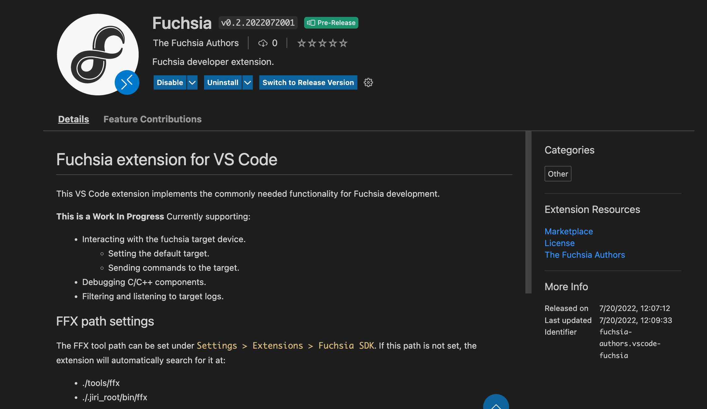
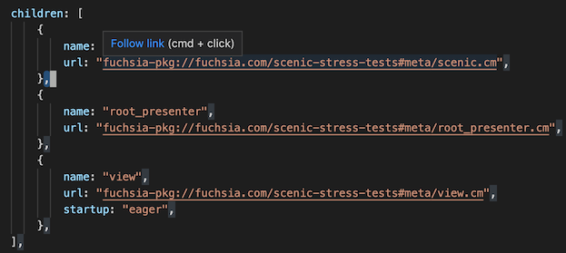
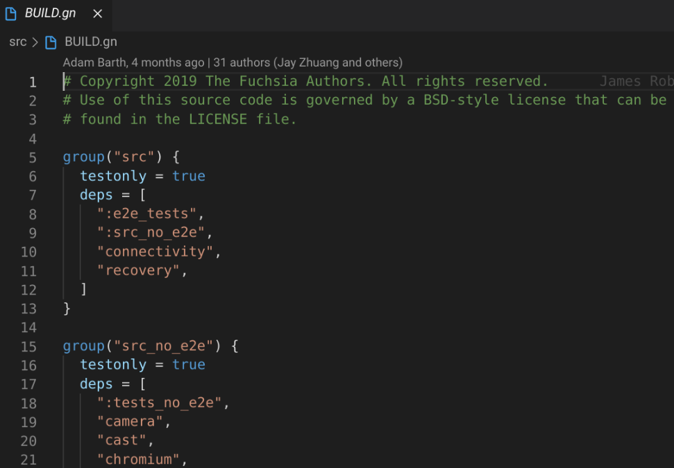
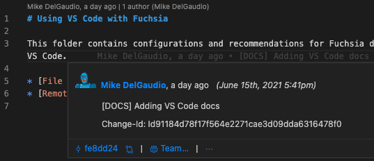
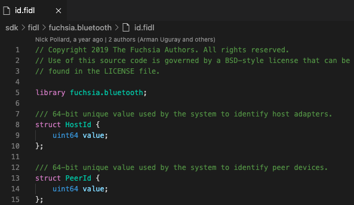
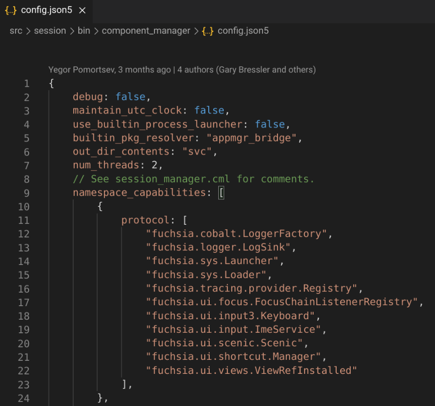
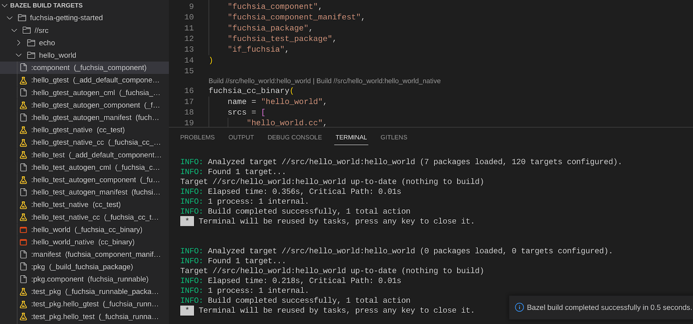



# Additional VS Code extensions for Fuchsia

The following VS Code extensions may provide a productive development environment
for Fuchsia:

## Official Fuchsia-specific extensions

Fuchsia-specific extensions provide support for working with Fuchsia software
and systems. These extensions are currently supported by the Fuchsia project.

### Fuchsia extension for VS Code

The [Fuchsia extension for VS Code][extension-link]{: .external} provides support for debugging
Fuchsia devices, logging, and syntax highlighting. This extension is Fuchsia’s official extension
and can be used with the source tree and the SDK. For more information see the
[Fuchsia developer extension page][extension-install].



## Community contributed extensions

These extensions are developed by Fuchsia contributors. Extensions listed are unsupported
and could conflict with the official Fuchsia developer extension. It is recommended to use
the [Fuchsia developer extension.][extension-link]{: .external}

### Fuchsia.git Helper

[Fuchsia.git Helper](https://marketplace.visualstudio.com/items?itemName=jwing.fuchsia-git-helper){: .external}
adds an "Open in...", which allows you to open a file in OSS Code Search.

To use this extension:

1. Right click a file in the file editor.
1. Select **Open in OSS Code Search**.


### FuchsiAware

[FuchsiAware](https://marketplace.visualstudio.com/items?itemName=RichKadel.fuchsiaware){: .external}
assists with browsing Fuchsia artifacts, such as by linking from component URLs to component manifests.



### Build system extensions

#### GN

[GN](https://marketplace.visualstudio.com/items?itemName=npclaudiu.vscode-gn){: .external}
adds syntax highlighting for GN files.



#### GNFormat

[GNFormat](https://marketplace.visualstudio.com/items?itemName=persidskiy.vscode-gnformat){: .external}
provides GN file formatting.

You may need to configure GNFormat with the file path to your GN binary and buildtools.
Do the following:

1. In VS Code, launch **Quick Open** by running `CMD/CTRL + P`.
1. Type `settings` in the search field.
1. Click **Preferences: Open Settings (JSON)**.
1. Add the following configuration and restart VS Code:

```json5
"gnformat.path.gn": "{{ '<var>' }}FILE_PATH{{ '</var>' }}",
"gnformat.path.buildtools": "{{ '<var>' }}BUILD_TOOLS_PATH{{ '</var>' }}"
```

### General workflow extensions

General workflow extensions provide an overall productive workflow when working with Fuchsia.

#### GitLens

[GitLens](https://marketplace.visualstudio.com/items?itemName=eamodio.gitlens){: .external}
provides highly customizable insights of git history, which allows you to see code evolution.



### Language specific extensions

#### FIDL language support

[FIDL Language Support](https://marketplace.visualstudio.com/items?itemName=fuchsia-authors.language-fidl){: .external}
provides syntax support and LSP-based language features in [FIDL][fidl].

Note: You need to configure Fuchsia environment variables to run this extension. For more information, see [Set up environment variables][set-up-env].



#### JSON5

In some cases, you may work on Fuchsia components using a
[structured configuration][structured-config-json5] written in JSON5.
[JSON5](https://marketplace.visualstudio.com/items?itemName=mrmlnc.vscode-json5){: .external}
adds syntax highlighting for JSON5 files.



#### Rust-analyzer {#rust-analyzer}

[Rust-analyzer](https://marketplace.visualstudio.com/items?itemName=matklad.rust-analyzer){: .external}
is a [Language Server Protocol][lsp-definition]{: .external} (LSP)
implementation for the Rust language.

Note: If your Fuchsia source is symlinked from another mountpoint, the
`rust-analyzer` extension may not locate the files for analysis.
Instead, open the actual file path to the Fuchsia source in VS Code.

To use `rust-analyzer` with VS Code, Fuchsia recommends:

* [Updating to the latest stable VS Code][vscode-update]{: .external}.
* [Disabling telemetry reporting][vscode-disable-telemetry]{: .external} for confidential code.

##### Configure workflow {#rust-configure-workflow}

After installing `rust-analyzer`, modify your
VS Code's `settings.json` file:

1. Press `CMD/CTRL + SHIFT + P` to open **Command Palette**.
1. Type `settings` in the search field.
1. Click **Preferences: Open Settings (JSON)**.
1. In `settings.json`, paste the following snippets:

Note: If you use VS Code's [remote workspaces][vscode-remote-workspaces], use the `settings.json`
for your remote environment.

```json

  // disable cargo check on save
  "rust-analyzer.checkOnSave.enable": false,
  "rust-analyzer.checkOnSave.allTargets": false,

  // workaround for https://fxbug.dev/102739
  // needed if you see errors about extension host crashing
  "rust-analyzer.files.watcher": "server",
```

Additionally, you may want to configure smaller tooltips and hide parameter hints to optimize your
workspace:

```json

  // optional: only show summary docs for functions (keeps tooltips small)
  "rust-analyzer.callInfo.full": false,
  // optional: don't activate parameterHints automatically
  "editor.parameterHints.enabled": false,

```

##### Enable rustfmt

The `rust-analyzer` extension relies on the `rustup` installer to invoke `rustfmt`,
a tool for formatting Rust code according to style guidelines.

To configure `rustup` with your Fuchsia source code, run:

Note: `HOST_OS` is `linux-x64` on Linux and `mac-x64` on macOS.

```posix-terminal
rustup toolchain link fuchsia {{ '<var>' }}FUCHSIA_DIR{{ '</var>' }}/prebuilt/third_party/rust/{{ '<var>' }}HOST_OS{{ '</var>' }}
```

After configuring `rustup`, the `rust-analyzer` extension supports additional configuration
with Fuchsia's Rust style guide, [`rustfmt.toml`](/rustfmt.toml).

Add the following snippet to your `settings.json` using the same steps
from [Configuring workflow](#rust-configure-workflow):

```json

    // use fuchsia toolchain and fuchsia's rules for rustfmt:
    "rust-analyzer.rustfmt.extraArgs": [
        "+fuchsia",
        "--config-path= {{ '<var>' }}FUCHSIA_DIR{{ '</var>' }}/rustfmt.toml"
    ],

```

## Fuchsia SDK extensions

### Bazel

The [Fuchsia SDK][sdk-get-started] uses the Bazel build system. The
[Bazel extension][bazel-vscode-ext]{:.external} can build and run components
directly from VS Code.



<!-- Reference links -->

[set-up-env]: /docs/get-started/get_fuchsia_source.md#set-up-environment-variables
[fidl]: /docs/development/languages/fidl/README.md
[vscode-update]:  https://vscode-docs.readthedocs.io/en/stable/supporting/howtoupdate/
[vscode-disable-telemetry]: https://code.visualstudio.com/docs/getstarted/telemetry#_disable-telemetry-reporting
[lsp-definition]: https://microsoft.github.io/language-server-protocol/
[vscode-remote-workspaces]: /docs/reference/tools/editors/vscode/remote-workspaces.md
[extension-install]: /docs/reference/tools/editors/vscode/fuchsia-ext-install.md
[extension-link]: https://marketplace.visualstudio.com/items?itemName=fuchsia-authors.vscode-fuchsia
[structured-config-json5]: /docs/development/components/configuration/structured_config.md
[bazel-vscode-ext]: https://marketplace.visualstudio.com/items?itemName=BazelBuild.vscode-bazel
[sdk-get-started]: /docs/get-started/sdk/index.md?ide=vscode
