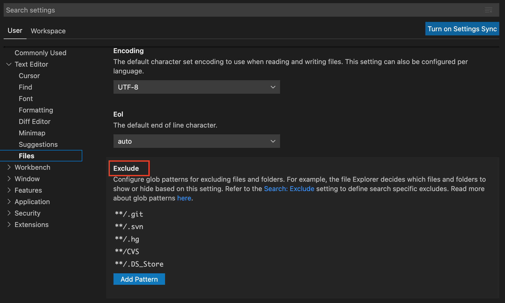



# Configuring file reloading

VS Code watches external file changes, reloading the latest stored file if there is
no conflicting working copy. Watching and detecting changes, however, can take a
long time. The larger the code base, the longer VS Code takes to detect the file
change. Excluding some directories from the search space improves the speed.

Note: You can manually configure file reloading with **[Modify in `settings.json`](#modify-settings-json)**.

## Modify in GUI

To exclude a directory from VS Code’s watcher:

1. Press `CMD/CTRL + comma` to open VS Code's settings.
1. In the user settings menu, click **Text Editor**.
1. In the Text Editor dropdown, click the **Files** tab.
1. In the Files tab go to the **Exclude** section.
   
1. Click the **Add Pattern** button.
1. Add your directory pattern in the text box.
1. Click **OK** to save your changes.
1. Your changes will take effect the next time you open VS Code.

## Modify in `settings.json`{#modify-settings-json}

Alternatively, you can directly modify `settings.json` and add an exclude pattern.
`settings.json` contains all custom VS Code settings stored in a single JSON.

To manually exclude a directory from VS Code’s watcher:

1. Press `CMD/CTRL + SHIFT + P` to open **Command Palette**.
1. Type `settings` in the search field.
1. Click **Preferences: Open Settings (JSON)**.
1. In `settings.json`, add an exclude pattern similar to below and restart VS Code for changes to take effect.

    ```json
        "files.watcherExclude": {
            "**/.DS_Store": true,
            "**/.cipd": true,
            "**/.clang-format": true,
            "**/.clang-tidy": true,
            "**/.dir-locals.el": true,
            "**/.git": true,
            "**/.gitattributes": true,
            "**/.gitignore": true,
            "**/.hg": true,
            "**/.idea": true,
            "**/.jiri_manifest": true,
            "**/.jiri_root": true,
            "**/.ssh": true,
            "**/.style.yapf": true,
            "**/.svn": true,
            "**/AUTHORS": true,
            "**/CMakeLists.txt": true,
            "**/CODE_OF_CONDUCT.md": true,
            "**/CONTRIBUTING.md": true,
            "**/CVS": true,
            "**/LICENSE": true,
            "**/PATENTS": true,
            "**/buildtools": true,
            "**/examples": true,
            "**/prebuilt/test_data": true,
            "**/garnet/third_party": true,
            "**/out": true,
            "**/prebuilt": true,
            "**/rustfmt.toml": true,
            "**/src/chromium": true,
            "**/topaz": true,
            "**/zircon/experimental": true,
            "**/zircon/third_party": true,
        }
    ```
