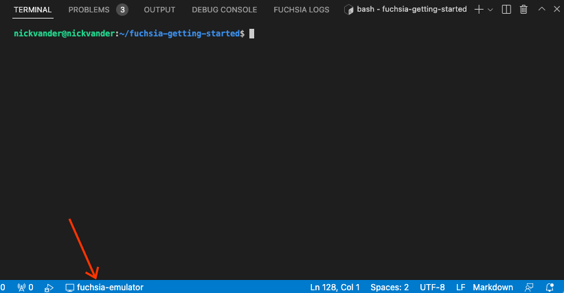
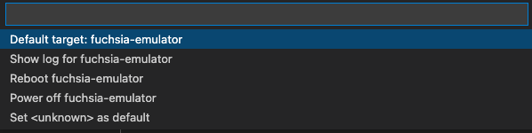
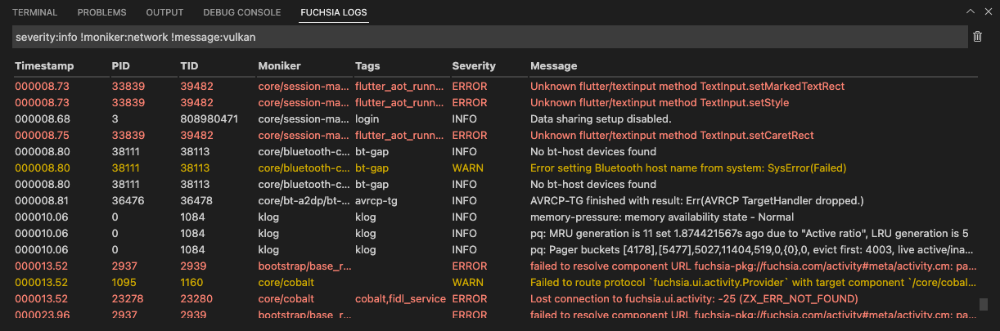
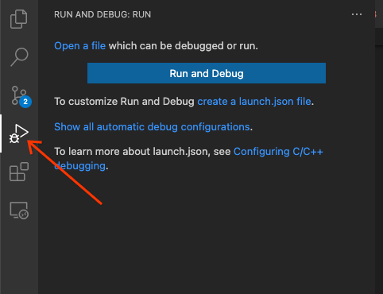
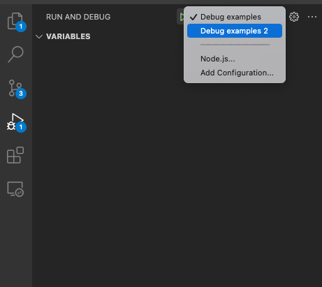



# Using the Fuchsia extension for VS Code

This extension adds support for working with Fuchsia targets and source code, including:

* Connecting to a device.
* Debugging C++ and Rust code (supported by `zxdb`).
* Analyzing logs from Fuchsia devices.

Note: To see how to perform the initial installation and configuration of the
extension, see [Installing the Fuchsia extension for VS Code][fuchsia-dev-ext].

## Compatibility

The Fuchsia extension is compatible with ffx `9.20220803.3.1` and forward.

## Edit code

By default, VS code provides syntax highlighting, errors and warnings,
jumping to a definition, and lists references for C++.

Note: The Fuchsia extension does not directly implement support for C++
editor. Instead, it relies on additional VS Code extensions for that functionality.

VS Code actively analyzes your code in the background and can show you various
warnings or errors. For more information, see
[Errors and warnings][vscode-errors]{: .external}.

The Fuchsia extension also provides syntax highlighting for
[FIDL][fidl-docs] and [CML][cml-docs].

## Connect to a Fuchsia device

The Fuchsia extension allows you to connect to a Fuchsia target which
can be a physical device or an emulator. The extension supports multiple
target devices and allows you to easily switch between various Fuchsia devices.
You can only connect to a single device at any given time.

Note: For more information on getting started with the Fuchsia SDK and starting
an emulator, see [Get started with the Fuchsia SDK][get-started-sdk].

If your emulator is properly configured and started, you should see a
<span class="material-icons">computer</span> and the
name of your Fuchsia device in the status bar of VS Code. If you are using
the emulator and not seeing a Fuchsia device, see
[Start the Fuchsia emulator][sdk-start-emulator].



### Options for a Fuchsia device

You can click the
<span class="material-icons">computer</span> and the
name of your Fuchsia device in the status bar of VS Code to see the various
options that you have for your Fuchsia devices. These options display in the
VS Code command palette. In most cases, you have the following options:



* **Default target: `<device-name>`**: This option shows which Fuchsia device is
  currently configured as your default target. If you have additional Fuchsia
  devices, click the `Set <device-name> as default` to connect to that specific
  device. This is equivalent to running `ffx target default get`.
* **Set `<device-name>` as default**: This options lets you connect to the selected
  Fuchsia device. This is equivalent to running
  `ffx target default set <device-name>`.
* **Show log for `<device-name>`**: This option opens the **Fuchsia logs** tab of
  the Fuchsia extension. For more information, see
  [View Fuchsia logs](#view-fuchsia-logs). This is equivalent to running
  `ffx log`.
* **Reboot `<device-name>`**: This options restarts your Fuchsia device. This is
  equivalent to running `ffx target reboot`.
* **Power off `<device-name>`**: This option powers off your Fuchsia device. This
  is equivalent to running `ffx target off`. If you power off a Fuchsia emulator,
  you need to use `ffx emu start <product-bundle>` to start the emulator again.
  For more information, see [Start the Fuchsia emulator][sdk-start-emulator].

## View Fuchsia logs {#view-fuchsia-logs}

The Fuchsia extension allows you to view the symbolized logs
(human-readable stack traces) for your connected Fuchsia device. This is equivalent
to running `ffx log`. For more information on `ffx log`, see
[Monitor device logs][monitor-device-logs].

In the **Fuchsia logs** tab, you can see the following:

Note: When you first open the **Fuchsia logs** tab, it may take a few minutes
to load all of the available Fuchsia logs. If no logs display, it may be an
indication that you do not have connected a Fuchsia device or an emulator.



Note: For more information on the JSON schema that transports the contents
of Fuchsia logs, see [Diagnostics schema][diagnostics-schema].

* **Timestamp**: This shows the timestamp (read from the
  [system monotonic clock][zx_clock_get_monotonic]) of the event. The time is
  since the device was booted. It is formatted with 5 digits (leading zeroes)
  for seconds and three digits for milliseconds (trailing zeroes).
* **PID**: This shows the process identifier for the process that generated the log
  message.
* **TID**: This shows the thread identifier for the thread that started the process
  that generated the log message.
* **Moniker**: This shows the component moniker of the component that generated
  the log message. For more information on component monikers, see
  [Component monikers][component-moniker].
* **Tags**: This shows the tags that have been associated with the logging event.
  For more information on adding tags to logs,
  [Logging in Rust][add-tags-logging].
* **Severity**: This lets you filter all log messages with certain severities
  including based on a severity of at least a specified level.
  For example, `severity:WARN` or `severity>=WARN` would include all logs with
  severity levels `WARN`, `ERROR`, and `FATAL`. `severity=WARN` would only
  include logs with a `WARN` level. You can use severities to filter based on
  a minimum, exact, or a maximum severity, see [Example][#filter-examples]. The
  valid values (in order of decreasing severity) are:

  * `FATAL`
  * `ERROR`
  * `WARN`
  * `INFO`
  * `DEBUG`
  * `TRACE`

  For more information on severity of log records, see
  [Choosing severity for log records][log-severity].
* **Message**: This shows the actual logging message.

### Filter Fuchsia logs

You can filter the Fuchsia logs to find specific logging events. To filter the
Fuchsia logs:

In the **Filter logs...** text box at the top of the **Fuchsia logs** tabs, use
the following syntax:

A filter is composed of one or more sub-filters of the following form:

```
<category> <operator> <value>
```

Where:

* `category`: For valid categories, see [Categories](#categories).
* `operator`: For valid categories, see [Operators](#operators).
* `value`: depends on the category. For:
  - severities: a severity name. For valid severities, see [Categories](#categories).
  - rest of the categories, depending on the type:
    - a string without spaces (or with escaped spaces `\ `)
    - a double-quoted string: which can contain any character but must escape `"` and `\` with a
     `\`.
    - a regular expression, see [Regular expressions](#regexes)
    - a number
    - a boolean (true, false)

Additionally, sub-filters may be joined with OR. Any logical expression can be expressed.
For example:

```
this-filter-is-always-here (first-alternative-filter OR second-alternative-filter)
```

Note: You can also write multiple filtering operations one after the other
and this will be equivalent to use an `AND` operator. If your string value
does not have spaces, you do not need to use double quotes after the `:`.
Logical operators are also supported for multiple operations or for the value,
see [Logical operators][#logical-operators].

For example `message:"Hello world"` queries for log message that contain
`Hello world`.

Finally, the logging viewer also supports passing raw strings and regexes as filters. This
causes the viewer to filter on any field containing the given value. For example:

* Writing `foo` will show logs where any field contains the word `foo`.
* Writing `foo bar`` will show logs where any field contains `foo` and `bar` at
  any position.
* Writing `"foo bar"` will show logs that contains the string `"foo bar"` anywhere.
* Writing `not foo` or `!foo` will show logs that do not contain `foo` anywhere.


#### Categories {:categories}

The filtering supports the following categories:

* `any`: This lets you filter by any of the supported fields. This is equivalent to just
  writing the raw string, for example `any:foo` is the same as `foo`.
* `manifest`: This lets you filter by the name of the manifest that is in
  the corresponding section of the URL with which the component was launched.
* `moniker`: This lets you filter by the component that emitted the log.
* `package-name`: This lets you filter by the name of the package that is
  in the corresponding section of the URL with which the component was launched.
* `tags`: This lets you filter by tags that may be present in a log.
* `severity`: This lets you filter all of the log messages with the specified
  severity. The valid values (in order of decreasing severity) are:

  * `FATAL`
  * `ERROR`
  * `WARN`
  * `INFO`
  * `DEBUG`
  * `TRACE`

* `message`: This lets you filter by the content of the log message.

Additionally you can filter based on additional keys defined in the Fuchsia logs
JSON payload. For example `myCustomKey:"Hello world"`. For more information, see
[Logs][docs-schema-logs].

#### Operators {:operators}

The filtering supports the following operators:

* `:`: This operator lets you query and has different uses depending on the
  specified value:
  * If the value is a `severity` the operator is treated as a `>=`. For example,
    `severity:info` indicates `severity>=info`.
  * If the value is a string, the operator filters logs that contain the string.
  * If the value is not a string or a severity, the operator is treated as an
    `=`. For example to compare an integer or boolean value.
* `=`: This operator lets you query if the filter contains an exact match.
* `>`, `<`, `>=`, `<=`: These operators let you compare values. This is only
  supported for `custom` categories and `severity`.

#### Logical operators {#logical-operators}

* `or` or `|`: This lets you use an `or` qualifier in your query or to chain
  multiple queries.
* `not` or `!`: This lets you use a `not` logical operator in your query or
  to chain multiple queries.
* `and` or `&`: This lets you use an `and` logical operator in your
  query or to chain multiple queries.

The operator `and` takes precedence over `or`. So, the following two statements are equivalent:

```
moniker:foo severity:info or moniker:bar
(moniker:foo and severity:info) or moniker:bar
```

`not` always applies to the filter/expression next to it. So the following statements are
equivalent:

```
not severity:info moniker:bar not (tag:baz id=3)
(not severity:info) moniker:bar !(tag:baz and id=3)
```

#### Regular expressions {#regexes}

A regular expression can be passed to operators `:` and `=`. When used with a `:`, the regular
expression will be searched for within the category it's being applied to. When used with `=`, the
entire field must match the regular expression.

A regular expression must be written within `/`. For example: `moniker:/core.+net.+/`.

A regular expression can also be used without targeting a category, by just writing `/regex-here/`,
just like filtering with raw strings. When used this way, logs that contain a field where a match
for the regular expression was found will be displayed.

#### Examples {#filter-examples}

* Show logs from the `core/test` and `core/network` monikers:

  ```
  moniker:core/test|core/network
  ```

  This is equivalent to:

  ```
  (moniker:core/test | moniker:core/network)
  ```

* Show logs of severity `error` or higher, where the component url contains a
  package named hello, where the manifest is named hello or where the message
  contains “hello world” but where the message doesn’t contain “bye”:

  ```
  (package_name:hello | manifest:hello | message:"hello world") severity:error !message:"bye"
  ```

* Show logs where any field contains `hello`, `world`, or `test` either in the
  message, component url, moniker, etc...:

  ```
  any:hello|world|test
  ```

* Show logs that include severities of `INFO`, `WARN`, `ERROR`, and `FATAL`:

  ```
  severity:info
  ```

* Show logs that only include severities of `INFO`:

  ```
  severity=info
  ```

* Show logs with a maximum severity of `INFO`, but that doesn't actually include
  `INFO`. This shows logs with severities of `TRACE` and `DEBUG`:

  ```
  severity<info
  ```

### Clearing the Fuchsia logs

Once the Fuchsia extension has streamed the Fuchsia logs, you can
clear the listed Fuchsia logs to see the incoming logging events for your Fuchsia
device.

To clear the Fuchsia logs, click the <span class="material-icons">
delete</span> in the top right corner of the **Fuchsia logs**
tab.

## Debug code

The Fuchsia extension allows you to run the Fuchsia debugger,
[zxdb][zxdb-docs]. This integrates the zxdb debugger into the VS Code IDE to
let you set break points and other debugger settings as you are working with
source code.

### Configure a profile

Before you start using the debug console, you need to create a debugging profile.
You can create several debugging profiles and then easily toggle between each
profile.

To create a debugging profile:

1. In VS Code, open **Run and Debug** (this option is in the left side-bar and
   has a play and bug icon).

   

1. From the **Run and Debug: Run** panel, click **Show all automatic debug
   configurations**. Then, from the command palette, select **Add Config (fuchsia)**.
   The editor will open a `launch.json` file.
1. The editor should display a list of prepopulated debugging profiles, select
   any of the profiles that start with `zxdb`.

   Modify the key/values as needed for your debugging profile. Before you edit
   the profile, consider the following:

   Note: You can save this profile file into a personal repository so that you
   can use the same settings across multiple instances of VS Code.

   * `name`: Specify a meaningful identifier for the profile.
   * `type`: Specify `zxdb`. This is the only Fuchsia debugger.
   * `request`: Specify `launch`. This is the only valid option.
   * `launchcommand`: Specify the alias or path to the ffx binary and append
     any options and parameters. In most cases, this will be a `ffx component
     run ....`. For more information, see [`ffx run`][ffx-run-ref].
   * `process`: Specify the name of the component that you are debugging.

   Note: If you have not set a system alias for the `ffx` tool, you need to
   specify the path of the `ffx` binary for the `launchCommand` key. If you
   use a relative path, make sure to navigate to the correct directory from
   your terminal. For example `cd ~/fuchsia-getting-started`.

1. Once you have added the values for your profile, `launch.json` should look
   similar to the following:

       ```json5
       {
         "configurations": [
         {
          # Specify a meaningful identifier.
          "name": "Debug examples",
          # This is a fixed required value.
          "type": "zxdb",
          # This is a fixed required value.
          "request": "launch",
          # Specify the desired launchcommand.
          "launchCommand": "tools/ffx component run /core/ffx-laboratory:hello_world fuchsia-pkg://fuchsiasamples.com/hello_world#meta/hello_world.cm --recreate",
          # Specify the process that you want to debug.
          "process": "hello_world"
        }
        ]
      }
      ```

1. Save the changes that you made to the `launch.json` file.

You have successfully created a debugging profile. You can repeat the instructions
to add additional profiles.

### Run and debug

Once you have created a debugging profile, you can use your profile to
run and debug a component that you are working on.

Note: These steps are the default VS Code steps. For the complete VS Code
documentation about debugging, see [Debugging][docs-debuggging-vscode]{: .external}.

To start the debugger:

1. In VS Code, open **Run and Debug** (this option is in the left side-bar and
   has a play and bug icon).
1. From the **Run and Debug: Run** panel, use the drop-down list to select
   your debugging profile. Then, click the green
   <span class="material-icons">play_arrow</span> to the left of the drop-down
   list to start the debugging session.

   

Once you have started the debugger:

* You can use the **Debug console** tab to run zxdb commands. For more
  information on zxdb console commands, see
  [Zxdb console commands and interaction model][zxdb-commands-docs].
* You can use the VS Code debugger features to perform debugging actions, add
  breakpoints, logpoints, etc... For more information, see
  [Debug actions][vscode-debug-actions]{: .external}.

[fuchsia-dev-ext]: /reference/tools/editors/vscode/fuchsia-ext-install.md
[get-started-sdk]: /get-started/sdk/index.md
[sdk-start-emulator]: /development/sdk/ffx/start-the-fuchsia-emulator.md
[zx_clock_get_monotonic]: /reference/syscalls/clock_get_monotonic.md
[add-tags-logging]: /development/languages/rust/logging.md#add_tags
[log-severity]: /development/diagnostics/logs/severity.md
[monitor-device-logs]: /development/sdk/ffx/view-device-logs.md#monitor-device-logs
[zxdb-docs]: /development/debugging/debugging.md
[ffx-run-ref]: https://fuchsia.dev/reference/tools/sdk/ffx#run
[zxdb-commands-docs]: /development/debugger/commands.md
[vscode-debug-actions]: https://code.visualstudio.com/docs/editor/debugging#_debug-actions
[fidl-docs]: /concepts/fidl/overview.md
[cml-docs]: https://fuchsia.dev/reference/cml
[vscode-errors]: https://code.visualstudio.com/Docs/editor/editingevolved#_errors-warnings
[diagnostics-schema]: /reference/platform-spec/diagnostics/schema.md#payload
[docs-schema-logs]: /reference/platform-spec/diagnostics/schema.md#logs
[docs-debuggging-vscode]: https://code.visualstudio.com/docs/editor/debugging
[component-moniker]: /reference/components/moniker.md
