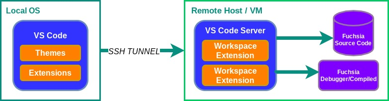
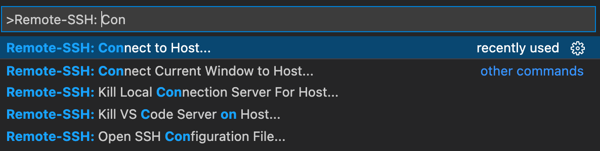
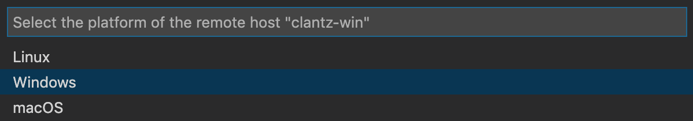



# Configuring remote workspaces

VS Code allows you to open a remote folder on any virtual machine, container,
or environment with a running SSH server, allowing developers to interact
with files and folders on the remote filesystem. Remote workspaces are
helpful when using a separate environment to edit, build, or run Fuchsia.



Configuring remote workspaces involve the following steps:

1. [Prerequisites](#prerequisites)
1. [Connect to remote workspace](#connect-to-remote-workspace)
1. [Disconnect remote workspace](#disconnect-remote-workspace)

## Prerequisites {#prerequisites}

Before you start, complete the following tasks:

* [Install VS Code][install-vscode]{: .external}
* [Install SSH extension](#install-ssh-extension)

### Install SSH extension {#install-ssh-extension}

To connect to a remote host for the first time, install Microsoft’s Remote SSH
Extension in VS Code:

1. In VS Code, launch **Quick Open** by running `CMD/CTRL + P`.
1. Paste the following command in the text prompt and press enter:

   ```posix-terminal
   ext install ms-vscode-remote.remote-ssh
   ```

## Connect to remote workspace {#connect-to-remote-workspace}

After [installing the SSH extension](#install-ssh-extension), connect to your
SSH environment:

1. Press `F1` or `CMD/CTRL + SHIFT + P` to open **Command Palette**.
1. Type in the field, `Remote-SSH: Connect to Host…` and press enter.
   
1. Type in the domain name of your SSH environment and press enter:

   ```none
   {{ '<var>' }}username{{ '</var>' }}@{{ '<var>' }}hostname{{ '</var>' }}.com
   ```

1. If VS Code cannot detect the type of server, select the type manually.
   
1. After connecting, the bottom left status bar displays your current SSH session.

## Disconnect remote workspace {#disconnect-remote-workspace}

To close the connection with the remote host, you can either:

* Exit VS Code.
* In VS Code's navigation, click **File** then **Close Remote Connection**.

## Troubleshooting

For additional support, VS Code provides [official documentation][troubleshoot-vscode]{: .external}
for troubleshooting scenarios.

<!-- Reference links -->

[install-vscode]: https://code.visualstudio.com/docs/setup/setup-overview
[troubleshoot-vscode]: https://code.visualstudio.com/docs/remote/ssh#_connect-to-a-remote-host