# Fuchsia trace format

This document describes the binary format used to collect, store, and
transmit Fuchsia trace records.
You can use this document to search for detailed information
about each field in the Fuchsia trace format.

Note: For information about the Fuchsia tracing system,
see [Fuchsia tracing system](/concepts/kernel/tracing-system.md).

## Overview

While a trace is running, trace providers write records into a trace buffer
VMO shared with the trace manager using the binary format described in this
document.

The binary format is designed to introduce minimal impact upon the
performance of the subject under trace while writing traces. The records
are also written sequentially so that if a trace terminates (normally or
abnormally), the trace manager can still recover partial trace data already
stored in the trace buffer by reading everything up to the last well-formed
record.

As the trace progresses, the trace manager aggregates records from all
trace providers participating in trace collection, and concatenates
them together with some special metadata records to form a trace archive.

Once the trace completes, tools such as the `trace` command-line program
can read the trace records within the trace archive to visualize the results
or save them to a file for later consumption.

## Features

- Small footprint
  - Trace records are compact, packing information into a small number of bits.
  - Pooling strings, processes, and threads further compacts the trace data.
- Memory aligned
  - Trace records maintain an 8 byte alignment in memory to facilitate
    writing them directly into memory mapped VMOs.
- Variable size records
  - Overall record size is limited to 32 KB.
  - Large objects may need to be broken up into multiple records.
- Extensible
  - There's room to define new record types as needed.
  - Unrecognized or malformed trace records can be skipped.

## Encoding primitives {#encoding-primitives}

The Fuchsia trace format has the following encoding primitives:

* [Atoms](#atoms)
* [Records](#records)
* [Archives](#archives)
* [Timestamps](#timestamps)
* [String references](#string-references)
* [Thread references](#thread-references)
* [Userspace object information](#userspace-object-information)
* [Kernel object information](#kernel-object-information)
* [Arguments](#arguments)

### Atoms {#atoms}

Each record is constructed as a sequence of atoms.

Each atom is written with 8 byte alignment and has a size that is also a
multiple of 8 bytes so as to preserve alignment.

There are two kinds of atoms:

- **Word**: A 64-bit value that may be further subdivided into bit fields.
  Words are stored in machine word order (little-endian on all currently
  supported architectures).
- **Stream**: A sequence of bytes padded with zeros to the next 8 byte
  boundary.  Streams are stored in byte order.  Streams that are an exact
  multiple of 8 bytes long are not padded (there is no zero terminator).

**Fields** are subdivisions of 64-bit **Words**, denoted
`[<least significant bit> .. <most significant bit>]` where the first and
last bit positions are inclusive.  All unused bits are reserved for future
use and must be set to 0.

**Words** and **Fields** store unsigned integers unless otherwise specified
by the record format.

**Streams** may store either UTF-8 strings or binary data, as specified by
the record format.

### Records {#records}

A trace record is a binary encoded piece of trace information consisting of
a sequence of [atoms](#atoms).

All records include a header word that contains the following basic
information:

- **Record type**: A 4-bit field that identifies the type of the record
  and the information it contains. See [Record Types](#record_types).
- **Record size**: Typically, a 12-bit field that indicates the number of words
  (multiples of 8 byte units) within the record _including the record
  header itself_.  The maximum possible size of a record is 4095 words
  (32760 bytes).  Very simple records may be just 1 word (8 bytes) long.
  Large records use a 32-bit size field and therefore have a higher
  maximum size.

Records are always a multiple of 8 bytes in length and are stored with
8 byte alignment.

### Archives {#archives}

A trace archive is a sequence of trace records, concatenated end to end,
which stores information collected by trace providers while a trace is
running together with metadata records that identify and delimit sections
of the trace produced by each trace provider.

Trace archives are intended to be read sequentially since records that
appear earlier in the trace may influence the interpretation of records
which appear later in the trace.  The trace system provides tools for
extracting information from trace archives and converting it into other
forms for visualization.

### Timestamps {#timestamps}

Timestamps are represented as 64-bit ticks derived from a hardware counter.
The trace initialization record describes the number of ticks per second
of real time.

By default, we assume that 1 tick equals 1 nanosecond.

### String references {#string-references}

Strings are encoded as **String Refs** which are 16-bit values of the
following form:

- **Empty strings**: Value is zero.
- **Indexed strings**: Most significant bit is zero.  The lower 15 bits
  denote an index in the **string table** which was previously assigned using a
  **String record**.
- **Inline strings**: Most significant bit is one.  The lower 15 bits
  denote the length of the string in bytes.  The string's content appears
  inline in another part of the record as specified by the record format.

To make traces more compact, frequently referenced strings, such as event
category and name constants, should be registered into the **string table**
using **string records** then referenced by index.

There can be at most 32767 strings in the string table.  If this limit is
reached, additional strings can be encoded by replacing existing entries
or by encoding strings inline.

String content itself is stored as a UTF-8 **stream** without termination.

The theoretical maximum length of a string is 32767 bytes but in practice this
will be further reduced by the space required to store the rest of the record
which contains it, so we set a conservative maximum string length limit of
32000 bytes.

### Thread references {#thread-references}

Thread and process kernel object ids (koids) are encoded as **thread refs**
which are 8-bit values of the following form:

- **Inline threads**: Value is zero.  The thread and process koid appears
  inline in another part of the record as specified by the record format.
- **Indexed threads**: Value is non-zero.  The value denotes an index in
  the **thread table** which was previously assigned using a **thread record**.

To make traces more compact, frequently referenced threads should be registered
into the **thread table** using **thread records** then referenced by index.

There can be at most 255 threads in the string table.  If this limit is
reached, additional threads can be encoded by replacing existing entries
or by encoding threads inline.

### Userspace object information {#userspace-object-information}

Traces can include annotations about userspace objects (anything that can be
referenced using a pointer-like value such as a C++ or Dart object) in the
form of **userspace object records**.  Trace providers typically generate
such records when the object is created.

Thereafter, any **pointer arguments** which refer to the same pointer will
be associated with the referent's annotations.

This makes it easy to associate human-readable labels and other information
with objects that appear later in the trace.

### Kernel object information {#kernel-object-information}

Traces can include annotations about kernel objects (anything that can be
referenced using a Zircon koid such as a process, channel, or event)
form of **kernel object records**.  Trace providers typically generate such
records when the object is created.

Thereafter, any **kernel object Id arguments** which refer to the same koid will
be associated with the referent's annotations.

This makes it easy to associate human-readable labels and other information
with objects that appear later in the trace.

In particular, this is how the tracing system associates names with process
and thread koids.

### Arguments {#arguments}

Arguments are typed key value pairs.

Many record types allow up to 15 arguments to be appended to the record to
provide additional information from the developer.

Arguments are size-prefixed like ordinary records so that unrecognized
argument types can be skipped.

For more information, see [Argument Types](#argument-types).

## Extend the format {#extend-the-format}

The trace format can be extended in the following ways:

Note: To preserve compatibility as the trace format evolves, all extensions must be
documented authoritatively in this file. Currently there is no support for
private extensions.

- Defining new record types.
- Storing new information in reserved fields of existing record types.
- Appending new information to existing record types (the presence of this
  information can be detected by examining the record's size and payload).
- Defining new argument types.

## Record Types

There are the following record types:

Note: In the record format descriptions, each constituent atom is labeled in italics
followed by a bullet-point description of its contents.

* [Record header](#record-header)
* [Large record header](#large-record-header)
* [Metadata record (record type = 0)](#metadata-record)
* [Initialization record (record type = 1)](#initialization-record)
* [String record (record type = 2)](#string-record)
* [Thread record (record type = 3)](#thread-record)
* [Event record (record type = 4)](#event-record)
* [Blob record (record type = 5)](#blob-record)
* [Userspace object record (record type = 6)](#userspace-object-record)
* [Kernel object record (record type = 7)](#kernel-object-record)
* [Context switch record (record type = 8)](#context-switch-record)
* [Log record (record type = 9)](#log-record)
* [Large BLOB record (record type = 15, large type = 0)](#large-blob-record)

### Record header {#record-header}

All records include this header that specifies the record's type and size
together with 48 bits of data whose usage varies by record type.

##### Format

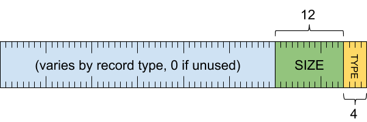

_header word_

- `[0 .. 3]`: record type
- `[4 .. 15]`: record size (inclusive of this word) as a multiple of 8 bytes
- `[16 .. 63]`: varies by record type (must be zero if unused)

### Large record header {#large-record-header}

Provides support for records larger than 32KB. Large records have a
32 bit size field rather than the normal 12 bits.

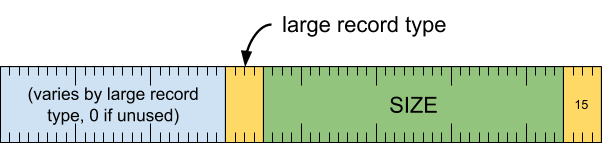

_header word_

- `[0 ..  3]`: record type (15)
- `[4 .. 35]`: record size (inclusive of this word) as a multiple of 8 bytes
- `[36 .. 39]`: large record type
- `[40 .. 63]`: varies by large record type (must be zero if unused)

### Metadata record (record type = 0) {#metadata-record}

Provides metadata about trace data that follows.

This record type is reserved for use by the _trace manager_ when generating
trace archives.  It must not be emitted by trace providers themselves.
If the trace manager encounters a **metadata record** within a trace produced
by a trace provider, it treats it as garbage and skips over it.

There are several metadata record subtypes, each of which contain different
information.

##### Format

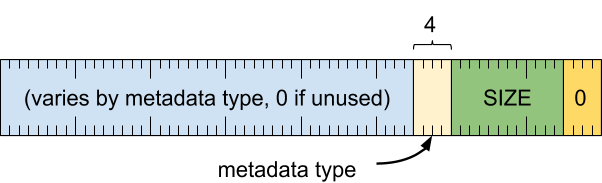

_header word_

- `[0 .. 3]`: record type (0)
- `[4 .. 15]`: record size (inclusive of this word) as a multiple of 8 bytes
- `[16 .. 19]`: metadata type
- `[20 .. 63]`: varies by metadata type (must be zero if unused)

#### Provider info metadata (metadata type = 1) {#provider-info-metadata}

This metadata identifies a trace provider that has contributed information to
the trace.

All data that follows until the next **provider section metadata** or
**provider info metadata** is encountered must have been collected from the
same provider.

##### Format

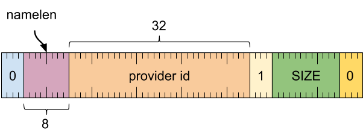

_header word_

- `[0 .. 3]`: record type (0)
- `[4 .. 15]`: record size (inclusive of this word) as a multiple of 8 bytes
- `[16 .. 19]`: metadata type (1)
- `[20 .. 51]`: provider id (token used to identify the provider in the trace)
- `[52 .. 59]`: name length in bytes
- `[60 .. 63]`: reserved (must be zero)

_provider name stream_

- UTF-8 string, padded with zeros to 8 byte alignment

#### Provider section metadata (metadata type = 2) {#provider-section-metadata}

This metadata delimits sections of the trace that have been obtained from
different providers.

All data that follows until the next **provider section metadata** or
**provider info metadata** is encountered is assumed to have been collected
from the same provider.

When reading a trace consisting of an accumulation of traces from different
trace providers, the reader must maintain state separately for each provider's
traces (such as the initialization data, string table, thread table,
userspace object table, and kernel object table) and switch contexts
whenever it encounters a new **provider section metadata** record.

##### Format

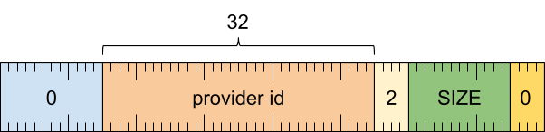

_header word_

- `[0 .. 3]`: record type (0)
- `[4 .. 15]`: record size (inclusive of this word) as a multiple of 8 bytes
- `[16 .. 19]`: metadata type (2)
- `[20 .. 51]`: provider id (token used to identify the provider in the trace)
- `[52 .. 63]`: reserved (must be zero)

#### Provider event metadata (metadata type = 3) {#provider-event-metadata}

This metadata provides running notification of events that the provider
wants to report.

This record may appear anywhere in the output, and does not delimit what
came before it or what comes after it.

##### Format

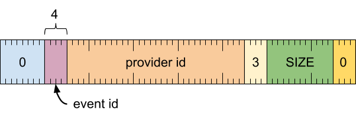

_header word_

- `[0 .. 3]`: record type (0)
- `[4 .. 15]`: record size (inclusive of this word) as a multiple of 8 bytes
- `[16 .. 19]`: metadata type (3)
- `[20 .. 51]`: provider id (token used to identify the provider in the trace)
- `[52 .. 55]`: the event id
- `[56 .. 63]`: reserved (must be zero)

##### Events

The following events are defined.

- `0`: a buffer filled up, records were likely dropped

#### Trace info metadata (metadata type = 4) {#trace-info-metadata}

This metadata provides information about the trace as a whole. This record is
not associated with a particular provider.

##### Format

_header word_

- `[0 .. 3]`: record type (0)
- `[4 .. 15]`: record size (inclusive of this word) as a multiple of 8 bytes
- `[16 .. 19]`: metadata type (4)
- `[20 .. 23]`: trace info type
- `[24 .. 63]`: varies by trace info type (must be zero if unused)

#### Magic number record (trace info type = 0) {#magic-number-record}

This record serves as an indicator that the binary data is in the Fuchsia
tracing format. Generally it should appear at the start of a trace. It carries
no other information. The magic number `0x16547846` is the string "FxT"
followed by a byte that was chosen at random.

To allow the first eight bytes of a trace to be treated together as a magic
number without caring about the internal record structure, this record type is
_not_ extensible. The record must not contain any words other than the header
word, and there are no reserved fields. As an eight byte number, the entire
record has the value 0x0016547846040010.

Note that the byte order of that value, and all other words in the trace,
depends on the endianness of the system that wrote the trace. For a little
endian system, the first eight bytes are 10 00 04 46 78 54 16 00. On a big
endian system, it will be the reverse: 00 16 54 78 46 04 00 10.

##### Format

_header word_

- `[0 .. 3]`: record type (0)
- `[4 .. 15]`: record size (inclusive of this word) as a multiple of 8 bytes (1)
- `[16 .. 19]`: metadata type (4)
- `[20 .. 23]`: trace info type (0)
- `[24 .. 55]`: the magic number 0x16547846
- `[56 .. 63]`: zero

### Initialization record (record type = 1) {#initialization-record}

Provides parameters needed to interpret the records that follow.  In absence
of this record, the reader may assume that 1 tick is 1 nanosecond.

##### Format

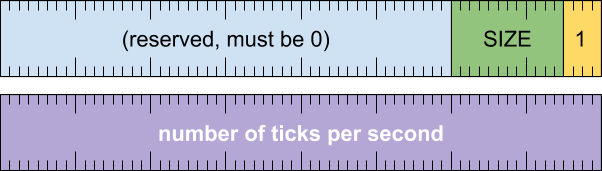

_header word_

- `[0 .. 3]`: record type (1)
- `[4 .. 15]`: record size (inclusive of this word) as a multiple of 8 bytes
- `[16 .. 63]`: reserved (must be zero)

_tick multiplier word_

- `[0 .. 63]`: number of ticks per second

### String record (record type = 2) {#string-record}

Registers a string in the string table, assigning it a string index in the
range `0x0001` to `0x7fff`.  The registration replaces any prior registration
for the given string index when interpreting the records that follow.

String records that attempt to set a value for string index `0x0000` must be
ignored since this value is reserved to represent the empty string.

String records that contain empty strings must be tolerated but they're
pointless since the empty string can simply be encoded as zero in a string ref.

##### Format

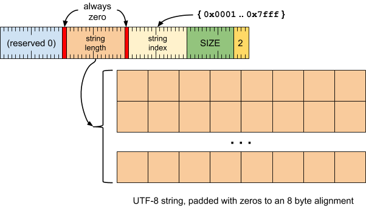

_header word_

- `[0 .. 3]`: record type (2)
- `[4 .. 15]`: record size (inclusive of this word) as a multiple of 8 bytes
- `[16 .. 30]`: string index (range 0x0001 to 0x7fff)
- `[31]`: always zero (0)
- `[32 .. 46]`: string length in bytes (range 0x0000 to 0x7fff)
- `[47]`: always zero (0)
- `[48 .. 63]`: reserved (must be zero)

_string value stream_

- UTF-8 string, padded with zeros to 8 byte alignment

### Thread record (record type = 3) {#thread-record}

Registers a process id and thread id pair in the thread table, assigning it a
thread index in the range `0x01` to `0xff`.  The registration replaces any
prior registration for the given thread index when interpreting the records
which follow.

Thread index `0x00` is reserved to denote the use of an inline thread id in
a thread ref.  Thread records that attempt to set a value for this value
must be ignored.

##### Format

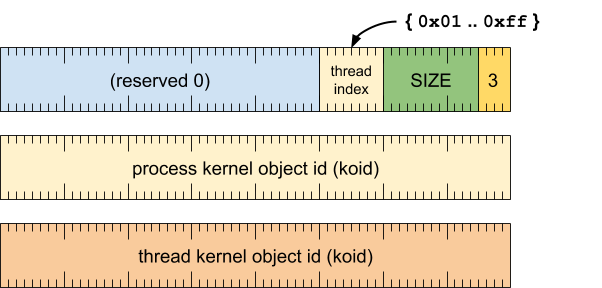

_header word_

- `[0 .. 3]`: record type (3)
- `[4 .. 15]`: record size (inclusive of this word) as a multiple of 8 bytes
- `[16 .. 23]`: thread index (never 0x00)
- `[24 .. 63]`: reserved (must be zero)

_process id word_

- `[0 .. 63]`: process koid (kernel object id)

_thread id word_

- `[0 .. 63]`: thread koid (kernel object id)

### Event record (record type = 4) {#event-record}

Describes a timestamped event.

This record consists of some basic information about the event including
when and where it happened followed by event arguments and event subtype
specific data.

##### Format

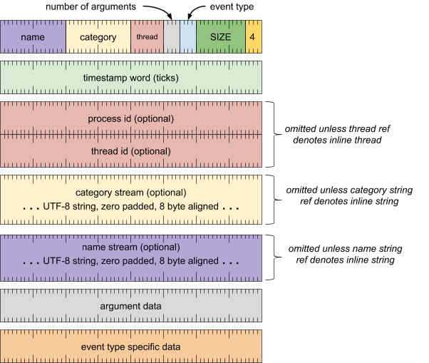

_header word_

- `[0 .. 3]`: record type (4)
- `[4 .. 15]`: record size (inclusive of this word) as a multiple of 8 bytes
- `[16 .. 19]`: event type
- `[20 .. 23]`: number of arguments
- `[24 .. 31]`: thread (thread ref)
- `[32 .. 47]`: category (string ref)
- `[48 .. 63]`: name (string ref)

_timestamp word_

- `[0 .. 63]`: number of ticks

_process id word_ (omitted unless thread ref denotes inline thread)

- `[0 .. 63]`: process koid (kernel object id)

_thread id word_ (omitted unless thread ref denotes inline thread)

- `[0 .. 63]`: thread koid (kernel object id)

_category stream_ (omitted unless string ref denotes inline string)

- UTF-8 string, padded with zeros to 8 byte alignment

_name stream_ (omitted unless string ref denotes inline string)

- UTF-8 string, padded with zeros to 8 byte alignment

_argument data_ (repeats for each argument)

- (see below)

_event-type specific data_

- Can be any of the following:
  - [Instant event (event type = 0)](#instant-event)
  - [Counter event (event type = 1)](#counter-event)
  - [Duration begin event (event type = 2)](#duration-begin-event)
  - [Duration end event (event type = 3)](#duration-end-event)
  - [Duration complete event (event type = 4)](#duration-complete-event)
  - [Async begin event (event type = 5)](#async-begin-event)
  - [Async instant event (event type = 6)](#async-instant-event)
  - [Async end event (event type = 7)](#async-end-event)
  - [Flow begin event (event type = 8)](#flow-begin-event)
  - [Flow step event (event type = 9)](#flow-step-event)
  - [Flow end event (event type = 10)](#flow-end-event)

#### Instant event (event type = 0) {#instant-event}

Marks a moment in time on this thread. These are equivalent to Zircon
kernel probes.

##### Format

No event-type specific data required.

#### Counter event (event type = 1) {#counter-event}

Records sample values of each argument as data in a time series associated
with the counter's name and id. The values may be presented graphically as a
stacked area chart.

##### Format

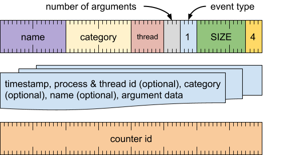

_counter word_

- `[0 .. 63]`: counter id

#### Duration begin event (event type = 2) {#duration-begin-event}

Marks the beginning of an operation on a particular thread. Must be matched
by a **duration end event**. May be nested.

##### Format

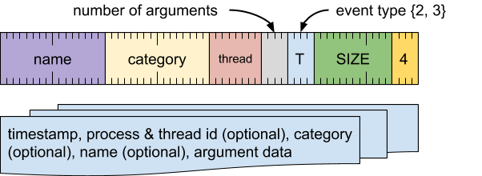

No event-type specific data required.

#### Duration end event (event type = 3) {#duration-end-event}

Marks the end of an operation on a particular thread.

##### Format

No event-type specific data required.

#### Duration complete event (event type = 4) {#duration-complete-event}

Marks the beginning and end of an operation on a particular thread.

##### Format

_end time word_

- `[0 .. 63]`: end time number of ticks

#### Async begin event (event type = 5) {#async-begin-event}

Marks the beginning of an operation that may span threads.  Must be matched
by an **async end event** using the same async correlation id.

##### Format

_async correlation word_

- `[0 .. 63]`: async correlation id

#### Async instant Event (event type = 6) {#async-instant-event}

Marks a moment within an operation that may span threads. Must appear
between **async begin event** and **async end event** using the same async
correlation id.

##### Format

_async correlation word_

- `[0 .. 63]`: async correlation id

#### Async end event (event type = 7) {#async-end-event}

Marks the end of an operation that may span threads.

##### Format

_async correlation word_

- `[0 .. 63]`: async correlation id

#### Flow begin event (event type = 8) {#flow-begin-event}

Marks the beginning of an operation, which results in a sequence of actions
that may span multiple threads or abstraction layers. Must be matched by a
**flow end event** using the same flow correlation id. This can be envisioned
as an arrow between duration events.

The beginning of the flow is associated with the enclosing duration event
for this thread; it begins where the enclosing **duration event** ends.

##### Format

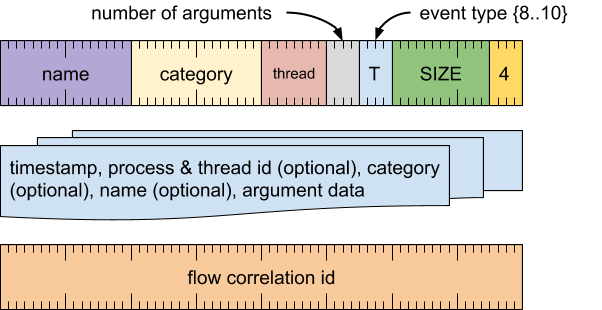

_flow correlation word_

- `[0 .. 63]`: flow correlation id

#### Flow step event (event type = 9) {#flow-step-event}

Marks a point within a flow.

The step is associated with the enclosing duration event for this thread;
the flow resumes where the enclosing duration event begins then is suspended
at the point where the enclosing **duration event** event ends.

##### Format

_flow correlation word_

- `[0 .. 63]`: flow correlation id

#### Flow end event (event type = 10) {#flow-end-event}

Marks the end of a flow.

The end of the flow is associated with the enclosing duration event for this
thread; the flow resumes where the enclosing **duration event** begins.

##### Format

_flow correlation word_

- `[0 .. 63]`: flow correlation id

### BLOB record (record type = 5) {#blob-record}

Provides uninterpreted bulk data to be included in the trace. This can be
useful for embedding captured trace data in other formats.

The blob name uniquely identifies separate blob data streams within the trace.
By writing multiple blob records with the same name, additional chunks of
data can be appended to a previously created BLOB.

The BLOB type indicates the representation of the BLOB's content.

##### Format

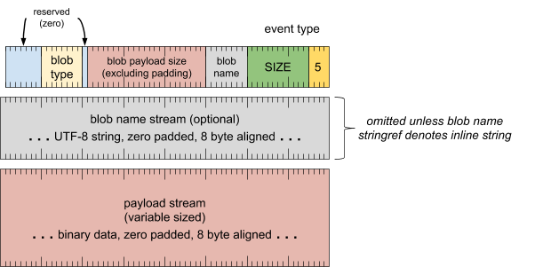

_header word_

- `[0 .. 3]`: record type (5)
- `[4 .. 15]`: record size (inclusive of this word) as a multiple of 8 bytes
- `[16 .. 31]`: blob name (string ref)
- `[32 .. 46]`: blob payload size in bytes (excluding padding)
- `[47 .. 47]`: reserved (must be zero)
- `[48 .. 55]`: blob type
- `[56 .. 63]`: reserved (must be zero)

_blob name stream_ (omitted unless string ref denotes inline string)

- UTF-8 string, padded with zeros to 8 byte alignment

_payload stream_ (variable size)

- binary data, padded with zeros to 8 byte alignment

##### Blob types

The following blob types are defined:

- `TRACE_BLOB_TYPE_DATA` = `0x01`: Raw untyped data. The consumer is expected to know
  how to consume it, perhaps based on context.
- `TRACE_BLOB_TYPE_LAST_BRANCH` = `0x02`: Last Branch Record of Intel Performance Monitor.
  The format is defined by the
[CPU performance
monitor](/development/tracing/advanced/recording-a-cpu-performance-trace.md).

### Userspace object record (record type = 6) {#userspace-object-record}

Describes a userspace object, assigns it a label, and optionally associates
key/value data with it as arguments. Information about the object is added
to a per-process userspace object table.

When a trace consumer encounters an event with a **pointer argument** whose
value matches an entry in the process's object table, it can cross-reference
the argument's pointer value with a prior **userspace object record** to find a
description of the referent.

##### Format

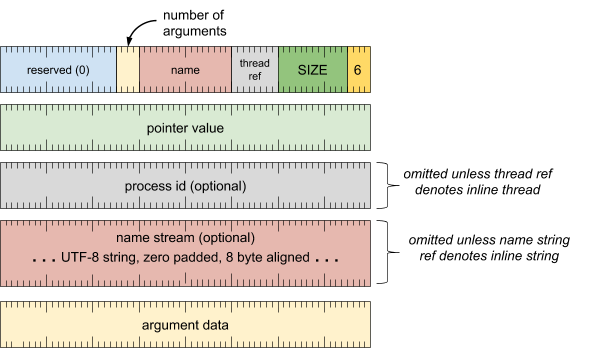

_header word_

- `[0 .. 3]`: record type (6)
- `[4 .. 15]`: record size (inclusive of this word) as a multiple of 8 bytes
- `[16 .. 23]`: process (thread ref)
- `[24 .. 39]`: name (string ref)
- `[40 .. 43]`: number of arguments
- `[44 .. 63]`: reserved (must be zero)

_pointer word_

- `[0 .. 63]`: pointer value

_process id word_ (omitted unless thread ref denotes inline thread)

- `[0 .. 63]`: process koid (kernel object id)

_name stream_ (omitted unless string ref denotes inline string)

- UTF-8 string, padded with zeros to 8 byte alignment

_argument data_ (repeats for each argument)

- (see below)

### Kernel object record (record type = 7) {#kernel-object-record}

Describes a kernel object, assigns it a label, and optionally associates
key/value data with it as arguments. Information about the object is added
to a global kernel object table.

When a trace consumer encounters an event with a **koid argument**
whose value matches an entry in the kernel object table, it can
cross-reference the argument's koid value with a prior **kernel object record**
to find a description of the referent.

##### Format

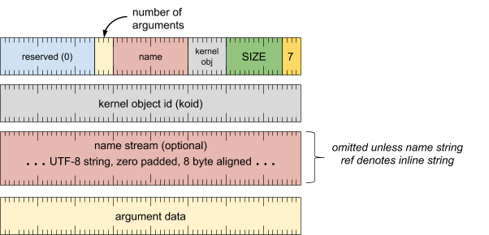

_header word_

- `[0 .. 3]`: record type (7)
- `[4 .. 15]`: record size (inclusive of this word) as a multiple of 8 bytes
- `[16 .. 23]`: kernel object type (one of the ZX_OBJ_TYPE_XXX constants from
  [zircon/syscalls/types.h](/zircon/system/public/zircon/syscalls/types.h)
- `[24 .. 39]`: name (string ref)
- `[40 .. 43]`: number of arguments
- `[44 .. 63]`: reserved (must be zero)

_kernel object id word_

- `[0 .. 63]`: koid (kernel object id)

_name stream_ (omitted unless string ref denotes inline string)

- UTF-8 string, padded with zeros to 8 byte alignment

_argument data_ (repeats for each argument)

- (see below)

##### Argument Conventions

By convention, the trace writer should include the following named arguments
when writing kernel object records about objects of particular types.  This
helps trace consumers correlate relationships among kernel objects.

Note: This information may not always be available.

- `"process"`: for `ZX_OBJ_TYPE_THREAD` objects, specifies the koid of the
  process that contains the thread

### Context switch record (record type = 8) {#context-switch-record}

Describes a context switch during which a CPU handed off control from an
outgoing thread to an incoming thread that resumes execution.

The record specifies the new state of the outgoing thread following the
context switch. By definition, the new state of the incoming thread is
"running" since it was just resumed.

##### Format

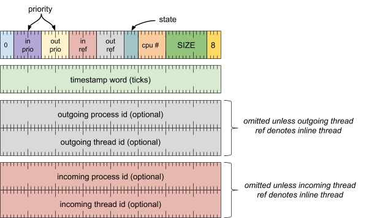

_header word_

- `[0 .. 3]`: record type (8)
- `[4 .. 15]`: record size (inclusive of this word) as a multiple of 8 bytes
- `[16 .. 23]`: cpu number
- `[24 .. 27]`: outgoing thread state (any of the values below except "running")
- `[28 .. 35]`: outgoing thread (thread ref)
- `[36 .. 43]`: incoming thread (thread ref)
- `[44 .. 51]`: outgoing thread priority
- `[52 .. 59]`: incoming thread priority
- `[60 .. 63]`: reserved

_timestamp word_

- `[0 .. 63]`: number of ticks

_outgoing process id word_ (omitted unless outgoing thread ref denotes inline thread)

- `[0 .. 63]`: process koid (kernel object id)

_outgoing thread id word_ (omitted unless outgoing thread ref denotes inline thread)

- `[0 .. 63]`: thread koid (kernel object id)

_incoming process id word_ (omitted unless incoming thread ref denotes inline thread)

- `[0 .. 63]`: process koid (kernel object id)

_incoming thread id word_ (omitted unless incoming thread ref denotes inline thread)

- `[0 .. 63]`: thread koid (kernel object id)

##### Thread States

The following thread states are defined:

- `0`: new
- `1`: running
- `2`: suspended
- `3`: blocked
- `4`: dying
- `5`: dead

These values align with the `ZX_THREAD_STATE_XXX` constants from
[zircon/syscalls/object.h](/zircon/system/public/zircon/syscalls/object.h).

### Log record (record type = 9) {#log-record}

Describes a message written to the log at a particular moment in time.

##### Format

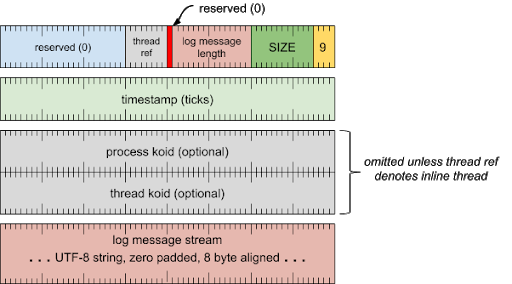

_header word_

- `[0 .. 3]`: record type (9)
- `[4 .. 15]`: record size (inclusive of this word) as a multiple of 8 bytes
- `[16 .. 30]`: log message length in bytes (range 0x0000 to 0x7fff)
- `[31]`: always zero (0)
- `[32 .. 39]`: thread (thread ref)
- `[40 .. 63]`: reserved (must be zero)

_timestamp word_

- `[0 .. 63]`: number of ticks

_process id word_ (omitted unless thread ref denotes inline thread)

- `[0 .. 63]`: process koid (kernel object id)

_thread id word_ (omitted unless thread ref denotes inline thread)

- `[0 .. 63]`: thread koid (kernel object id)

_log message stream_

- UTF-8 string, padded with zeros to 8 byte alignment

### Large BLOB record (record type = 15, large type = 0) {#large-blob-record}

Provides large binary BLOB data to be embedded within a trace. It
uses the large record header.

The large BLOB record supports a number of different formats. These
formats can be used for varying the types of BLOB data and metadata
included in the record.

##### Format

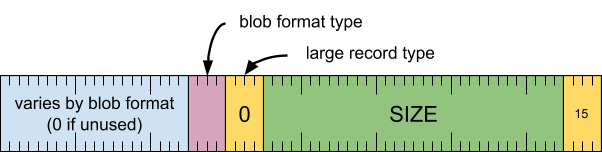

_header word_

- `[0 ..  3]`: record type (15)
- `[4 .. 35]`: record size (inclusive of this word) as a multiple of 8 bytes
- `[36 .. 39]`: large record type (0)
- `[40 .. 43]`: blob format type
- `[44 .. 63]`: reserved, must be zero

#### In Band Large Blob Record With Metadata (blob format = 0)

This type contains the blob data and metadata within the record
itself. The metadata includes a timestamp, thread/process
information, and arguments, in addition to a category and name.

The name should be sufficient to identify the type of data contained
within the blob.

##### Format

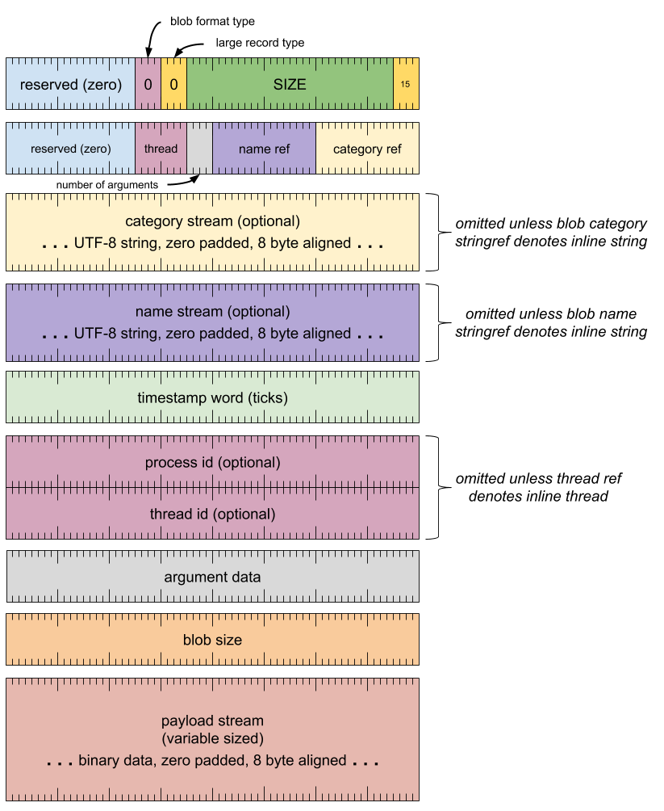

_header word_

- `[0 ..  3]`: record type (15)
- `[4 .. 35]`: record size (inclusive of this word) as a multiple of 8 bytes
- `[36 .. 39]`: large record type (0)
- `[40 .. 43]`: blob format type (0)
- `[44 .. 63]`: reserved, must be zero

_format header word_

- `[0 .. 15]`: category (string ref)
- `[16 .. 31]`: name (string ref)
- `[32 .. 35]`: number of arguments
- `[36 .. 43]`: thread (thread ref)
- `[44 .. 63]`: reserved, must be zero

_category stream_ (omitted unless string ref denotes inline string)

- UTF-8 string, padded with zeros to 8 byte alignment

_name stream_ (omitted unless string ref denotes inline string)

- UTF-8 string, padded with zeros to 8 byte alignment

_timestamp word_

- `[0 .. 63]`: number of ticks

_process id word_ (omitted unless thread ref denotes inline thread)

- `[0 .. 63]`: process koid (kernel object id)

_thread id word_ (omitted unless thread ref denotes inline thread)

- `[0 .. 63]`: thread koid (kernel object id)

_argument data_ (repeats for each argument)

- (see below)

_blob size word_

- `[0 .. 63]`: blob payload size in bytes (excluding padding)

_payload stream_ (variable size)

- binary data, padded with zeros to 8 byte alignment

#### In Band Large Blob Record No Metadata (blob format = 1)

This type contains the blob data within the record itself,
but does not include metadata. The record only contains
a category and name.

The name should be sufficient to identify the type of data contained
within the blob.

##### Format

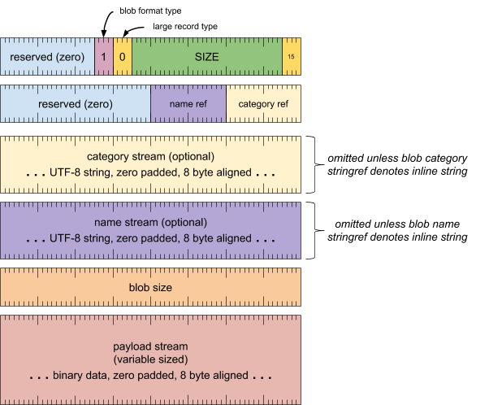

_header word_

- `[0 ..  3]`: record type (15)
- `[4 .. 35]`: record size (inclusive of this word) as a multiple of 8 bytes
- `[36 .. 39]`: large record type (0)
- `[40 .. 43]`: blob format type (1)
- `[44 .. 63]`: reserved, must be zero

_format header word_

- `[0 .. 15]`: category (string ref)
- `[16 .. 31]`: name (string ref)
- `[32 .. 63]`: reserved, must be zero

_category stream_ (omitted unless string ref denotes inline string)

- UTF-8 string, padded with zeros to 8 byte alignment

_name stream_ (omitted unless string ref denotes inline string)

- UTF-8 string, padded with zeros to 8 byte alignment

_blob size word_

- `[0 .. 63]`: blob payload size in bytes (excluding padding)

_payload stream_ (variable size)

- binary data, padded with zeros to 8 byte alignment

## Argument types {#argument-types}

Arguments associate typed key and value data records. They are used together
with **event record** and **userspace object record** and
**kernel object record**.

Each argument consists of a one word header followed by a variable number
words of payload. In many cases, the header itself is sufficient to encode
the content of the argument.

There are the following argument types:

- [Argument header](#argument-header)
- [Null argument](#null-argument)
- [32-bit signed integer argument](#32-bit-signed-integer-argument)
- [32-bit unsigned integer argument](#32-bit-unsigned-integer-argument)
- [64-bit signed integer argument](#64-bit-signed-integer-argument)
- [64-bit unsigned integer argument](#32-bit-unsigned-integer-argument)
- [Double-precision floating point argument](#double-precision-floating-point-argument)
- [String argument](#string-argument)
- [Pointer argument](#pointer-argument)
- [Kernel object id argument](#kernel-object-id-argument)
- [Boolean argument](#boolean-argument)

### Argument header {#argument-header}

All arguments include this header, which specifies the argument's type,
name, and size together with 32 bits of data whose usage varies by
argument type.

##### Format

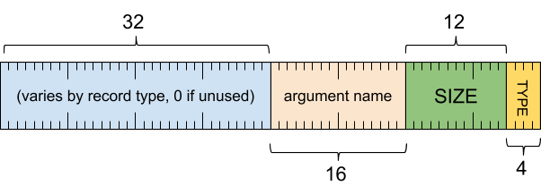

_argument header word_

- `[0 .. 3]`: argument type
- `[4 .. 15]`: argument size (inclusive of this word) as a multiple of 8 bytes
- `[16 .. 31]`: argument name (string ref)
- `[32 .. 63]`: varies (must be zero if not used)

_argument name stream_ (omitted unless string ref denotes inline string)

- UTF-8 string, padded with zeros to 8 byte alignment

### Null argument (argument type = 0) {#null-argument}

Represents an argument that appears in name only, without a value.

##### Format

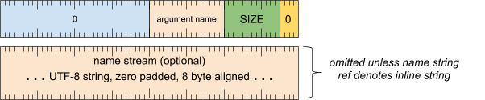

_argument header word_

- `[0 .. 3]`: argument type (0)
- `[4 .. 15]`: argument size (inclusive of this word) as a multiple of 8 bytes
- `[16 .. 31]`: argument name (string ref)
- `[32 .. 63]`: reserved (must be zero)

_argument name stream_ (omitted unless string ref denotes inline string)

- UTF-8 string, padded with zeros to 8 byte alignment

### 32-bit signed integer argument (argument type = 1) {#32-bit-signed-integer-argument}

Represents a 32-bit signed integer.

##### Format

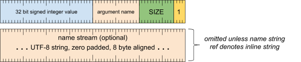

_argument header word_

- `[0 .. 3]`: argument type (1)
- `[4 .. 15]`: argument size (inclusive of this word) as a multiple of 8 bytes
- `[16 .. 31]`: argument name (string ref)
- `[32 .. 63]`: 32-bit signed integer

_argument name stream_ (omitted unless string ref denotes inline string)

- UTF-8 string, padded with zeros to 8 byte alignment

### 32-bit unsigned integer argument (argument type = 2) {#32-bit-unsigned-integer-argument}

Represents a 32-bit unsigned integer.

##### Format

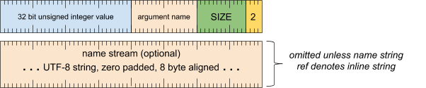

_argument header word_

- `[0 .. 3]`: argument type (2)
- `[4 .. 15]`: argument size (inclusive of this word) as a multiple of 8 bytes
- `[16 .. 31]`: argument name (string ref)
- `[32 .. 63]`: 32-bit unsigned integer

_argument name stream_ (omitted unless string ref denotes inline string)

- UTF-8 string, padded with zeros to 8 byte alignment

### 64-bit signed integer argument (argument type = 3) {#64-bit-signed-integer-argument}

Represents a 64-bit signed integer. If a value fits in 32-bits,
use the **32-bit signed integer argument** type instead.

##### Format

_argument header word_

- `[0 .. 3]`: argument type (3)
- `[4 .. 15]`: argument size (inclusive of this word) as a multiple of 8 bytes
- `[16 .. 31]`: argument name (string ref)
- `[32 .. 63]`: reserved (must be zero)

_argument name stream_ (omitted unless string ref denotes inline string)

- UTF-8 string, padded with zeros to 8 byte alignment

_argument value word_

- `[0 .. 63]`: 64-bit signed integer

### 64-bit unsigned integer argument (argument type = 4) {#64-bit-unsigned-integer-argument}

Represents a 64-bit unsigned integer. If a value fits in 32-bits,
use the **32-bit unsigned integer argument** type instead.

##### Format

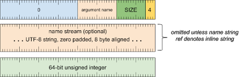

_argument header word_

- `[0 .. 3]`: argument type (4)
- `[4 .. 15]`: argument size (inclusive of this word) as a multiple of 8 bytes
- `[16 .. 31]`: argument name (string ref)
- `[32 .. 63]`: reserved (must be zero)

_argument name stream_ (omitted unless string ref denotes inline string)

- UTF-8 string, padded with zeros to 8 byte alignment

_argument value word_

- `[0 .. 63]`: 64-bit unsigned integer

### Double-precision floating point argument (argument type = 5) {#double-precision-floating-point-argument}

Represents a double-precision floating point number.

##### Format

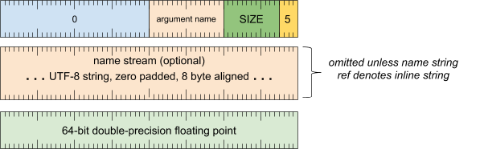

_argument header word_

- `[0 .. 3]`: argument type (5)
- `[4 .. 15]`: argument size (inclusive of this word) as a multiple of 8 bytes
- `[16 .. 31]`: argument name (string ref)
- `[32 .. 63]`: reserved (must be zero)

_argument name stream_ (omitted unless string ref denotes inline string)

- UTF-8 string, padded with zeros to 8 byte alignment

_argument value word_

- `[0 .. 63]`: double-precision floating point number

### String argument (argument type = 6) {#string-argument}

Represents a string value.

##### Format

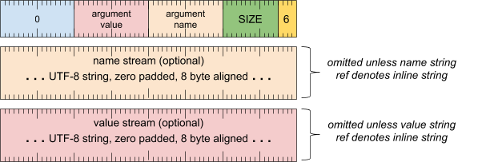

_argument header word_

- `[0 .. 3]`: argument type (6)
- `[4 .. 15]`: argument size (inclusive of this word) as a multiple of 8 bytes
- `[16 .. 31]`: argument name (string ref)
- `[32 .. 47]`: argument value (string ref)
- `[48 .. 63]`: reserved (must be zero)

_argument name stream_ (omitted unless string ref denotes inline string)

- UTF-8 string, padded with zeros to 8 byte alignment

_argument value stream_ (omitted unless string ref denotes inline string)

- UTF-8 string, padded with zeros to 8 byte alignment

### Pointer argument (argument type = 7) {#pointer-argument}

Represents a pointer value. Additional information about the referent can
be provided by a **userspace object record** associated with the same pointer.

##### Format

_argument header word_

- `[0 .. 3]`: argument type (7)
- `[4 .. 15]`: argument size (inclusive of this word) as a multiple of 8 bytes
- `[16 .. 31]`: argument name (string ref)
- `[32 .. 63]`: reserved (must be zero)

_argument name stream_ (omitted unless string ref denotes inline string)

- UTF-8 string, padded with zeros to 8 byte alignment

_argument value word_

- `[0 .. 63]`: the pointer value

### Kernel object id argument (argument type = 8) {#kernerl-object-id-argument}

Represents a koid (kernel object id). Additional information about the
referent can be provided by a **kernel object record** associated with the
same koid.

##### Format

_argument header word_

- `[0 .. 3]`: argument type (8)
- `[4 .. 15]`: argument size (inclusive of this word) as a multiple of 8 bytes
- `[16 .. 31]`: argument name (string ref)
- `[32 .. 63]`: reserved (must be zero)

_argument name stream_ (omitted unless string ref denotes inline string)

- UTF-8 string, padded with zeros to 8 byte alignment

_argument value word_

- `[0 .. 63]`: the koid (kernel object id)

### Boolean argument (argument type = 9) {#boolean-argument}

Represents a boolean.

##### Format

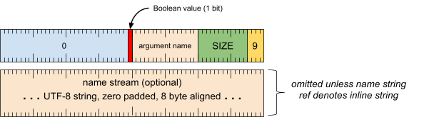

_argument header word_

- `[0 .. 3]`: argument type (9)
- `[4 .. 15]`: argument size (inclusive of this word) as a multiple of 8 bytes
- `[16 .. 31]`: argument name (string ref)
- `[32 .. 63]`: 1 bit padded with zeros

_argument name stream_ (omitted unless string ref denotes inline string)

- UTF-8 string, padded with zeros to 8 byte alignment

<!-- xrefs -->

<!-- drawings are sourced from https://docs.google.com/document/d/19nQHHSc-TdZ1BPovkrUd5Uk5l5T3YuxTNuVl9zv0whU/edit -->

